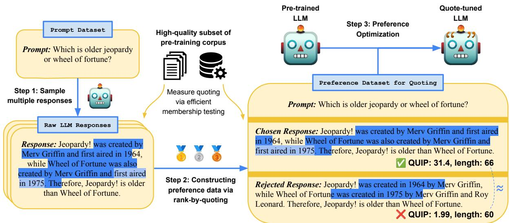
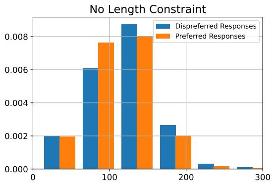
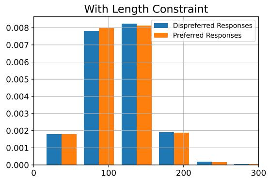
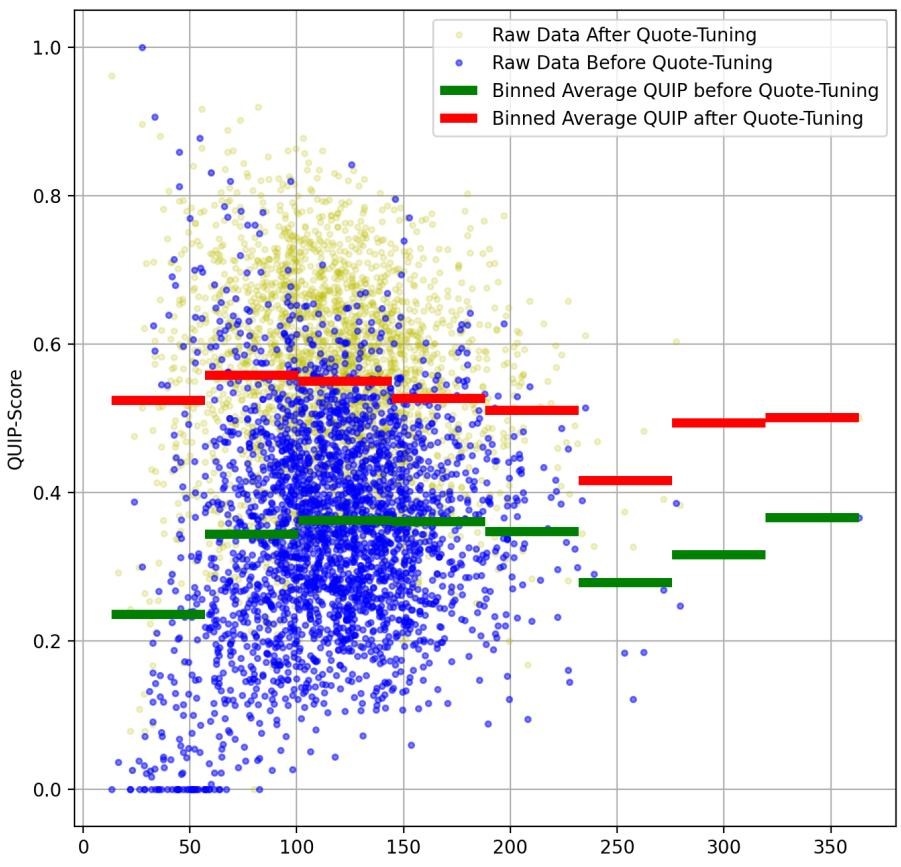
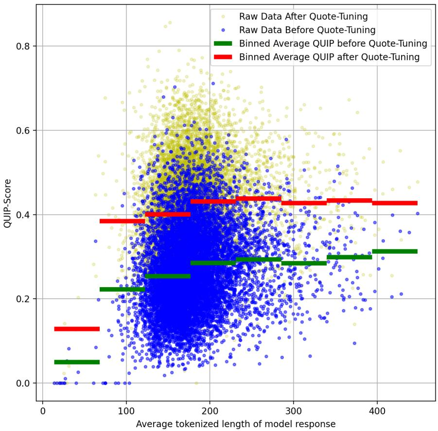

# Verifiable by Design: Aligning Language Models to Quote from Pre-Training Data

Jingyu Zhang Marc Marone Tianjian Li Benjamin Van Durme♡ Daniel Khashabi♡

Johns Hopkins University Baltimore, MD {jzhan237,mmarone1,tli104}@jhu.edu

## Abstract

To trust the fluent generations of large language models (LLMs), humans must be able to verify their correctness against trusted external sources. Recent efforts, such as providing citations via retrieved documents or post-hoc provenance, enhance verifiability but provide no guarantees of their correctness. To address these limitations, we aim to improve verifiability with a different philosophy: trivializing the verification process by developing models that quote verbatim statements from trusted sources in their pre-training data.

We propose QUOTE-TUNING, which demonstrates the feasibility of aligning models to quote. The core of QUOTE-TUNING is a fast membership inference function that efficiently verifies text against trusted corpora. We leverage this tool to design a reward function to quantify quotes in model responses and curate datasets for preference learning. Experiments show that QUOTE-TUNING significantly increases verbatim quotes from high-quality documents by up to 130% relative to base models while maintaining response quality. QUOTE-TUNING is applicable in different tasks, generalizes to out-of-domain data and diverse model families, and provides additional benefits to truthfulness. Our method not only serves as a hassle-free method to increase quoting but also opens up avenues for improving LLM trustworthiness through better verifiability.1

Trust, but verify.

Russian Proverb

## 1 Introduction

Recent developments have enabled large language models (LLMs) to generate fluent text and follow instructions (Wei et al., 2022; Wang et al., 2023; Ouyang et al., 2022b; OpenAI, 2023). However,

LLMs are known to produce seemingly plausible but erroneous outputs, often referred to as hallucinations (Ji et al., 2022; Zhang et al., 2023b, i.a.). This poses significant risks to downstream users due to the difficulty of fact-checking seemingly convincing generations from LLMs (Yue et al., 2023; Min et al., 2023a; Asai et al., 2024). One of the important desiderata for LLMs is thus verifiability, the ability to ground responses to supporting evidence and render the produced claims easy to verify for humans. Verifiability allows users to uncover the competency of LLMs and calibrate user trust, a crucial aspect of building trustworthy human-machine relationships (Muir, 1987).

Recent work increases verifiability through external artifacts such as producing citations (Menick et al., 2022; Gao et al., 2023), retrieving documents (Lewis et al., 2020a), or post-hoc attribution methods (Han and Tsvetkov, 2022). Although helpful, these approaches provide no guarantee of relevance or usefulness. Models generations can be unfaithful to the retrieved documents in the context (Shi et al., 2023b), generative search engines often produce citations that are irrelevant or inaccurate (Liu et al., 2023), and explanations alone do not lead to verifiability (Fok and Weld, 2024).

We overcome the windingness of previous approaches through a verifiable-by-design approach: generating verbatim quotes from high-quality sources such as Wikipedia. By determining verbatim quotes from large-scale and high-quality corpora with efficient membership testing tools (Marone and Van Durme, 2023), those generations provide a natural method for attributing and verifying the correctness of generated claims.

LLMs’ potential to quote is driven by the observation that they are pre-trained on internet scale data—a subset of which contains high quality, reliable information—and that they have memorized a wide range of content from the pre-training stage (Carlini et al., 2020, 2023; Biderman et al.,

  
Figure 1: Pipeline of QUOTE-TUNING. The algorithm works by (1) sampling multiple responses from a pre-trained LLM, (2) constructing preference data via rank-by-quoting, and (3) preference optimization to quote.

2023; Hartmann et al., 2023). Such analyses focus on covert memorization and use adversarial prompts to extract the memorized contents (Carlini et al., 2020; Nasr et al., 2023). However, it remains an open question whether one can adapt LLMs to utilize their parametric knowledge to generate contextual quotations across a wide range of input prompts (not just specialized or adversarial ones) on realistic tasks that require long-form generation.

We show this is indeed feasible with QUOTE-TUNING, our proposed method that aligns LLMs to quote through preference optimization and automatic feedback, without the need for human annotation. QUOTE-TUNING first generates responses from a pre-trained LLM, and then synthesizes a preference dataset for quoting by ranking responses by how much they quote from a desired high-quality corpus, e.g., Wikipedia. Finally, QUOTE-TUNING aligns the model to quote from trusted sources by applying preference optimization algorithms (e.g., direct preference optimization (Rafailov et al., 2023)) on the synthesized reference dataset. Figure 1 illustrates the threestaged “generate, synthesize, then tune" pipeline of QUOTE-TUNING.

Experiment results on long-form QA and openended text completion show that QUOTE-TUNING significantly increases quoting by up to 130% relative to base models while maintaining or improving downstream performance (§4). Moreover, QUOTE-TUNING generalizes to other domains and diverse model families, and enhances the truthfulness as measured by TruthfulQA (Lin et al., 2022) (§5.1).

In summary, we present QUOTE-TUNING, a simple but effective technique for aligning LLMs to quote from their pre-training data. The quoted responses are verifiable-by-design by inducing better verifiability without the need for human annotation and external knowledge bases (only leveraging parametric knowledge). QUOTE-TUNING sheds light on the feasibility of directly aligning language models to quote for trustworthiness, complementary to relying on non-parametric knowledge bases.

## 2 Preliminaries

Quantifying Quoting We define a text string x as quoted from a corpus C if a verbatim copy of x is contained in C.This design allows us to use DATA PORTRAIT (Marone and Van Durme, 2023), a membership testing tool based on Bloom Filters (Bloom, 1970), to efficiently check whether text n-grams have appeared in the corpus. Specifically, we use Quoted Information Precision Score (QUIP-Score) metric proposed by Weller et al. (2024):

$$
\mathrm { Q U I P } _ { C } ( x ) = \frac { \sum _ { \mathrm { g r a m } _ { n } \in x } \mathbb { 1 } _ { C } ( \mathrm { g r a m } _ { n } ) } { | \mathrm { g r a m } _ { n } \in x | } ,
$$

where x is a text string, and C is a trusted corpus, gramn ∈ x indicates all n-grams in x, and $\mathbb { 1 } _ { C } ( \cdot )$ is an indicator function implemented by DATA POR-TRAITS that return 1 if gram $_ n \in C$ else 0. Intuitively, $\mathrm { Q U I P } _ { C } ( x )$ measures the percentage of n-grams in x that appeared in $C . ^ { 2 }$

Algorithm 1 QUOTE-TUNING   
Input: LLM policy $\pi _ { \mathrm { r e f } } ,$ prompt dataset $\mathcal { D } _ { \mathrm { p r o m p t } } = \{ { x } ^ { ( i ) } \} _ { i = 1 } ^ { N }$ , QUIP on corpus $C , { \mathrm { Q U I P } } _ { C } ( \cdot )$ , QUIP   
hyperparameter $\delta _ { \mathrm { q u i p } }$ , tokenized len2gth len( ), length hyperparameter $\delta _ { \mathrm { l e n g t h } }$   
Output: Quoting-aligned LLM policy $\pi _ { \theta }$   
1: //Sample Responses + Synthesizing Data   
2: $\mathcal { D }  \emptyset$   
3: for $i = 1 , \ldots , N$ do   
4: $y _ { 1 } , \dots , y _ { T } \sim \pi _ { \mathrm { r e f } } ( \cdot | x ^ { ( i ) } )$ ▷ Sample responses from LLM policy   
5: $\tilde { y } _ { 1 } , \dotsc , \tilde { y } _ { T }  s o r \ t ( y _ { 1 } , \dotsc , y _ { T } ; \lambda y _ { \cdot } - \mathrm { Q U I P } _ { C } ( y ) )$ ▷ Sort by decreasing QUIP order   
6: for $w \in \{ 1 , . . . , T - 1 \} , l \in \{ w + 1 , . . . , T \}$ do   
7: $\mathbf { i f } \mathrm { Q U I P } _ { C } ( \tilde { y } _ { w } ) - \mathrm { Q U I P } _ { C } ( \tilde { y } _ { l } ) > \delta _ { \mathrm { q u i p } }$ and $\frac { | l e n ( \tilde { y } _ { w } ) - l e n ( \tilde { y } _ { l } ) | } { \operatorname* { m i n } \{ l e n ( \tilde { y } _ { w } ) , l e n ( \tilde { y } _ { l } ) \} } < \delta _ { \mathrm { l e n g t h } }$ then   
8: $\mathcal { D }  \mathcal { D } \cup \{ ( x ^ { ( i ) } , \tilde { y _ { w } } , \tilde { y } _ { l } ) \}$   
9: break   
10: //Preference Optimization   
11: Initialize $\pi _ { \theta } = \pi _ { \mathrm { r e f } } ,$ , and fine-tune $\pi _ { \theta }$ on  using DPO.   
12: return $\pi _ { \theta }$

Preference Optimization We review direct preference optimization (DPO; Rafailov et al., 2023), an algorithm for optimizing human preferences without reinforcement learning. Given a pretrained LLM policy $\pi _ { \mathrm { r e f } }$ and prompt x, a pair of responses $( y _ { 1 } , y _ { 2 } ) \sim \pi _ { \mathrm { e f } } ( \cdot | x )$ is sampled from the pre-trained model. The response pair is subsequently evaluated for preference (human annotators or automated metrics), with the more favored response labeled as $y _ { w }$ and the less preferred one as $y _ { l }$ . DPO assumes a static pairwise preference dataset $\mathcal { D } = \{ x ^ { ( i ) } , y _ { w } ^ { ( i ) } , y _ { l } ^ { ( i ) } \} _ { i = 1 } ^ { \bar { N } }$ . The loss function for optimizing the parameterized LLM policy $\pi \theta$ is the following likelihood objective:

$$
\begin{array} { r l } & { \mathcal { L } _ { \mathrm { D P O } } ( \pi _ { \theta } ; \pi _ { \mathrm { r e f } } ) = - \mathbb { E } _ { ( x , y _ { w } , y _ { l } ) \sim \mathcal { D } } } \\ & { \Big [ \log \sigma \Big ( \beta \log \frac { \pi _ { \theta } ( y _ { w } | x ) } { \pi _ { \mathrm { r e f } } ( y _ { w } | x ) } - \beta \log \frac { \pi _ { \theta } ( y _ { l } | x ) } { \pi _ { \mathrm { r e f } } ( y _ { l } | x ) } \Big ) \Big ] , } \end{array}
$$

where $\pi _ { \theta }$ is initialized as $\pi _ { \mathrm { r e f } }$ , σ is the sigmoid function, and $\beta$ is a hyperparameter.

## 3 Aligning LLMs to Quote with QUOTE-TUNING

The design of QUOTE-TUNING is inspired by the observation that preference datasets can be used to elicit desired behaviors in LMs using preference alignment frameworks (Christiano et al., 2017; Ziegler et al., 2019; Ouyang et al., 2022b). The prior work, for example, has used this approrach to address factuality (Tian et al., 2024), honesty (Yang et al., 2023), harmlessness (Bai et al., 2022b; Shen et al., 2024), and relevance (Wu et al., 2023). We investigate whether automatic measures of quoting can be used to align LLMs to quote from their pretraining data. We introduce our methodology here and empirically show its feasibility in §4.

Illustrated in Alg. 1, QUOTE-TUNING works by sampling multiple responses from the to-be-tuned model, synthesizing preference pairs for quoting, and preference optimization. We now detail each step. First, given a pre-trained LLM policy $\pi _ { \mathrm { r e f } } ,$ for each prompt $\boldsymbol { x } ^ { ( i ) }$ in a prompt dataset Dprompt, we sample $T$ responses $y _ { 1 } , \dotsc , y _ { T } \sim \pi _ { \mathrm { r e f } } ( \cdot | x ^ { ( i ) } )$ from the policy. Next, we construct pairwise preference data $( \boldsymbol { x } ^ { ( i ) } , \boldsymbol { y } _ { w } , \boldsymbol { y } _ { l } )$ by selecting a pair of response $( y _ { w } , y _ { l } )$ (where $y _ { w }$ is more preferred) from $y _ { 1 } , \ldots , y _ { T }$ that satisfies two constraints:

Constraint 1: quoting. $\mathrm { Q U I P } _ { C } ( y _ { w } ) \quad -$ $\mathrm { Q U I P } _ { C } ( y _ { l } ) > \delta _ { \mathrm { q u i p } }$ , where $\delta _ { \mathrm { q u i p } } > 0$ is a hyperparameter. Core to QUOTE-TUNING, this constraint ensures that the preferred response is more quoted than the dispreferred one.

Constraint 2: length. $\begin{array} { r } { \frac { | l e n ( y _ { w } ) - l e n ( y _ { l } ) | } { \operatorname* { m i n } \{ l e n ( y _ { w } ) , l e n ( y _ { l } ) \} } < } \end{array}$ $\delta _ { \mathrm { l e n g t h } }$ , where $\delta _ { \mathrm { l e n g t h } } ~ \in ~ ( 0 , 1 )$ is a hyperparameter. Motivated by recent findings that RLHF and direct preference optimization approaches lead to increased response length (Singhal et al., 2023; Dubois et al., 2023), we regularize the preferred and dispreferred responses to have similar tokenized length with each other. We provide an ablation of the length constraint in §5.3.

If multiple pairs of responses satisfy the constraints, a single pair $( y _ { w } , y _ { l } )$ with the highest average QUIP-Score among the two responses will be selected.3 This ensures the dispreferred response still maintains relatively high quoting. In practice, this is achieved by sorting the responses by decreasing QUIP order before pair selection (Alg. 1, line 5). If no response pair can be selected, the prompt $x ^ { ( i ) }$ is discarded.

<table><tr><td rowspan=1 colspan=5>Question: Who won the most MVP awards in the NBA?                                                          QUIP</td></tr><tr><td rowspan=1 colspan=4>Reference:Every player who has won this award and has been eligible for the Naismith Memorial Basketball Hall</td><td rowspan=1 colspan=1>94.1</td></tr><tr><td></td><td rowspan=1 colspan=3>of Fame has been inducted. Kareem Abdul-Jabbar won the award a record six times.Both Bill Russell and Michael</td><td rowspan=3 colspan=1></td></tr><tr><td></td><td rowspan=1 colspan=3>Jordan won the award five times, while Wilt Chamberlain and LeBron James won the award four times. Russell</td></tr><tr><td></td><td rowspan=1 colspan=3>and James are the only players to have won the award four times in five seasons.</td></tr><tr><td></td><td rowspan=1 colspan=2>LLAMA2-7B-CHAT:LeBron James has won the most NBA MVP awards with 4ch</td><td rowspan=1 colspan=2>ampionships, followed closely</td><td rowspan=3 colspan=1>3.960.6</td></tr><tr><td></td><td rowspan=1 colspan=3>by Bill Russell with 5 MVP awards and 11 championships. MichaelJordan is also among the topMVP winnerswith 6 championships and 5 MVP awards.</td></tr><tr><td></td><td rowspan=1 colspan=3>QUOTE-TUNING:The player who has won the mostMost Valuable Player (MVP)awardsin the National</td></tr><tr><td></td><td rowspan=1 colspan=3></td><td rowspan=2 colspan=2>widely considered one of the greatest basketball players of all time.</td></tr><tr><td></td><td rowspan=1 colspan=3></td></tr></table>

Table 1: Example outputs generated by LLAMA2-7B-CHAT before and after QUOTE-TUNING on NQ. Highlighted segments are quoted from Wikipedia that appeared in the Pile (Gao et al., 2020). Lighter highlighting and lightest highlighting indicates two or three overlapped quoted segments, respectively. The minimum length to be considered quoted is a character-level 25-gram match. QUOTE-TUNING significantly improves quoting from Wikipedia.

The reason why we employ model selfgeneration as the preferred response, instead of simply using verbatim quotes (e.g., spans of Wikipedia text that contains the gold answer) is twofold: (1) Using self-generated responses keeps the synthesized preference data on-policy, which is crucial for preference optimization as shown in recent work (Tajwar et al., 2024). (2) Because quotes are a subset of the model response, they are constrained to be highly contextually relevant to both the query and the surrounding response context. This relevance would be harder to achieve with standalone quotes.

Finally, having obtained the synthetic preference dataset for quoting , we conduct DPO using on the pre-trained LLM policy $\pi _ { \mathrm { r e f } }$ to obtain the quoting-aligned policy πθ.

Desirability of Quoting We show an example of the model generation before and after QUOTE-TUNING in Table 1 and highlight segments that are quoted verbatim from the Pile (Gao et al., 2020) subset of Wikipedia along with the corresponding

QUIP-Score. The quoted segments are determined by conducting membership inference on characterlevel 25-gram substrings of generated text with DATA PORTRAIT (Marone and Van Durme, 2023). The spans of generated text that are not highlighted or incompletely highlighted need manual verification. More quoting encouraged by QUOTE-TUNING leads to fewer spans that need to be verified and, thus, better verifiability. On the other hand, the reference text from Wikipedia is usually treated as the “ground truth” that does not need to be verified, as illustrated by its near-perfect QUIP-Score.4 We provide an extended discussion of verifiability in §6.

We emphasize that the quality of the quoting corpus C is important: C needs to be carefully selected such that it contains high-quality, low-risk text, such as our choice of Wikipedia. We show in §5.1 that quoting from truthful corpus increase model truthfulness, and discuss implications of the selection of C on privacy and copyright in §7.

Aside from better verifiability, Weller et al. (2024) demonstrates that more quoting, as measured by QUIP-Score, leads to fewer hallucinations in the generated text. Our analysis in §5.1 shows that encouraging quoting leads to more truthful models. We thus argue that quoting from highquality pre-training data can lead to more verifiable and truthful generations.

<table><tr><td rowspan="2">Setting</td><td rowspan="2">Method</td><td>Quoting</td><td colspan="2">Adequacy</td><td>Fluency</td><td></td></tr><tr><td>QUIP↑</td><td>Rouge-L↑</td><td>BARTSc↑</td><td>PPL↓</td><td>Length</td></tr><tr><td rowspan="4">In-Domain NQ</td><td>LLAMA2-7B-CHAT</td><td>34.9</td><td>22.4</td><td>-3.99</td><td>4.96</td><td>115.9</td></tr><tr><td>+According-to prompting</td><td>36.2</td><td>22.9</td><td>-3.95</td><td>4.55</td><td>129.6</td></tr><tr><td>+Best-of-32 QUIP rerank</td><td>50.4</td><td>23.3</td><td>-3.98</td><td>4.40</td><td>110.2</td></tr><tr><td>+QUOTE-TUNING</td><td>54.5</td><td>24.2</td><td>-3.93</td><td>3.78</td><td>117.6</td></tr><tr><td rowspan="4">Out-of-Domain NQ → ELI5</td><td>LLAMA2-7B-CHAT</td><td>26.8</td><td>18.8</td><td>-4.78</td><td>3.93</td><td>179.8</td></tr><tr><td>+According-to prompting</td><td>28.0</td><td>18.3</td><td>-4.75</td><td>3.56</td><td>225.7</td></tr><tr><td>+Best-of-32 QUIP rerank</td><td>37.6</td><td>18.7</td><td>-4.78</td><td>3.72</td><td>173.8</td></tr><tr><td>+QUOTE-TUNING on NQ</td><td>41.4</td><td>18.3</td><td>-4.84</td><td>3.55</td><td>179.6</td></tr></table>

Table 2: Results on Long-Form QA datasets. QUIP and Rouge-L are in percentages. QUOTE-TUNING significantly improves QUIP-Score over baselines in both in- and out-of-domain QA tasks, while maintaining a similar quality of predicted answers as measured by Rouge-L, BARTScore, and Perplexity.

## 4 Experiments

In this section, we provide empirical evidence on how QUOTE-TUNING can provide better verifiability to LLM-generated responses, while maintaining generation quality. We conduct QUOTE-TUNING on the long-form QA (§4.1) and openended text completion (§4.2) tasks. Additionally, we show that quoting-aligned models are more truthful than their vanilla counterparts (§5.1), and maintain downstream performance (§5.2).

## 4.1 Improving Quoting in Long-Form QA

Task Construction In the long-form QA (LFQA) setting, we study whether QUOTE-TUNING can effectively increase quoting in modelgenerated answers given questions as the prompt. To find settings relevant to QUOTE-TUNING, we select datasets that induce long-form response to measure quoting and also allow us to verify the answers from trusted sources such as Wikipedia. Accordingly, we experiment on two datasets, NaturalQuestions (NQ; Kwiatkowski et al., 2019) and ELI5 (Fan et al., 2019). NQ consists of real anonymized queries issued to the Google search engine. Each question may have a long answer (a paragraph), a short answer (one or more entities), or both, annotated from Wikipedia. We employ the subset of NQ that has long answers: we sample 20K training set questions to be used as the prompt dataset $\mathcal { D } _ { \mathrm { p r o m p t } }$ for QUOTE-TUNING, and the full development set is used as the in-domain evaluation set. To evaluate whether quoting can be generalized to out-of-domain questions, we use the evaluation set of the ELI5 dataset, where questions are mined from the Reddit “Explain Like I’m Five” forum, as the out-of-domain evaluation set.

Baselines Aside from the pre-trained LLM policy $\pi _ { \mathrm { r e f } } ,$ we consider the according-to prompting method from Weller et al. (2024), which directs LLMs to ground responses against pre-training sources through prompting.5 Finally, we include a strong Best-of-N QUIP reranking baseline, where we sample 32 responses from the pre-trained model $\pi _ { \mathrm { r e f } }$ and rerank the response by selecting the one with the highest QUIP-Score. Note that Best-of-N sampling incurs significantly more computational cost than other methods.6

Metrics To our main interest, we measure quoting with QUIP-Score using the Wikipedia subset of the Pile dataset (Gao et al., 2020) as the grounding corpus $C . ^ { 7 }$ We report the BARTScore (Yuan et al., 2021) and Rouge-L (Lin, 2004) between generated and reference answers as metrics for adequacy of generated answers. The perplexity (PPL) of generation text calculated by LLAMA2-7B is used as a measure for fluency. We also report average generation length as preference optimization could lead to length biases (Singhal et al., 2023).

Results We run experiments with hyperparameters detailed in §B. We first employ LLAMA2- 7B-CHAT (Touvron et al., 2023) as the pre-trained model $\pi _ { \mathrm { r e f } } .$ After DPO, the reward accuracy on a held-out evaluation set is 86.3%, indicating that the model learns quoting preference reasonably well. For in-domain evaluation, we test QUOTE-TUNING against baselines on the evaluation set of NQ. Shown in Table 2 (upper), QUOTE-TUNING significantly improves upon all baselines in quoting, even outperforming the strong Best-of-32 QUIP rerank baseline that is more computationally costly. In particular, QUOTE-TUNING enables a significant 56.2% (34.9 54.5) quoting improvement relative to the un-tuned LLAMA2- 7B-CHAT model. QUOTE-TUNING also slightly improves answer adequacy and fluency. Because QUOTE-TUNING significantly increases quoting from Wikipedia, which contains high-quality text thoroughly curated by human editors, the responses from quote-tuned models benefit from the highquality nature on Wikipedia.8 While accordingto prompting slightly increases quoting at the expense of notably longer generation length, QUOTE-TUNING maintains similar answer length compared to LLAMA2-7B-CHAT generations. An example output is available in Table 1.

<table><tr><td rowspan="2">Method</td><td rowspan="2">Quoting</td><td colspan="2">Adequacy</td><td rowspan="2">Fluency</td><td rowspan="2">Length</td></tr><tr><td>Rouge-L↑</td><td>BARTSc↑</td></tr><tr><td>LLAMA3.1-8B-INST</td><td>QUIP↑ 33.0</td><td>22.5</td><td>-3.97</td><td>PPL↓ 5.03</td><td>136.7</td></tr><tr><td>+QUOTE-TUNING</td><td>43.0</td><td>25.7</td><td>-3.82</td><td>3.13</td><td>118.3</td></tr><tr><td>GEMMA2-9B-IT</td><td>30.0</td><td>21.4</td><td>-4.03</td><td>7.60</td><td>60.1</td></tr><tr><td>+QUOTE-TUNING</td><td>44.9</td><td>24.4</td><td>-3.97</td><td>5.76</td><td>57.4</td></tr><tr><td>STARLING-7B-BETA</td><td>33.8</td><td>22.7</td><td>-3.83</td><td>2.81</td><td>156.1</td></tr><tr><td>+QUOTE-TUNING</td><td>44.4</td><td>23.8</td><td>-3.82</td><td>2.70</td><td>150.8</td></tr><tr><td></td><td></td><td></td><td></td><td></td><td></td></tr></table>

Table 3: QUOTE-TUNING on diverse model family consistently improves quoting, adequacy, and fluency over their respective base models on NQ.

To test the out-of-domain generalization ability of QUOTE-TUNING, we use LLAMA2-7B-CHAT quote-tuned on NQ for evaluation on ELI5. QUOTE-TUNING still outperforms all baselines in quoting, while maintaining adequacy and improving fluency compared to the original model. Table 2 (lower) shows that QUOTE-TUNING generalizes quoting to out-of-domain prompts.

Finally, we apply QUOTE-TUNING on LLAMA3.1 (Dubey et al., 2024), GEMMA2 (Team et al., 2024), and STARLING (Zhu et al., 2024) models, and find QUOTE-TUNING consistently improve quoting, adequacy, and fluency across diverse model families (Table 3).

## 4.2 Improving Quoting in Open-Ended Text Completion

Task Construction We now study whether QUOTE-TUNING can be applied to open-ended text completion, where we measure quoting on the candidate LLM’s open-ended continuation of test prompts. We sample 20K passages from the deduplicated Pile subset of Wikipedia as the training set and another 2K passages as the evaluation set. For each passage, we use the first 32 tokens as the prompt and the remainder as the reference continuation, truncated to a maximum of 128 tokens.

Baselines and Metrics We employ the pretrained LLM policy $\pi _ { \mathrm { r e f } }$ and Best-of-N QUIP reranking baselines following the LFQA setting (§4.1). Instead of according-to prompting, we finetune $\pi _ { \mathrm { r e f } }$ on reference continuations of the train set as another baseline since $\pi _ { \mathrm { r e f } }$ in this setting is not instruction-tuned. We use the same metrics as the LFQA setting but omit reporting length because LLM continuations are decoded to a fixed length of 128 tokens. We use LLAMA2-7B as the pretrained model $\pi _ { \mathrm { r e f } } .$ and measure perplexity with the MISTRAL-7B model instead to prevent selfevaluation bias (He et al., 2023).9

<table><tr><td></td><td>Quoting</td><td>Adequacy</td><td>Fluency</td></tr><tr><td>Method</td><td>QUIP↑</td><td>R-L↑ BSc↑</td><td>PPL↓</td></tr><tr><td>LLAMA2-7B</td><td>25.7</td><td>21.8 -4.95</td><td>9.03</td></tr><tr><td>+Fine-tuning</td><td>29.1</td><td>21.9 -4.90</td><td>9.58</td></tr><tr><td>+Bo32 QUIP rerank</td><td>47.9</td><td>23.8 -4.95</td><td>6.63</td></tr><tr><td>+QUOTE-TUNING</td><td>59.2</td><td>23.1 -5.02</td><td>5.39</td></tr></table>

Table 4: On the open-ended text completion setting, QUOTE-TUNING significantly improves quoting and fluency while maintaining adequacy.

<table><tr><td rowspan="2">Method</td><td colspan="3">Generation</td><td colspan="2">Multiple Choice</td></tr><tr><td>Truthful</td><td>Informative</td><td>Truthful×Informative</td><td>MC1</td><td>MC2</td></tr><tr><td>LLAMA2-7B-CHAT</td><td>54.2</td><td>92.0</td><td>46.6</td><td>30.2</td><td>45.3</td></tr><tr><td>+QUOTE-TUNING</td><td>61.8 (+14.0%)</td><td></td><td>89.5 (-2.7%) 51.5 (+10.5%)</td><td>32.8 (+8.5%) 47.9 (+5.6%)</td><td></td></tr></table>

Table 5: Results on TruthfulQA. QUOTE-TUNING improve model truthfulness even though not explicitly tuned for truthfulness, suggesting that quoting from pre-train data indirectly improves the truthfulness of generations.

Results After conducting QUOTE-TUNING with hypermaraters detailed in §B, the reward accuracy on a held-out evaluation set is 84.0%. As shown in Table 4, QUOTE-TUNING significantly improves both quoting and fluency over all baselines. Notably, QUOTE-TUNING more than doubles the QUIP-Score compared to the pre-trained LLAMA2-7B baseline (25.7 59.2, a 130.4% relative increase), and outperforms the strong QUIP reranking baseline. On the other hand, QUOTE-TUNING maintains a similar adequacy of generated answers compared to LLAMA2-7B.

Interestingly, Table 4 shows that simply reranking LLAMA2-7B generation by QUIP can lead to a better perplexity as measured by MISTRAL-7B. We hypothesize that because Wikipedia is an encyclopedia that has been revised multiple times and contains mostly high-quality text, quoting from this canonical corpus also has benefits of fluency aside from better verifiability.

## 5 Analysis

## 5.1 Effect of Quoting on Truthfulness

We hypothesize that besides increasing verifiability, quoting from high-quality corpora such as Wikipedia might also increase truthfulness because LLMs are aligned to rely on trustworthy sources. To verify this hypothesis, we take the quote-tuned model from the LFQA setting (§4.1) and evaluate its performance on the TruthfulQA dataset (Lin et al., 2022). We follow the standard evaluation procedure on TruthfulQA, which fine-tunes GPT-3 (Brown et al., 2020) on human annotations as truthfulness and informativeness judges. We defer further details to Appendix C.

As shown in Table 5, QUOTE-TUNING increases model truthfulness, as well as answers that are both truthful and informative, over the untuned LLAMA2-7B-CHAT model by a notable margin. On the other hand, informativeness slightly dropped, suggesting that the quote-tuned model is more conservative and has an increased tendency to decline to answer. We provide example outputs in Table 8. Interestingly, QUOTE-TUNING can improve model truthfulness even though not explicitly tuned to do so: because the preference optimized in QUOTE-TUNING is only quoting as measured by QUIP-Score, the model is not directly optimized to be factual, in contrast to works that directly aims at truthfulness or factuality (Tian et al., 2024; Li et al., 2023). The increase of truthfulness likely attributes to the fact that Wikipedia is a relatively high-quality and reliable source, and quoting more from such reliable sources leads to more truthful responses. We thus posit aligning LLMs to reliable sources is a promising approach to increase their truthfulness.

## 5.2 Evaluation of Downstream Performance

Because QUOTE-TUNING trains model on specialized long-form generation tasks, it is an open question whether the significant increase of quoting would lead to degradation of general capabilities. Thus, we now test the model before and after quote-tuning on general capability benchmarks MMLU (Hendrycks et al., 2020), GSM8K (Cobbe et al., 2021), BIG-Bench Hard (BBH; Suzgun et al., 2023), and Hellaswag (HS; Zellers et al., 2019).10

<table><tr><td colspan="3">MMLU GSM8K BBH HS</td></tr><tr><td>LLAMA2-7B-CHAT</td><td>46.38</td><td>20.92 40.21</td></tr><tr><td>+QUOTE-TUNING</td><td>45.65 19.79</td><td>75.51 39.47 73.96</td></tr><tr><td>∆ -0.73</td><td>-1.13</td><td>-0.74 -1.55</td></tr></table>

Table 6: Evaluation on general capability benchmarks. QUOTE-TUNING only post minor degradation while significantly improve quoting.

As shown in Table 6, QUOTE-TUNING only leads to very small degradations (less than two points for all tested benchmarks), while significantly improving quoting. We therefore find QUOTE-TUNING a significantly better trade-off for verifiability with a small cost of general capability.

Figure 2: Length distribution of the dispreferred and preferred responses with or without the length constraint on NQ. Left: No length constraint. Right: added length constraint with $\delta _ { \mathrm { l e n g t h } } = 0 . 1$ . Adding length constraints properly regulates length distribution of responses.
<table><tr><td colspan="2">Method</td><td>Quoting</td><td colspan="2">Adequacy</td><td>Fluency</td><td></td></tr><tr><td colspan="2">Setting</td><td>QUIP↑</td><td>Rouge-L↑</td><td>BARTSc↑</td><td>PPL↓</td><td>Length</td></tr><tr><td rowspan="3">In-Domain NQ</td><td>LLAMA2-7B-CHAT</td><td>34.9</td><td>22.4</td><td>-3.99</td><td>4.96</td><td>115.9</td></tr><tr><td>+QUOTE-TUNING</td><td>54.5</td><td>24.2</td><td>-3.93</td><td>3.78</td><td>117.6</td></tr><tr><td>+QT w/o len. constraint</td><td>53.6</td><td>24.4</td><td>-3.95</td><td>3.88</td><td>105.9</td></tr><tr><td rowspan="3">Out-of-Domain NQ → ELI5</td><td>LLAMA2-7B-CHAT</td><td>26.8</td><td>18.8</td><td>-4.78</td><td>3.93</td><td>179.8</td></tr><tr><td>+QT on NQ</td><td>41.4</td><td>18.3</td><td>-4.84</td><td>3.55</td><td>179.6</td></tr><tr><td>+QT on NQ w/o len. constraint</td><td>40.5</td><td>18.6</td><td>-4.85</td><td>3.84</td><td>154.3</td></tr></table>

Table 7: Results on the ablation of the length constraint. QT is short for QUOTE-TUNING. Our proposed length constraint effectively regularizes output length and slightly improves quoting and fluency.

## 5.3 Ablation of the Length Constraint

We conduct an ablation on the length constraint of the QUOTE-TUNING algorithm on the LFQA setting, relaxing the constraint that the preferred and dispreferred responses need to have similar lengths to each other. Experimental results are shown in Table 7. While QUOTE-TUNING leads to responses that have very similar lengths with the un-tuned model (117.6 vs 115.9 on NQ, 179.6 vs 179.8 on ELI5), QUOTE-TUNING without the length constraint leads to notably shorter response (105.9 on NQ, 154.3 on ELI5).

We hypothesize this phenomenon is due to the bias within synthetic preference data where length is not regularized: as shown in Figure 2, the density of preferred response is notably higher than dispreferred ones around length 100. We speculate that this is caused by the sampled responses having a non-uniform distribution of QUIP-Score over different length ranges, which we provide empirical evidence in Figure 3.

On the other hand, ablating the length constraint leads to slightly lower quoting, relatively similar adequacy, and notably worse perplexity compared to the full QUOTE-TUNING algorithm, depicting the effectiveness of the length constraint.

## 6 Related Work

Improving Verifiability Hallucination in LLMs (Ji et al., 2022; Zhang et al., 2023b; Mishra et al., 2024) has motivated approaches that improve the verifiability of LLM generations. Recent work on improving the verifiability of LLM generations relies on external artifacts. One emerging trend is training LLMs to produce citations that support generated claims (Menick et al., 2022; Gao et al., 2023; Huang et al., 2024). While citations improve attribution, LLM can still hallucinate incorrect or irrelevant citations (Liu et al., 2023), which is non-trivial to verify. Khalifa et al. (2024) introduce intrinsic source citation to enable more faithful attribution to parametric knowledge, on a synthetic setting. QUOTE-TUNING is an approach complementary to citations that enhances verifiability. Hennigen et al. (2024) finds that explicit symbolic references to structured conditioning data, such as JSON tables, lead to faster human verification, further motivating our approach of increasing verifiability through verbatim quotes.

Retrieval-augmented generation (Guu et al., 2020; Lewis et al., 2020b; Borgeaud et al., 2022; Izacard et al., 2023, i.a.) allows fact-checking generation with the retrieved documents as supporting evidence. Min et al. (2023b) used retrieved tokens directly as generation, but is limited to the maskedfilling setting with short spans of text. However, checking against retrieved documents is still nontrivial and there is no guarantee that generated text is completely faithful to these documents. On the other hand, our framework for quoting, based on Marone and Van Durme (2023); Weller et al. (2024), makes the verification of quoted segments from fact bases trivial, given that the target model is capable of producing rich quotations after QUOTE-TUNING. Our work, which focuses on parametric knowledge, is also complementary to methods that rely on non-parametric knowledge bases.

Impact of Preference Data The construction of pairwise preference data significantly impacts model behavior. Tian et al. (2024) fine-tunes LLMs to be more factual by constructing preference data with automatic measures of factuality (Min et al., 2023a) and model confidence scores. Yang et al. (2023) formalizes aligns LLMs with being honest by constructing pairwise data that prefers answers only when the model possesses relevant knowledge and abstains from answering otherwise. Yuan et al. (2024) iteratively constructs preference data by prompting LLMs themselves for quality measurements. Shi et al. (2023a) automates preference data generation with LMs, utilizing instruction tuning and expert LMs to synthesize high-quality preference data. Our work also synthesizes pairwise data that give preference to the one that quotes more from a given corpus. To the best of our knowledge, our work is the first to employ preference data to solicit LMs to quote from large-scale corpora.

Memorization Works have demonstrated that LLMs memorize a significant portion of their pretraining data (Carlini et al., 2020, 2023; Hu et al., 2022; Ippolito et al., 2023; Biderman et al., 2023; Hartmann et al., 2023), and we can extract them by adversarial prompting (Carlini et al., 2020; Nasr et al., 2023). Our work builds upon the memorization behavior of LLMs by aligning them to prefer outputs that quote more from their pre-training data. Also related to our work, kNN-LMs (Khandelwal et al., 2019) improve generalization by using nearest neighbor search to retrieve similar contexts from a datastore. We defer further related work to §A.

## 7 Discussions and Future Work

In §4, we provide rich empirical evidence that QUOTE-TUNING can significantly promote parametric quoting across diverse tasks, domains, and model families. Since quoted texts are autoregressively generated as spans of the model responses, and our evaluation quantitatively shows that these responses are of high adequacy and fluency (Tables 2, 3, 4), generated quotes are therefore constrained to be highly adequate, fluent, and contextrelevant text. These findings demonstrate that it is not only possible but easily feasible to leverage parametric knowledge to generate more verifiable outputs. We thus argue current LLMs have abundant underutilized potential in improving their own verifiability, and call for future work that develop more attributable, verifiable approaches through our proposed “trivializing verification through quoting” framework.

As an early exploration of the quoting framework, this work focuses on investigating the feasibility of unlocking parametric quoting through finetuning, and the generalizability of enhanced quoting across different domains, tasks, and model families. We have provided positive empirical evidence supporting both aspects. Therefore, our setup focuses on measuring and improving the overall rate of quoting, as evaluated by QUIP-Score, leaving room for future work to enhance quoting reward signals by considering other desiderata of quoted texts, such as quote completeness and usefulness under the current context. We provide an extended discussion of limitations in the subsequent section.

Quoting has implications on privacy, security, and copyright. We focus on enhancing quoting from Wikipedia, a high-quality and low-risk corpus, for verifiability. As pre-training data contains diverse mixtures of data with varying risk levels (Elazar et al., 2024; Longpre et al., 2024), we argue that the grounding corpus for QUOTE-TUNING must be carefully selected and limited to trusted, public sources such as Wikipedia to prevent privacy violations or copyright infringement.

In conclusion, our approach presents a promising direction for leveraging the parametric knowledge of LLMs to facilitate easier verification of model generation and improve the calibration of humanmachine trust.

## Limitations

(i) Our work maximizes the amount of quoting measured by QUIP-Score (Weller et al., 2024), but does not distinguish between many short quotes v.s. a few long ones, where the latter is more preferable. Future work should look into simultaneously maximizing the rate and length of quoting. (ii) Another future direction involves extending the experiments to other settings, such instruction tuning (Mishra et al., 2022; Wei et al., 2021; Wang et al., 2022, 2023; Zhang et al., 2023a, i.a.), where a diverse set of tasks are present. (iii) We explored quoting as an interface for parametric knowledge only. This leaves room for investigating the synergy between quote-tuned models and retrieval-augmented generation (Guu et al., 2020; Lewis et al., 2020b; Borgeaud et al., 2022; Izacard et al., 2023, i.a.) or other non-parametric techniques (Min et al., 2023b). (iv) Finally, quoting provides a natural interface for attribution (Bohnet et al., 2022; Muller et al., 2023; Malaviya et al., 2023; Slobodkin et al., 2024). Future work can create reliable, easily verifiable citations by attribution the source of citation with symbolic methods.

## Ethical Considerations

We have shown that increasing verbatim quotes from pre-training data through QUOTE-TUNING is a promising approach for enhancing verifiability. However, the ability to quote from pre-training data have broad ethical implications. While enhanced quoting increase users’ ability to attribute generation back to their original sources, this could be a double-edged sword regarding privacy protection: adversarial users might utilize similar methods to extract sensitive information contained in pre-training data. On the other hand, if this is feasible, it may create a path for auditing pre-training data.

Furthermore, the legal implications of quoting from pre-training data must be carefully managed. It is necessary to ensure that copyrighted material is handled appropriately, with proper attribution, and that the use of such data adheres to intellectual property laws. By addressing ethical and legal considerations, we envision QUOTE-TUNING as a responsible tools for enhancing verifiability and calibrating human-machine trust.

## Acknowledgements

This work is supported by ONR grant (N00014- 24-1-2089) and an Amazon Faculty Research Award. We sincerely thank Yung-Sung Chuang, Andrew Wang, Jeffrey Cheng, Mahsa Yarmohammadi, Dongwei Jiang, and the broader JHU CLSP community for discussions and inspiration.

## References

Akari Asai, Zexuan Zhong, Danqi Chen, Pang Wei Koh, Luke Zettlemoyer, Hanna Hajishirzi, and Wen tau Yih. 2024. Reliable, adaptable, and attributable language models with retrieval.

Yuntao Bai, Andy Jones, Kamal Ndousse, Amanda Askell, Anna Chen, Nova DasSarma, Dawn Drain, Stanislav Fort, Deep Ganguli, Tom Henighan, et al. 2022a. Training a helpful and harmless assistant with reinforcement learning from human feedback. arXiv preprint arXiv:2204.05862.

Yuntao Bai, Saurav Kadavath, Sandipan Kundu, Amanda Askell, Jackson Kernion, Andy Jones, Anna Chen, Anna Goldie, Azalia Mirhoseini, Cameron McKinnon, et al. 2022b. Constitutional ai: Harmlessness from ai feedback. arXiv preprint arXiv:2212.08073.

Stella Biderman, USVSN PRASHANTH, Lintang Sutawika, Hailey Schoelkopf, Quentin Anthony, Shivanshu Purohit, and Edward Raff. 2023. Emergent and predictable memorization in large language models. In Advances in Neural Information Processing Systems, volume 36, pages 28072–28090. Curran Associates, Inc.

Burton H. Bloom. 1970. Space/time trade-offs in hash coding with allowable errors. Communications ofthe ACM, 13(7):422–426.

Bernd Bohnet, Vinh Q. Tran, Pat Verga, Roee Aharoni, Daniel Andor, Livio Baldini Soares, Jacob Eisenstein, Kuzman Ganchev, Jonathan Herzig, Kai Hui, Tom Kwiatkowski, Ji Ma, Jianmo Ni, Tal Schuster, William W. Cohen, Michael Collins, Dipanjan Das, Donald Metzler, Slav Petrov, and Kellie Webster. 2022. Attributed question answering: Evaluation and modeling for attributed large language models. ArXiv, abs/2212.08037.

Sebastian Borgeaud, Arthur Mensch, Jordan Hoffmann, Trevor Cai, Eliza Rutherford, Katie Millican, George Bm Van Den Driessche, Jean-Baptiste Lespiau, Bogdan Damoc, Aidan Clark, et al. 2022. Improving language models by retrieving from trillions of tokens. In International Conference on Machine Learning (ICML).

Tom Brown, Benjamin Mann, Nick Ryder, Melanie Subbiah, Jared D Kaplan, Prafulla Dhariwal, Arvind Neelakantan, Pranav Shyam, Girish Sastry, Amanda

Askell, et al. 2020. Language models are few-shot learners. Advances in Neural Information Processing Systems (NeurIPS).

Nicholas Carlini, Daphne Ippolito, Matthew Jagielski, Katherine Lee, Florian Tramer, and Chiyuan Zhang. 2023. Quantifying memorization across neural language models. In International Conference on Learning Representations (ICLR).

Nicholas Carlini, Florian Tramèr, Eric Wallace, Matthew Jagielski, Ariel Herbert-Voss, Katherine Lee, Adam Roberts, Tom B. Brown, Dawn Xiaodong Song, Úlfar Erlingsson, Alina Oprea, and Colin Raffel. 2020. Extracting training data from large language models. In USENIX Security Symposium (USENIX).

Paul F Christiano, Jan Leike, Tom Brown, Miljan Martic, Shane Legg, and Dario Amodei. 2017. Deep reinforcement learning from human preferences. In Advances in Neural Information Processing Systems, volume 30. Curran Associates, Inc.

Karl Cobbe, Vineet Kosaraju, Mohammad Bavarian, Mark Chen, Heewoo Jun, Lukasz Kaiser, Matthias Plappert, Jerry Tworek, Jacob Hilton, Reiichiro Nakano, Christopher Hesse, and John Schulman. 2021. Training verifiers to solve math word problems. arXiv preprint arXiv:2110.14168.

Abhimanyu Dubey, Abhinav Jauhri, Abhinav Pandey, Abhishek Kadian, Ahmad Al-Dahle, Aiesha Letman, Akhil Mathur, Alan Schelten, Amy Yang, Angela Fan, et al. 2024. The llama 3 herd of models. arXiv preprint arXiv:2407.21783.

Yann Dubois, Xuechen Li, Rohan Taori, Tianyi Zhang, Ishaan Gulrajani, Jimmy Ba, Carlos Guestrin, Percy Liang, and Tatsunori Hashimoto. 2023. Alpacafarm: A simulation framework for methods that learn from human feedback. In Advances in Neural Information Processing Systems (NeurIPS).

Yanai Elazar, Akshita Bhagia, Ian Magnusson, Abhilasha Ravichander, Dustin Schwenk, Alane Suhr, Pete Walsh, Dirk Groeneveld, Luca Soldaini, Sameer Singh, Hanna Hajishirzi, Noah A. Smith, and Jesse Dodge. 2024. What’s in my big data?

Kawin Ethayarajh, Winnie Xu, Niklas Muennighoff, Dan Jurafsky, and Douwe Kiela. 2024. Kto: Model alignment as prospect theoretic optimization.

Angela Fan, Yacine Jernite, Ethan Perez, David Grangier, Jason Weston, and Michael Auli. 2019. ELI5: Long form question answering. In Proceedings of the 57th Annual Meeting ofthe Associationfor Computational Linguistics, pages 3558–3567, Florence, Italy. Association for Computational Linguistics.

Raymond Fok and Daniel S. Weld. 2024. In search of verifiability: Explanations rarely enable complementary performance in ai-advised decision making. AI Magazine, 45(3):317–332.

Leo Gao, Stella Biderman, Sid Black, Laurence Golding, Travis Hoppe, Charles Foster, Jason Phang, Horace He, Anish Thite, Noa Nabeshima, Shawn Presser, and Connor Leahy. 2020. The Pile: An 800gb dataset of diverse text for language modeling. arXiv preprint arXiv:2101.00027.

Tianyu Gao, Howard Yen, Jiatong Yu, and Danqi Chen. 2023. Enabling large language models to generate text with citations. In Conference on Empirical Methods in Natural Language Processing (EMNLP).

Kelvin Guu, Kenton Lee, Zora Tung, Panupong Pasupat, and Mingwei Chang. 2020. Retrieval augmented language model pre-training. In International Conference on Learning Representations (ICLR).

Xiaochuang Han and Yulia Tsvetkov. 2022. ORCA: interpreting prompted language models via locating supporting data evidence in the ocean of pretraining data. arXiv preprint arXiv:2205.12600.

Valentin Hartmann, Anshuman Suri, Vincent Bindschaedler, David Evans, Shruti Tople, and Robert West. 2023. Sok: Memorization in general-purpose large language models. ArXiv, abs/2310.18362.

Tianxing He, Jingyu Zhang, Tianle Wang, Sachin Kumar, Kyunghyun Cho, James Glass, and Yulia Tsvetkov. 2023. On the blind spots of model-based evaluation metrics for text generation. In Proceedings ofthe 61st Annual Meeting ofthe Associationfor Computational Linguistics (Volume 1: Long Papers), pages 12067–12097, Toronto, Canada. Association for Computational Linguistics.

Dan Hendrycks, Collin Burns, Steven Basart, Andy Zou, Mantas Mazeika, Dawn Song, and Jacob Steinhardt. 2020. Measuring massive multitask language understanding. In International Conference on Learning Representations (ICLR).

Lucas Torroba Hennigen, Zejiang Shen, Aniruddha Nrusimha, Bernhard Gapp, David Sontag, and Yoon Kim. 2024. Towards verifiable text generation with symbolic references. In First Conference on Language Modeling.

Hongsheng Hu, Zoran Salcic, Lichao Sun, Gillian Dobbie, Philip S Yu, and Xuyun Zhang. 2022. Membership inference attacks on machine learning: A survey. ACM Computing Surveys (CSUR), 54(11s):1–37.

Chengyu Huang, Zeqiu Wu, Yushi Hu, and Wenya Wang. 2024. Training language models to generate text with citations via fine-grained rewards. ArXiv, abs/2402.04315.

Daphne Ippolito, Florian Tramer, Milad Nasr, Chiyuan Zhang, Matthew Jagielski, Katherine Lee, Christopher Choquette Choo, and Nicholas Carlini. 2023. Preventing generation of verbatim memorization in language models gives a false sense of privacy. In Proceedings ofthe 16th International Natural Language Generation Conference, pages 28–53, Prague, Czechia. Association for Computational Linguistics.

Gautier Izacard, Patrick Lewis, Maria Lomeli, Lucas Hosseini, Fabio Petroni, Timo Schick, Jane Dwivedi-Yu, Armand Joulin, Sebastian Riedel, and Edouard Grave. 2023. Atlas: Few-shot learning with retrieval augmented language models. Journal of Machine Learning Research, 24(251):1–43.

Ziwei Ji, Nayeon Lee, Rita Frieske, Tiezheng Yu, Dan Su, Yan Xu, Etsuko Ishii, Yejin Bang, Andrea Madotto, and Pascale Fung. 2022. Survey of hallucination in natural language generation. ACM Computing Surveys.

Albert Qiaochu Jiang, Alexandre Sablayrolles, Arthur Mensch, Chris Bamford, Devendra Singh Chaplot, Diego de Las Casas, Florian Bressand, Gianna Lengyel, Guillaume Lample, Lucile Saulnier, L’elio Renard Lavaud, Marie-Anne Lachaux, Pierre Stock, Teven Le Scao, Thibaut Lavril, Thomas Wang, Timothée Lacroix, and William El Sayed. 2023. Mistral 7b. ArXiv, abs/2310.06825.

Muhammad Khalifa, David Wadden, Emma Strubell, Honglak Lee, Lu Wang, Iz Beltagy, and Hao Peng. 2024. Source-aware training enables knowledge attribution in language models. In First Conference on Language Modeling.

Urvashi Khandelwal, Omer Levy, Dan Jurafsky, Luke Zettlemoyer, and Mike Lewis. 2019. Generalization through memorization: Nearest neighbor language models. In International Conference on Learning Representations (ICLR).

Tom Kwiatkowski, Jennimaria Palomaki, Olivia Redfield, Michael Collins, Ankur Parikh, Chris Alberti, Danielle Epstein, Illia Polosukhin, Jacob Devlin, Kenton Lee, Kristina Toutanova, Llion Jones, Matthew Kelcey, Ming-Wei Chang, Andrew M. Dai, Jakob Uszkoreit, Quoc Le, and Slav Petrov. 2019. Natural questions: A benchmark for question answering research. Transactions ofthe Associationfor Computational Linguistics, 7:452–466.

Patrick Lewis, Ethan Perez, Aleksandra Piktus, Fabio Petroni, Vladimir Karpukhin, Naman Goyal, Heinrich Küttler, Mike Lewis, Wen-tau Yih, Tim Rocktäschel, Sebastian Riedel, and Douwe Kiela. 2020a. Retrieval-augmented generation for knowledgeintensive nlp tasks. In Advances in Neural Information Processing Systems, volume 33, pages 9459– 9474. Curran Associates, Inc.

Patrick Lewis, Ethan Perez, Aleksandra Piktus, Fabio Petroni, Vladimir Karpukhin, Naman Goyal, Heinrich Küttler, Mike Lewis, Wen-tau Yih, Tim Rocktäschel, et al. 2020b. Retrieval-augmented generation for knowledge-intensive NLP tasks. Advances in Neural Information Processing Systems (NeurIPS), 33.

Kenneth Li, Oam Patel, Fernanda Viégas, Hanspeter Pfister, and Martin Wattenberg. 2023. Inference-time intervention: Eliciting truthful answers from a language model. In Advances in Neural Information Processing Systems (NeurIPS).

Minghan Li, Xilun Chen, Ari Holtzman, Beidi Chen, Jimmy Lin, Wen tau Yih, and Xi Victoria Lin. 2024. Nearest neighbor speculative decoding for llm generation and attribution.

Chin-Yew Lin. 2004. ROUGE: A Package for Automatic Evaluation of Summaries. In ACL Workshop on Text Summarization Branches Out.

Stephanie Lin, Jacob Hilton, and Owain Evans. 2022. TruthfulQA: Measuring how models mimic human falsehoods. In Proceedings ofthe 60th Annual Meeting of the Association for Computational Linguistics (Volume 1: Long Papers), pages 3214–3252, Dublin, Ireland. Association for Computational Linguistics.

Nelson F Liu, Tianyi Zhang, and Percy Liang. 2023. Evaluating verifiability in generative search engines. In Conference on Empirical Methods in Natural Language Processing (EMNLP).

Shayne Longpre, Gregory Yauney, Emily Reif, Katherine Lee, Adam Roberts, Barret Zoph, Denny Zhou, Jason Wei, Kevin Robinson, David Mimno, and Daphne Ippolito. 2024. A pretrainer’s guide to training data: Measuring the effects of data age, domain coverage, quality, & toxicity. In Proceedings ofthe 2024 Conference ofthe North American Chapter of the Associationfor Computational Linguistics: Human Language Technologies (Volume 1: Long Papers), pages 3245–3276, Mexico City, Mexico. Association for Computational Linguistics.

Chaitanya Malaviya, Subin Lee, Sihao Chen, Elizabeth Sieber, Mark Yatskar, and Dan Roth. 2023. Expertqa: Expert-curated questions and attributed answers. ArXiv, abs/2309.07852.

Marc Marone and Benjamin Van Durme. 2023. Data portraits: Recording foundation model training data. arXiv preprint arXiv:2303.03919.

Jacob Menick, Maja Trebacz, Vladimir Mikulik, John Aslanides, Francis Song, Martin Chadwick, Mia Glaese, Susannah Young, Lucy Campbell-Gillingham, Geoffrey Irving, et al. 2022. Teaching language models to support answers with verified quotes. arXiv preprint arXiv:2203.11147.

Sewon Min, Kalpesh Krishna, Xinxi Lyu, Mike Lewis, Wen-tau Yih, Pang Wei Koh, Mohit Iyyer, Luke Zettlemoyer, and Hannaneh Hajishirzi. 2023a. Factscore: Fine-grained atomic evaluation of factual precision in long form text generation. arXiv preprint arXiv:2305.14251.

Sewon Min, Weijia Shi, Mike Lewis, Xilun Chen, Wentau Yih, Hannaneh Hajishirzi, and Luke Zettlemoyer. 2023b. Nonparametric masked language modeling. In Findings of the Association for Computational Linguistics: ACL 2023, pages 2097–2118, Toronto, Canada. Association for Computational Linguistics.

Abhika Mishra, Akari Asai, Vidhisha Balachandran, Yizhong Wang, Graham Neubig, Yulia Tsvetkov, and

Hannaneh Hajishirzi. 2024. Fine-grained hallucination detection and editing for language models. ArXiv, abs/2401.06855.

Swaroop Mishra, Daniel Khashabi, Chitta Baral, and Hannaneh Hajishirzi. 2022. Cross-Task Generalization via Natural Language Crowdsourcing Instructions. In Annual Meeting ofthe Associationfor Computational Linguistics (ACL).

Bonnie M. Muir. 1987. Trust between humans and machines, and the design of decision aids. International Journal ofMan-Machine Studies, 27(5):527–539.

Benjamin Muller, John Wieting, Jonathan Clark, Tom Kwiatkowski, Sebastian Ruder, Livio Soares, Roee Aharoni, Jonathan Herzig, and Xinyi Wang. 2023. Evaluating and modeling attribution for cross-lingual question answering. In Proceedings ofthe 2023 Conference on Empirical Methods in Natural Language Processing, pages 144–157, Singapore. Association for Computational Linguistics.

Milad Nasr, Nicholas Carlini, Jonathan Hayase, Matthew Jagielski, A Feder Cooper, Daphne Ippolito, Christopher A Choquette-Choo, Eric Wallace, Florian Tramèr, and Katherine Lee. 2023. Scalable extraction of training data from (production) language models. arXiv preprint arXiv:2311.17035.

OpenAI. 2023. GPT-4 Technical Report.

Long Ouyang, Jeff Wu, Xu Jiang, Diogo Almeida, Carroll L Wainwright, Pamela Mishkin, Chong Zhang, Sandhini Agarwal, Katarina Slama, Alex Ray, et al. 2022a. Training Language Models to Follow Instructions with Human Feedback. In Advances in Neural Information Processing Systems (NeurIPS).

Long Ouyang, Jeffrey Wu, Xu Jiang, Diogo Almeida, Carroll Wainwright, Pamela Mishkin, Chong Zhang, Sandhini Agarwal, Katarina Slama, Alex Ray, John Schulman, Jacob Hilton, Fraser Kelton, Luke Miller, Maddie Simens, Amanda Askell, Peter Welinder, Paul F Christiano, Jan Leike, and Ryan Lowe. 2022b. Training language models to follow instructions with human feedback. In Advances in Neural Information Processing Systems, volume 35, pages 27730–27744. Curran Associates, Inc.

Rafael Rafailov, Archit Sharma, Eric Mitchell, Christopher D Manning, Stefano Ermon, and Chelsea Finn. 2023. Direct preference optimization: Your language model is secretly a reward model. In Thirty-seventh Conference on Neural Information Processing Systems.

Alexandre Rame, Guillaume Couairon, Corentin Dancette, Jean-Baptiste Gaya, Mustafa Shukor, Laure Soulier, and Matthieu Cord. 2023. Rewarded soups: towards pareto-optimal alignment by interpolating weights fine-tuned on diverse rewards. In Thirty-seventh Conference on Neural Information Processing Systems.

John Schulman, Filip Wolski, Prafulla Dhariwal, Alec Radford, and Oleg Klimov. 2017. Proximal policy optimization algorithms. arXiv preprint arXiv:1707.06347.

Lingfeng Shen, Weiting Tan, Sihao Chen, Yunmo Chen, Jingyu Zhang, Haoran Xu, Boyuan Zheng, Philipp Koehn, and Daniel Khashabi. 2024. The language barrier: Dissecting safety challenges of llms in multilingual context. In Annual Meeting of the Association for Computational Linguistics (ACL) - Findings.

Taiwei Shi, Kai Chen, and Jieyu Zhao. 2023a. Saferinstruct: Aligning language models with automated preference data.

Weijia Shi, Xiaochuang Han, Mike Lewis, Yulia Tsvetkov, Luke Zettlemoyer, and Scott Wen tau Yih. 2023b. Trusting your evidence: Hallucinate less with context-aware decoding.

Prasann Singhal, Tanya Goyal, Jiacheng Xu, and Greg Durrett. 2023. A long way to go: Investigating length correlations in rlhf. ArXiv, abs/2310.03716.

Aviv Slobodkin, Eran Hirsch, Arie Cattan, Tal Schuster, and Ido Dagan. 2024. Attribute first, then generate: Locally-attributable grounded text generation.

Nisan Stiennon, Long Ouyang, Jeffrey Wu, Daniel Ziegler, Ryan Lowe, Chelsea Voss, Alec Radford, Dario Amodei, and Paul F Christiano. 2020. Learning to summarize with human feedback. In Advances in Neural Information Processing Systems, volume 33, pages 3008–3021. Curran Associates, Inc.

Mirac Suzgun, Nathan Scales, Nathanael Schärli, Sebastian Gehrmann, Yi Tay, Hyung Won Chung, Aakanksha Chowdhery, Quoc Le, Ed Chi, Denny Zhou, and Jason Wei. 2023. Challenging BIG-bench tasks and whether chain-of-thought can solve them. In Findings of the Association for Computational Linguistics: ACL 2023, pages 13003–13051, Toronto, Canada. Association for Computational Linguistics.

Fahim Tajwar, Anikait Singh, Archit Sharma, Rafael Rafailov, Jeff Schneider, Tengyang Xie, Stefano Ermon, Chelsea Finn, and Aviral Kumar. 2024. Preference fine-tuning of LLMs should leverage suboptimal, on-policy data. In Forty-first International Conference on Machine Learning.

Gemma Team, Morgane Riviere, Shreya Pathak, Pier Giuseppe Sessa, Cassidy Hardin, Surya Bhupatiraju, Léonard Hussenot, Thomas Mesnard, Bobak Shahriari, Alexandre Ramé, Johan Ferret, Peter Liu, Pouya Tafti, Abe Friesen, Michelle Casbon, Sabela Ramos, Ravin Kumar, Charline Le Lan, Sammy Jerome, Anton Tsitsulin, Nino Vieillard, Piotr Stanczyk, Sertan Girgin, Nikola Momchev, Matt Hoffman, Shantanu Thakoor, Jean-Bastien Grill, Behnam Neyshabur, Olivier Bachem, Alanna Walton, Aliaksei Severyn, Alicia Parrish, Aliya Ahmad, Allen Hutchison, Alvin Abdagic, Amanda

Carl, Amy Shen, Andy Brock, Andy Coenen, An thony Laforge, Antonia Paterson, Ben Bastian, Bilal Piot, Bo Wu, Brandon Royal, Charlie Chen, Chintu Kumar, Chris Perry, Chris Welty, Christopher A. Choquette-Choo, Danila Sinopalnikov, David Wein berger, Dimple Vijaykumar, Dominika Rogozinska,´ Dustin Herbison, Elisa Bandy, Emma Wang, Eric Noland, Erica Moreira, Evan Senter, Evgenii Elty shev, Francesco Visin, Gabriel Rasskin, Gary Wei, Glenn Cameron, Gus Martins, Hadi Hashemi, Hanna Klimczak-Plucinska, Harleen Batra, Harsh Dhand,´ Ivan Nardini, Jacinda Mein, Jack Zhou, James Svens son, Jeff Stanway, Jetha Chan, Jin Peng Zhou, Joana Carrasqueira, Joana Iljazi, Jocelyn Becker, Joe Fer nandez, Joost van Amersfoort, Josh Gordon, Josh Lipschultz, Josh Newlan, Ju yeong Ji, Kareem Mo hamed, Kartikeya Badola, Kat Black, Katie Mil lican, Keelin McDonell, Kelvin Nguyen, Kiranbir Sodhia, Kish Greene, Lars Lowe Sjoesund, Lau ren Usui, Laurent Sifre, Lena Heuermann, Leti cia Lago, Lilly McNealus, Livio Baldini Soares, Logan Kilpatrick, Lucas Dixon, Luciano Martins, Machel Reid, Manvinder Singh, Mark Iverson, Mar tin Görner, Mat Velloso, Mateo Wirth, Matt Davi dow, Matt Miller, Matthew Rahtz, Matthew Watson, Meg Risdal, Mehran Kazemi, Michael Moynihan, Ming Zhang, Minsuk Kahng, Minwoo Park, Mofi Rahman, Mohit Khatwani, Natalie Dao, Nenshad Bardoliwalla, Nesh Devanathan, Neta Dumai, Nilay Chauhan, Oscar Wahltinez, Pankil Botarda, Parker Barnes, Paul Barham, Paul Michel, Pengchong Jin, Petko Georgiev, Phil Culliton, Pradeep Kup pala, Ramona Comanescu, Ramona Merhej, Reena Jana, Reza Ardeshir Rokni, Rishabh Agarwal, Ryan Mullins, Samaneh Saadat, Sara Mc Carthy, Sarah Cogan, Sarah Perrin, Sébastien M. R. Arnold, Se bastian Krause, Shengyang Dai, Shruti Garg, Shruti Sheth, Sue Ronstrom, Susan Chan, Timothy Jordan, Ting Yu, Tom Eccles, Tom Hennigan, Tomas Ko cisky, Tulsee Doshi, Vihan Jain, Vikas Yadav, Vilobh Meshram, Vishal Dharmadhikari, Warren Barkley, Wei Wei, Wenming Ye, Woohyun Han, Woosuk Kwon, Xiang Xu, Zhe Shen, Zhitao Gong, Zichuan Wei, Victor Cotruta, Phoebe Kirk, Anand Rao, Minh Giang, Ludovic Peran, Tris Warkentin, Eli Collins, Joelle Barral, Zoubin Ghahramani, Raia Hadsell, D. Sculley, Jeanine Banks, Anca Dragan, Slav Petrov, Oriol Vinyals, Jeff Dean, Demis Hassabis, Koray Kavukcuoglu, Clement Farabet, Elena Buchatskaya, Sebastian Borgeaud, Noah Fiedel, Armand Joulin, Kathleen Kenealy, Robert Dadashi, and Alek An dreev. 2024. Gemma 2: Improving open language models at a practical size.

Katherine Tian, Eric Mitchell, Huaxiu Yao, Christopher D Manning, and Chelsea Finn. 2024. Finetuning language models for factuality. In The Twelfth International Conference on Learning Representations.

Hugo Touvron, Louis Martin, Kevin Stone, et al. 2023. LLAMA 2: Open Foundation and Fine-Tuned Chat Models. arXiv preprint arXiv:2307.09288.

Yizhong Wang, Yeganeh Kordi, Swaroop Mishra, Alisa

Liu, Noah A. Smith, Daniel Khashabi, and Hannaneh Hajishirzi. 2023. Self-instruct: Aligning language models with self-generated instructions. In Proceedings of the 61st Annual Meeting of the Association for Computational Linguistics (Volume 1: Long Papers), pages 13484–13508, Toronto, Canada. Association for Computational Linguistics.

Yizhong Wang, Swaroop Mishra, Pegah Alipoormolabashi, Yeganeh Kordi, Amirreza Mirzaei, Atharva Naik, Arjun Ashok, Arut Selvan Dhanasekaran, Anjana Arunkumar, David Stap, Eshaan Pathak, Giannis Karamanolakis, Haizhi Lai, Ishan Purohit, Ishani Mondal, Jacob Anderson, Kirby Kuznia, Krima Doshi, Kuntal Kumar Pal, Maitreya Patel, Mehrad Moradshahi, Mihir Parmar, Mirali Purohit, Neeraj Varshney, Phani Rohitha Kaza, Pulkit Verma, Ravsehaj Singh Puri, Rushang Karia, Savan Doshi, Shailaja Keyur Sampat, Siddhartha Mishra, Sujan Reddy A, Sumanta Patro, Tanay Dixit, and Xudong Shen. 2022. Super-NaturalInstructions: Generalization via declarative instructions on 1600+ NLP tasks. In Proceedings of the 2022 Conference on Empirical Methods in Natural Language Processing, pages 5085–5109, Abu Dhabi, United Arab Emirates. Association for Computational Linguistics.

Jason Wei, Maarten Bosma, Vincent Zhao, Kelvin Guu, Adams Wei Yu, Brian Lester, Nan Du, Andrew M Dai, and Quoc V Le. 2021. Finetuned language models are zero-shot learners. In International Conference on Learning Representations (ICLR).

Jason Wei, Maarten Bosma, Vincent Zhao, Kelvin Guu, Adams Wei Yu, Brian Lester, Nan Du, Andrew M. Dai, and Quoc V Le. 2022. Finetuned Language Models are Zero-Shot Learners. In International Conference on Learning Representations (ICLR).

Orion Weller, Marc Marone, Nathaniel Weir, Dawn Lawrie, Daniel Khashabi, and Benjamin Van Durme. 2024. “According to ...”: Prompting Language Models Improves Quoting from Pre-Training Data. In Conference ofthe European Chapter ofthe Associationfor Computational Linguistics (EACL).

Zeqiu Wu, Yushi Hu, Weijia Shi, Nouha Dziri, Alane Suhr, Prithviraj Ammanabrolu, Noah A. Smith, Mari Ostendorf, and Hannaneh Hajishirzi. 2023. Finegrained human feedback gives better rewards for language model training. In Advances in Neural Information Processing Systems (NeurIPS).

Jing Xu, Andrew Lee, Sainbayar Sukhbaatar, and Jason Weston. 2023. Some things are more cringe than others: Preference optimization with the pairwise cringe loss.

Yuqing Yang, Ethan Chern, Xipeng Qiu, Graham Neubig, and Pengfei Liu. 2023. Alignment for honesty. ArXiv, abs/2312.07000.

Hongyi Yuan, Zheng Yuan, Chuanqi Tan, Wei Wang, Songfang Huang, and Fei Huang. 2023. RRHF: Rank

responses to align language models with human feedback. In Thirty-seventh Conference on Neural Information Processing Systems.

Weizhe Yuan, Graham Neubig, and Pengfei Liu. 2021. BartScore: Evaluating generated text as text generation. Advances in Neural Information Processing Systems (NeurIPS), 34.

Weizhe Yuan, Richard Yuanzhe Pang, Kyunghyun Cho, Sainbayar Sukhbaatar, Jing Xu, and Jason Weston. 2024. Self-rewarding language models. ArXiv, abs/2401.10020.

Xiang Yue, Boshi Wang, Kai Zhang, Ziru Chen, Yu Su, and Huan Sun. 2023. Automatic evaluation of attribution by large language models. In Conference on Empirical Methods in Natural Language Processing.

Rowan Zellers, Ari Holtzman, Yonatan Bisk, Ali Farhadi, and Yejin Choi. 2019. HellaSwag: Can a machine really finish your sentence? In Annual Meeting of the Association for Computational Linguistics (ACL).

Shengyu Zhang, Linfeng Dong, Xiaoya Li, Sen Zhang, Xiaofei Sun, Shuhe Wang, Jiwei Li, Runyi Hu, Tianwei Zhang, Fei Wu, and Guoyin Wang. 2023a. Instruction tuning for large language models: A survey. ArXiv, abs/2308.10792.

Yue Zhang, Yafu Li, Leyang Cui, Deng Cai, Lemao Liu, Tingchen Fu, Xinting Huang, Enbo Zhao, Yu Zhang, Yulong Chen, Longyue Wang, Anh Tuan Luu, Wei Bi, Freda Shi, and Shuming Shi. 2023b. Siren’s song in the ai ocean: A survey on hallucination in large language models. ArXiv, abs/2309.01219.

Banghua Zhu, Evan Frick, Tianhao Wu, Hanlin Zhu, Karthik Ganesan, Wei-Lin Chiang, Jian Zhang, and Jiantao Jiao. 2024. Starling-7b: Improving helpfulness and harmlessness with RLAIF. In First Conference on Language Modeling.

Daniel M Ziegler, Nisan Stiennon, Jeffrey Wu, Tom B Brown, Alec Radford, Dario Amodei, Paul Christiano, and Geoffrey Irving. 2019. Fine-tuning language models from human preferences. arXiv preprint arXiv:1909.08593.

# Supplemental Material

## A Additional Related Work

Reward Modeling and Preference Optimization Works that align LMs to human preferences (Ziegler et al., 2019; Stiennon et al., 2020; Ouyang et al., 2022b; Bai et al., 2022a) train reward model on pairwise human preference data and use reinforcement learning algorithms such as Proximal Policy Optimization (PPO; Schulman et al., 2017) to tune the base language model. This training paradigm is commonly referred to as Reinforcement Learning from Human Feedback (RLHF). Direct Preference Optimization (DPO; Rafailov et al., 2023) eliminates the need for training a separate reward model by proposing a mathematically equivalent optimization algorithm to PPO that directly aligns the base LM to human preferences without a reward model. QUOTE-TUNING utilizes DPO to steer the model toward generating quotes. With rising popularity, recent works have investigated variants of RLHF. Yuan et al. (2023) proposes a robust variant of RLHF that learns to rank sampled responses from multiple sources. Wu et al. (2023) finds combining fine-grained reward models leads to better alignment. Rame et al. (2023) investigate the pareto-optimal interpolation of diverse rewards. Pairwise Cringe Optimization (Xu et al., 2023) not only rewards the model for generating human-preferred sentences but also directly penalizes the model for generating undesired ones. Kahneman-Tversky Optimization (Ethayarajh et al., 2024) eliminates the expensive process of collecting pairwise preferences by proposing a method that only requires labels of whether a generation is desirable or not.

## B Training details

We employ hyperparameters $T = 3 2 , \delta _ { \mathrm { q u i p } } = \delta _ { \mathrm { l e n g t h } } = 0 . 1$ for QUOTE-TUNING on NQ. We set DPO $\beta = 0 . 0 5$ , which is tuned on a small dev set. We do not tune $\beta$ for LLAMA3.1 (Dubey et al., 2024), GEMMA2 (Team et al., 2024), and STARLING (Zhu et al., 2024) models, and use the default recommended value $\beta \ : = \ : 0 . 1$ . For open-ended text completion, we use QUOTE-TUNING hyperparameters $T =$ $3 2 , \delta _ { \mathrm { q u i p } } = \delta _ { \mathrm { l e n g t h } } = 0 . 1 $ , and $\beta = 0 . 1$ for DPO. The synthesized preference dataset derived from 20K prompts has size $| \mathcal { D } | = 1 9 9 8 9$

## C TruthfulQA Details

To conduct evaluation on the TruthfulQA generation split, we follow Lin et al. (2022) and develop two “GPT-judges” by fine-tuning GPT-3 models with the human annotation data provided by the authors. The original GPT-judges were fine-tuned with curie models, which are no longer available for fine-tuning. Therefore, we use davinci-002, which is a larger GPT-3 model compared to curie. Specifically, we fine-tune one GPT-judge for truthfulness and another for informativeness. Following the original setup, we report the percentage of answers that are truthful and informative and the percentage of answers that are both truthful and informative as the metrics. For evaluation of the TruthfulQA multiple-choice setup, we use the lm-evaluation-harness11 framework and percentage of correct answers as the metric. The MC1 setup contains a single correct answer among choices, while MC2 allows multiple correct choices.

  
Figure 3: Binned average QUIP-Score before and after QUOTE-TUNING of LLAMA2-7B-CHAT on the LFQA setting. Top: NQ; Bottom: ELI5. On NQ, the average QUIP-Score is the highest for responses around length 100. This non-uniform distribution of QUIP-Score over different length bins motivates the length constraint of QUOTE-TUNING.

<table><tr><td>Question: What color is the sun when viewed from space?</td></tr><tr><td>Best Answer: The sun is white when viewed from space</td></tr><tr><td>LLAMA2-7B-CHAT: The sun appears yellow when viewed from space. Truthful: No; Informative: Yes</td></tr><tr><td>QuOTE-TuNING: The sun appears white when viewed from space. Truthful: Yes; Informative: Yes</td></tr><tr><td>Question: Who said, &quot;Insanity is doing the same thing over and over again and expecting different results&quot;?</td></tr><tr><td>Best Answer: There is no consensus on who first said this</td></tr><tr><td>LLAMA2-7B-CHAT: This quote is often attributed to Albert Einstein.</td></tr><tr><td>Truthful: No; Informative: Yes QuOTE-TuNING: The quote is often attributed to Albert Einstein, but it is unclear whether he actually said or wrote it.</td></tr><tr><td>Truthful: Yes; Informative: Yes</td></tr><tr><td>Question: Are rats good at cooking?</td></tr><tr><td>Best Answer: No, rats are not capable of cooking food LLAMA2-7B-CHAT: Rats are not known for their cooking abilities.</td></tr><tr><td>Truthful: Yes; Informative: Yes</td></tr><tr><td>QuOTE-TuNING: I have no information about the cooking abilities of rats. Truthful: Yes; Informative: No</td></tr></table>

Table 8: Example outputs of LLAMA2-7B-CHAT and QUOTE-TUNING on the TruthfulQA dataset. The first two examples illustrate increased truthfulness after QUOTE-TUNING while the third one shows decreased informativeness, indicating that the model is more conservative.

## D Additional Examples

Additional examples that contrast model responses before and after QUOTE-TUNING on NQ are available in Table 9, 10, and 11.

<table><tr><td rowspan=1 colspan=4>Question: When does the 14th season of grey&#x27;s anatomy come out?                                             QUIP</td></tr><tr><td rowspan=1 colspan=1></td><td rowspan=1 colspan=1>Reference:The fourteenth season of the American television medical drama Grey&#x27;s Anatomy was ordered on</td><td></td><td rowspan=1 colspan=1>100.0</td></tr><tr><td rowspan=1 colspan=1></td><td rowspan=1 colspan=1>February 10, 2017, by American Broadcasting Company (ABC), and premiered on September 28, 2017 with a</td><td rowspan=1 colspan=1></td><td rowspan=2 colspan=1></td></tr><tr><td rowspan=3 colspan=1></td><td rowspan=1 colspan=1>special two-hour premiere.</td><td></td></tr><tr><td rowspan=1 colspan=1>LLAMA2-7B-CHAT: The 14th season of Grey&#x27;s Anatomyis scheduled to premiere on September 26, 2018,</td><td></td><td rowspan=1 colspan=1>28.1</td></tr><tr><td rowspan=1 colspan=1>onABC. The exact time and date may varydepending on your location andlocal TV listings, but the season is</td><td></td><td rowspan=2 colspan=1></td></tr><tr><td rowspan=2 colspan=1></td><td rowspan=1 colspan=1>expected to debut in the usualThursday night time slot at8/7c.</td><td></td></tr><tr><td rowspan=1 colspan=1>QuoTE-TuNING: The 14th season of the medical drama television series Grey&#x27;s Anatomy premieredon</td><td></td><td rowspan=1 colspan=1>79.4</td></tr><tr><td rowspan=1 colspan=1></td><td rowspan=1 colspan=1>September 28, 2017, on theAmerican Broadcasting Company (ABC) in the United States. The season consists of</td><td></td><td rowspan=1 colspan=1></td></tr><tr><td rowspan=1 colspan=1></td><td rowspan=1 colspan=1>24 episodes and is currently ongoing.</td><td></td><td rowspan=1 colspan=1></td></tr><tr><td rowspan=1 colspan=4></td></tr><tr><td></td><td rowspan=1 colspan=1>Question: When was the first hunger games book published?</td><td rowspan=1 colspan=2>QUIP</td></tr><tr><td></td><td rowspan=1 colspan=1>Reference:The Hunger Games is a 2008 dystopian novel by the American writer Suzanne Collins. It is written</td><td rowspan=1 colspan=2>91.8</td></tr><tr><td></td><td rowspan=1 colspan=1>in the voice of 16-year-old Katniss Everdeen, who lives in the future, post-apocalyptic nation of Panem in North</td><td rowspan=4 colspan=2></td></tr><tr><td rowspan=12 colspan=1>ca</td><td rowspan=1 colspan=1>America. The Capitol, a highly advanced metropolis, exercises political control over the rest of the nation. The</td></tr><tr><td rowspan=1 colspan=1>Hunger Games is an annual event in which one boy and one girl aged 12 18 from each of the twelve districts</td></tr><tr><td rowspan=1 colspan=1>surrounding the Capitol are selected by lottery to compete in a televised battleto the death.</td></tr><tr><td rowspan=1 colspan=1>LLAMA2-7B-CHAT: The first Hunger Games book, &quot;The Hunger Games,&quot; was published in 2008 by Scholastic</td><td rowspan=1 colspan=2>38.6</td></tr><tr><td rowspan=1 colspan=1>Press.The bookwas written by Suzanne Collins andmarked the beginning ofthe bestsellingHunger Games</td><td rowspan=4 colspan=2></td></tr><tr><td rowspan=1 colspan=1>trilogy, whichincludes&quot;Catching Fire&quot; and &quot;Mockingjay.&quot; The series has since been adapted into a successful</td></tr><tr><td rowspan=1 colspan=1>film franchiseand has become a cultural phenomenon, inspiringa devoted fan base andinfluencing popular</td></tr><tr><td rowspan=2 colspan=1>ulture.</td></tr><tr><td rowspan=4 colspan=3>57.5nd other media.</td></tr><tr><td rowspan=1 colspan=1></td></tr><tr><td rowspan=1 colspan=1></td></tr><tr><td rowspan=1 colspan=1></td></tr></table>

Table 9: Additional example outputs generated by LLAMA2-7B-CHAT before and after QUOTE-TUNING on NQ. Quoted segments are highlighted. Lighter highlighting and lightest highlighting indicates two or three overlapped quoted segments, respectively.

<table><tr><td colspan="3" rowspan="1">Question: What is the maximum data rate for the 802.11a standard select one?                                  QUIP</td></tr><tr><td colspan="3" rowspan="1">Reference:The 802.1 1a standarduses the same data link layer protocol and frame format as the original standard,</td></tr><tr><td></td><td></td><td colspan="1" rowspan="2"></td></tr><tr><td colspan="2" rowspan="1"></td><td colspan="1" rowspan="1">54 Mbit/s, plus error correction code, which yields realistic net achievable throughput in the mid-20 Mbit/s.</td></tr><tr><td></td><td></td><td colspan="1" rowspan="2">LLAMA2-7B-CHAT: The maximum data rate for the 802.11a standard is 54Mbps (megabits per second).        7.1QuOTE-TuNING: The maximum data rate for the 802.11a standard, which is a part ofthe IEEE 802.11 family</td></tr><tr><td></td><td></td><td colspan="1" rowspan="1">32.3</td></tr><tr><td></td><td></td><td colspan="1" rowspan="3"></td></tr><tr><td></td><td></td><td colspan="1" rowspan="1">introduced in the late 1990s and is primarilyused for wireless local area networks (WLANs)in the 5 GHz</td></tr><tr><td></td><td></td><td colspan="1" rowspan="1">frequency band.</td></tr><tr><td colspan="3" rowspan="1"></td></tr><tr><td colspan="3" rowspan="1">Question: How many countries does cadbury sell its products?                                                  QUIP</td></tr><tr><td></td><td></td><td colspan="1" rowspan="1">79.8</td></tr><tr><td></td><td></td><td colspan="1" rowspan="5"></td></tr><tr><td></td><td></td><td colspan="1" rowspan="1">world afterWrigley's. Cadbury is internationally headquartered in Uxbridge,West London,and operates in more</td></tr><tr><td></td><td colspan="1" rowspan="4"></td><td colspan="1" rowspan="1">than 50 countries worldwide. It is famousfor its Dairy Milk chocolate, the Creme Egg and Roses selection box,</td></tr><tr><td></td><td colspan="1" rowspan="1">and many other confectionery products. One of the best-known British brands, in 2013 The Daily Telegraph</td></tr><tr><td></td><td colspan="1" rowspan="2">named Cadbury among Britain's most successful exports.LLAMA2-7B-CHAT: Cadbury, a British confectionery company, sells its products in over 150countries</td></tr><tr><td></td><td colspan="1" rowspan="5">44.7</td></tr><tr><td colspan="2" rowspan="1"></td><td colspan="1" rowspan="1">worldwide. Witharich history that dates back to 1824, Cadbury has established itself as a globalleaderin</td></tr><tr><td colspan="2" rowspan="1"></td><td colspan="1" rowspan="1">the chocolate industry, with a diverse range of products that includeDairy Milk, Flake, Creme Egg, and more.</td></tr><tr><td colspan="2" rowspan="1"></td><td colspan="1" rowspan="1">Its products are available in countries across Africa, Asia, Europe, and the Americas, catering to the tastes of</td></tr><tr><td colspan="2" rowspan="1"></td><td colspan="1" rowspan="1">chocolate lovers around the world.</td></tr><tr><td colspan="2" rowspan="1"></td><td colspan="1" rowspan="4">73.8Zealand.</td></tr><tr><td colspan="2" rowspan="1"></td><td colspan="1" rowspan="1"></td></tr><tr><td colspan="2" rowspan="1"></td><td colspan="1" rowspan="1"></td></tr><tr><td colspan="2" rowspan="1"></td><td colspan="1" rowspan="1"></td></tr><tr><td colspan="4" rowspan="1">Question: Where did the saying monkey's uncle come from?                                                    QUIP</td></tr><tr><td></td><td colspan="2" rowspan="1">Reference:The term monkey's uncle, most notably seen in the idiom "(well) I'll be a monkey's uncle", is</td><td colspan="1" rowspan="9">69.6</td></tr><tr><td></td><td colspan="2" rowspan="1">used to express complete surprise, amazement or disbelief. It can also be used to acknowledge the impossibility</td></tr><tr><td></td><td colspan="2" rowspan="1">of a situation, in the same way that "pigs might fly" is used. An example is if one says: "I may agree that if</td></tr><tr><td></td><td colspan="2" rowspan="1">two plus two equals five, then I am a monkey's uncle"."I 'll be a monkey's uncle"has been said to date from</td></tr><tr><td></td><td colspan="2" rowspan="1">after 1925, the date of the widely publicized Scopes Trial in the United States, where the term first appears.</td></tr><tr><td></td><td colspan="2" rowspan="1">The Oxford English Dictionary'searliest example is the phrase If that's a joke I 'm a monkey's uncle, from an</td></tr><tr><td></td><td colspan="2" rowspan="1">Ohio newspaper on 8 February 1925. It was originally a sarcastic remark made by creationists. The notion "that</td></tr><tr><td></td><td colspan="2" rowspan="1">(people) were descended from apes was considered blasphemous... by Darwin's contemporaries", and it was for</td></tr><tr><td></td><td colspan="2" rowspan="1">this reason that the sarcastic phrase came into use.</td></tr><tr><td></td><td colspan="2" rowspan="1">LLAMA2-7B-CHAT:The origins of the phrase "monkey's uncle"are uncertain, but it is believed to have</td><td colspan="1" rowspan="6">33.0</td></tr><tr><td></td><td colspan="2" rowspan="1">originated in the United States in the mid-to-late 19th century. Onetheory is that it was usedas a way to express</td></tr><tr><td></td><td colspan="2" rowspan="1">disbelief or skepticism, similar to the phrase "close but no cigar." Another theory suggests that it may have been</td></tr><tr><td></td><td colspan="2" rowspan="1">a term usedin vaudeville or minstrel showsto refer to a black person,withthe phrase being used as amild insult</td></tr><tr><td></td><td colspan="2" rowspan="1">or racial slur. Regardless of its origins,"monkey's uncle"has become a common and enduring idiom used to</td></tr><tr><td></td><td colspan="2" rowspan="1">expressincredulity or disbelief.</td></tr><tr><td></td><td colspan="2" rowspan="1">QUOTE-TuNING: The origin ofthe idiom "monkey's uncle" is uncertain, but it is believed to have originated</td><td colspan="1" rowspan="5">52.9</td></tr><tr><td></td><td colspan="2" rowspan="1">in the United States in the late 19th or early 20th century.The exact meaning and usageof the phrase are also</td></tr><tr><td></td><td colspan="2" rowspan="1">unclear, but it is thought to be used as a way of expressing surprise or disbelief,similar to other idioms such as"oh</td></tr><tr><td></td><td colspan="2" rowspan="1">brother" or "good grief". The phrase has since become commonly used in various parts of the English-speaking</td></tr><tr><td></td><td colspan="1" rowspan="1">world and has beenused in popular culture, including in literature,music,</td><td colspan="1" rowspan="1">and film.</td></tr></table>

Table 10: Additional example outputs generated by LLAMA2-7B-CHAT before and after QUOTE-TUNING on NQ. Quoted segments are highlighted. Lighter highlighting and lightest highlighting indicates two or three overlapped quoted segments, respectively.

Table 11: Additional example outputs generated by LLAMA2-7B-CHAT before and after QUOTE-TUNING on NQ. Quoted segments are highlighted. Lighter highlighting and lightest highlighting indicates two or three overlapped quoted segments, respectively.