# VividMed: Vision Language Model with Versatile Visual Grounding for Medicine

Lingxiao Luo\*, Bingda Tang\*, Xuanzhong Chen, Rong Han, and Ting Chen†

Tsinghua University {luolx24,tbd21,cxz23,hanr21}@mails.tsinghua.edu.cn tingchen@tsinghua.edu.cn

## Abstract

Recent advancements in Vision Language Models (VLMs) have demonstrated remarkable promise in generating visually grounded responses. However, their application in the medical domain is hindered by unique challenges. For instance, most VLMs rely on a single method of visual grounding, whereas complex medical tasks demand more versatile approaches. Additionally, while most VLMs process only 2D images, a large portion of medical images are 3D. The lack of medical data further compounds these obstacles. To address these challenges, we present VividMed, a vision language model with versatile visual grounding for medicine. Our model supports generating both semantic segmentation masks and instancelevel bounding boxes, and accommodates various imaging modalities, including both 2D and 3D data. We design a three-stage training procedure and an automatic data synthesis pipeline based on open datasets and models. Besides visual grounding tasks, VividMed also excels in other common downstream tasks, including Visual Question Answering (VQA) and report generation. Ablation studies empirically show that the integration of visual grounding ability leads to improved performance on these tasks. Our code is publicly available at https: //github.com/function2-llx/MMMM.

## 1 Introduction

Medical data encompasses a broad spectrum of modalities, such as medical images, radiology reports and genomics. Synthesizing these diverse data is essential for building a holistic view of the health condition of a patient, enabling precision diagnostics and treatment planning. The emergence of Large Multimodal Models (LMMs), particularly Vision Language Models (VLMs), has initiated a transformative paradigm shift in AI for medicine (Li et al., 2023; Bai et al., 2024; Wu et al., 2023b; Wang et al., 2023b; Yang et al., 2024). LMMs overcome the limitations of task-specific specialist medical models confined to single input and output modalities, paving the way for the development of Generalist Medical AI (GMAI) models (Moor et al., 2023). These models are anticipated to handle dynamically specified tasks and incorporate versatile input and output modalities, and realize many unprecedented clinical use cases.

A prominent prospective use case of GMAI models is to draft grounded radiology reports (Moor et al., 2023). Specifically, beyond providing textual reports for given radiology images, GMAI models could further ground the anatomical structures and abnormality findings mentioned by specific phrases in reports with localized visualizations, typically highlighting them with bounding boxes or segmentation masks. Compared to plain textual reports, visually grounded reports possess significantly improved clinical utility by facilitating intuitive user interaction, effective interpretation of radiology images, and straightforward verification against harmful hallucinations.

Grounded report generation is rendered feasible by recent advancements in VLMs with visual grounding, which are capable of generating visually grounded detailed conversations (Yang et al., 2023; Rasheed et al., 2024). Despite generalpurpose visual grounding VLMs have demonstrated impressive performance, they still struggle to interpret medical images with accurate anatomical localization (Zhou et al., 2024; Wu et al., 2023a). To address these limitations, we propose VividMed: Vision Language Model with Versatile Visual Grounding for Medicine, which supports diverse downstream tasks and accommodates both 2D and 3D imaging modalities. VividMed implements visual grounding via prompting localization modules based on the Segment Anything Model (SAM) (Kirillov et al., 2023) with the hidden embeddings of the additional special tokens in the VLM’s output, which are then decoded into corresponding image regions.

Replicating the success of general-purpose VLMs with visual grounding capability in the medical domain is non-trivial, as several major challenges impede such efforts. (i) Medical images are highly heterogeneous, encompassing diverse imaging modalities. However, existing VLMs are predominantly developed for 2D natural images and are inherently inefficient at handling 3D med ical images. To address this, we draw inspiration from previous works (Luo et al., 2024) and dynamically adjust the patch embeddings of the vision encoder. (ii) Existing grounding VLMs typically generate either segmentation masks or bounding boxes. However, both forms are essential for our tasks. While some anatomical structures and abnor malities are best captured by segmentation masks, others are better delineated using bounding boxes as they are ill-suited for segmentation. Therefore, we augment the localization module to generate both. (iii) Radiologists sometimes refer to multi ple instances in a single phrase, therefore requiring instance segmentation and detection. For example, in a chest X-ray report, a radiologist might note “multiple lung nodules are observed”, without specifying each nodule separately. We attend to this problem by adapting SAM to generate multiple outputs. (iv) The most significant obstacle is the scarcity of publicly available data. Currently, there is no single dataset can support the develop ment of grounded report generation. To tackle this challenge, we propose a three-stage training and automatic data annotation pipeline that make the best use of existing localization and report generation datasets to realize grounded report generation.

Experiments show that VividMed not only excels in previously unassailable visual grounding tasks, but also exhibits competitive performance on common downstream tasks such as visual question answering (VQA) and report generation. Ablation studies also empirically show that the integration of visual grounding capability allows medical VLMs to achieve improved performance on other downstream tasks. Our main contributions are summarized as follows:

• We present VividMed, an exploratory attempt to equip medical VLMs with versatile visual grounding capabilities, paving the way for grounded report generation along with other

visual grounding tasks.

• We design a three-stage training procedure for VividMed and an automatic data synthesis pipeline to tackle the scarcity of data, where all datasets and models involved are from the open domain.

• We conduct extensive experiments to validate the effectiveness of VividMed on various downstream tasks. The experimental results also show that integrating visual grounding ability to VLMs benefit downstream tasks.

## 2 Related Works

## 2.1 Medical VLMs

Building upon the remarkable success of generalpurpose VLMs (Dai et al., 2023; Liu et al., 2024; Wang et al., 2023a), a multitude of medical VLMs have been developed for varying ranges of imaging modalities and downstream tasks (Li et al., 2023; Bai et al., 2024; Wu et al., 2023b; Wang et al., 2023b; Yang et al., 2024; Hyland et al., 2024). Recently, the concept of GMAI (Moor et al., 2023) is gaining increasing attention for the promising clinical utility. However, existing VLMs are mostly restricted to text generation tasks and 2D input images, limiting their real-world applications. Our work aims to move a step forward towards GMAI, where we explore equipping medical VLMs with versatile visual grounding capabilities for both 2D and 3D imaging modalities.

## 2.2 Visual Grounding VLMs

A branch of existing visual grounding VLMs implement visual grounding by relying on the LLM to generate bounding box coordinates in literal texts (Wang et al., 2023a; Chen et al., 2023; Bai et al., 2023) or discretized location tokens (Peng et al., 2024). More recent approaches incorporate external pre-trained object detectors or segmentation models by prompting them with hidden embeddings from the VLM (Pi et al., 2023; You et al., 2024; Lai et al., 2023; Rasheed et al., 2024; Yang et al., 2023; Zhang et al., 2024).

Due to the aforementioned challenges, existing general-purpose VLMs with visual grounding do not generalize effectively to the medical domain, necessitating the development of domain-specific models. M3D (Bai et al., 2024) implements referring expression segmentation by employing the promptable segmentation module, but it does not support grounded report generation and was trained solely on 3D images. Concurrent to our work, MAIRA-2 (Bannur et al., 2024) offers promising results in grounded report generation. However, it is tailored for grounded report generation on 2D Chest X-ray images and cannot be flexibly applied to other tasks and 3D images. Moreover, it relies on a substantial amount of private data specifically annotated for grounded report generation, limiting the contribution to the open source community.

## 3 Method

## 3.1 Task Formulation

We begin by formulating the task of Vision Language models (VLMs) with visual grounding as considered in this work. Similar to regular VLMs, such a model generates responses based on an input image and language instructions. In addition to generating text, the model also identifies key phrases $\{ r _ { i } \} _ { i = 1 } ^ { k }$ within the generated text that refer to specific visual objects or regions of interest in the image. For each identified phrase $r _ { i }$ , the model maps it to corresponding localized representations, such as bounding boxes or segmentation masks, thereby making the responses visually grounded.

The visual objects and regions of interest for visual grounding vary by application scenario. In this work, we focus on developing VLMs for medical images that can visually ground anatomical structures and abnormalities, which are crucial in radiology. In general, anatomical structures are grounded with segmentation masks, and abnormalities are grounded with bounding boxes. These models can perform conventional tasks like medical VQA and report generation, as well as novel tasks requiring visual grounding such as grounded report generation, and target detection and localization.

## 3.2 Model Architecture

VividMed, our proposed vision-language model with visual grounding for medicine, is built upon a base VLM with an additional promptable localization module, as demonstrated in Figure 1.

## 3.2.1 Base VLM

We adopt CogVLM (Wang et al., 2023a) as our base VLM to generate responses given the input image and language instructions. The detailed architecture of the base VLM is recapped in $\mathbf { A p } \cdot$ pendix B. To enable the model to generate visually grounded responses, we draw inspiration from previous work (Peng et al., 2024; Rasheed et al., 2024; Zhang et al., 2024) and fintune the VLM to enclose the target phrases to be grounded with special bracket tokens, 
 and $< / { \mathsf { p } } >$ , when generating their responses. For instance, in the example shown in Figure 1, the model should generate the response 
opacity
 is seen in 
right lower lobe
, where the anatomical structure “right lower lobe” and the abnormality “opacity” are enclosed within the bracket tokens. Besides, two special tokens, <grd> and <ngrd>, are also introduced to indicate whether the model should perform visual grounding. We insert either of them at the beginning of a instruction, which helps the model adapt to training data with different granularity of available annotation, and serves as a switch for visual grounding during inference.

## 3.2.2 Localization Module

The architecture of the promptable localization module generally follows SAM (Kirillov et al., 2023), which consists of a vision encoder and a transformer-based decoder. For each phrase identified by the VLM to be grounded, we extract the last-layer hidden states of the corresponding closed bracket token $< / { \mathsf { p } } >$ as its embedding. This embedding is then projected through an MLP to serve as the prompt for the decoder, which subsequently generates the corresponding bounding boxes or segmentation masks based on the encoded input image for each prompt.

We emphasize that enabling the SAM mask decoder to output bounding boxes is not as trivial as merely reducing from output segmentation masks or introducing an additional box prediction head. The vanilla SAM mask decoder outputs only a single binary mask for each prompt, projected from a mask query token. Such behavior is insufficient to distinguish between different instances corresponding to the same phrase prompt1. In particular, when annotations for different instances are available, they are typically in the form of bounding boxes. Even the compromise of merging these bounding boxes into a single one will result in excessive information loss.

To address this challenge, we introduce a new branch to the decoder, in addition to the vanilla mask prediction branch, that predicts multiple different instances corresponding to the prompt, formulated as a binary set prediction task inspired by DETR-like methods (Carion et al., 2020). Specifically, we introduce m additional instance query tokens to the decoder, where each token may correspond to a unique instance in the image or be dummy negative, indicating no correspondance to any instance. The number of tokens m is predefined to be larger than the number of different instances associated with a prompt in most medical images. Let $y = \{ y _ { i } \} _ { i = 1 } ^ { m }$ and $\hat { y } = \{ \hat { y } _ { i } \} _ { i = 1 } ^ { m }$ denote the set of ground truth labels and predictions, respectively, with the ground truth padded to the size of m with dummy negative instances. To compute the loss during training, each prediction i is first assigned a unique label $\sigma ( i )$ , where the permutation $\sigma \in S _ { m }$ is determined by the following assignment objective:

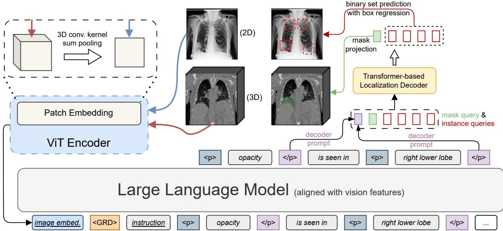  
Figure 1: The architecture of VividMed, which is built upon a base VLM (left and lower) and a promptable localization module (upper right). The model identifies key phrases for grounding by enclosing them with bracket tokens, and the hidden states of the closed bracket token is used for prompting the localization module. The query tokens for both mask and instances are fed to the transformer-based localization decoder in parallel. The bounding boxes for negative instances are illustrated with dashed lines. The model accepts both 2D and 3D images as input by adaptively adjusting weights in the patch embedding layer. The vision encoder of the localization module is omitted for clarity.

$$
\underset { \sigma \in S _ { m } } { \operatorname { a r g m i n } } \sum _ { i = 1 } ^ { m } L _ { \mathrm { c o s t } } \big ( \hat { y } _ { i } , y _ { \sigma ( i ) } \big ) .\tag{1}
$$

Given the cost function $L _ { \mathrm { { c o s t } } }$ , the optimization objective 1 can be solved precisely in polynomial time using the Hungarian algorithm (Kuhn, 1955; Jocobi and Borchardt, 1865).

Let $b _ { i }$ and $\hat { b } _ { i }$ denote the bounding box coordinates for $y _ { i }$ and $\hat { y } _ { i }$ , respectively; $c _ { i } = 1$ if $y _ { i }$ is positive, and $c _ { i } = 0$ otherwise; and $\hat { p } _ { i }$ denotes the predicted probability of $\hat { y } _ { i }$ being positive. The cost function $L _ { \mathrm { c o s t } }$ for each pair of $\hat { y } _ { i }$ and $y _ { j }$ is defined as a linear combination of a bounding box regression loss $L _ { \mathrm { b o x } }$ and a discrimination loss $L _ { \mathrm { d i s c } }$

$$
\begin{array} { r } { L _ { \mathrm { d i s c } } ( \hat { p } _ { i } , c _ { j } ) + \left\{ \begin{array} { l l } { 0 } & { c _ { j } = 0 } \\ { L _ { \mathrm { b o x } } ( \hat { b } _ { i } , b _ { j } ) } & { c _ { j } = 1 } \end{array} \right. . } \end{array}\tag{2}
$$

We choose $\ell ^ { 1 }$ loss and GIoU loss (Rezatofighi et al., 2019) for $L _ { \mathrm { b o x } }$ , and focal loss (Lin et al., 2020) for $L _ { \mathrm { d i s c } }$ following DINO (Zhang et al., 2023).

The final loss for bounding boxes is the same as Eq. 1. For segmentation masks, we use a combination of Dice loss and focal loss.

## 3.2.3 Diverse Input Handling

Most medical images consist of a stack of 2D image slices. A common 2D image, such as an X-ray image, is a special case with a single slice. To handle medical images with various numbers of slices, a direct approach would be to interpolate all images to a fixed size. However, for 3D images, inter-slice interpolation can introduce unwanted artifacts, such as overlapping contents of adjacent slices. Instead of interpolating input images, we dynamically adjust related model weights based on the number of slices of the input image, inspired by previous works on building universal backbones for medical images (Luo et al., 2024). We provide a detailed discussion on this topic in Appendix D.

Patch Embedding For a ViT-based vision encoder, we set the maximum number of patches $t _ { d }$ and the base patch size $P _ { d }$ along the depth dimension, on which the image slices are stacked. For an input image with $D$ slices, the effective patch size $P _ { d } ^ { \prime }$ is dynamically given as the closest valid patch size, with a closed form:

$$
\left\{ \begin{array} { l l } { 1 } & { D \leq t _ { d } } \\ { 2 \uparrow \mathrm { r o u n d } \left( \log _ { 2 } \frac { D } { t _ { d } } \right) , } & { t _ { d } < D \leq t _ { d } P _ { d } , } \\ { P _ { d } } & { D > t _ { d } P _ { d } } \end{array} \right.\tag{3}
$$

where a $\uparrow b = a ^ { b }$ and $\mathrm { r o u n d } ( x ) = \lfloor x + 1 / 2 \rfloor$ . The convolution kernel weight in the patch embedding layer is then reduced to the effective patch size through sum pooling, which make the output embeddings of different patch sizes commensurable. During training, we sample log $P _ { d } ^ { \prime }$ from a normal distribution $N ( \log _ { 2 } ( D / t _ { d } ) , 0 . 2 5 )$ for augmentation.

Upsampling The decoder in the localization module involves the upsampling of feature maps when output segmentation masks. The upsampling is achieved with a series of transposed convolution layers, each with a scale factor of 2. To preserve a consistent size with the input, if the depth of the feature map has already reached D, then upsampling is disabled along the depth dimension. This is implemented with reducing the transposed convolution kernel weight along the depth dimension with mean pooling.

## 3.3 Model Training

We design a three-stage training procedure for VividMed, where each stage involves different training tasks. All stages are trained end-to-end with visual instruction-following training data, which are constructed using open datasets and models. We sketch the training procedure in Section 3.3.1 and detail each task involved in Section 3.3.2.

## 3.3.1 Training Procedure

Stage 1: Visual Grounding Pre-training In the first stage, we pre-train the model’s visual grounding ability with the task of target detection and localization. Specifically, the model is instructed to determine whether given targets exist on the image, and list the target names along with their presence in the response. The target names in responses are then visually grounded on the image. We utilize open source medical image semantic segmentation and disease detection datasets to construct training data for this task.

Stage 2: Medical Visual Instruction Tuning This stage is dedicated to training the model’s visual understanding and reasoning capabilities for medical images. The training data is constructed using hand-crafted prompt templates across several tasks, including visual question answering (VQA), image captioning, and report generation. Visual grounding is disabled during this stage.

Stage 3: Alignment In the third stage, we finetune the model to align both the visual grounding and medical image understanding abilities trained by previous stages to unleash the combined strengths. To do this, we train the model with the grounded report generation task, where the model generates reports for input images and visually grounds key phrases on images. We synthesize training data for this stage as described in Section 3.3.3.

## 3.3.2 Training Datasets

Visual Question Answering This task involves instructing the model with a question about an image, and the model should answer based on the image. We construct three types of VQA data. (i) Modality Recognition: query the imaging modality of the image, such as X-ray, CT, and MRI. The modality information is available for most data, and we randomly include this task for 50% of training samples. (ii) Plane Recognition: query the viewing plane of the chest X-ray image. We randomly include this task for 20% of training samples from MIMIC-CXR. (iii) Abnormality Recognition: query if specific abnormalities are present on the input image. We randomly include this task for 20% of training samples from Vin-Dr-CXR, MIMIC-CXR, and CT-RATE, utilizing the associated abnormality labels.

Image Captioning This task involves the model predicting the caption of an image. We adopt the ROCOv2 (Rückert et al., 2024) dataset for this task, which comprises 79,789 diverse radiographs with associated medical concepts and captions. We address hallucination vulnerability in captions as described in Appendix E, and discard captions with overly low quality. After filtering, there are 59,958

image-caption pairs.

Report Generation This task requires the model to generate two key sections of a typical report: (i) Findings: (Johnson et al., 2019): provides a detailed description of the observations from the imaging study, including the presence of any abnormalities and their anatomical locations. (ii) Impression: synthesizes these observations into a concise diagnostic summary.

We employ two large publicly available radiology report datasets, encompassing both 2D and 3D images:

(i) MIMIC-CXR (Johnson et al., 2019): A chest X-ray dataset containing 377,110 images corresponding to 227,835 radiographic studies, each study accompanied by labels and a report. In this work, we use its JPEG format version (Johnson et al., 2024).

(ii) CT-RATE (Hamamci et al., 2024): A 3D medical imaging dataset consisting of 25,692 chest CT volumes paired with labels and reports.

For both datasets, we use official data splits and address hallucination vulnerability in the reports as described in Appendix E. We also discard reports lacking “Findings” or “Impression” sections. For MIMIC-CXR, we filter the training set for balance between studies with and without findings. In line with prior studies (Yang et al., 2024; Hyland et al., 2024), we only use frontal chest X-ray images to generate report, which visualize the anatomy most clearly. After filtering, there are 121,953 training and 1,587 testing image-report pairs in MIMIC-CXR and 24,086 training and 1,560 testing imagereport pairs in CT-RATE.

Grounded Report Generation We construct training data for the task with an automatic pipeline using open datasets and models, the details are described in Section 3.3.3. The statistics for resulting grounded reports are presented in Table 1.

<table><tr><td>Dataset</td><td>MIMIC-CXR</td><td>CT-RATE</td></tr><tr><td>#tags</td><td>435396</td><td>346650</td></tr><tr><td>#boxes/masks</td><td>33114</td><td>96620</td></tr></table>

Table 1: Statistics for resulting grounded reports generated by our pipeline. Note that the number of boxes or masks are significantly smaller than tags due to many classes are unsupported by the pre-trained detection or segmentation module.

## 3.3.3 Grounded Reports Construction

We design a automatic pipeline to construct training data for the task of grounded report generation. The pipeline is applied to both MIMIC-CXR and CT-RATE datasets.

Key Phrases Identification First, we instruct the pre-trained LLM of Meta Llama 3 to identify key phrases in the report text that correspond to anatomical structures or abnormality findings on images (Figure 6). In our experiments, we find that the fully open-vocabulary manner for this step results in inferior results. Therefore, we maintain a taxonomy of common targets of human body and instruct the LLM to focus on targets within it. As a result, key phrases along with their standardized names are extracted from the reports.

Positive Targets Filtering We find that LLM tends to wrongly identify targets that are stated as absent in the image, such as “No pleural effusion or pneumothorax is observed”. Therefore, we introduce an intermediate step by instructing the LLM to filter only positive targets from the output of the last step (Figure 7).

Localized Annotations Generation Finally, we utilize pre-trained models to generate localized annotations for extracted phrases. For abnormality targets, we train a detection model of DINO with EVA-02 backbone (Fang et al., 2024) ourselves, utilizing the VinDr-CXR dataset. For anatomical structures, we simply utilize the pre-trained SAT-Pro (Zhao et al., 2024) as it demonstrates robust out-of-box segmentation performance.

## 4 Experiments

## 4.1 Target Detection and Localization

Datasets We use the validation split of TotalSegmentator (TS) (Wasserthal et al., 2023) for segmentaiton mask generation and the test split of VinDr-CXR for bounding boxes generation.

Settings In this task, we evaluate the model’s localization ability for given targets. Specifically, the model directly processes class names in visual grounding format, as described in Section 3.2.1, and the hidden states of the 
 is used to prompt the localization module and obtain the final results.

Metrics For segmentation, we compute Dice coefficient and $\ell ^ { 1 }$ distance.

<table><tr><td></td><td colspan="3">VQA-RAD</td><td colspan="3">SLAKE</td><td colspan="3">VQA-Med</td></tr><tr><td>Model</td><td>BLEU-1</td><td>ROUGE-1</td><td>Accuracy</td><td>BLEU-1</td><td>ROUGE-1</td><td>Accuracy</td><td>BLEU-1</td><td>ROUGE-1</td><td>Accuracy</td></tr><tr><td>InstructBLIP</td><td>0.368</td><td>0.392</td><td>0.428</td><td>0.510</td><td>0.551</td><td>0.558</td><td>0.166</td><td>0.205</td><td>0.222</td></tr><tr><td>LLaVA 1.6 (13B)</td><td>0.526</td><td>0.540</td><td>0.558</td><td>0.818</td><td>0.822</td><td>0.828</td><td>0.619</td><td>0.630</td><td>0.614</td></tr><tr><td>CogVLM</td><td>0.545</td><td>0.559</td><td>0.568</td><td>0.840</td><td>0.843</td><td>0.832</td><td>0.621</td><td>0.631</td><td>0.621</td></tr><tr><td>LLaVA-Med 1.5</td><td>0.491</td><td>0.503</td><td>0.529</td><td>0.579</td><td>0.581</td><td>0.559</td><td>0.398</td><td>0.400</td><td>0.391</td></tr><tr><td>M3D</td><td>0.471</td><td>0.481</td><td>0.497</td><td>0.557</td><td>0.570</td><td>0.544</td><td>0.272</td><td>0.270</td><td>0.263</td></tr><tr><td>RadFM</td><td>0.541</td><td>0.557</td><td>0.588</td><td>0.784</td><td>0.789</td><td>0.771</td><td>0.519</td><td>0.536</td><td>0.543</td></tr><tr><td>VividMed w/o VG</td><td>0.519</td><td>0.533</td><td>0.566</td><td>0.878</td><td>0.882</td><td>0.869</td><td>0.623</td><td>0.633</td><td>0.619</td></tr><tr><td>VividMed</td><td>0.542</td><td>0.558</td><td>0.568</td><td>0.880</td><td>0.885</td><td>0.873</td><td>0.636</td><td>0.648</td><td>0.637</td></tr></table>

Table 2: Evaluation results of visual question answering. Accuracy is evaluated with Llama 3 70B. We notice that RadFM is trained on the MedPix® database, which is the source for both VQA-RAD and VQA-Med. Therefore, we exclude RadFM from comparison on both datasets.
<table><tr><td>Dataset</td><td>Metric</td><td>R2GenGPT</td><td>M3D</td><td>RadFM</td><td> $\mathbf { V i v i d M e d } _ { \mathrm { w / o \ V G } }$ </td><td>VividMed</td></tr><tr><td rowspan="12">MIMIC-CXR</td><td>BLEU-4</td><td>0.093</td><td>0.049</td><td>0.071</td><td>0.122</td><td>0.120</td></tr><tr><td>ROUGE-L</td><td>0.267</td><td>0.200</td><td>0.253</td><td>0.310</td><td>0.306</td></tr><tr><td>METEOR</td><td>0.310</td><td>0.241</td><td>0.283</td><td>0.361</td><td>0.364</td></tr><tr><td>Macro CheXpert F1 14</td><td>0.295</td><td>0.115</td><td>0.165</td><td>0.346</td><td>0.370</td></tr><tr><td>Micro CheXpert F1 14</td><td>0.440</td><td>0.176</td><td>0.268</td><td>0.507</td><td>0.529</td></tr><tr><td>Macro CheXpert F1 5</td><td>0.453</td><td>0.193</td><td>0.279</td><td>0.494</td><td>0.512</td></tr><tr><td>Micro CheXpert F1 5</td><td>0.522</td><td>0.234</td><td>0.361</td><td>0.579</td><td>0.598</td></tr><tr><td>Macro CheXpert FNR 14</td><td>0.152</td><td>0.199</td><td>0.177</td><td>0.138</td><td>0.133</td></tr><tr><td>Micro CheXpert FNR 14</td><td>0.146</td><td>0.195</td><td>0.178</td><td>0.131</td><td>0.124</td></tr><tr><td>Macro CheXpert FNR 5</td><td>0.218</td><td>0.293</td><td>0.257</td><td>0.190</td><td>0.181</td></tr><tr><td>Micro CheXpert FNR 5</td><td>0.209</td><td>0.285</td><td>0.251</td><td>0.186</td><td>0.175</td></tr><tr><td>CheXbert Šimilarity</td><td>0.393</td><td>0.251</td><td>0.299</td><td>0.444</td><td>0.445</td></tr><tr><td>RadGraph F1</td><td>0.240</td><td>0.169</td><td>0.182</td><td>0.278</td><td>0.278</td></tr><tr><td rowspan="6">CT-RATE</td><td>RadCliQ v1 (↓)</td><td>0.272</td><td>0.504</td><td>0.423</td><td>0.142</td><td>0.142</td></tr><tr><td>BLEU-4</td><td></td><td>0.193</td><td>0.226</td><td>0.240</td><td>0.245</td></tr><tr><td>ROUGE-L</td><td></td><td>0.327</td><td>0.352</td><td>0.369</td><td>0.373</td></tr><tr><td>METEOR</td><td></td><td>0.343</td><td>0.402</td><td>0.418</td><td>0.419</td></tr><tr><td>Macro RadBERT F1</td><td></td><td>0.114</td><td>0.112</td><td>0.264</td><td>0.312</td></tr><tr><td>Micro RadBERT F1</td><td></td><td>0.182</td><td>0.215</td><td>0.375</td><td>0.395</td></tr><tr><td>Macro RadBERT FNR Micro RadBERT FNR</td><td></td><td></td><td>0.192 0.183</td><td>0.184 0.176</td><td>0.160 0.152</td><td>0.156 0.149</td></tr></table>

Table 3: Evaluation results of report generation on MIMIC-CXR and CT-RATE test sets. Note that R2GenGPT can only handle 2D images and is not evaluated on CT-RATE, where the images are 3D CT scans.

Results The results are as follows:
<table><tr><td></td><td>Dice (%)</td><td>Mean  $\ell ^ { 1 }$ </td><td>Mean GIoU</td></tr><tr><td>nnU-Net</td><td>84.0</td><td></td><td></td></tr><tr><td>VividMed</td><td>70.3</td><td>0.121</td><td>1.43</td></tr></table>

The performance of the nnU-Net (Isensee et al., 2020) is taken from official TS results. It is expected that results are inferior than models specific for segmentation or detection, due to the limited training scale of our model and the exhaustive task prior incorporation by task-specific models. We leave the improvement of localization quality to future works.

## 4.2 Visual Question Answering

Datasets We adopt three widely used VQA datasets for evaluation:

(i) VQA-RAD (Lau et al., 2018): A radiology VQA dataset comprising 315 images and 2,248 QA pairs.

(ii) SLAKE (Liu et al., 2021): A bilingual (English and Chinese) medical VQA dataset. We only keep the English portion in our experiments, resulting in 641 images and 7,033 QA pairs.

(iii) VQA-Med (Ben Abacha et al., 2019): A medical VQA dataset consisting of 4,200 images

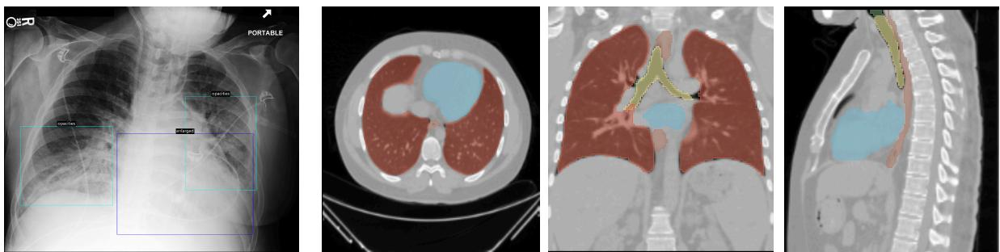  
Findings: Lung volumes are low. Heart size is mildly enlarged. Hilar contours are unremarkable. Opacities in the lung bases likely reflect areas of atelectasis. No large pleural effusion or pneumothorax is identified. No acute osseous abnormalities seen.  
Findings: Trachea and main bronchi are open. No pathological increase in wall thickness was observed in the esophagus . No pathological LAP was detected in the mediastinum. The heart and mediastinal vascular structures could not be evaluated optimally due to the lack of contrast, and they have a natural appearance. Pleural effusionthickening was not detected in both hemithorax. In the evaluation of both lung parenchyma; No active infiltration or mass lesion was detected. No pathology was detected in the sections passing through the upper part of the abdomen. No lytic or destructive lesions were detected in bone structures.

Figure 2: Selected qualitative results for grounded report generation, zoom in for better view. Impressions are omitted for clarity.

and 13,792 QA pairs.

Settings We compare VividMed with several popular general-purpose and domain-specific models (Dai et al., 2023; Liu et al., 2024; Wang et al., 2023a; Li et al., 2023; Bai et al., 2024; Wu et al., 2023b). All models are fine-tuned on each dataset for evaluation. During training, we combine all available QA pairs for the same image into a multiround conversation for better efficiency.

Metrics We employ BLEU-1 (Papineni et al., 2002) and ROUGE-1 (Lin, 2004) as evaluation metrics. As high-quality answers may not lexically match the reference ones, especially in medical contexts, we additionally utilize Llama 3 70B to evaluate accuracy.

Results The evaluation results are presented in Table. 2. VividMed shows non-trivial general improvement over fine-tuned CogVLM and outperforms all other baselines. Specifically, VividMed improves the answer accuracy by 4.1% for SLAKE and 1.6% for VQA-Med. We also find that generalpurpose VLMs like CogVLM and LLaVA 1.6 could also achieve promising results after fine-tuning on medical data, and we suggest that an effective way towards GMAI could still be starting from strong general-purpose foundation models and incorporating domain-specific data and designs for medical purposes.

## 4.3 Report Generation

Datasets The test sets of both MIMIC-CXR and CT-RATE are used for evaluation.

Settings Due to the complexity of report generation, we only focus on baselines that have undergone extensive training for this task (Wang et al., 2023b; Bai et al., 2024; Wu et al., 2023b). For fair comparison, we further fine-tune all baselines (except for R2GenGPT, which is specialized for the MIMIC-CXR and OpenI datasets) on training sets to ensure output alignment.

Metrics Following common practices, we employ several common n-gram-based lexical metrics: BLEU-4, ROUGE-L and METEOR (Banerjee and Lavie, 2005). We also evaluate the generated reports through the lens of clinical metrics, including CheXpert F1 and FNR, CheXbert vector similarity, RadGraph F1 and FNR, RadCliQ v1 and RadBERT F1. The details of the clinical metrics are given in Appendix C.

Results The evaluation results are shown in Table 3. VividMed outperforms all other baselines by a large margin on both datasets. Given the higher BLEU-4, ROUGE-L and METEOR metrics on both dataset of VividMed, it could generate more coherent reports within the context of radiology, facilitating accurate interpretation of the generated reports for clinicians. VividMed is also shown with stronger ability of abnormality recognition, where it improves macro CheXpert F1 by 8.5% and macro RadBERT F1 by 4.8%, and has FNRs consistently lower than other baselines. Notably, VividMed is evaluated on both datasets directly without further fine-tuning on each dataset, highlighting its capability to effectively handle both 2D and 3D data simultaneously.

## 4.4 Grounded Report Generation

We evaluate VividMed on the corresponding test sets of both MIMIC-CXR and CT-RATE. The selected qualitative results are shown in Figure 2. After alignment, VividMed is able to generate accurate report while also grounds key phrases on images, significantly enhancing interpretation procedure for medical images. More results and analyses can be found in Appendix G.

Error Analysis We conduct a qualitative review for grounded reports generated by VividMed on 12 selected cases from MIMIC-CXR test set, following the methodology of MAIRA-2 (Bannur et al., 2024). Among 91 generated sentences, 82 can be accepted as-is, 9 are wrongly stated and need major correction. 6 critical omissions are determined. Overall, 8 reports (67%) required at most one correction. Among 17 correctly identified findings, 16 (94%) of them are accurately visually grounded. Qualitative examples also show that when findings are incorrectly reported, visual grounding gives obvious outlier results.

## 4.5 Ablation Studies

We remove the visual grounding tasks from our training procedure to explore their impact on downstream tasks. Results presented in Table 2 and Table 3 demonstrate consistent performance degradation, showing that the integration of visual grounding ability leads to improved performance on other downstream tasks.

Contrary to our findings, MAIRA-2 (Bannur et al., 2024) reports that integrating the grounded report generation task does not affect the report generation performance of the model. We hypothesize that one reason behind this is that MAIRA-2 implements visual grounding with tokenized bounding box coordinates, which are still generated in the way of causal language modeling and the localized information is not effectively utilized. On the other hand, our model incorporates a pixel- or voxellevel localization module and is end-to-end trained, which benefits both tasks.

## 5 Conclusion

In this paper, we present VividMed as a pioneering step towards vision-language models with versatile visual grounding for medical images. Through its novel architecture, grounded data annotation pipeline, and the three-stage training procedure, VividMed exhibits superior performance on various downstream tasks, and realizes the visual grounding tasks especially the grounded report generation on MIMIC-CXR and CT-RATE datasets. Our empirical results show that the integration of visual grounding capabilities boosts the performance of medical VLMs on other downstream tasks as well. We believe our work has established a robust baseline in this field, and hope that future research may focus on improving performance further, as well as integrating into reliable clinical applications that benefit patients.

## Limitations

During our experiments, we observe that there is still room for improvement in downstream tasks through more careful hyperparameters tuning and more computational resources. The clinical utility of our model can be further enhanced by allowing more flexible interaction. In addition, we believe the incorporation of instance-level localization into visual grounding VLMs can be implemented with more recent advanced techniques, such as deriving from recent open-set object detection techniques, as well as function calling to external localization modules. Furthermore, due to the limited available data, our model does not fully unleash the promising potentials of grounded report generation and struggles generalizing beyond chest X-ray and CT images on this task. The absence of wellestablished evaluation metrics and benchmarks also poses a challenge in assessing the performance.

## Ethics Statement

All data involved in our study are sourced from publicly available, de-identified datasets. Our model and data is not intended for real-world clinical usage. Despite impressive performance compared to baselines, the generated reports still suffer from inaccuracies and require human review if applied in practice. We recognize that while automated tools can enhance efficiency, the expertise of healthcare professionals remain indispensable for clinical practice in the foreseeable future.

## Acknowledgement

This study was supported by grants from the National Key R&D Program of China (2024YFF1207100, 2024YFF1207103, 2022YFC2703100, 2022YFC2703105), Guoqiang Institute of Tsinghua University, and Beijing National Research Center for Information Science and Technology (BNRist). The funders had no roles in study design, data collection and analysis, publication decisions, or manuscript preparation.

## References

Jason Ansel, Edward Yang, Horace He, Natalia Gimelshein, Animesh Jain, Michael Voznesensky, Bin Bao, Peter Bell, David Berard, Evgeni Burovski, Geeta Chauhan, Anjali Chourdia, Will Constable, Alban Desmaison, Zachary DeVito, Elias Ellison, Will Feng, Jiong Gong, Michael Gschwind, Brian Hirsh, Sherlock Huang, Kshiteej Kalambarkar, Laurent Kirsch, Michael Lazos, Mario Lezcano, Yanbo Liang, Jason Liang, Yinghai Lu, C. K. Luk, Bert Maher, Yunjie Pan, Christian Puhrsch, Matthias Reso, Mark Saroufim, Marcos Yukio Siraichi, Helen Suk, Shunting Zhang, Michael Suo, Phil Tillet, Xu Zhao, Eikan Wang, Keren Zhou, Richard Zou, Xiaodong Wang, Ajit Mathews, William Wen, Gregory Chanan, Peng Wu, and Soumith Chintala. 2024. Pytorch 2: Faster machine learning through dynamic python bytecode transformation and graph compilation. In Proceedings ofthe 29th ACM International Conference on Architectural Supportfor Programming Languages and Operating Systems, Volume 2, ASPLOS ’24, page 929–947, New York, NY, USA. Association for Computing Machinery.

Fan Bai, Yuxin Du, Tiejun Huang, Max Q. H. Meng, and Bo Zhao. 2024. M3d: Advancing 3d medical image analysis with multi-modal large language models. Preprint, arXiv:2404.00578.

Jinze Bai, Shuai Bai, Shusheng Yang, Shijie Wang, Sinan Tan, Peng Wang, Junyang Lin, Chang Zhou, and Jingren Zhou. 2023. Qwen-vl: A frontier large vision-language model with versatile abilities. arXiv preprint arXiv:2308.12966.

Satanjeev Banerjee and Alon Lavie. 2005. Meteor: An automatic metric for mt evaluation with improved correlation with human judgments. In Proceedings of the acl workshop on intrinsic and extrinsic evaluation measures for machine translation and/or summarization, pages 65–72.

Shruthi Bannur, Kenza Bouzid, Daniel C. Castro, Anton Schwaighofer, Sam Bond-Taylor, Maximilian Ilse, Fernando Pérez-García, Valentina Salvatelli, Harshita Sharma, Felix Meissen, Mercy Ranjit, Shaury Srivastav, Julia Gong, Fabian Falck, Ozan Oktay, Anja Thieme, Matthew P. Lungren, Maria Teodora Wetscherek, Javier Alvarez-Valle, and Stephanie L. Hyland. 2024. Maira-2: Grounded radiology report generation. Preprint, arXiv:2406.04449.

Asma Ben Abacha, Sadid A. Hasan, Vivek V. Datla, Joey Liu, Dina Demner-Fushman, and Henning Müller. 2019. Vqa-med: Overview of the medical visual question answering task at imageclef 2019. In Working Notes of CLEF 2019, volume 2380 of CEUR Workshop Proceedings, Lugano, Switzerland. CEUR-WS.org.

M. Jorge Cardoso, Wenqi Li, Richard Brown, Nic Ma, Eric Kerfoot, Yiheng Wang, Benjamin Murrey, Andriy Myronenko, Can Zhao, Dong Yang, Vishwesh Nath, Yufan He, Ziyue Xu, Ali Hatamizadeh, Andriy

Myronenko, Wentao Zhu, Yun Liu, Mingxin Zheng, Yucheng Tang, Isaac Yang, Michael Zephyr, Behrooz Hashemian, Sachidanand Alle, Mohammad Zalbagi Darestani, Charlie Budd, Marc Modat, Tom Vercauteren, Guotai Wang, Yiwen Li, Yipeng Hu, Yunguan Fu, Benjamin Gorman, Hans Johnson, Brad Genereaux, Barbaros S. Erdal, Vikash Gupta, Andres Diaz-Pinto, Andre Dourson, Lena Maier-Hein, Paul F. Jaeger, Michael Baumgartner, Jayashree Kalpathy-Cramer, Mona Flores, Justin Kirby, Lee A. D. Cooper, Holger R. Roth, Daguang Xu, David Bericat, Ralf Floca, S. Kevin Zhou, Haris Shuaib, Keyvan Farahani, Klaus H. Maier-Hein, Stephen Aylward, Prerna Dogra, Sebastien Ourselin, and Andrew Feng. 2022. Monai: An open-source framework for deep learning in healthcare. Preprint, arXiv:2211.02701.

Nicolas Carion, Francisco Massa, Gabriel Synnaeve, Nicolas Usunier, Alexander Kirillov, and Sergey Zagoruyko. 2020. End-to-end object detection with transformers. In European conference on computer vision, pages 213–229. Springer.

Keqin Chen, Zhao Zhang, Weili Zeng, Richong Zhang, Feng Zhu, and Rui Zhao. 2023. Shikra: Unleashing multimodal llm’s referential dialogue magic. arXiv preprint arXiv:2306.15195.

Wei-Lin Chiang, Zhuohan Li, Zi Lin, Ying Sheng, Zhanghao Wu, Hao Zhang, Lianmin Zheng, Siyuan Zhuang, Yonghao Zhuang, Joseph E. Gonzalez, Ion Stoica, and Eric P. Xing. 2023. Vicuna: An opensource chatbot impressing gpt-4 with 90%\* chatgpt quality.

Wenliang Dai, Junnan Li, Dongxu Li, Anthony Tiong, Junqi Zhao, Weisheng Wang, Boyang Li, Pascale Fung, and Steven Hoi. 2023. InstructBLIP: Towards general-purpose vision-language models with instruction tuning. In Thirty-seventh Conference on Neural Information Processing Systems.

Tri Dao. 2024. Flashattention-2: Faster attention with better parallelism and work partitioning. In The Twelfth International Conference on Learning Representations.

Tri Dao, Dan Fu, Stefano Ermon, Atri Rudra, and Christopher Ré. 2022. Flashattention: Fast and memory-efficient exact attention with io-awareness. In Advances in Neural Information Processing Systems, volume 35, pages 16344–16359. Curran Associates, Inc.

Abhimanyu Dubey, Abhinav Jauhri, Abhinav Pandey, Abhishek Kadian, Ahmad Al-Dahle, Aiesha Letman, et al. 2024. The llama 3 herd of models. Preprint, arXiv:2407.21783.

Yuxin Fang, Quan Sun, Xinggang Wang, Tiejun Huang, Xinlong Wang, and Yue Cao. 2024. Eva-02: A visual representation for neon genesis. Image and Vision Computing, 149:105171.

Ibrahim Ethem Hamamci, Sezgin Er, Furkan Almas, Ayse Gulnihan Simsek, Sevval Nil Esirgun,

Irem Dogan, Muhammed Furkan Dasdelen, Bastian Wittmann, Enis Simsar, Mehmet Simsar, Emine Bensu Erdemir, Abdullah Alanbay, Anjany Sekuboyina, Berkan Lafci, Mehmet K. Ozdemir, and Bjoern Menze. 2024. A foundation model utilizing chest ct volumes and radiology reports for supervisedlevel zero-shot detection of abnormalities. Preprint, arXiv:2403.17834.

Edward J Hu, yelong shen, Phillip Wallis, Zeyuan Allen-Zhu, Yuanzhi Li, Shean Wang, Lu Wang, and Weizhu Chen. 2022. LoRA: Low-rank adaptation of large language models. In International Conference on Learning Representations.

Stephanie L. Hyland, Shruthi Bannur, Kenza Bouzid, Daniel C. Castro, Mercy Ranjit, Anton Schwaighofer, Fernando Pérez-García, Valentina Salvatelli, Shaury Srivastav, Anja Thieme, Noel Codella, Matthew P. Lungren, Maria Teodora Wetscherek, Ozan Oktay, and Javier Alvarez-Valle. 2024. Maira-1: A specialised large multimodal model for radiology report generation. Preprint, arXiv:2311.13668.

Jeremy Irvin, Pranav Rajpurkar, Michael Ko, Yifan Yu, Silviana Ciurea-Ilcus, Chris Chute, Henrik Marklund, Behzad Haghgoo, Robyn Ball, Katie Shpanskaya, Jayne Seekins, David A. Mong, Safwan S. Halabi, Jesse K. Sandberg, Ricky Jones, David B. Larson, Curtis P. Langlotz, Bhavik N. Patel, Matthew P. Lungren, and Andrew Y. Ng. 2019. Chexpert: A large chest radiograph dataset with uncertainty labels and expert comparison. Proceedings ofthe AAAI Conference on Artificial Intelligence, 33(01):590–597.

Fabian Isensee, Paul F. Jaeger, Simon A. A. Kohl, Jens Petersen, and Klaus H. Maier-Hein. 2020. nnu-net: a self-configuring method for deep learning-based biomedical image segmentation. Nature Methods, 18(2):203–211.

Saahil Jain, Ashwin Agrawal, Adriel Saporta, Steven Truong, Du Nguyen Duong Nguyen Duong, Tan Bui, Pierre Chambon, Yuhao Zhang, Matthew Lungren, Andrew Ng, Curtis Langlotz, Pranav Rajpurkar, and Pranav Rajpurkar. 2021. Radgraph: Extracting clinical entities and relations from radiology reports. In Proceedings of the Neural Information Processing Systems Track on Datasets and Benchmarks, volume 1.

C.G.J. Jocobi and C.W. Borchardt. 1865. De investigando ordine systematis aequationum differentialium vulgarium cujuscunque. Journal für die reine und angewandte Mathematik, 1865(64):297–320.

Alistair Johnson, Matt Lungren, Yifan Peng, Zhiyong Lu, Roger Mark, Seth Berkowitz, and Steven Horng. 2024. Mimic-cxr-jpg - chest radiographs with structured labels (version 2.1.0). PhysioNet.

Alistair EW Johnson, Tom J Pollard, Seth J Berkowitz, Nathaniel R Greenbaum, Matthew P Lungren, Chihying Deng, Roger G Mark, and Steven Horng. 2019. Mimic-cxr, a de-identified publicly available

database of chest radiographs with free-text reports. Scientific data, 6(1):317.

Damjan Kalajdzievski. 2023. A rank stabilization scaling factor for fine-tuning with lora. Preprint, arXiv:2312.03732.

Alexander Kirillov, Eric Mintun, Nikhila Ravi, Hanzi Mao, Chloe Rolland, Laura Gustafson, Tete Xiao, Spencer Whitehead, Alexander C. Berg, Wan-Yen Lo, Piotr Dollár, and Ross Girshick. 2023. Segment anything. In 2023 IEEE/CVF International Conference on Computer Vision (ICCV), pages 3992–4003.

H. W. Kuhn. 1955. The hungarian method for the assignment problem. Naval Research Logistics Quarterly, 2(1-2):83–97.

Xin Lai, Zhuotao Tian, Yukang Chen, Yanwei Li, Yuhui Yuan, Shu Liu, and Jiaya Jia. 2023. Lisa: Reasoning segmentation via large language model. arXiv preprint arXiv:2308.00692.

Jason J Lau, Soumya Gayen, Asma Ben Abacha, and Dina Demner-Fushman. 2018. A dataset of clinically generated visual questions and answers about radiology images. Scientific data, 5(1):1–10.

Benjamin Lefaudeux, Francisco Massa, Diana Liskovich, Wenhan Xiong, Vittorio Caggiano, Sean Naren, Min Xu, Jieru Hu, Marta Tintore, Susan Zhang, Patrick Labatut, Daniel Haziza, Luca Wehrstedt, Jeremy Reizenstein, and Grigory Sizov. 2022. xformers: A modular and hackable transformer modelling library. https: //github.com/facebookresearch/xformers.

Chunyuan Li, Cliff Wong, Sheng Zhang, Naoto Usuyama, Haotian Liu, Jianwei Yang, Tristan Naumann, Hoifung Poon, and Jianfeng Gao. 2023. Llavamed: Training a large language-and-vision assistant for biomedicine in one day. arXiv preprint arXiv:2306.00890.

Chin-Yew Lin. 2004. Rouge: A package for automatic evaluation of summaries. In Text summarization branches out, pages 74–81.

Tsung-Yi Lin, Priya Goyal, Ross Girshick, Kaiming He, and Piotr Dollár. 2020. Focal loss for dense object detection. IEEE Transactions on Pattern Analysis and Machine Intelligence, 42(2):318–327.

Bo Liu, Li-Ming Zhan, Li Xu, Lin Ma, Yan Yang, and Xiao-Ming Wu. 2021. Slake: A semantically-labeled knowledge-enhanced dataset for medical visual question answering. In 2021 IEEE 18th International Symposium on Biomedical Imaging (ISBI), pages 1650–1654. IEEE.

Haotian Liu, Chunyuan Li, Yuheng Li, Bo Li, Yuanhan Zhang, Sheng Shen, and Yong Jae Lee. 2024. Llavanext: Improved reasoning, ocr, and world knowledge.

Lingxiao Luo, Xuanzhong Chen, Bingda Tang, Xinsheng Chen, Rong Han, Chengpeng Hu, Yujiang Li, and Ting Chen. 2024. Building universal foundation models for medical image analysis with spatially adaptive networks. Preprint, arXiv:2312.07630.

Michael Moor, Oishi Banerjee, Zahra Shakeri Hossein Abad, Harlan M. Krumholz, Jure Leskovec, Eric J. Topol, and Pranav Rajpurkar. 2023. Foundation models for generalist medical artificial intelligence. Nature, 616(7956):259–265.

Kishore Papineni, Salim Roukos, Todd Ward, and Wei-Jing Zhu. 2002. Bleu: a method for automatic evaluation of machine translation. In Proceedings ofthe 40th annual meeting ofthe Associationfor Computational Linguistics, pages 311–318.

Zhiliang Peng, Wenhui Wang, Li Dong, Yaru Hao, Shaohan Huang, Shuming Ma, Qixiang Ye, and Furu Wei. 2024. Grounding multimodal large language models to the world. In The Twelfth International Conference on Learning Representations.

Renjie Pi, Jiahui Gao, Shizhe Diao, Rui Pan, Hanze Dong, Jipeng Zhang, Lewei Yao, Jianhua Han, Hang Xu, Lingpeng Kong, and Tong Zhang. 2023. DetGPT: Detect what you need via reasoning. In Proceedings of the 2023 Conference on Empirical Methods in Natural Language Processing, pages 14172–14189, Singapore. Association for Computational Linguistics.

Hanoona Rasheed, Muhammad Maaz, Sahal Shaji, Abdelrahman Shaker, Salman Khan, Hisham Cholakkal, Rao M. Anwer, Eric Xing, Ming-Hsuan Yang, and Fahad S. Khan. 2024. Glamm: Pixel grounding large multimodal model. In Proceedings ofthe IEEE/CVF Conference on Computer Vision and Pattern Recognition (CVPR), pages 13009–13018.

Tianhe Ren, Shilong Liu, Feng Li, Hao Zhang, Ailing Zeng, Jie Yang, Xingyu Liao, Ding Jia, Hongyang Li, He Cao, Jianan Wang, Zhaoyang Zeng, Xianbiao Qi, Yuhui Yuan, Jianwei Yang, and Lei Zhang. 2023. detrex: Benchmarking detection transformers. arXiv preprint.

Hamid Rezatofighi, Nathan Tsoi, JunYoung Gwak, Amir Sadeghian, Ian Reid, and Silvio Savarese. 2019. Generalized intersection over union: A metric and a loss for bounding box regression. In 2019 IEEE/CVF Conference on Computer Vision and Pattern Recognition (CVPR), pages 658–666.

Johannes Rückert, Louise Bloch, Raphael Brüngel, Ahmad Idrissi-Yaghir, Henning Schäfer, Cynthia S. Schmidt, Sven Koitka, Obioma Pelka, Asma Ben Abacha, Alba G. Seco de Herrera, Henning Müller, Peter A. Horn, Felix Nensa, and Christoph M. Friedrich. 2024. Rocov2: Radiology objects in context version 2, an updated multimodal image dataset. Preprint, arXiv:2405.10004.

Noam Shazeer. 2020. Glu variants improve transformer. Preprint, arXiv:2002.05202.

Akshay Smit, Saahil Jain, Pranav Rajpurkar, Anuj Pareek, Andrew Ng, and Matthew Lungren. 2020. Combining automatic labelers and expert annotations for accurate radiology report labeling using BERT. In Proceedings of the 2020 Conference on Empirical Methods in Natural Language Processing (EMNLP), pages 1500–1519, Online. Association for Computational Linguistics.

Weihan Wang, Qingsong Lv, Wenmeng Yu, Wenyi Hong, Ji Qi, Yan Wang, Junhui Ji, Zhuoyi Yang, Lei Zhao, Xixuan Song, et al. 2023a. Cogvlm: Visual expert for pretrained language models. arXiv preprint arXiv:2311.03079.

Zhanyu Wang, Lingqiao Liu, Lei Wang, and Luping Zhou. 2023b. R2gengpt: Radiology report generation with frozen llms. Meta-Radiology, 1(3):100033.

Jakob Wasserthal, Hanns-Christian Breit, Manfred T. Meyer, Maurice Pradella, Daniel Hinck, Alexander W. Sauter, Tobias Heye, Daniel T. Boll, Joshy Cyriac, Shan Yang, Michael Bach, and Martin Segeroth. 2023. Totalsegmentator: Robust segmentation of 104 anatomic structures in ct images. Radiology: Artificial Intelligence, 5(5):e230024.

Chaoyi Wu, Jiayu Lei, Qiaoyu Zheng, Weike Zhao, Weixiong Lin, Xiaoman Zhang, Xiao Zhou, Ziheng Zhao, Ya Zhang, Yanfeng Wang, et al. 2023a. Can gpt-4v (ision) serve medical applications? case studies on gpt-4v for multimodal medical diagnosis. arXiv preprint arXiv:2310.09909.

Chaoyi Wu, Xiaoman Zhang, Ya Zhang, Yanfeng Wang, and Weidi Xie. 2023b. Towards generalist foundation model for radiology by leveraging web-scale 2d&3d medical data. Preprint, arXiv:2308.02463.

Lin Yang, Shawn Xu, Andrew Sellergren, Timo Kohlberger, Yuchen Zhou, Ira Ktena, Atilla Kiraly, Faruk Ahmed, Farhad Hormozdiari, Tiam Jaroensri, Eric Wang, Ellery Wulczyn, Fayaz Jamil, Theo Guidroz, Chuck Lau, Siyuan Qiao, Yun Liu, Akshay Goel, Kendall Park, Arnav Agharwal, Nick George, Yang Wang, Ryutaro Tanno, David G. T. Barrett, Wei-Hung Weng, S. Sara Mahdavi, Khaled Saab, Tao Tu, Sreenivasa Raju Kalidindi, Mozziyar Etemadi, Jorge Cuadros, Gregory Sorensen, Yossi Matias, Katherine Chou, Greg Corrado, Joelle Barral, Shravya Shetty, David Fleet, S. M. Ali Eslami, Daniel Tse, Shruthi Prabhakara, Cory McLean, Dave Steiner, Rory Pilgrim, Christopher Kelly, Shekoofeh Azizi, and Daniel Golden. 2024. Advancing multimodal medical capabilities of gemini. Preprint, arXiv:2405.03162.

Senqiao Yang, Tianyuan Qu, Xin Lai, Zhuotao Tian, Bohao Peng, Shu Liu, and Jiaya Jia. 2023. An improved baseline for reasoning segmentation with large language model. arXiv preprint arXiv:2312.17240.

Haoxuan You, Haotian Zhang, Zhe Gan, Xianzhi Du, Bowen Zhang, Zirui Wang, Liangliang Cao, Shih-Fu Chang, and Yinfei Yang. 2024. Ferret: Refer and ground anything anywhere at any granularity. In

The Twelfth International Conference on Learning Representations.

Feiyang Yu, Mark Endo, Rayan Krishnan, Ian Pan, Andy Tsai, Eduardo Pontes Reis, Eduardo Kaiser Ururahy Nunes Fonseca, Henrique Min Ho Lee, Zahra Shakeri Hossein Abad, Andrew Y Ng, et al. 2023. Evaluating progress in automatic chest x-ray radiology report generation. Patterns, 4(9).

Hao Zhang, Feng Li, Shilong Liu, Lei Zhang, Hang Su, Jun Zhu, Lionel Ni, and Heung-Yeung Shum. 2023. DINO: DETR with improved denoising anchor boxes for end-to-end object detection. In The Eleventh International Conference on Learning Representations.

Tianyi Zhang, Varsha Kishore, Felix Wu, Kilian Q Weinberger, and Yoav Artzi. 2019. Bertscore: Evaluating text generation with bert. In International Conference on Learning Representations.

Yichi Zhang, Ziqiao Ma, Xiaofeng Gao, Suhaila Shakiah, Qiaozi Gao, and Joyce Chai. 2024. Groundhog: Grounding large language models to holistic segmentation. arXiv preprint arXiv:2402.16846.

Ziheng Zhao, Yao Zhang, Chaoyi Wu, Xiaoman Zhang, Ya Zhang, Yanfeng Wang, and Weidi Xie. 2024. One model to rule them all: Towards universal segmentation for medical images with text prompts. Preprint, arXiv:2312.17183.

Yiliang Zhou, Hanley Ong, Patrick Kennedy, Carol C Wu, Jacob Kazam, Keith Hentel, Adam Flanders, George Shih, and Yifan Peng. 2024. Evaluating gpt-v4 (gpt-4 with vision) on detection of radiologic findings on chest radiographs. Radiology, 311(2):e233270.

## A Symbols

The description of symbols used in this manuscript are listed in Table 4.

## B Base VLM Architecture

In brief, CogVLM 17B consists of a vision transformer (ViT) encoder, an MLP adapter of the SwiGLU variant (Shazeer, 2020), an LLM based on Vicuna 1.5 7B (Chiang et al., 2023).

During inference, firstly the ViT encoder divides the input image into non-overlapping patches and encodes them as image embeddings. Then the MLP adapter is employed to project the image embeddings into the language embedding space. Finally, the LLM generates responses by processing the concatenated projected image embeddings and the embeddings of language instructions. Notably, the image embeddings are processed using a separate set of parameters within the transformer layers of the LLM, originally referred to as the visual expert module. The visual expert module parameters are initialized from the pretrained LLM.

## C Clinical Metrics for Reports

## C.1 MIMIC-CXR

For the chest X-ray images from the MIMIC-CXR dataset, the following metrics are computed.

CheXpert F1 and FNR The macro and micro F1 scores and false nagative rates (FNRs) averaged over all 14 and 5 major2 CheXpert pathological observations (Irvin et al., 2019) extracted from the generated and reference reports using the CheXbert model (Smit et al., 2020).

CheXbert vector similarity The cosine similarity between the CheXbert-embedded reference and generated reports.

RadGraph F1 The F1 score for the presence of clinical entities and their relations extracted by the RadGraph model (Jain et al., 2021).

RadCliQ v1 (Yu et al., 2023): A composite metric integrating BLEU-2, CheXbert vector similarity, RadGraph F1, and BERTScore (Zhang et al., 2019) to predict report errors.

## C.2 CT-RATE

For the CT-RATE dataset, we compute RadBERT F1 and FNR, which is analogous to CheXpert F1 and FNR, but uses the RadBERT model trained specifically on the CT-RATE dataset to extract 18 abnormalities, which is used to annotate CT-RATE (Hamamci et al., 2024).

## D Discussion on Diverse Input Handling

Conventional vision models require all input tensors have the same spatial dimensions. Interpolation is a common technique to fulfill purpose. However, 3D medical images can have varying sizes, and inter-slice interpolation can introduce significant artifacts, particularly in regions where anatomical continuity is crucial. When interpolating these images to a unified size or voxel spacing, there is a risk of losing important spatial information. As a result, inter-slice interpolation can blur critical details and introduce uncertainty in tasks such as segmentation and detection, ultimately affecting the clinical interpretation of medical images.

<table><tr><td>Symbol</td><td>Description</td></tr><tr><td> $S _ { m }$ </td><td>The set of all permutations with m elements, or commonly known as the symmetric group of order m</td></tr><tr><td> $\sigma$ </td><td>A permutation (an element of  $S _ { m }$  for some m), i.e., a bijection that maps from a finite set with m elements to itself</td></tr><tr><td> $y _ { i }$ </td><td>The i-th ground truth bounding box label, where  $y$  may be padded with dummy negative instances</td></tr><tr><td> $\hat { y } _ { i }$   $\cal { L } _ { \mathrm { c o s t } } ( \cdot , \cdot )$ </td><td>The i-th bounding box predicted by the model The cost function matching a ground truth with a prediction, used by the Hungarian</td></tr><tr><td> $c _ { i }$ </td><td>algorithm for weighted bipartite matching Indicates if  $y _ { i }$  is a dummy negative instance  $( c _ { i } = 0 )$  or not  $( c _ { i } = 1 )$ </td></tr><tr><td> $\hat { p } _ { i }$ </td><td>The predicted probability by the model that  $\hat { y } _ { i }$  is positive (not a padded dummy negative instance)</td></tr><tr><td> $L _ { \mathrm { b o x } } ( \cdot , \cdot )$ </td><td>The loss function for bounding box regression; a component of  $L _ { \mathrm { { c o s t } } }$ </td></tr><tr><td> $\boldsymbol { L } _ { \mathrm { d i s c } } ( \cdot , \cdot )$ </td><td>The loss function for positive/negative classification for predicted instances; a component of  $L _ { \mathrm { c o s t } }$ </td></tr><tr><td> $a \uparrow b$ </td><td>Knuth&#x27;s up-arrow notation for exponentiation, equivalent to  $a ^ { b }$ </td></tr></table>

Table 4: Description of symbols.

In contrast, our proposed approach leverages dynamic patch embeddings, which adapt to the specific characteristics of each image without requiring uniform interpolation. This allows us to maintain the original spatial resolution and anatomical integrity of the image, ensuring that fine details are preserved. The principle of avoiding interpolation but adapting the (static) model architecture to image properties was empirically validated by nnU-Net by segmentation performance, and is widely used by nowadays medical image analysis models.

## E Hallucination Vulnerability Addressing

Radiologists frequently reference external information in reports, such as images of other views, prior examinations, and the patient’s medical history. While being crucial for diagnosis, such information cannot be inferred solely from a single image, and models trained on such reports tend to hallucinate, generating unfounded references to nonexistent external information (Hyland et al., 2024). While this issue should be resolved by including enough information (Bannur et al., 2024), such as images from other views, images and reports from prior studies images, prior reports, and the “Indication”, “Technique” and “Comparison” sections of the current report into the input (Bannur et al., 2024). However, such approach is infeasible for most datasets as they still fail to cover all external information of concern, especially for existing open datasets such as MIMIC-CXR and CT-RATE.

Conversely, we opt for a more flexible approach that removes content in the report that may result in hallucinations. Specifically, we instruct Meta Llama 3 70B (Dubey et al., 2024) to process reports and captions by removing all references to external information. Meanwhile, sentences are paraphrased based on the context with minimal modifications to minimize distribution shift and information loss.

## F Implementation Details

The details of hyperparameter settings are presented in Table 5. We train VividMed for 40k, 50k, and 10k steps for 3 stages, respectively. We adopt rank-stabilized LoRA (rsLoRA) (Hu et al., 2022; Kalajdzievski, 2023) with rank = 64 and α = 8 to adapt from the pre-trained general-purpose VLM. The base patch size of ViT is 16 for all spatial dimensions. Inspired by M3D (Bai et al., 2024), we adopt a max pooling layer to reduce the spatial dimensions of feature maps output by the vision encoder by a factor of 2 when applicable.

We implement our model largely based on Py-Torch 2 (Ansel et al., 2024) and MONAI (Cardoso et al., 2022). Additionally, we adapt the vision encoder and LLM to using FlashAttention-2 (Dao et al., 2022; Dao, 2024) for computation efficiency based on the xFormers (Lefaudeux et al., 2022). The DINO model for disease detection on chest

X-ray images is trained based on the detrex library (Ren et al., 2023). Our models are trained on 8 NVIDIA A100 GPUs with 80 GB memory.

For all downstream tasks, we train all models for the same batch size, number of iterations, and learning rate schedule. We adapt the open-sourced implementation of baselines to our settings. We refer readers to the detailed configuration in our code for each task and model.

## G More Qualitative Examples

We provide more qualitative examples and analyses in Figures 3 to 5. These examples further demonstrate the performance of VividMed and the significance of visual grounding in radiology report generation.

## H Prompt Templates

Grounded Reports Construction See Figures 6 and 7.

Datasets Pre-processing See Figures 8 and 9 for MIMIC-CXR, Figure 10 for CT-RATE, and Figure 11 for ROCOv2.

Evaluation Figure 12 depicts the prompt template for evaluating VQA accuracy.

<table><tr><td>Configuration</td><td>Stage 1</td><td>Stage 2</td><td>Stage 3</td></tr><tr><td>training steps</td><td>40k</td><td>50k</td><td>10k</td></tr><tr><td>linear warmup steps batch size</td><td>2k</td><td>2.5k 128</td><td>0</td></tr><tr><td>peak lr</td><td>5e-5</td><td>5e-5</td><td>2e-5</td></tr><tr><td>lr schedule</td><td></td><td>cosine decay</td><td></td></tr><tr><td>grad. clip norm.</td><td></td><td>1</td><td></td></tr><tr><td>optimizer Adam parameters</td><td></td><td>AdamW</td><td></td></tr><tr><td>weight decay</td><td></td><td>β = (0.9, 0.999), ε = 1e-8</td><td></td></tr><tr><td>base LLM</td><td></td><td>5e-2</td><td></td></tr><tr><td></td><td></td><td>Vicuna-1.5-7B</td><td></td></tr><tr><td>base ViT patch size</td><td></td><td> $1 6 \times 1 6 \times 1 6$ </td><td></td></tr><tr><td>numerical precision</td><td></td><td>bfloat16</td><td></td></tr><tr><td>LoRA rank</td><td></td><td>64</td><td></td></tr><tr><td>LoRA α</td><td></td><td>8</td><td></td></tr><tr><td>LoRA dropout</td><td></td><td>0.05</td><td></td></tr><tr><td>rsLoRA</td><td></td><td>√</td><td></td></tr></table>

Table 5: Hyperparameter settings of VividMed.

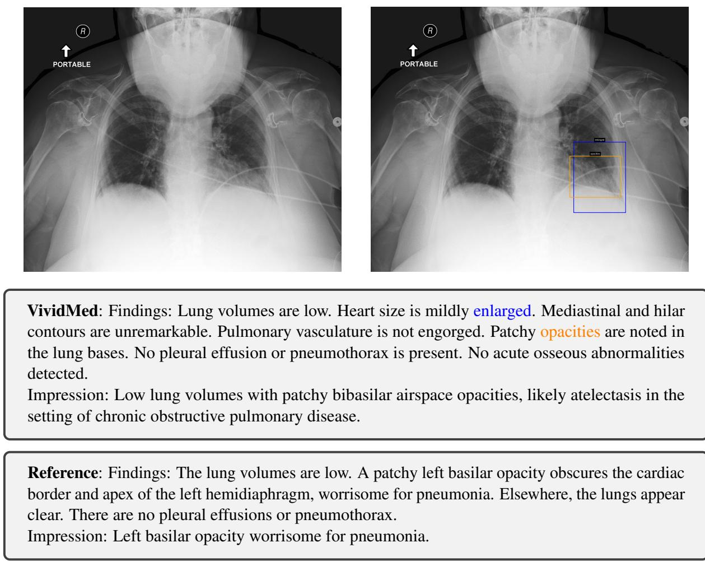  
Figure 3: In this example, the model wrongly identifies cardiomegaly and gives an unusual visual grounding result, which may remind the radiologist in clinical practice.

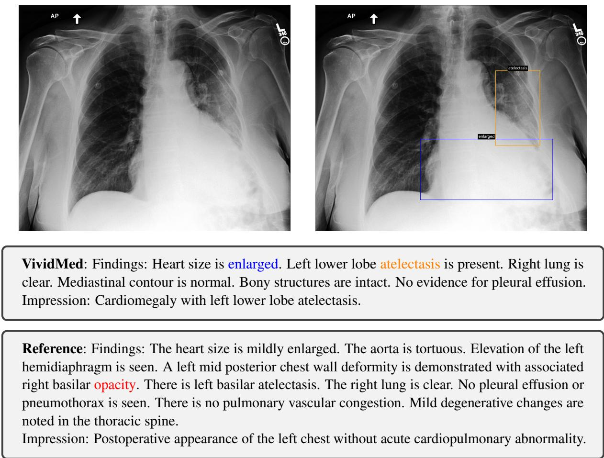  
Figure 4: In this example, the model correctly identifies cardiomegaly and atelectasis, validated by corresponding bounding boxes output by the visual grounding. However, it omits the presented opacity.

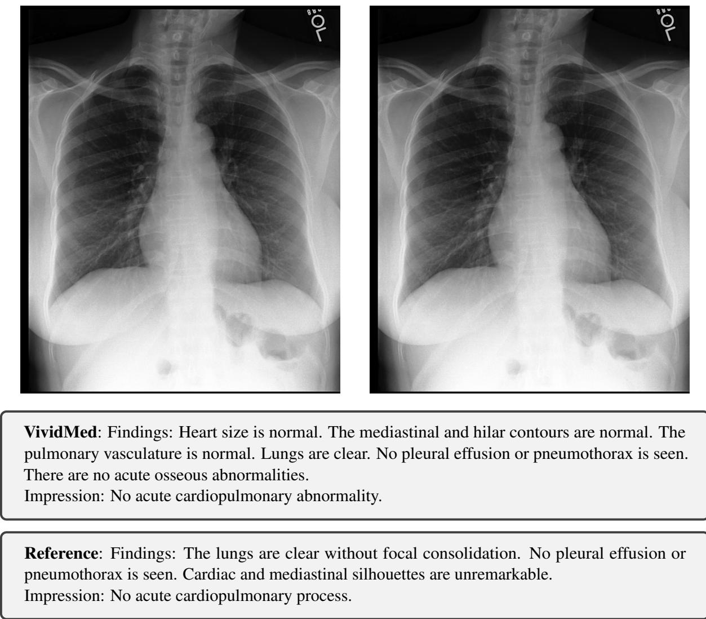  
Figure 5: In this example, the model correctly reports that no abnormality is presented.

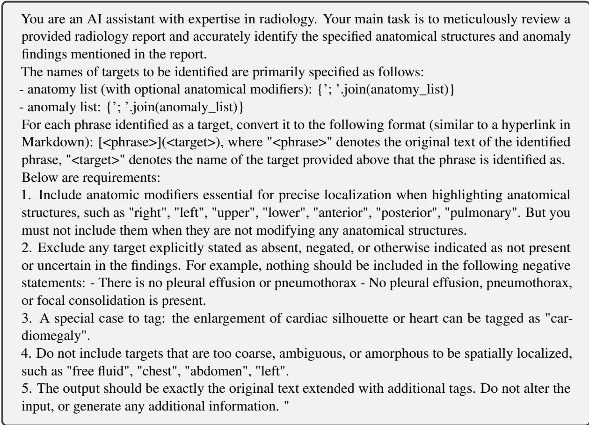  
Figure 6: Prompt template for Llama 3 70B used to identify key phrases. Hand-crafted few-shot examples are appended to the prompt. Some Python script is presented in the template for simplicity.

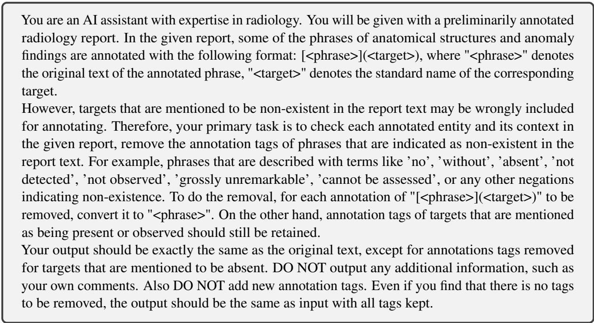  
Figure 7: Prompt template for Llama 3 70B used to filter positive targets. Hand-crafted few-shot examples are appended to the prompt.

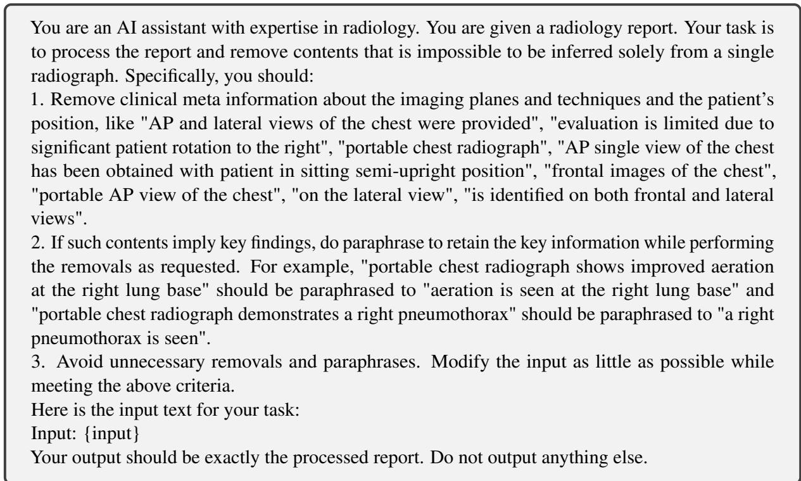  
Figure 8: Prompt templates used to pre-process the MIMIC-CXR dataset in two sequential steps (step 1).

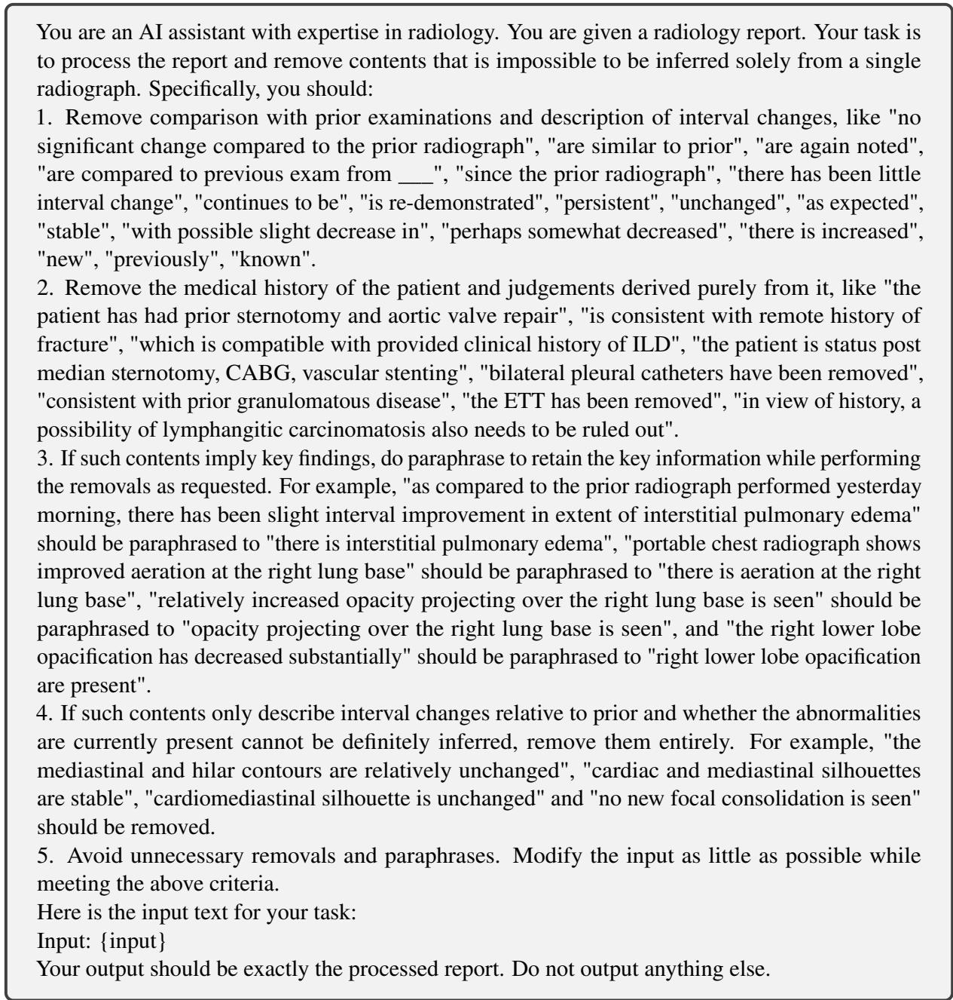  
Figure 9: Prompt templates used to pre-process the MIMIC-CXR dataset in two sequential steps (step 2).

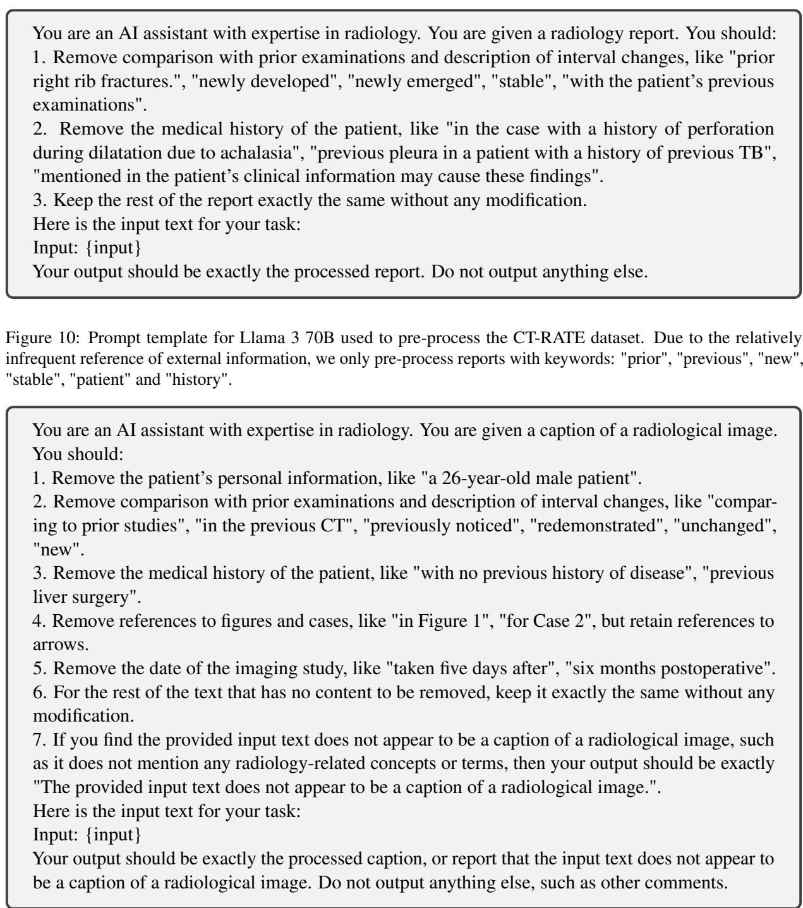

Figure 11: Prompt template for Llama 3 70B used to pre-process the ROCOv2 dataset.  
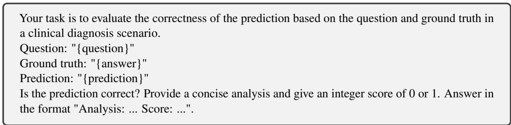  
Figure 12: Prompt template for Llama 3 70B used to evaluate VQA accuracy. We instruct the model to provide analysis befor giving the score to achieve Chain-of-Thought prompting and better explainability.