# VoCoT: Unleashing Visually Grounded Multi-Step Reasoning in Large Multi-Modal Models

Zejun Li1†, Ruipu Luo2†, Jiwen Zhang1, Minghui Qiu2,

Xuanjing Huang3, Zhongyu Wei1,4,5\*

1School of Data Science, Fudan University

2ByteDance

3School of Computer Science, Fudan University 4Research Institute of Intelligent and Complex Systems, Fudan University 5Shanghai Innovation Institute {zejunli20,zywei}@fudan.edu.cn

## Abstract

While large multi-modal models (LMMs) have exhibited impressive capabilities across diverse tasks, their effectiveness in handling complex tasks has been limited by the prevailing singlestep reasoning paradigm. To this end, this paper proposes VoCoT, a multi-step Visuallygrounded object-centric Chain-of-Thought reasoning framework tailored for inference with LMMs. VoCoT is characterized by two key features: (1) object-centric reasoning paths that revolve around cross-modal shared object-level information, and (2) visually grounded representation of object concepts in a multi-modal interleaved and aligned manner, which effectively bridges the modality gap within LMMs during long-term generation. To adapt LMMs in reasoning with VoCoT, we further construct an instruction-tuning dataset. By combining VoCoT with the prevalent open-source LMM architectures, we develop a VoCoT-based model, VolCano. With only 7B parameters and limited input image resolution, VolCano demonstrates excellent performance across various scenarios. In benchmarks like CLEVR and EmbSpatial, which highly require complex reasoning capabilities, VolCano outperforms SOTA models, including powerful GPT-4V. Related code, models, and datasets are released in https://github.com/RupertLuo/VoCoT.

## 1 Introduction

In recent years, the success of large language models (LLMs) (OpenAI, 2023a,b) has been gradually extended to the multi-modal domain. By equipping LLM backbones (Touvron et al., 2023a,b; Chiang et al., 2023) with visual encoders (Radford et al., 2021) and efficient cross-modal alignment through generative training on image-text data (Liu et al., 2024b; Schuhmann et al., 2021), the constructed large multi-modal models (LMMs) possess the capabilities to perceive visual signals and engage in dialogue with users in multi-modal contexts (Liu et al., 2024b; Dai et al., 2023; Bai et al., 2023).

Despite the potential demonstrated by LMMs to serve as unified and versatile foundations, even models like GPT-4V struggle in composite tasks requiring complex analysis (Yang et al., 2023b; Wu and Xie, 2023), such as spatial reasoning (Du et al., 2024). We attribute this phenomenon to a major limitation of current LMMs: the prevailing single-step question-to-answer (Q2A) inference paradigm that directly generates answers based on questions (Dai et al., 2023; Liu et al., 2023b). As illustrated in Figure 1, correctly answering the question relies on analyzing the actions and relationships of multiple objects and thinking step-bystep, which is almost impossible to accomplish in a single-step prediction. Moreover, the singlestep Q2A paradigm obscures the problem-solving process, limiting the interpretability of the LMM outputs. Conversely, in the language domain, the chain-of-thought (CoT) paradigm, which involves multi-step reasoning, has been widely explored in LLMs (Kojima et al., 2022; Wei et al., 2022), indicating a promising way for enhancing LMMs.

However, for complex contexts where multi-modal information coexists, constructing effective multistep reasoning paths faces several challenges: (1) Difficulty in integrating reasoning anchors within multi-modal contexts. Textual CoTs mainly extract key information from contexts, such as entities, as anchors and conduct multi-step reasoning around these anchors (Yao et al., 2024). In multi-modal contexts, the anchor information is further required to be concepts shared between images and texts and establish connections between modalities. Existing works either supplement the image with additional information (such as segmentation maps (Yang et al., 2023a) and dot grids (Lei et al., 2024)) as anchors, but such information can only be effectively utilized by GPT-4V, or they roughly consider a single region as the anchor through a searchbased approach (Shao et al., 2024), failing to model complex multi-object interactions. (2) Limited grounding capabilities of LMMs. During the generation process, LMMs may fail to ground textual descriptions to the corresponding visual information, resulting in erroneous information generated. For example, GPT-4V incorrectly ground the target person to the waiter in Figure 1. The risk of hallucination (Li et al., 2023d; Wang et al., 2023b) further hinders effective multi-step reasoning.

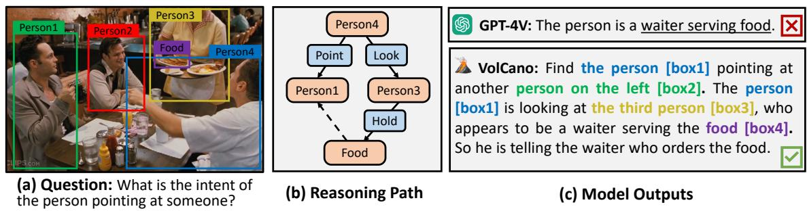  
Figure 1: An example to compare different inference paradigms in LMMs. (a) A visual question that requires complex reasoning. (b) The conceptual object-centric reasoning path constructed to solve the problem. (c) Outputs of GPT-4V and the proposed VolCano. Hallucination is included in the output of GPT-4V. VoCalno performs multi-step reasoning in the VoCoT format. In the reasoning path, key objects are highlighted and colors indicate the correspondence between object descriptions and the grounded regions in the image. “[box]” represents the coordinates of mentioned objects. Visual representations of objects are omitted for brevity.

To address these challenges, we introduce a framework to empower LMMs for effective and reliable multi-step reasoning. We propose VoCoT, Visually grounded object-centric Chain of Thought. VoCoT is a CoT format that is compatible with LMM inference: (1) As illustrated in Figure 1 (a, b), objects serve as fundamental semantic units in both images and text, effectively bridging multi-modal information. Therefore, VoCoT leverages objects as anchors for reasoning. LMMs are encouraged to conduct multi-step analysis on the properties of key objects, as well as the relationships between them, ultimately reaching a conclusion. (2) To ensure the reliability of reasoning paths, VoCoT represents objects in a visually grounded format: a tuple of <textual description, coordinates, corresponding visual representations>. Models are required to explicitly ground objects in images by generating coordinates for them. Visual representations of objects are supplemented to enhance the cross-modal relevance in reasoning paths. This design mimics the habit of human, where we continuously reference the visual information of an object in the image when we mention it. (3) We propose a RefBind mechanism to efficiently obtain the representations of objects without extra computation. Specifically, RefBind indexes the representation of each object from the image representation based on its coordinates. Generally, VoCoT constructs multi-modal interleaved reasoning paths where cross-modal aligned anchors are incorporated as shown in Figure 1 (c).

Nevertheless, there is a significant disparity between VoCoT and the formats of existing visual instruction data. To this end, we further construct a dataset, VoCoT-Instruct-80K, to train LMMs for reasoning in the format of VoCoT. VoCoT-Instruct-80K is built on multiple data sources: (1) Verbalizing structured reasoning paths from GQA (Hudson and Manning, 2019). (2) Supplementing visual QA pairs with thought processes. (3) Constructing complex questions and reasoning paths from images annotated with objects. By curating a wide range of data and leveraging assistance of GPT-4V, the presented dataset maintains both diversity and consistency in the desired format.

Based on the introduced VoCoT framework and dataset, we develop VolCano, a Visually-grounded multi-modal Chain-of-thought reasoning model. With only 7B parameters and 3362 input resolution, VolCano excels in various scenarios and even surpasses GPT-4V on benchmarks like CLEVR (Johnson et al., 2017) and EmbSpatial (Du et al., 2024) that highly require complex reasoning.

## 2 Visually-grounded Object-centric CoT

In this section, we explain how to enable LMM to perform multi-step reasoning in the format of visually-grounded object-centric chain-of-thought (VoCoT). In Section 2.1, we elaborate on the formulation of VoCoT. In Section 2.2, we present how to transform existing data resources into instructiontuning datasets aligned with the VoCoT format.

## 2.1 VoCoT Formulation

VoCoT requires LMMs to perform step-by-step reasoning based on the provided context. Following textual CoTs (Kojima et al., 2022; Wei et al., 2022; Wang et al., 2022), the reasoning logic in VoCoT is primarily expressed in text but is not limited to specific formats. However, there exists a significant gap between multi-modal and text-only contexts. In order to construct effective and reliable reasoning paths in multi-modal contexts, we characterize VoCoT with two features: (1) Object-centric. Objects are the basic semantic units in images and can serve as anchors to establish connections between multi-modal contextual information. Therefore, VoCoTs are required to include important objects, followed by relevant information extraction and analysis. (2) Visually-grounded. Key objects included in VoCoT should be represented by tuples of <text description, coordinates, visual object representation>. During inference, LMMs are required to generate both text and coordinates for objects to explicitly ground them within the images. The visual representation of objects further enhances the cross-modal relevance in the reasoning paths. Section 3.1 introduces how to obtain the visual object representations within current LMM frameworks.

## 2.2 VoCoT-Instruct-80K Dataset

The community has witnessed a surge in multimodal instruction-following datasets (Liu et al., 2024b; Luo et al., 2023; Chen et al., 2024). However, none of these datasets meet the requirements of the VoCoT format, which includes responses to instructions (1) with CoT-formatted multi-step reasoning processes and (2) with visually grounded object-centric information, i.e., objects with corresponding coordinates. In this section, we introduce the pipeline to construct a VoCoT-formatted dataset from three types of existing data sources.

Type 1: GQA Source GQA (Hudson and Manning, 2019) is a VQA dataset that includes structured information: each image is paired with a scene graph, and a SQL-like reasoning path over the scene graph is provided for each VQA pair. An example is shown by the first part of Table 6 in Appendix A.1. Inspired by Shikra (Chen et al.,

2023b), we use a rule-based method to verbalize the SQL-like statements “[SementicStr]" and answers “[FullAnswer]" into fluent textual thoughts, supplementing objects descriptions with the corresponding coordinates from the scene graph.

Type 2: VQA-Based Source Another intuitive way to construct data in VoCoT format is to supplement VQA data with multi-step reasoning processes in the middle of the Q2A process. With the assistance of GPT-4V, reasoning thoughts are generated based on images, questions, answers, and object information within the images. The second part of Table 6 provides an example. Furthermore, we control the output format through in-context learning. Specifically, a crafted sample is included in the input context. As overly simple questions may not require complex reasoning, we sample a subset of data from complex reasoning problems in LLaVA-Instruct (Liu et al., 2024a) as the source.

Type 3: Image-Only Source Although the aforementioned two construction methods are effective, the generated data is limited to existing questions. To enhance the richness of questions and reasoning logic, we leverage GPT-4V to expand the constructed dataset. As illustrated by Table 6 in Appendix A.1, GPT-4V is provided with images and object information and prompted to generate complex questions, along with VoCoT-formatted reasoning paths and answers. In-context samples are also incorporated to ensure the correct output format. We choose LVIS (Gupta et al., 2019) as the data source due to the diversity of objects included.

Ultimately, we construct VoCoT-Instruct-80K, comprising 72K, 6K, and 2K samples from data sources of Type 1, 2, and 3, respectively. More details about the construction process, including the rule-based conversion approach, prompts for GPT-4V, in-context samples, and quality control methods used are provided in Appendix A.1.

## 3 VolCano: A VoCoT-enhanced LMM

In this section, we introduce how to adapt a modern LMM to utilize the VoCoT framework. We present the architecture of VolCano in Section 3.1, and detail the model training process in Section 3.2.

## 3.1 Architecture

As presented in Figure 2, the overall architecture of VolCano mainly follows LLaVA (Liu et al., 2023b). VolCano is built on top of a decoder-only LLM as the backbone. We incorporate a vision transformer (ViT) as the visual encoder to encode image inputs. A two-layer MLP is adopted as the connection module to map the output of the visual encoder into the input space of the language backbone.

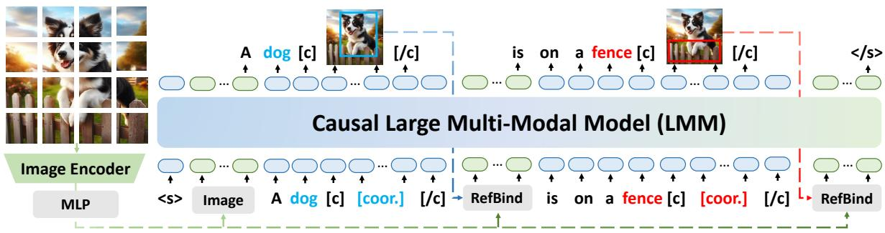  
Figure 2: Illustration of the VolCano framework. The input and output are shown below and above the model, respectively. The blue and green rounded rectangles represent textual and visual tokens, respectively. Special tokens “[c]” and “[/c]” denotes the beginning and end of the coordinates (“[coor.]” in the figure). Coordinates are represented in text. In the output, we visualize coordinates by drawing corresponding boxes in the image for a better illustration. RefBind obtains the representations of objects with the image features and predicted coordinates.

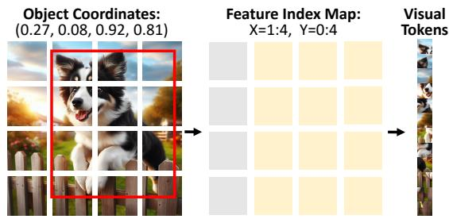  
Figure 3: Illustration of the RefBind mechanism.

Representations of Multi-modal Sequences VolCano represents image-text data as an interleaved sequence of visual and textual tokens. Text inputs are tokenized and represented using the embedding layer. Images and objects can appear at any position in the sequence and are represented by visual tokens. Images are encoded by the ViT. The obtained 2D feature maps are flattened into 1D sequences and further mapped to visual input tokens through the connection module.

Following the configuration of VoCoT, each object is represented by a visually grounded format: “{textual description} [c] {coordinates} [/c] {visual representation}”, e.g., “dog [c] 0.27, 0.08, 0.92, 0.81 [/c] Vdog”. “[c]” and “[/c]” are special tokens denoting the beginning and ending of coordinates. We use bounding boxes $[ x _ { \mathrm { m i n } } , y _ { \mathrm { m i n } } , x _ { \mathrm { m a x } } , y _ { \mathrm { m a x } } ]$ as coordinates, x and y are normalized between 0 and 1 w.r.t to the image size. Coordinates are treated as text, undergoing tokenization and embedding.

In addition to text and coordinates, visual tokens of objects, such as $V _ { \mathrm { d o g } } .$ , are supplemented to help the model reference the corresponding visual information in images. The visual tokens of objects are obtained based on the coordinates and image tokens through the RefBind mechanism. Once the end of coordinates token, “[/c]”, is detected in the input or generated, RefBind is activated to obtain the visual object tokens based on the coordinate between “[c]” and “[/c]”. The obtained object tokens are further appended after the “[/c]” token.

RefBind A straightforward method for representing objects is to crop the corresponding regions in the image and encode them with the ViT. However, this method introduces additional computational costs and loses the contextual information of the complete image. For regions with very few pixels, representing objects with sub-images would introduce redundant information. To tackle with above issues, we propose the RefBind mechanism.

RefBind (short for “Reffering Bind”) is conceptually illustrated in Figure 3. Inspired by the RoIpooling method in Fast-RCNN (Girshick, 2015), given a bounding box and the encoded 2D grid features of the entire image, we can efficiently index the patches in which the target object appears. The features of these patches are flattened into a sequence that represents the object. RefBind relies solely on indexing operations without additional computation. Additionally, the object representation obtained by RefBind inherently preserves contextual information within the whole image.

## 3.2 Training

The training of VolCano undergoes three stages:

Stage 1: Alignment Pre-training The first stage aims to align visual representations with the LLM backbone. We utilize image-caption pairs from LLaVA-Pretrain (Liu et al., 2023b). Only the parameters in the connection module are updated.

Stage 2: Multi-modal Interleaved Pre-training Following the alignment stage, the model is trained to adapt to multi-modal interleaved sequences and visually grounded object representations with Ref-Bind. Three types of sequences are considered: (1) Image-caption pair constitutes the simplest form of multi-modal sequences. We utilize ALLaVA-Caption (Chen et al., 2024) which provides detailed descriptions. (2) Multi-modal document includes multiple image-text pairs in a sequence. Based on the relevance between images and text, we filter a subset of documents from MMC4 (Zhu et al., 2024). (3) Grounded image caption further annotates the coordinates of objects in the caption. We extend the object representations to the visually grounded format consistent with VoCoT. Flickr30K Entities (Plummer et al., 2015) and a subset of GRIT (Peng et al., 2023) are adopted. Both the connection module and the LLM backbone are trained to model the multi-modal sequences.

Stage 3: Instruction Tuning The pre-trained model is further fine-tuned to follow instructions in multi-modal contexts and perform multi-step reasoning with VoCoT. We supplement the constructed VoCoT-Instruct-80K and referring expression data (Kazemzadeh et al., 2014; Chen et al., 2023b) to the existing non-CoT-form visual instruction data (Liu et al., 2023b). We update the LLM backbone and connection module in this stage.

Table 1 summarizes the data mixtures used during the three training stages of VolCano. For more details, please refer to Section 4.1 and Appendix A.3.

## 4 Experiments

## 4.1 Experiment Settings

Implementation Details We build VolCano with the pre-trained ViT-L/14 CLIP (Radford et al., 2021) visual encoder and Mistral-7B (Jiang et al., 2023) as the baseline backbone. In addition, we explore the impact of a more powerful LLM backbone in our framework, constructing VolCanoQ2 based on Qwen2-7B (Yang et al., 2024). Detailed parameter settings are provided in Appendix A.3. To save resources, we merely evaluate VolCanoQ2 in the main experiments and primarily focus on the Mistral-based VolCano in further analysis.

<table><tr><td rowspan=1 colspan=2>Stages Data Type</td><td rowspan=1 colspan=1>Source</td><td rowspan=1 colspan=1>Size</td></tr><tr><td rowspan=1 colspan=1>Stage 1</td><td rowspan=1 colspan=1>Image-Caption</td><td rowspan=1 colspan=1>LLaVA</td><td rowspan=1 colspan=1>558k</td></tr><tr><td rowspan=3 colspan=1>Stage 2</td><td rowspan=1 colspan=1>Image-Caption</td><td rowspan=1 colspan=1>ALLaVA</td><td rowspan=1 colspan=1>695k</td></tr><tr><td rowspan=1 colspan=1>Grounded Image-Caption</td><td rowspan=1 colspan=1>GRITFlickr30k</td><td rowspan=1 colspan=1>756k148k</td></tr><tr><td rowspan=1 colspan=1>Multimodal Document</td><td rowspan=1 colspan=1>MMC4</td><td rowspan=1 colspan=1>890k</td></tr><tr><td rowspan=2 colspan=1>Stage 3</td><td rowspan=1 colspan=1>Visual Instruction</td><td rowspan=1 colspan=1>LLaVA</td><td rowspan=1 colspan=1>612k</td></tr><tr><td rowspan=1 colspan=1>Referring Expression</td><td rowspan=1 colspan=1>Shikra-RDRefCOCOg-RefCOCO</td><td rowspan=1 colspan=1>6k42k×379k</td></tr><tr><td rowspan=1 colspan=1></td><td rowspan=1 colspan=1>VoCoT</td><td rowspan=1 colspan=1>This Work</td><td rowspan=1 colspan=1>80k</td></tr></table>

Table 1: The training data mixtures used by VolCano.

Evaluation Benchmarks To validate the effectiveness and versatility of the VoCoT framework, we adopt different tasks across various scenarios for assessment: (1) General VQA benchmarks, including GQA (Hudson and Manning, 2019), MMBench (Liu et al., 2023c), and SEED (Li et al., 2023a); (2) Composite tasks requiring multistep analysis and composite capabilities, such as visual spatial reasoning in VSR (Liu et al., 2023a) and EmbSpatial (Du et al., 2024), visual search in V-Star (Wu and Xie, 2023), complex reasoning in CLEVR (Johnson et al., 2017) and Winoground (Thrush et al., 2022), and complex referring expression in CLEVR-Ref (Liu et al., 2019); (3) Hallucination benchmarks, including POPE (Li et al., 2023d) and AMBER (Wang et al., 2023b), to evaluate whether VoCoT can mitigate hallucinations. AMBER uses CHAIR (Wang et al., 2023b) as the evaluation metric while accuracy is reported for other datasets. Details on the evaluation processes are provided in Appendix A.4.

Baselines We compare VolCano with existing LMMs with \~7B parameters, as listed in Appendix A.5. For strict comparison, we construct a baseline model, VolCano-SE, which is based on the same architecture as VolCano but without VoCoT-Instruct-80K training data, so it can only perform single-step reasoning. We divide models into two groups for comparison: models based on baseline backbones (LLaMA-1,2, Vicuna, Qwen, and Mistral) and models based on advanced backbones (LLaMA-3 and Qwen2). We focus on models with single-image inputs in the main part. Please refer to Appendix B.1 for comparison and discussion involving models that use multiple additional subimages as inputs for resolution enhancement.

<table><tr><td colspan="3">Model</td><td colspan="3">General VQA</td><td colspan="6">Composite Tasks</td><td colspan="2">Hallucination</td></tr><tr><td>Method</td><td>Res.</td><td>#VP</td><td>GQA</td><td>MMBDev Seed</td><td></td><td>VSR</td><td>EmbSpa.</td><td>CLEVR</td><td>V-Star</td><td>Winotxt</td><td>C-Ref</td><td>POPEAAMB↓</td></tr><tr><td colspan="10">Models based on baseline LLM backbones</td><td></td><td></td><td></td></tr><tr><td>InstructBLIP-7B</td><td>2242</td><td>1.3B</td><td>49.20</td><td>36.00</td><td>52.10</td><td>33.41</td><td></td><td>34.02</td><td></td><td></td><td>72.10</td><td>8.80</td></tr><tr><td>Shikra-7B mPLUG-Owl2-7B</td><td>2242</td><td>0.3B</td><td></td><td>58.80</td><td></td><td>34.75</td><td></td><td></td><td></td><td></td><td>83.10</td><td></td></tr><tr><td></td><td>4482 4482</td><td>0.3B</td><td>56.10</td><td>64.50 59.99</td><td></td><td>36.72</td><td>43.22</td><td>36.12</td><td>63.38</td><td></td><td></td><td>10.60</td></tr><tr><td>MiniGPT-v2-7B</td><td>4482</td><td>1.3B</td><td>60.10</td><td>55.14 51.50</td><td>62.90</td><td>43.85</td><td>46.23</td><td>33.19</td><td>62.00</td><td>24.90</td><td>80.50</td><td></td></tr><tr><td>Qwen-VL-Chat</td><td></td><td>1.9B</td><td>57.50</td><td>60.60 64.70</td><td></td><td>38.68</td><td>53.20</td><td>45.80</td><td></td><td>22.35</td><td>84.70</td><td>5.50</td></tr><tr><td>LLaVA1.5-7B</td><td>3362 3362</td><td>0.3B</td><td>62.00</td><td>64.30 53.80</td><td>64.24</td><td>42.43</td><td>43.73</td><td>48.68</td><td>55.31</td><td>6.70</td><td>84.50</td><td>7.80</td></tr><tr><td>VILA-7B VisCoT-7B</td><td>3362</td><td>0.3B</td><td>62.30</td><td>61.50 60.40</td><td>66.02</td><td>38.05</td><td>47.60</td><td>46.22</td><td>66.37</td><td></td><td>84.50</td><td>10.50</td></tr><tr><td></td><td></td><td>0.3B</td><td>63.00</td><td>63.82 63.23</td><td></td><td>37.01</td><td>53.15</td><td>61.76</td><td>56.40</td><td>32.05</td><td>86.10</td><td>7.20</td></tr><tr><td>VolCano-SE VolCano</td><td>3362 3362</td><td>0.3B 0.3B</td><td>59.91 64.40</td><td>61.15 68.10</td><td>54.15 64.50</td><td>63.42</td><td>36.14</td><td>51.70</td><td>44.96 64.00</td><td>21.70</td><td>84.50 86.50</td><td>6.70 4.60</td></tr><tr><td colspan="10">67.18 58.29 56.17 58.40 68.37</td><td>33.95</td><td></td><td></td></tr><tr><td colspan="10"></td></tr><tr><td>VILA1.5-8B</td><td>3842</td><td>0.4B</td><td>63.50 64.38</td><td>64.41</td><td>53.76</td><td>54.95</td><td>55.22</td><td>58.74</td><td>66.00</td><td></td><td>84.90</td><td>8.50</td></tr><tr><td>Bunny-8B V1.0</td><td>3842</td><td>0.4B</td><td>70.86</td><td>67.59</td><td>65.71</td><td>53.54</td><td>54.47</td><td>58.32</td><td>68.50</td><td></td><td>86.40</td><td>7.40</td></tr><tr><td>VolCano-SEQ2</td><td>3362</td><td>0.3B</td><td>64.00</td><td>64.51</td><td>69.37</td><td>55.19</td><td>51.58</td><td>56.30</td><td>66.63</td><td>23.90</td><td>85.20</td><td>8.00</td></tr><tr><td>VolCanoQ2</td><td>3362</td><td>0.3B</td><td>62.23 64.60</td><td>66.87 71.61 66.95</td><td>74.22</td><td>59.86</td><td>56.78</td><td>62.81</td><td>68.78</td><td>34.00</td><td>86.60</td><td>4.40</td></tr><tr><td>GPT-4V</td><td></td><td></td><td></td><td></td><td></td><td></td><td></td><td></td><td></td><td></td><td></td><td></td></tr><tr><td></td><td>20482</td><td></td><td></td><td>75.80</td><td>71.60</td><td>68.24</td><td>36.07</td><td>51.90 55.00</td><td>83.75</td><td></td><td>82.00</td><td>4.60</td></tr></table>

Table 2: Comparison on 11 benchmarks. Res. and #VP respectively denote the input image resolution and the number of parameters in visual encoder. MMBDev, SeedI, EmbSpa., Winotxt, C-Ref, POPEA and AMB represent MMBench-DEV, SEED-Image, Embspatial, the reformulated Winoground, CLEVR-Ref, POPE-adversarial, and AMBER, repectively. indicates the lower metric is preferred. For each dataset, the best result in each group is highlighted in bold while the runner-up is underlined. Except GQA, all results are evaluated in a zero-shot manner.

<table><tr><td>Method</td><td>Obj-Format</td><td>Seed</td><td>EmbSpa.</td><td>CLEVR V-Star</td><td></td><td>VSR</td><td></td><td>Winotxt POPEA AMBcover</td><td></td><td> $\mathbf { A M B } ^ { \mathrm { c h a i r } } \downarrow$ </td></tr><tr><td>Zero-Shot CoT</td><td>&lt;T&gt;</td><td>56.79</td><td>52.47</td><td>51.70</td><td>45.32</td><td>57.20</td><td>65.00</td><td>67.50</td><td>52.20</td><td>6.70</td></tr><tr><td>Text CoT</td><td>&lt;T&gt;</td><td>63.36</td><td>59.20</td><td>49.60</td><td>47.90</td><td>68.49</td><td>65.75</td><td>84.63</td><td>49.30</td><td>5.50</td></tr><tr><td>Coor. CoT</td><td>&lt;T, C &gt;</td><td>64.32</td><td>58.59</td><td>54.42</td><td>53.78</td><td>66.86</td><td>65.87</td><td>85.47</td><td>47.80</td><td>4.30</td></tr><tr><td>Sub-Img CoT</td><td>&lt; T, C, S &gt;</td><td>61.29</td><td>54.10</td><td>51.85</td><td>63.45</td><td>66.23</td><td>58.87</td><td>85.77</td><td>47.80</td><td>4.60</td></tr><tr><td>VoCoT</td><td>&lt; T, C, R &gt;</td><td>64.50</td><td>58.29</td><td>56.17</td><td>58.40</td><td>67.18</td><td>68.37</td><td>86.50</td><td>51.00</td><td>4.60</td></tr></table>

Table 3: Comparison between different CoT formats. The “Obj-Format” column indicates the representation format of objects. T, C, S, and R are short for texts, coordinates, sub-images, and RefBind representations.

## 4.2 Main Results

Table 2 presents a thorough evaluation of existing LMMs. Several insights can be gleaned: (1) By comparing VolCano and VolCano-SE, it demonstrates that VoCoT effectively mitigates hallucinations and brings consistent improvement across all benchmarks. Section 4.3 delves deeper into how VoCoT contributes to reliable and visually grounded reasoning. (2) Across different datasets, VolCano and VolCanoQ2 achieve the best or secondbest results within their respective group, where the advantages are more pronounced in composite tasks. On benchmarks like CLEVR and EmbSpatial, VolCano with a limited scale even outperforms powerful GPT-4V. (3) Furthermore, we compare two multi-modal CoT methods: VisCoT and Vo-CoT. VisCoT (Shao et al., 2024) designs a simple two-step reasoning process: first searching for a single relevant region and then answering based on the detected region. Experimental results imply that VisCoT merely performs better on V-Star because the questions in V-Star perfectly align with the twostep search ligic of VisCoT. However, VisCoT falls short in other complex scenarios that involve interaction between multiple objects, indicating that Vo-CoT is a more generalizable format of multi-modal CoT. Overall, the experimental results validate the effectiveness of VoCoT-based multi-step reasoning in various scenarios. In addition, we find that Vo-CoT could seamlessly generalize to other scenarios including scene-text-centric tasks, please refer to the results and analysis in Appendix B.2.

## 4.3 Comparing CoTs in Different Formats

We validate the effectiveness of the VoCoT format by comparing it with different CoT formats: (1) Zero-Shot CoT directly prompts VolCano-SE to think step-by-step without training; (2) Text CoT represents objects with only text descriptions; (3) Coor. CoT augments Text CoT with coordinates; and (4) Sub-Img CoT encodes sub-images as representations of objects rather than using RefBind.

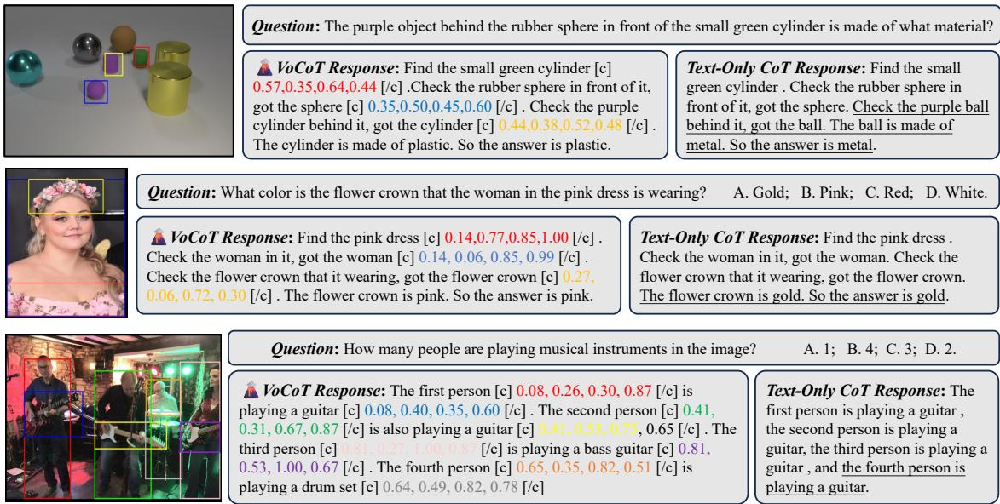  
Figure 4: Qualitative analysis to compare VoCoT and text-only CoT. Hallucinations are underlined.

<table><tr><td rowspan="2">Stage 2</td><td colspan="3">Stage 3</td><td rowspan="2"></td><td rowspan="2"></td><td rowspan="2">Seed EmbSpa. CLEVR V-Star</td><td rowspan="2"></td><td rowspan="2">VSR</td><td rowspan="2"></td><td rowspan="2"></td><td rowspan="2"></td><td rowspan="2">Winotxt POPEA AMBcover AMBchair ↓</td></tr><tr><td>Type 1</td><td>Type 2</td><td>Type 3</td></tr><tr><td>√</td><td>√</td><td></td><td></td><td>63.63</td><td>47.78</td><td>56.07</td><td>57.14</td><td>68.90</td><td>66.00</td><td>84.80</td><td>33.70</td><td>1.80</td></tr><tr><td>√</td><td></td><td>√</td><td>√</td><td>65.45</td><td>58.21</td><td>54.93</td><td>61.34</td><td>66.85</td><td>65.00</td><td>80.16</td><td>48.90</td><td>5.00</td></tr><tr><td>√</td><td>√</td><td>√</td><td></td><td>64.20</td><td>57.24</td><td>54.17</td><td>53.36</td><td>68.98</td><td>66.87</td><td>86.50</td><td>48.90</td><td>4.40</td></tr><tr><td>V</td><td>√</td><td>√</td><td>√</td><td>64.50</td><td>58.29</td><td>56.17</td><td>58.40</td><td>67.18</td><td>68.37</td><td>86.50</td><td>51.00</td><td>4.60</td></tr><tr><td></td><td>√</td><td>√</td><td>V</td><td>61.62</td><td>57.22</td><td>49.18</td><td>53.36</td><td>67.13</td><td>63.62</td><td>85.60</td><td>46.90</td><td>5.50</td></tr></table>

Table 4: Ablation of VoCoT-formatted data on stage 2 and stage 3 training process.

Table 3 lists the results. Firstly, the zero-shot multistep reasoning capability of VolCano-SE is limited. It is likely to exhibit hallucinations, highlighting the necessity to construct visual CoT tuning data. Secondly, CoT expressed only in texts is also affected by hallucinations, handling spatial reasoning well where each type of object appears only once, but failing to manage more complex scenarios. Thirdly, introducing coordinates grounds the thoughts to visual signals, mitigating hallucination and improving performance across various tasks. Furthermore, representations obtained by RefBind effectively help the model to utilize visual signals of objects. In contrast, the performance of Sub-Img CoT is overall inferior to that of Coor. CoT, which supports our claim in Section 3.1: simply encoding each object as an sub-image may introduce redundant information and degrade the performance.

Besides quantitative results, we present cases in Figure 4. We observe that text-only CoT is limited in terms of: (i) It may fail to accurately find/locate target object (Case 1). (ii) It is unable to leverage object-level visual information for inferring object attributes, as VoCoT does through RefBind (Case

3). (iii) It cannot resolve ambiguity between multiple objects (Case 4). (iv) Lack of interpretability. In general, it is crucial to ground the reasoning process to the visual information and VoCoT is the most suitable format.

## 4.4 Ablation on the Constructed Dataset

In Table 4, we explore the role of three types of data in VoCoT-Instruct-80K. The results implies that: (1) Type 1, the GQA-based data, is precise but limited in terms of diversity. Models trained solely on Type 1 data produces the fewest hallucinations but struggle to handle diverse questions. (2) Type 2 and 3 data effectively help the model generalize across various instructions. Nevertheless, totally removing Type 1 data will increase the risk of hallucinations. (3) Introducing multi-modal interleaved data in Stage 2 leads to a significant improvement. In summary, interleaved pre-training data and three types of VoCoT data should be jointly utilized.

## 4.5 Further Analysis

VoCoT enhances performance in complex questions Figure 5 compares the performance of

<table><tr><td>Analyzer</td><td colspan="2">VolCanoy</td><td colspan="4">VolCano</td><td rowspan="2">VolCanoQ2</td><td rowspan="2">GPT-4V</td></tr><tr><td>Judger</td><td>VolCanoy Vicuna-1.5</td><td>Mistral</td><td>VolCano</td><td>Vicuna-1.5</td><td>Mistral</td><td>GPT-4</td></tr><tr><td>Accuracy(%)</td><td>63.5 64.5</td><td>67.2</td><td>67.2</td><td>65.1</td><td>67.8</td><td>73.8</td><td>74.2</td><td>68.2</td></tr></table>

Table 5: Performance with different analyzers and judgers on the VSR benchmark.

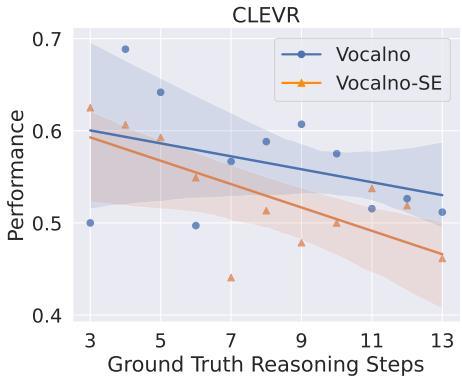  
Figure 5: Relationship between performance and the number of reasoning steps required by the questions.

VolCano-SE and VolCano on questions of varying difficulty in CLEVR. The fitted curves and confidence intervals imply that as the number of required reasoning steps increases, the advantage of multi-step reasoning becomes more pronounced.

Disentangling Multi-Modal Reasoning Our preliminary study finds that sometimes VolCano generates reasonable reasoning paths but fail to infer the correct answer. Therefore, we split the reasoning process into two sub-processes: analysis and judgment, where the former constructs reasoning paths and the latter provides conclusions. We conduct experiments to combine different analyzers and judgers on the VSR benchmark, where each object category corresponds to a single object in the image, allowing us to use text-only LLMs to judge based on the paths analyzed by VolCano. In Table 5, VolCano represents the Vicuna-based VolCano to explore the impact of LLM backbones. The results indicate that the judger plays a important role. The path analyzed by VolCano help GPT-4 make better decisions (73.8%) than GPT-4V (68.2%). However, the overall capability of VolCano is upperbounded by the judgement ability of its LLM backbone. Comparison between VolCano , VolCano, and $\mathrm { V o l C a n o } _ { Q 2 }$ further reveals the potential of applying VoCoT on stronger LLM backbones.

Case Study Examples in Figure 6 show that Vol-Cano provides a visually grounded description with no hallucinations in AMBER. In CLEVR, VolCano infers effective reasoning paths towards the answer. See Appendix B.8 for more cases in other datasets.

## 5 Related Works

## 5.1 Large Multi-Modal Models

Architecture of LMMs A vast amount of research has emerged, focusing on adapting LLMs to handle multi-modal tasks. Initially, researchers treat LLMs as intelligent agents capable of using various tools. They train or prompt LLMs to invoke fundamental vision models, enabling them to complete multi-modal tasks such as captioning and VQA (Wu et al., 2023; Yang et al., 2023c). Recent methods directly align the visual and textual representations in a unified backbone. To achieve this, various connection modules are designed, including MLP (Liu et al., 2024b, 2023b), Q-Former (Li et al., 2023b; Dai et al., 2023), and cross-attention layers (Alayrac et al., 2022; Wang et al., 2023c).

Visual Instruction Data Construction To enable LMMs to follow instructions in multi-modal contexts, a line of research has focused on converting existing academic datasets into instruction data (Dai et al., 2023; Li et al., 2023c). In addition, researchers also use powerful tools like GPT-4V to assist in bootstrapping and generating high-quality data (Zhu et al., 2023; Liu et al., 2024b). Further efforts are devoted towards improving both the quality and scale of the generated data (Chen et al., 2024; Zhao et al., 2023; Wang et al., 2023a).

Visual Grounding in LMMs Beyond text descriptions, some researchers further empower LMMs to understand and extract fine-grained visual information through visually grounded representations like coordinates (Peng et al., 2023; Chen et al., 2023b), masks (Yuan et al., 2024) and visual prompts (Cai et al., 2024). However, most of these LMMs still rely on single-step and text-only reasoning, failing to effectively leverage fine-grained information during the reasoning process.

## 5.2 Multi-Step Reasoning

CoT in LLMs Chain of Thoughts (CoT) is a series of prompting techniques designed to facilitate LLMs in addressing complex problems by guiding them through intermediate steps. CoT is first proposed through in-context learning (Wei et al., 2022), followed by the introduction of zero-shot CoT (Kojima et al., 2022), Auto-CoT (Zhang et al.,

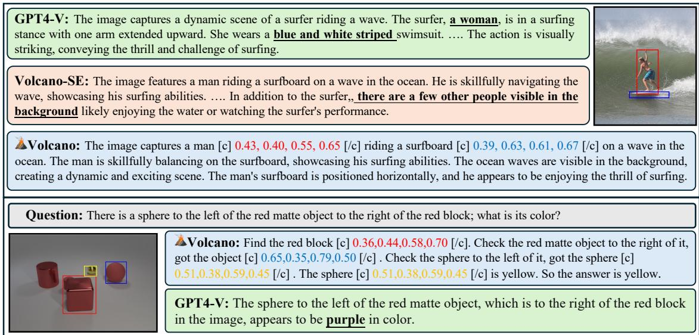  
Figure 6: Qualitative analysis with cases from AMBER and CLEVR. Hallucinations are highlighted.

2022) and self-consistency (Wang et al., 2023d). Subsequently, CoT are extended to more complex formats (Yao et al., 2024; Besta et al., 2024).

Visually Enhanced Reasoning To address complex multi-modal problems, Shikra (Chen et al., 2023b) initially explores the potential of applying CoT to specific tasks with LMMs. SoM (Yang et al., 2023a) and Scaffolding (Lei et al., 2024) respectively incorporate segmentation maps and dot grids in images to assist LMMs in reasoning, but such information can only be utilized by proprietary models like GPT-4V. The most related work is VisCoT (Shao et al., 2024), which designs a twostep CoT: first searching for a relevant region and then answering based on the additional region information. This method is effective but cannot model complex multi-step reasoning. Overall, CoT has not been comprehensively explored in LMMs and there lack appropriate reasoning formats that could be generalized to various scenarios and tasks.

## 6 Conclusion

In this paper, we introduce VoCoT, a visuallygrounded and object-centric chain of thoughts format to assist LMMs in multi-step reasoning. We also curate a VoCoT-formatted dataset from existing resources to train LMMs to learn reasoning with VoCoT. Building on this, we develop VolCano, a model capable of multi-step reasoning using the VoCoT format. Comprehensive experimental results demonstrate the effectiveness of our approach.

## Limitations

Our work, as an early exploration of CoT techniques in large multi-modal models, is limited in the following aspects. (1) Currently, VoCoT is designed for single-image context and not applicable to multi-image inputs like videos and image sequences. Additional special tokens or marks can be introduced to extend VoCoT to a two-step grounding for multiple images. Each object is first grounded to a specific image and then localized to a region within that image. We will explore such mechanisms in our future work. (2) The construction of VoCoT-formatted dataset is limited by the cost of calling proprietary models and can not effectively scale up. In future work, we will explore methods to reduce the cost of data construction, including using smaller or open-source models, collecting and converting more finely annotated data (such as DocVQA) in a manner similar to GQA, and simulating and generating data based on specific needs, similar to CLEVR. (3) The presented VolCano model is currently limited with respect to 7B-sized models due to the lack of computational resources. As implied by the experimental results in Section 4.5, we hope to demonstrate the potential of applying VoCoT to larger and stronger backbones as explored in textual CoT techniques.

## Ethical Statement

The presented VoCoT-Instruct-80K dataset is sourced from open-source datasets including GQA (Hudson and Manning, 2019), LLaVA-Instruct (Liu et al., 2024b), and LVIS (Gupta et al., 2019). We carefully follow the license to use these datasets and ensure that they are applicable for research purposes. The original datasets have been widely adopted by relevant researchers and ensure no risk of privacy leakage or harmful information. Furthermore, during the data collection and construction, we perform balanced sampling based on the distribution of object categories to alleviate distribution bias. As mentioned in Appendix A.1, we also conduct human-in-the-loop quality control to ensure the final dataset has correct information without ethical issues. Please refer to Appendix B.9 for the detailed discussion. Currently, the presented models and dataset focus on English, we hope to expand to other languages in the future. Our work and artifacts are designed with the principle of universality and fairness, without any preference for specific demographic groups.

## Acknowledgment

The work is supported by National Key R&D Program of China (Grant Nos. 2023YFF1204800) and National Natural Science Foundation of China (Grant Nos. 62176058). The project’s computational resources are supported by CFFF platform of Fudan University.

## References

Harsh Agrawal, Karan Desai, Yufei Wang, Xinlei Chen, Rishabh Jain, Mark Johnson, Dhruv Batra, Devi Parikh, Stefan Lee, and Peter Anderson. 2019. Nocaps: Novel object captioning at scale. In ICCV, pages 8948–8957.

Jean-Baptiste Alayrac, Jeff Donahue, Pauline Luc, Antoine Miech, Iain Barr, Yana Hasson, Karel Lenc, Arthur Mensch, Katherine Millican, Malcolm Reynolds, et al. 2022. Flamingo: a visual language model for few-shot learning. NIPS, 35:23716–23736.

Jinze Bai, Shuai Bai, Shusheng Yang, Shijie Wang, Sinan Tan, Peng Wang, Junyang Lin, Chang Zhou, and Jingren Zhou. 2023. Qwen-vl: A frontier large vision-language model with versatile abilities. arXiv:2308.12966.

Maciej Besta, Nils Blach, Ales Kubicek, Robert Gerstenberger, Michal Podstawski, Lukas Gianinazzi, Joanna Gajda, Tomasz Lehmann, Hubert Niewiadomski, Piotr Nyczyk, et al. 2024. Graph of thoughts: Solving elaborate problems with large language models. In Proceedings of the AAAI Conference on Artificial Intelligence, volume 38, pages 17682–17690.

Mu Cai, Haotian Liu, Siva Karthik Mustikovela, Gregory P Meyer, Yuning Chai, Dennis Park, and Yong Jae Lee. 2024. Vip-llava: Making large multimodal models understand arbitrary visual prompts. In Proceedings

of the IEEE/CVF Conference on Computer Vision and Pattern Recognition, pages 12914–12923.

Guiming Hardy Chen, Shunian Chen, Ruifei Zhang, Junying Chen, Xiangbo Wu, Zhiyi Zhang, Zhihong Chen, Jianquan Li, Xiang Wan, and Benyou Wang. 2024. Allava: Harnessing gpt4v-synthesized data for a lite vision-language model. arXiv preprint arXiv:2402.11684.

Jun Chen, Deyao Zhu, Xiaoqian Shen, Xiang Li, Zechun Liu, Pengchuan Zhang, Raghuraman Krishnamoorthi, Vikas Chandra, Yunyang Xiong, and Mohamed Elhoseiny. 2023a. Minigpt-v2: large language model as a unified interface for vision-language multi-task learning. arXiv:2310.09478.

Keqin Chen, Zhao Zhang, Weili Zeng, Richong Zhang, Feng Zhu, and Rui Zhao. 2023b. Shikra: Unleashing multimodal llm’s referential dialogue magic. arXiv:2306.15195.

Wei-Lin Chiang, Zhuohan Li, Zi Lin, Ying Sheng, Zhanghao Wu, Hao Zhang, Lianmin Zheng, Siyuan Zhuang, Yonghao Zhuang, Joseph E. Gonzalez, Ion Stoica, and Eric P. Xing. 2023. Vicuna: An open-source chatbot impressing gpt-4 with 90%\* chatgpt quality.

Wenliang Dai, Junnan Li, Dongxu Li, Anthony Meng Huat Tiong, Junqi Zhao, Weisheng Wang, Boyang Li, Pascale Fung, and Steven Hoi. 2023. Instructblip: Towards general-purpose vision-language models with instruction tuning. Preprint, arXiv:2305.06500.

Tri Dao, Dan Fu, Stefano Ermon, Atri Rudra, and Christopher Ré. 2022. Flashattention: Fast and memoryefficient exact attention with io-awareness. Advances in Neural Information Processing Systems, 35:16344– 16359.

Mengfei Du, Binhao Wu, Zejun Li, Xuanjing Huang, and Zhongyu Wei. 2024. Embspatial-bench: Benchmarking spatial understanding for embodied tasks with large vision-language models.

Abhimanyu Dubey, Abhinav Jauhri, Abhinav Pandey, Abhishek Kadian, Ahmad Al-Dahle, Aiesha Letman, Akhil Mathur, Alan Schelten, Amy Yang, Angela Fan, et al. 2024. The llama 3 herd of models. arXiv preprint arXiv:2407.21783.

R Girshick. 2015. Fast r-cnn. arXiv preprint arXiv:1504.08083.

Agrim Gupta, Piotr Dollar, and Ross Girshick. 2019. LVIS: A dataset for large vocabulary instance segmentation. In Proceedings ofthe IEEE Conference on Computer Vision and Pattern Recognition.

Muyang He, Yexin Liu, Boya Wu, Jianhao Yuan, Yueze Wang, Tiejun Huang, and Bo Zhao. 2024. Efficient multimodal learning from data-centric perspective. Preprint, arXiv:2402.11530.

Shuting He, Henghui Ding, Chang Liu, and Xudong Jiang. 2023. GREC: Generalized referring expression comprehension. arXiv preprint arXiv:2308.16182.

Drew A Hudson and Christopher D Manning. 2019. Gqa: A new dataset for real-world visual reasoning and compositional question answering. In CVPR, pages 6700–6709.

Albert Q. Jiang, Alexandre Sablayrolles, Arthur Mensch, Chris Bamford, Devendra Singh Chaplot, Diego de las Casas, Florian Bressand, Gianna Lengyel, Guillaume Lample, Lucile Saulnier, Lélio Renard Lavaud, Marie-Anne Lachaux, Pierre Stock, Teven Le Scao, Thibaut Lavril, Thomas Wang, Timothée Lacroix, and William El Sayed. 2023. Mistral 7b. Preprint, arXiv:2310.06825.

Justin Johnson, Bharath Hariharan, Laurens Van Der Maaten, Li Fei-Fei, C Lawrence Zitnick, and Ross Girshick. 2017. Clevr: A diagnostic dataset for compositional language and elementary visual reasoning. In CVPR, pages 2901–2910.

Amita Kamath, Jack Hessel, and Kai-Wei Chang. 2023. What’s" up" with vision-language models? investigating their struggle with spatial reasoning. arXiv preprint arXiv:2310.19785.

Sahar Kazemzadeh, Vicente Ordonez, Mark Matten, and Tamara Berg. 2014. Referitgame: Referring to objects in photographs of natural scenes. In EMNLP, pages 787–798.

Aniruddha Kembhavi, Mike Salvato, Eric Kolve, Minjoon Seo, Hannaneh Hajishirzi, and Ali Farhadi. 2016. A diagram is worth a dozen images. In Computer Vision– ECCV 2016: 14th European Conference, Amsterdam, The Netherlands, October 11–14, 2016, Proceedings, Part IV 14, pages 235–251. Springer.

Takeshi Kojima, Shixiang Shane Gu, Machel Reid, Yutaka Matsuo, and Yusuke Iwasawa. 2022. Large language models are zero-shot reasoners. Advances in neural information processing systems, 35:22199–22213.

Xuanyu Lei, Zonghan Yang, Xinrui Chen, Peng Li, and Yang Liu. 2024. Scaffolding coordinates to promote vision-language coordination in large multi-modal models. Preprint, arXiv:2402.12058.

Bohao Li, Rui Wang, Guangzhi Wang, Yuying Ge, Yixiao Ge, and Ying Shan. 2023a. Seed-bench: Benchmarking multimodal llms with generative comprehension. arXiv:2307.16125.

Junnan Li, Dongxu Li, Silvio Savarese, and Steven Hoi. 2023b. Blip-2: Bootstrapping language-image pretraining with frozen image encoders and large language models. arXiv:2301.12597.

Lei Li, Yuwei Yin, Shicheng Li, Liang Chen, Peiyi Wang, Shuhuai Ren, Mukai Li, Yazheng Yang, Jingjing Xu, Xu Sun, Lingpeng Kong, and Qi Liu. 2023c. M3it: A large-scale dataset towards multi-modal multilingual instruction tuning. Preprint, arXiv:2306.04387.

Yifan Li, Yifan Du, Kun Zhou, Jinpeng Wang, Wayne Xin Zhao, and Ji-Rong Wen. 2023d. Evaluating object hallucination in large vision-language models. arXiv:2305.10355.

Zejun Li, Ye Wang, Mengfei Du, Qingwen Liu, Binhao Wu, Jiwen Zhang, Chengxing Zhou, Zhihao Fan, Jie Fu, Jingjing Chen, et al. 2023e. Reform-eval: Evaluating large vision language models via unified re-formulation of task-oriented benchmarks. arXiv preprint arXiv:2310.02569.

Zhang Li, Biao Yang, Qiang Liu, Zhiyin Ma, Shuo Zhang, Jingxu Yang, Yabo Sun, Yuliang Liu, and Xiang Bai. 2023f. Monkey: Image resolution and text label are important things for large multi-modal models. arXiv:2311.06607.

Ji Lin, Hongxu Yin, Wei Ping, Pavlo Molchanov, Mohammad Shoeybi, and Song Han. 2024. Vila: On pretraining for visual language models. In Proceedings ofthe IEEE/CVF Conference on Computer Vision and Pattern Recognition, pages 26689–26699.

Tsung-Yi Lin, Michael Maire, Serge Belongie, James Hays, Pietro Perona, Deva Ramanan, Piotr Dollár, and C Lawrence Zitnick. 2014. Microsoft coco: Common objects in context. In ECCV, pages 740–755. Springer.

Fangyu Liu, Guy Emerson, and Nigel Collier. 2023a. Visual spatial reasoning. TACL, 11:635–651.

Haotian Liu, Chunyuan Li, Yuheng Li, and Yong Jae Lee. 2023b. Improved baselines with visual instruction tuning. arXiv:2310.03744.

Haotian Liu, Chunyuan Li, Yuheng Li, Bo Li, Yuanhan Zhang, Sheng Shen, and Yong Jae Lee. 2024a. Llavanext: Improved reasoning, ocr, and world knowledge.

Haotian Liu, Chunyuan Li, Qingyang Wu, and Yong Jae Lee. 2024b. Visual instruction tuning. Advances in neural information processing systems, 36.

Runtao Liu, Chenxi Liu, Yutong Bai, and Alan L Yuille. 2019. Clevr-ref+: Diagnosing visual reasoning with referring expressions. In Proceedings ofthe IEEE/CVF conference on computer vision and pattern recognition, pages 4185–4194.

Yuan Liu, Haodong Duan, Yuanhan Zhang, Bo Li, Songyang Zhang, Wangbo Zhao, Yike Yuan, Jiaqi Wang, Conghui He, Ziwei Liu, et al. 2023c. Mmbench: Is your multi-modal model an all-around player? arXiv:2307.06281.

Haoyu Lu, Wen Liu, Bo Zhang, Bingxuan Wang, Kai Dong, Bo Liu, Jingxiang Sun, Tongzheng Ren, Zhuoshu Li, Yaofeng Sun, et al. 2024. Deepseekvl: Towards real-world vision-language understanding. arXiv:2403.05525.

Pan Lu, Hritik Bansal, Tony Xia, Jiacheng Liu, Chunyuan Li, Hannaneh Hajishirzi, Hao Cheng, Kai-Wei Chang, Michel Galley, and Jianfeng Gao. 2023. Mathvista: Evaluating mathematical reasoning of foundation models in visual contexts. arXiv preprint arXiv:2310.02255.

Ruipu Luo, Ziwang Zhao, Min Yang, Junwei Dong, Minghui Qiu, Pengcheng Lu, Tao Wang, and Zhongyu Wei. 2023. Valley: Video assistant with large

language model enhanced ability. arXiv preprint arXiv:2306.07207.

Ahmed Masry, Do Xuan Long, Jia Qing Tan, Shafiq Joty, and Enamul Hoque. 2022. Chartqa: A benchmark for question answering about charts with visual and logical reasoning. arXiv preprint arXiv:2203.10244.

Minesh Mathew, Dimosthenis Karatzas, and CV Jawahar. 2021. Docvqa: A dataset for vqa on document images. In WACV, pages 2200–2209.

OpenAI. 2023a. Chatgpt (august 3 version).

OpenAI. 2023b. Gpt-4 technical report. arXiv:2303.08774.

Zhiliang Peng, Wenhui Wang, Li Dong, Yaru Hao, Shaohan Huang, Shuming Ma, and Furu Wei. 2023. Kosmos-2: Grounding multimodal large language models to the world. arXiv:2306.14824.

Bryan A. Plummer, Liwei Wang, Chris M. Cervantes, Juan C. Caicedo, Julia Hockenmaier, and Svetlana Lazebnik. 2015. Flickr30k entities: Collecting regionto-phrase correspondences for richer image-to-sentence models. In Proceedings ofthe IEEE International Conference on Computer Vision (ICCV).

Alec Radford, Jong Wook Kim, Chris Hallacy, Aditya Ramesh, Gabriel Goh, Sandhini Agarwal, Girish Sastry, Amanda Askell, Pamela Mishkin, Jack Clark, et al. 2021. Learning transferable visual models from natural language supervision. In ICML, pages 8748–8763. PMLR.

Christoph Schuhmann, Richard Vencu, Romain Beaumont, Robert Kaczmarczyk, Clayton Mullis, Aarush Katta, Theo Coombes, Jenia Jitsev, and Aran Komatsuzaki. 2021. Laion-400m: Open dataset of clip-filtered 400 million image-text pairs. arXiv:2111.02114.

Hao Shao, Shengju Qian, Han Xiao, Guanglu Song, Zhuofan Zong, Letian Wang, Yu Liu, and Hongsheng Li. 2024. Visual cot: Unleashing chain-of-thought reasoning in multi-modal language models. arXiv preprint arXiv:2403.16999.

Amanpreet Singh, Vivek Natarajan, Meet Shah, Yu Jiang, Xinlei Chen, Dhruv Batra, Devi Parikh, and Marcus Rohrbach. 2019. Towards vqa models that can read. In CVPR, pages 8317–8326.

Tristan Thrush, Ryan Jiang, Max Bartolo, Amanpreet Singh, Adina Williams, Douwe Kiela, and Candace Ross. 2022. Winoground: Probing vision and language models for visio-linguistic compositionality. In CVPR, pages 5238–5248.

Hugo Touvron, Thibaut Lavril, Gautier Izacard, Xavier Martinet, Marie-Anne Lachaux, Timothée Lacroix, Baptiste Rozière, Naman Goyal, Eric Hambro, Faisal Azhar, et al. 2023a. Llama: Open and efficient foundation language models. arXiv:2302.13971.

Hugo Touvron, Louis Martin, Kevin Stone, Peter Albert, Amjad Almahairi, Yasmine Babaei, Nikolay Bashlykov, Soumya Batra, Prajjwal Bhargava, Shruti Bhosale, et al.

2023b. Llama 2: Open foundation and fine-tuned chat models. arXiv:2307.09288.

Ramakrishna Vedantam, C Lawrence Zitnick, and Devi Parikh. 2015. Cider: Consensus-based image description evaluation. In CVPR, pages 4566–4575.

Andreas Veit, Tomas Matera, Lukas Neumann, Jiri Matas, and Serge Belongie. 2016. Coco-text: Dataset and benchmark for text detection and recognition in natural images. arXiv:1601.07140.

Junke Wang, Lingchen Meng, Zejia Weng, Bo He, Zuxuan Wu, and Yu-Gang Jiang. 2023a. To see is to believe: Prompting gpt-4v for better visual instruction tuning. Preprint, arXiv:2311.07574.

Junyang Wang, Yuhang Wang, Guohai Xu, Jing Zhang, Yukai Gu, Haitao Jia, Ming Yan, Ji Zhang, and Jitao Sang. 2023b. An llm-free multi-dimensional benchmark for mllms hallucination evaluation. arXiv:2311.07397.

Weihan Wang, Qingsong Lv, Wenmeng Yu, Wenyi Hong, Ji Qi, Yan Wang, Junhui Ji, Zhuoyi Yang, Lei Zhao, Xixuan Song, et al. 2023c. Cogvlm: Visual expert for pretrained language models. arXiv preprint arXiv:2311.03079.

Xuezhi Wang, Jason Wei, Dale Schuurmans, Quoc Le, Ed Chi, Sharan Narang, Aakanksha Chowdhery, and Denny Zhou. 2022. Self-consistency improves chain of thought reasoning in language models. arXiv preprint arXiv:2203.11171.

Xuezhi Wang, Jason Wei, Dale Schuurmans, Quoc Le, Ed Chi, Sharan Narang, Aakanksha Chowdhery, and Denny Zhou. 2023d. Self-consistency improves chain of thought reasoning in language models. Preprint, arXiv:2203.11171.

Jason Wei, Xuezhi Wang, Dale Schuurmans, Maarten Bosma, Fei Xia, Ed Chi, Quoc V Le, Denny Zhou, et al. 2022. Chain-of-thought prompting elicits reasoning in large language models. Advances in neural information processing systems, 35:24824–24837.

Chenfei Wu, Shengming Yin, Weizhen Qi, Xiaodong Wang, Zecheng Tang, and Nan Duan. 2023. Visual chatgpt: Talking, drawing and editing with visual foundation models. arXiv preprint arXiv:2303.04671.

Penghao Wu and Saining Xie. 2023. V\*: Guided visual search as a core mechanism in multimodal llms. arXiv preprint arXiv:2312.14135.

An Yang, Baosong Yang, Binyuan Hui, Bo Zheng, Bowen Yu, Chang Zhou, Chengpeng Li, Chengyuan Li, Dayiheng Liu, Fei Huang, et al. 2024. Qwen2 technical report. arXiv preprint arXiv:2407.10671.

Jianwei Yang, Hao Zhang, Feng Li, Xueyan Zou, Chunyuan Li, and Jianfeng Gao. 2023a. Set-of-mark prompting unleashes extraordinary visual grounding in gpt-4v. Preprint, arXiv:2310.11441.

Zhengyuan Yang, Linjie Li, Kevin Lin, Jianfeng Wang, Chung-Ching Lin, Zicheng Liu, and Lijuan Wang. 2023b. The dawn of lmms: Preliminary explorations

with gpt-4v (ision). arXiv preprint arXiv:2309.17421, 9(1):1.

Zhengyuan Yang, Linjie Li, Jianfeng Wang, Kevin Lin, Ehsan Azarnasab, Faisal Ahmed, Zicheng Liu, Ce Liu, Michael Zeng, and Lijuan Wang. 2023c. Mm-react: Prompting chatgpt for multimodal reasoning and action. arXiv preprint arXiv:2303.11381.

Shunyu Yao, Dian Yu, Jeffrey Zhao, Izhak Shafran, Tom Griffiths, Yuan Cao, and Karthik Narasimhan. 2024. Tree of thoughts: Deliberate problem solving with large language models. Advances in Neural Information Processing Systems, 36.

Qinghao Ye, Haiyang Xu, Jiabo Ye, Ming Yan, Anwen Hu, Haowei Liu, Qi Qian, Ji Zhang, Fei Huang, and Jingren Zhou. 2023. mplug-owl2: Revolutionizing multi-modal large language model with modality collaboration. Preprint, arXiv:2311.04257.

Kaining Ying, Fanqing Meng, Jin Wang, Zhiqian Li, Han Lin, Yue Yang, Hao Zhang, Wenbo Zhang, Yuqi Lin, Shuo Liu, et al. 2024. Mmt-bench: A comprehensive multimodal benchmark for evaluating large visionlanguage models towards multitask agi. arXiv preprint arXiv:2404.16006.

Weihao Yu, Zhengyuan Yang, Linjie Li, Jianfeng Wang, Kevin Lin, Zicheng Liu, Xinchao Wang, and Lijuan Wang. 2023. Mm-vet: Evaluating large multimodal models for integrated capabilities. Preprint, arXiv:2308.02490.

Yuqian Yuan, Wentong Li, Jian Liu, Dongqi Tang, Xinjie Luo, Chi Qin, Lei Zhang, and Jianke Zhu. 2024. Osprey: Pixel understanding with visual instruction tuning. In Proceedings of the IEEE/CVF Conference on Computer Vision and Pattern Recognition, pages 28202– 28211.

Xiang Yue, Yuansheng Ni, Kai Zhang, Tianyu Zheng, Ruoqi Liu, Ge Zhang, Samuel Stevens, Dongfu Jiang, Weiming Ren, Yuxuan Sun, et al. 2023. Mmmu: A massive multi-discipline multimodal understanding and reasoning benchmark for expert agi. arXiv:2311.16502.

Zhuosheng Zhang, Aston Zhang, Mu Li, and Alex Smola. 2022. Automatic chain of thought prompting in large language models. Preprint, arXiv:2210.03493.

Bo Zhao, Boya Wu, and Tiejun Huang. 2023. Svit: Scaling up visual instruction tuning. arXiv preprint arXiv:2307.04087.

Deyao Zhu, Jun Chen, Xiaoqian Shen, Xiang Li, and Mohamed Elhoseiny. 2023. Minigpt-4: Enhancing vision-language understanding with advanced large language models. arXiv:2304.10592.

Wanrong Zhu, Jack Hessel, Anas Awadalla, Samir Yitzhak Gadre, Jesse Dodge, Alex Fang, Youngjae Yu, Ludwig Schmidt, William Yang Wang, and Yejin Choi. 2024. Multimodal c4: An open, billion-scale corpus of images interleaved with text. NeurIPS, 36.

## A Supplementary Details

## A.1 Data Construction Details

Construction Methods As for the Type 1 data construction, we utilize a rule-based conversion method, the mapping rules used are listed in Table 16. In terms of Type 2 and Type 3 data, the prompts for GPT-4V are respectively shown in Table 17 and 18. We use in-context learning to let GPT-4V generate thought with multi-step reasoning path in VoCoT format.

Quality Control For Type 1 data generated by rule based mapping, the quality is controled by the original source, namely GQA. We do not perform additional quality control.

For Type 2 and Type 3 data generated by GPT-4V, we first perform balanced sampling for images to achieve a balanced distribution of objects included. Secondly, we manually sample and check 200 data samples and find that initially constructed data suffers issues like uneven question types and incorrect object information. The first issue can be addressed by including well-designed in-context samples. The second issue is mainly caused by the potential incomplete and incorrect labels in LVIS. We find if GPT-4V think the information we provide is not enough to generate correct reasoning path, the response will contains error messages. All error message have patterns in common which may contains the following phrases: “From the object information provided", “provided object information", “From the bounding boxes provided", and so on. We remove the samples containing these patterns, leaving 8k samples after the filtering. Ultimately, by manually checking the constructed dataset, we do not observe any bias issues and achieve a 98% pass rate on the presented dataset.

## A.2 Training Data Details

We present our data mixture details in Table 8. In Stage 1, we use LLaVA-pretrain (Liu et al., 2023b) dataset for projector alignment which contains 558k image caption pairs. In Stage 2, to better adapt to multi-modal interleaved sequences and visually grounded object representations with Refbind, we mix three types of data: (1) multimodal documents, (2) grounded image captions, and (3) high-quality image captions. Multimodal documents data is sample from MMC4 (Zhu et al., 2024) by choosing which average similarity score between image and sentence before each image is larger than 0.3. Each multimodal document have multiple image, we remove samples with more than 6 images. Grounded image captions is from GRIT (Peng et al., 2023) and Flickr30K Entities (Plummer et al., 2015). For GRIT, we filter samples with clip score is larger than 0.35. We also use high quality image caption from ALLaVA (Chen et al., 2024) which is generated by GPT-4V and provide details description. In Stage 3, we remove samples from LLaVA-Instruct that meet two criteria: sourced from RefCOCO, and sourced from VG where the object sub-image size is less 50, the reason is that we find extremely small regions in VG are probably with low quality.

## A.3 Model & Training Details

The hyper-parameters in each stage are in Table 7. The learning rate setup mainly follows that of LLaVA (Liu et al., 2024b). In stage 1, a large learning rate is used to update the connection module, aiming to quickly align the cross-modal representations. In the latter stages, a small learning rare is adopted to carefully fine-tune the backbone. Following Kosmos2 (Peng et al., 2023), we introduce a special token “<grounding>” at the beginning of the sequence to control whether to require VolCano to produce visually grounded description.

Also notice that VolCano is able to perform both single-step and multi-step reasoning. Following (Kojima et al., 2022), we introduce a prompt “Answer the question and include the reasoning proess. Locate key objects and provide bounding boxes in your thoughts.” as a trigger to tell the model whether to use VoCoT or not during the generation process.

## A.4 Evaluation Details

In this section, we introduce the details in the evaluation procedure.

## A.4.1 Benchmark Details

General VQA Benchmarks In GQA, we utilize the “testdev\_balanced” split following (Liu et al., 2024b). As for MMBench, we adopt the “DEV” split for the evaluation efficiency. In terms of SEED, we only consider the subset that the visual inputs are images. For GQA, we append a prompt “Please answer in a word or short phrase” to require models produce concise outputs.

Spatial Reasoning Benchmarks For VSR, we utilize the unseen test split for zero-shot evaluation.

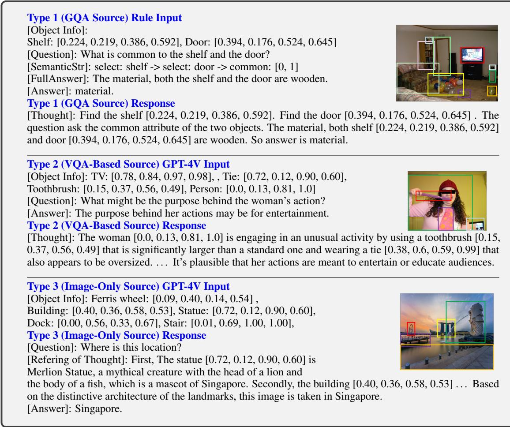  
Table 6: Examples to illustrate the construction of VoCoT-formatted data from three data sources. Type 1 data are obtained by rules, while Type 2 and Type 3 data are obtained by leveraging GPT-4V.

For each sample, a description is provided and the model is required to distinguish if the claims is supported by the image. We use the prompt “Is there a event {description} in the image?” for this dataset. With respect to EmbSpatial, we use the test split for assessment.

Hallucination Benchmarks For POPE, we consider the adversarial subset since it is the most challenging split. In AMBER, we leverage the generative task which asks the model to describe the image. All prompts are adopted from the original datasets with a yes-or-no instruction for POPE.

Benchmarks for Composite Tasks For CLEVR, we utilize the val split. Because the original CLEVR validation set is too large, we categorize the data the into six types based on the question type: count, yes/no, shape, material, size, and color. We sample 1k questions from each category as test samples and construct a multiple-choice candidate set based on the feasible answers in the dataset. We will also open-source this subset. For Winoground, we utilize the test set and consider it as a caption selection multiple-choice question, the prompt is designed as “Please describe the image.”. As for V-Star, we directly use the V-Star benchmark. Regarding CLEVR-Ref, which is a referring expression task with relatively complex queries, we use the provided set for evaluation. We design a prompt as "Can you locate {phrase} in the image?" where “{phrase}” is the target query.

Please see Table 10 and Table 9 for the splits and scales of benchmarks used in this paper.

## A.4.2 Evaluation Methods

All evaluation benchmarks adopted in this paper can be divided into three categories based on the task formulation: multiple-choice questions, openended generation, referring expression.

Multiple-Choice Question For multiple-choice questions, we utilize the likelihood-based evaluation method, which is also known as the perplexitybased method. These methods are widely adopted in evaluating LMMs (Li et al., 2023a,b; Dai et al.,

<table><tr><td>Configuration</td><td>Alignment</td><td>Multi-modal Interleaved</td><td>Instruction Tuning</td></tr><tr><td>Visual Encoder</td><td>OpenAI-CLIP ViT-L/14</td><td>OpenAI-CLIP ViT-L/14</td><td>OpenAI-CLIP ViT-L/14</td></tr><tr><td>Backbone Init</td><td>Mistral-Chat-v0.2-7B</td><td>Stage1</td><td>Stage2</td></tr><tr><td>Optimizer</td><td>AdamW</td><td>AdamW</td><td>AdamW</td></tr><tr><td>Optimizer Hyperparameters</td><td> $\beta _ { 1 } = 0 . 9 , \beta _ { 2 } = 0 . 9 5 , \epsilon = 1 e ^ { - 6 }$ </td><td> $\beta _ { 1 } = 0 . 9 , \beta _ { 2 } = 0 . 9 5 , \epsilon = 1 e ^ { - 6 }$ </td><td>β1 = 0.9, β2 = 0.95, ∈ = 1e−6</td></tr><tr><td>Global batch size</td><td>256</td><td>128</td><td>128</td></tr><tr><td>Peak learning rate of LLM</td><td>1e-3</td><td>1e-5</td><td>1e-5</td></tr><tr><td>Learning rate schedule</td><td>Cosine</td><td>Cosine</td><td>Cosine</td></tr><tr><td>Training Epochs</td><td>1</td><td>1</td><td>1</td></tr><tr><td>Warm-up ratio</td><td>0.03</td><td>0</td><td>0</td></tr><tr><td>Weight decay</td><td>0.0</td><td>0.0</td><td>0.0</td></tr><tr><td>Gradient clipping</td><td>1.0</td><td>1.0</td><td>1.0</td></tr><tr><td>Input image resolution</td><td>336*336</td><td>336*336</td><td>336*336</td></tr><tr><td>Input sequence to LLM</td><td>2048</td><td>3072</td><td>3072</td></tr><tr><td>Numerical precision</td><td>bfloat16</td><td>bfloat16</td><td>bfloat16</td></tr><tr><td>GPU Usage</td><td>8 NVIDIA A100</td><td>8 NVIDIA A100</td><td>8NVIDIA A100</td></tr><tr><td>Training Time</td><td>12h</td><td>48h</td><td>30h</td></tr></table>

Table 7: The detailed training hyper-parameters of VolCano. Except for the backbones for initialization, VolCanoQ2 follows the same hyper-parameters.
<table><tr><td rowspan=1 colspan=1>Stages</td><td rowspan=1 colspan=1>Data Type</td><td rowspan=1 colspan=1>Source</td><td rowspan=1 colspan=1>Size</td></tr><tr><td rowspan=1 colspan=1>Stage 1</td><td rowspan=1 colspan=1>Image-Caption</td><td rowspan=1 colspan=2>LLaVA-Pretrain (Liu et al., 2024b, 2023b) 558k</td></tr><tr><td rowspan=3 colspan=1>Stage 2</td><td rowspan=1 colspan=1>Image-Caption</td><td rowspan=1 colspan=1>ALLaVA-Caption (Chen et al., 2024)</td><td rowspan=1 colspan=1>695k</td></tr><tr><td rowspan=1 colspan=1>Grounded Image Caption</td><td rowspan=1 colspan=1>GRIT (Peng et al., 2023)Flickr30k-Entities (Plummer et al., 2015)</td><td rowspan=1 colspan=1>756k148k</td></tr><tr><td rowspan=1 colspan=1>Multimodal Document</td><td rowspan=1 colspan=1>MMC4 (Zhu et al., 2024)</td><td rowspan=1 colspan=1>890k</td></tr><tr><td rowspan=3 colspan=1>Stage 3</td><td rowspan=1 colspan=1>Visual Instruction</td><td rowspan=1 colspan=1>LLaVA (Liu et al., 2023b)</td><td rowspan=1 colspan=1>612k</td></tr><tr><td rowspan=1 colspan=1>Referring Expression</td><td rowspan=1 colspan=1>Shikra-RD (Chen et al., 2023b)RefCOCO (Kazemzadeh et al., 2014)RefCOCO+ (Kazemzadeh et al., 2014)RefCOCOg (Kazemzadeh et al., 2014)g-RefCOCO (He et al., 2023)</td><td rowspan=1 colspan=1>6k42k42k42k79k</td></tr><tr><td rowspan=1 colspan=1>VoCoT</td><td rowspan=1 colspan=1>This Work</td><td rowspan=1 colspan=1>80k</td></tr></table>

Table 8: The data mixture used in the three training stages of VolCano.

2023; Li et al., 2023e). The key idea is to select the option with the highest generated likelihood, please refer to these papers for the detail. If VoCoT is utilized, the likelihood is computed based on the question, image, and the genrated reasoning path.

Open-Ended Generation For GQA, we use the evaluation script provided by LLaVA (Liu et al., 2023b) for a fair comparison. As for VSR and POPE, we require the model to answer in yes and no, enabling us to evaluate the correctness with exact match. With respoect to AMBER, we use the official evaluation method to assess the hallucinations in the generated descriptions.

Referring Expression We first extract the predicted boxes from the outputs based on rules, then calculate the IoU between the ground truth box and the predicted box. If the IoU is larger than 0.5, it is considered as a correct prediction following (Kazemzadeh et al., 2014).

Further Analysis Setup In the reasoning capability assessment part in Section 4.5, to leverage LLM as the judger model. We utilize a prompt “There is a image, {reasoning path}, please determine whether {description}, please answer yes or no.”, where the reasoning path are generated by the analyzer (with the coordinates and visual information removed), descriptions are the target description in VSR. If the model chooses not to predict, we consider the prediction as “no”.

## A.5 Introduction to Baseline Models

We compare VolCano to several existing SOTA open-source LMMs, including BLIP-2 (Li et al., 2023b), InstructBLIP (Dai et al., 2023),

<table><tr><td>Category</td><td colspan="3">General VQA</td><td colspan="2">Spatial Reasoning</td><td colspan="2">Hallucination</td></tr><tr><td>Dataset</td><td>GQA</td><td>MMBench</td><td>SEED</td><td>VSR</td><td>EmbSpat.</td><td>POPE</td><td>AMBER</td></tr><tr><td>Split</td><td>testdev_balanced</td><td>DEV</td><td>Image</td><td>test unseen</td><td>test</td><td>adversarial</td><td>generative</td></tr><tr><td>Size</td><td>12578</td><td>4329</td><td>14233</td><td>1222</td><td>3625</td><td>3000</td><td>1004</td></tr></table>

Table 9: Information of Evaluation Benchmarks.

<table><tr><td>Category</td><td>Composite Tasks</td><td></td><td>Referring Expression</td></tr><tr><td>Dataset</td><td>V-Star Wino</td><td>CLEVR</td><td>CLEVR-Ref</td></tr><tr><td>Split</td><td>test =</td><td>val</td><td>=</td></tr><tr><td>Size</td><td>238 800</td><td>6000</td><td>2000</td></tr></table>

Table 10: Supplementation of Table 9.

Shikra (Chen et al., 2023b), mPLUG-Owl2 (Ye et al., 2023), MiniGPT-v2 (Chen et al., 2023a), Qwen-VL-Chat (Bai et al., 2023), VILA (Lin et al., 2024), LLaVA-1.5 (Liu et al., 2023b), and the most related VisCOT (Shao et al., 2024). These models are based on baseline LLM backbones released in 2023, including LLaMA (Touvron et al., 2023a), LLaMA-2 (Touvron et al., 2023b), Vicuna (Chiang et al., 2023), Mistral (Jiang et al., 2023), and Qwen (Bai et al., 2023). For models based on recently proposed advanced backbones like LLaMA-3 (Dubey et al., 2024) and Qwen2 (Yang et al., 2024), we compare VolCanoQ2 with Bunny (He et al., 2024) and VILA-1.5 (Lin et al., 2024). The models listed before take a single image as input, which is consistent with VolCano and VolCanoQ2 for a fair comparison. Additionally, we include another series of SOTA LMMs that enhance input resolution by splitting a single image into multiple sub-images: LLaVA-1.6 (Liu et al., 2024a), Deepseek-VL (Lu et al., 2024), and Monkey (Li et al., 2023f). As for GPT-4V, examples in Figure 1 and all results are obtained by calling openai API using the “GPT-4V” model between 2024/05/18 to 2024/05/30.

We only consider zero-shot performance in Table 2, except for GQA. If a model has been trained on a specific evaluation benchmark, we do not report the corresponding evaluation results. For example, in Table 2, the result of VisCOT on VSR is omitted because it uses the corresponding training data. For certain models, including Bunny and VILA, due to the lack of clear evaluation details, we re-evaluate their performance in the same setting to make a fair comparison with VolCano.

## B Supplementary Results and Discussion

## B.1 Comparison between VolCano and High-Resolution models

In Table 2 we compare models with single-image and relatively low-resolution inputs. Comparing VolCano with LMMs that enhance input resolution by introducing multiple-image inputs, we observe that these methods primarily improve the performance in general VQA and V-Star, as V-Star provides high-resolution input images (Wu and Xie, 2023). However, in tasks that require complex reasoning, the improvement brought by higher resolutions becomes less significant. VolCano either exceeds or perform comparably with these models in such tasks, indicating the superiority of introducing multi-step reasoning over enriching the input information in these scenarios.

Notice that the RefBind mechanism introduced in Section 3 can be directly extended to fit multiple split sub-images by mapping the predicted coordinates to patches from different sub-images. We leave exploring combining these two vertical research directions—enhancing input resolution and introducing multi-step reasoning–as future work.

## B.2 Performance in Additional Benchmarks

The benchmarks presented in the main text primarily focus on object-centric scenarios, which align with the design of VoCoT. Recently, a line of research develops LMMs to handle scene-textoriented scenarios including document understanding and chart information extraction. In this section, we explore whether VoCoT can adapt to other scenarios by conducting experiments on additional benchmarks: TextVQA (Singh et al., 2019), AI2D (Kembhavi et al., 2016), ChartQA (Masry et al., 2022), and DocVQA (Mathew et al., 2021) for scene-text-oriented tasks; MMMU (Yue et al., 2023) and MathVista (Lu et al., 2023) for reasoning based on knowledge and scene texts; MMVet (Yu et al., 2023) and MMT (Ying et al., 2024) for instruction-following; COCO caption (Veit et al., 2016) and NoCaps (Agrawal et al., 2019). For image captioning, we report the CIDEr (Vedantam et al., 2015) metric following (Li et al., 2023b) while accuracy is provided for other tasks. For efficiency, we only consider LLaVA-1.5, VolCano-SE, and VolCano for a fair and straightforward comparison to validate the effect of VoCoT.

<table><tr><td colspan="3">Model</td><td colspan="3">General VQA</td><td colspan="2">Spatial Reasoning</td><td colspan="3">Composite Tasks</td><td colspan="2">Hallucination</td></tr><tr><td>Method</td><td>Res.</td><td>#VP</td><td></td><td>GQA MMBDev Seed1</td><td></td><td>VSR</td><td>EmbSpa.</td><td>CLEVR</td><td>V-Star</td><td>Winotxt |</td><td>POPEAAMB↓</td></tr><tr><td colspan="10">Models with single-image inputs</td></tr><tr><td>VolCano-SE VolCano</td><td>3362 3362</td><td>0.3B 0.3B</td><td>59.91 61.15 64.40</td><td>54.15 64.50</td><td>63.42 67.18</td><td>36.14 58.29</td><td>56.17</td><td>51.70 44.96 58.40</td><td>64.00 68.37</td><td>84.50 86.50</td><td>6.70 4.60</td></tr><tr><td colspan="10">68.10</td></tr><tr><td></td><td></td><td></td><td></td><td></td><td></td><td>Models with multiple-image inputs</td><td></td><td></td><td></td><td></td><td></td></tr><tr><td>LLaVA1.6-7B</td><td>6722</td><td>0.3B</td><td>64.20</td><td>68.40 66.15</td><td>66.86</td><td>56.82</td><td>50.35</td><td>58.80</td><td>64.88</td><td>86.90</td><td></td></tr><tr><td>LLaVA1.6-7Bm</td><td>6722</td><td>0.3B</td><td>64.80</td><td>69.00</td><td>67.72 63.77</td><td>56.55</td><td></td><td>51.85</td><td>60.08</td><td>65.75</td><td>86.70</td></tr><tr><td>Deepseek-VL-7B</td><td>10242</td><td>0.4B</td><td></td><td>71.32</td><td>70.40 67.51</td><td>41.77</td><td></td><td>48.77 46.33</td><td>62.18</td><td>64.88</td><td>85.77</td></tr><tr><td>Monkey</td><td>8962</td><td>1.9B</td><td>60.70</td><td>61.95</td><td>67.58 62.93</td><td>32.91</td><td></td><td>67.23</td><td>68.63</td><td>82.57</td><td></td></tr><tr><td>GPT-4V</td><td>20482</td><td></td><td></td><td>75.80</td><td>71.60 68.24</td><td>26.65</td><td>51.90</td><td>55.00</td><td>83.75</td><td>82.00</td><td>4.60</td></tr></table>

Table 11: Comparison between VolCano and resolution-enhanced models. The notations follows Table 2. LLaVA1. $. 6 \mathrm { - } 7 \mathrm { B } _ { m }$ represents the Mistral-based LLaVA1.6-7B.
<table><tr><td rowspan="2">Model</td><td colspan="4">Scene-Text-Oriented Tasks</td><td colspan="2">Know. Reasoning</td><td colspan="2">Ins. Following</td><td colspan="2">Captioning</td></tr><tr><td>TextVQAN</td><td>AI2D</td><td>ChartQA</td><td>DocVQA</td><td>MMMU</td><td>MathVista</td><td>MMVet</td><td>MMT</td><td>COCO</td><td>NoCaps</td></tr><tr><td>LLaVA1.5-7B</td><td>46.1</td><td>43.0</td><td>14.9</td><td>2.9</td><td>28.4</td><td>26.7</td><td>30.5</td><td>45.0</td><td>94.5</td><td>95.6</td></tr><tr><td>VolCano-SE</td><td>45.1</td><td>45.3</td><td>19.0</td><td>4.6</td><td>29.3</td><td>27.8</td><td>32.1</td><td>44.1</td><td>81.0</td><td>90.6</td></tr><tr><td>VolCano</td><td>48.9</td><td>45.6</td><td>19.5</td><td>10.6</td><td>33.3</td><td>27.9</td><td>32.9</td><td>45.4</td><td>100.4</td><td>103.5</td></tr></table>

Table 12: Peformance on additional benchmarks. TextVQAN represents the TextVQA benchmark without providing reference OCR like in LLaVA-1.5 (Liu et al., 2023b). “Know.” and “Ins.” are respectively short for knowledge and instruction. The best performance for each dataset are bolded.

Scene-Text-Oriented Benchmarks As shown in Table 12, we can find: (1) Quantitatively, VoCoT can generalize to text and chart-centric scenarios and improve the performance, even though VoCoT-Instruct-80K does not include similar data. (2) Qualitatively, we present several samples in Figure 7. VoCoT can treat text blocks and chart areas as "objects". By locating and analyzing the corresponding regions, VoCoT easily generalizes to such tasks. (3) The cross-domain improvements are very exciting, and the potential of VoCoT in such tasks can be further unleashed by enhancing input resolution and constructing text-centric VoCoT data (with fine-grained annotations in TextVQA, AI2D...), which we leave as our future work.

Knowledge Reasoning and Instruction Following According to results in Table 12, we observe that: (1) Although MMMU and MathVista focus on reasoning involving commonsense, knowledge, and mathematical deduction, the results indicate that the generalization ability of VoCoT can still improve the performance. As shown in Figure 7, the framework of VoCoT to locate and analyze local objects and regions can generalize to such tasks. (2) Improvements brought by VoCoT in the absence of similar training data demonstrate its potential in such scenario, inspiring us to incorporate both visually grounded information and conceptual knowledge in VoCoT framework in our future work. (3) In general instruction-following datasets, MMT and MMVet, it is shown that VoCoT does not hurt the instruction-following ability and brings improvement, which is consistent with the findings in SEED and MMBench mentioned in our main paper. See Appenidx B.3 for further exploration.

Image Captioning Results in Table 12 imply that VoCoT helps VolCano to perceive accurate information and produce visually grounded descriptions, improving the quality of generated captions.

Generally, the results validates that VoCoT can generalize across various tasks and demonstrates potential for further enhancement.

## B.3 Do VoCoT Damage the Original Capabilities of LMMs?

Another concern about whether the proposed Vo-CoT framework brings negative effects to the original capabilities of a LMM. Noticing that the trained VolCano can perform both single-step and multistep reasoning as mentioned in Appendix A.3 and our paper aims at unleashing VoCoT reasoning ability of LMMs without affecting the original abilities. To validate that, we evaluate VolCano with the same single-step inference strategy as other compared baselines on general benchmarks in Table 14. It can be seen that VolCano maintains the original ability for conventional single-step inference, performing close to the two baselines in such settings and even surpassing them in some tasks. This indicates that the VoCoT framework does not hurt the original and fundamental capabilities of LMMs.

<table><tr><td>Method</td><td>Avg. # Tokens Generated</td><td>Avg. # Visual Tokens Added</td><td>Avg. Inference Time per Query</td></tr><tr><td>VolCano-SE</td><td>2.2</td><td>0</td><td>0.11s</td></tr><tr><td>VolCano</td><td>115.9</td><td>326</td><td>0.74s</td></tr></table>

Table 13: Statistics of single-step and multi-step inference in VSR.

<table><tr><td>Model</td><td>MMBench</td><td>SEED</td><td>MMMU</td><td>MMT</td><td>MMVet</td></tr><tr><td>LLaVA1.5-7B</td><td>64.3</td><td>53.8</td><td>28.4</td><td>45.0</td><td>30.5</td></tr><tr><td>VolCano-SE</td><td>61.1</td><td>54.2</td><td>29.3</td><td>45.1</td><td>32.1</td></tr><tr><td>VolCano</td><td>63.3</td><td>57.5</td><td>31.2</td><td>45.2</td><td>32.5</td></tr></table>

Table 14: Performance of differnt models with singlestep inference settings.

## B.4 Grounding Capabilities of VolCano

Besides the reasoning capability analyzed in Section 4.5, another key capability to ensure the effectiveness of VoCoT is the grounding. However, the commonly adopted RefCOCO (Kazemzadeh et al., 2014) dataset is widely used in training LMMs and not applicable for zero-shot evaluation. Besides, another problem with RefCOCO is that the query is relatively simple. To address this, we consider CLEVR-Ref in the main part because complex queries are considered. As a step further, we are interested in the grounding capability of LMMs during the generation process, but it is difficult to evaluate under this setting. Therefore, we conduct a preliminary exploration.

Specifically, we evaluate the performance of models to produce grounded captions: requiring models to annotate objects with coordinates while describing the images. 100 images are sampled from the LVIS (Gupta et al., 2019) validation set for evaluation. Pairwise evaluation is performed to compare the grounded contents generated by two models. Given the image, ground-truth object information, and responses from 2 models, the judge, GPT-4V, will score 2 responses from multiple perspectives (including both content accuracy and coordinates accuracy) and determine the winner.

<table><tr><td>Model</td><td>LLaVA1.5</td><td>LLaVA1.5</td><td>VolCano</td></tr><tr><td>Visual Input</td><td>Image</td><td>Image + Object Info.</td><td>Image</td></tr><tr><td>CLEVR Acc.</td><td>43.73</td><td>45.70</td><td>56.17</td></tr></table>

Table 15: Performance of models in CLEVR with different visual inputs. Acc. and Info. are short for Accuracy and Information, respectively.

As GPT-4V itself can not generate precise coordinates, we conduct a sanity check whether GPT-4V can evaluate the relevance between two bounding boxes described in texts. for ease of testing, we ask GPT-4V to evaluate responses in RefCOCOg that include single coordinates, and measure the Pearson correlation coefficient between "coordinate accuracy" judged by GPT-4V and the actual IoU. The coefficient is 0.932, indicating that GPT-4V can accurately judge the matching degree between coordinates represented in text. For ease of testing, we ask GPT-4V to evaluate responses in RefCOCOg that include single coordinates, and measure the Pearson correlation coefficient between "coordinate accuracy" judged by GPT-4V and the actual IoU. The coefficient is 0.932, indicating that GPT-4V can accurately judge the matching degree between coordinates represented in text.

Generally, we believe that the current setup can, to some extent, reflects the grounding abilities of models during generation. Ultimately, we compare Vol-Cano with Qwen-VL-Chat and MiniGPTv2. The win rates of VolCano against Qwen-VL-Chat and MiniGPTv2 are 76.5 and 82.0, respectively, indicating that VolCano can perform better in simultaneously locating and describing visual contents.

## B.5 Computational Efficiency

VoCoT leads to additional computational overheads compared with traditional single-step reasoning: (1) RefBind only introduces indexing operations without float-point calculations. Additional cost is caused by the visual tokens added to the sequences that will be processed. (2) Multi-step reasoning leads to additional computation by requiring more tokens to be generated. Since precise calculation of the computation cost is challenging, we provide empirical statistics in Table 13.

Notice that additional computation is inevitable in CoT methods. However, with Flash Attention (Dao et al., 2022) and KV Cache methods used during generation, we found the increase in token quantities does not lead to excessive inference time. In the future, we will follow text CoT papers to explore efficient decoding methods which help improve the efficiency of VoCoT.

## B.6 Can Other Open-Source LMMs Directly Utilize Object Information?

Besides the traditional single-step reasoning paradigm, we wonder whether open-source LMMs like LLaVA can utilize the provided ground truth object information to perform grounded reasoning and enhance the improvement. We conduct a experiment on CLEVR where gold object coordinates exist in the dataset. According to Table 15, it is observed that LLaVA benefits from the information but can not utilize it effectively. In contrast, VolCano can perform localization, analysis and reasoning on its own, showing clear superiority.

## B.7 Potential Language Bias in Spatial Reasoning

As presented in 3, text-only CoT method performs the best in VSR, we attribute this phenomenon to two reasons: (i) scenarios in VSR are relatively simple, and (ii) the text-only models can better leverage the language bias in spatial relationships as a shortcut. Firstly, each type of object appears only once in an image, with a one-to-one correspondence between the text and the object. so coordinates are not required to resolve ambiguity.

Secondly, as noted in (Kamath et al., 2023), spatial reasoning datasets exhibit some language biases (e.g., a television is more likely to be on a table rather than under it). We find that such biases are more likely to be exploited by text-only CoT models, while VoCoT-based VolCano relies more on analyzed visual information.

We conduct a experiment: replacing the images in VSR with completely black images and using the original queries to ask whether the corresponding spatial relationships exist in the image: (1) The VoCoT-based VolCano predicts "no" for 99% of the samples (in line with expectations). (2) The text-only CoT-based model predicted "yes" for 26% of the samples, achieving a 54.1% accuracy rate among these predictions (better than random choice for the binary questions). (3) This phenomenon demonstrates that the text-only CoT-based model is more prone to being influenced by language bias, which provides it with a shortcut and additional advantage in VSR.

## B.8 Case Study

Different from the black-box single-step reasoning paradigm, VolCano produces interpretable responses with the reasoning paths in text. Please see Figure 8, 9, 10, 11, 12, 13 for cases from representative datasets.

## B.9 Discussion on Potential Social Impacts and Bias

We discuss potential issues and our solutions from the following perspectives:

1. Visual Bias: object categories in object detection datasets are unevenly distributed (mainly a long-tail distribution). To address the issue, we perform a balanced sampling of images based the included object categories. For the constructed dataset, we performed manual sampling and inspection and applied some filtering methods mentioned in Appendix A.1 to improve data quality. By checking the final constructed datasets, we did not observe any significant bias issues.

2. Misinformation: LMMs may produce erroneous information, namely hallucinations. The design of visually grounded representation in VoCoT aims to mitigate object hallucinations, and the experimental results validate the effectiveness.

3. Privacy issue: The images we adopt come from open-source and widely used datasets. Our construction method does not introduce additional privacy risks. Furthermore, we believe our object-centric method can be utilized to detect potential privacy issues in images. In future work, methods like RLHF will be used to guide VolCano to avoid detecting and analyzing data with potential privacy issues.

4. Beyond the above concerns. We utilize existing resources and there is no issue regarding potential personal information leakage and offensive content. The utilized tool, GPT-4V, also possess the capability to avoid generating offensive content. We manually checked the constructed dataset to ensure there is no such issues. We will continue to follow current responsible AI methods to monitor and alleviate our model and dataset for any biases or issues.

## B.10 Discussion on the Use of Utilized and Presented Artifacts

In this work, we utilize existing artifacts including the data resources (GQA (Hudson and Manning, 2019), COCO (Lin et al., 2014), and LVIS (Gupta et al., 2019)), pre-trained models (CLIP (Radford et al., 2021), Mistral (Jiang et al., 2023), and Qwen2 (Yang et al., 2024)), and existing datasets as listed in Table 1. All utilized artifacts are opensourced to the research community. We carefully follow the license to use artifacts and ensure they are applicable for the research purpose. All utilized artifacts mainly focus on the English domain while Qwen2 and Mistral both possess multi-lingual capabilities. Please refer to the original resource for other information about the artifacts.

As for the artifacts we presented in this paper, including VoCoT-Instruct-80K and pre-trained Vol-Cano and VolCanoQ2, we will release the data, code, and model weights to the community for research purpose. Our introduced artifacts are primarily designed for the English domain and will be extended to more languages. Our artifacts are designed with the principle of universality and fairness, without any preference for specific demographic groups.

## B.11 Usage of AI Assistants

In this work, we mainly utilize GPT-4V as the AI assistants for preliminary exploration as in Figure 1, data transforming as in Section 2.2, and as a intelligent agent to judge the performance of models (Appendix B.4). Besides that, we utilize ChatGPT to help polish some parts of this paper.

<table><tr><td>Opeation</td><td>Mapping Rule</td></tr><tr><td>relate: sub, relation, obj</td><td>Check the {subject} that is {arg2} {object}.</td></tr><tr><td>same: attribute [obj1,obj2]</td><td>The question ask if the two objects has same {attribute}.</td></tr><tr><td></td><td>Check if they have same {attribute}.</td></tr><tr><td>common: [obj1,obj2]</td><td>The question ask the common attribute of the two objects.</td></tr><tr><td>different: attribute, [obj1, obj2]</td><td>The question ask if the two objects has different {attribute}</td></tr><tr><td>and: [obj1, obj2]</td><td>The question ask about &#x27;and’ relation.</td></tr><tr><td>select: obj1</td><td>Find {obj1}</td></tr><tr><td>exist: ? obj1</td><td>It doesn&#x27;t exist. if obj1 is not in annotation else It exist</td></tr><tr><td>verify: attribute,value, obj1</td><td>Verify if the {attribute} of {obj1} is {value}.</td></tr><tr><td>or: [obj1, obj2]</td><td>The question ask about &#x27;or&#x27; relation.</td></tr><tr><td>choose: obj1, attribute, value1, value2, obj2</td><td>Think {obj1 }&#x27;s {attribute} is {value1} or {value2} of {obj2}.</td></tr><tr><td>choose: obj1, attribute, value1, value2,</td><td>Think {obj1 }&#x27;s {attribute} is {value1 } or {value2}.</td></tr></table>

Table 16: Mapping rule for transferring SQL-like query statement to string in GQA Source Type Data construction.

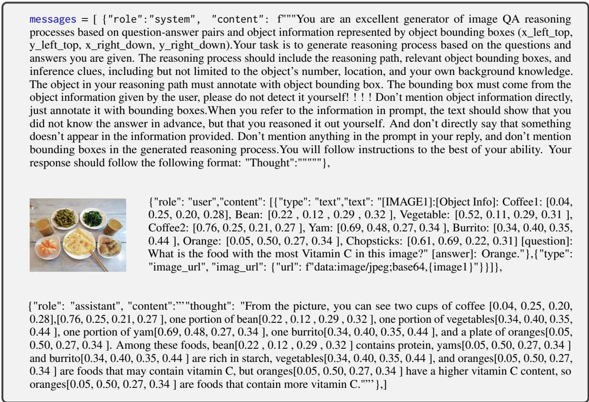  
Table 17: Prompt and one in-context sample for VQA-Based Source Type Data generation.

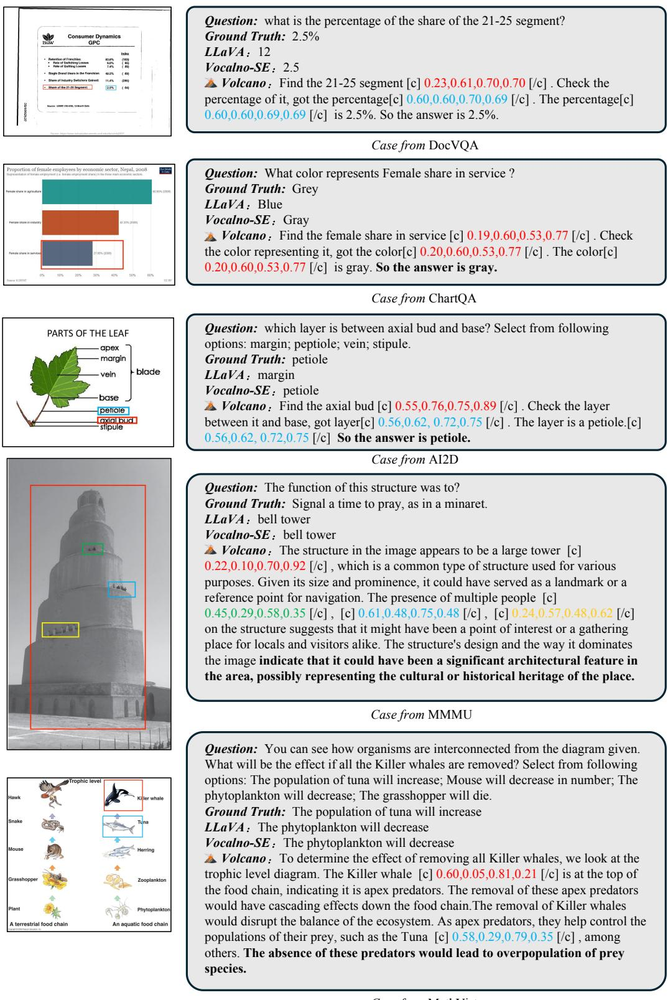  
Casefrom MathVista  
Figure 7: Cases on additional benchmarks included in Appendix B.2.

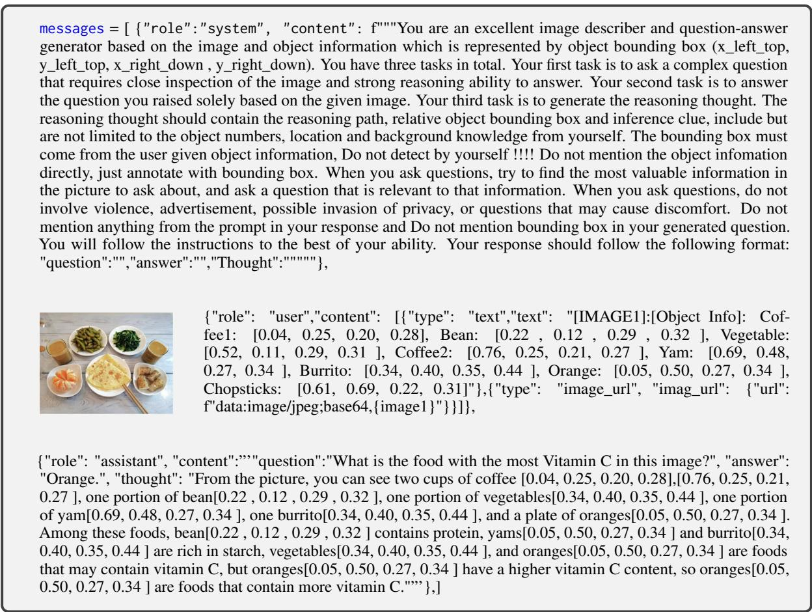  
Table 18: Prompt and one in-context sample for Image-Only Source Type Data generation.

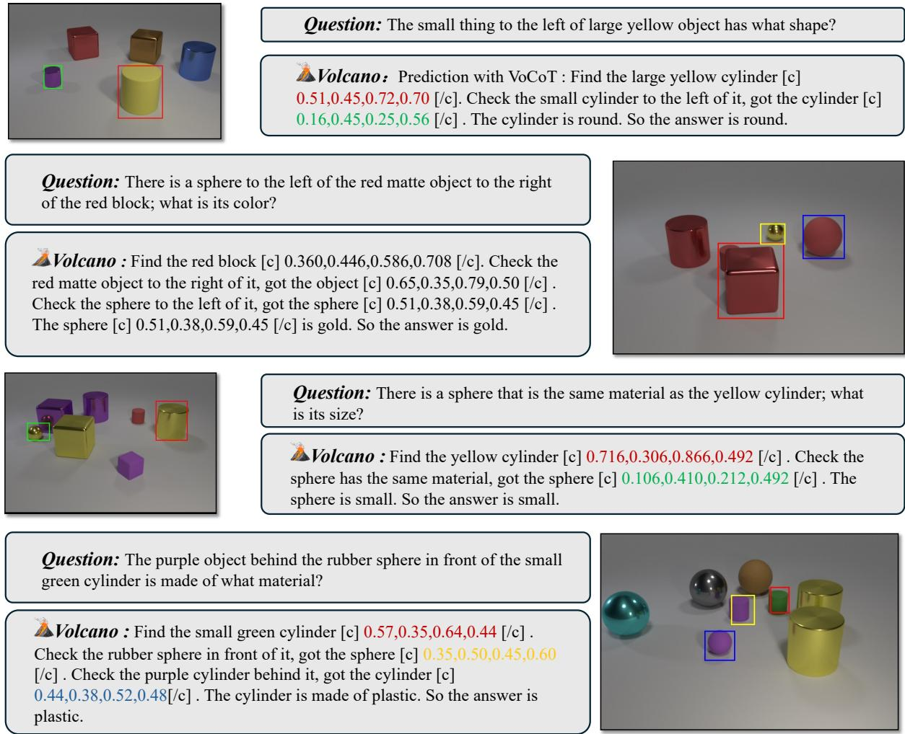  
Figure 8: Cases on CLEVR dataset.

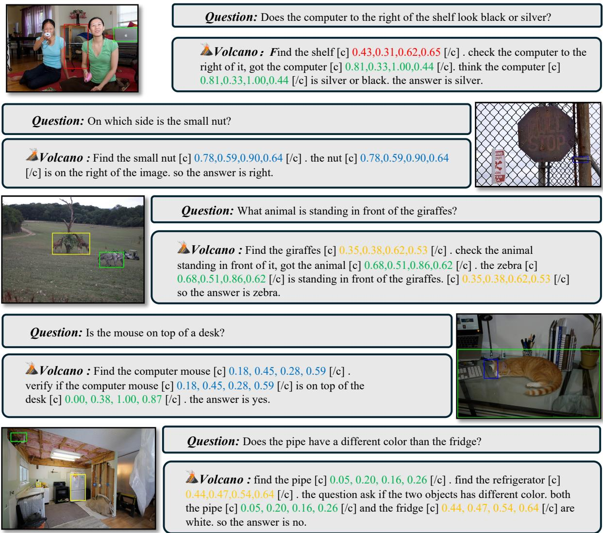  
Figure 9: Cases on GQA dataset.

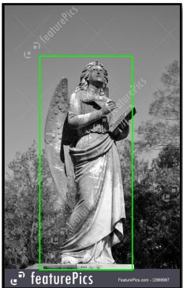

## Question: What object is depicted in the image?

Option:

A. A painting

B. A fish tank

C. A birdhouse

D. A statue of an angel holding a book

�Volcano ： Find the object [c] 0.31,0.18,0.64,0.93 [/c] . The object [c] 0.31,0.18,0.64,0.93 [/c] is a statue.[c] 0.31,0.18,0.64,0.93 [/c] So the answer is statue.

Question: Why are the photographers taking pictures of the woman? Option:

A. She is conducting an outdoor class

B. They are documenting a car accident

C. She is famous

D. She is a person of interest in an investigation

Ground Truth: She is famous

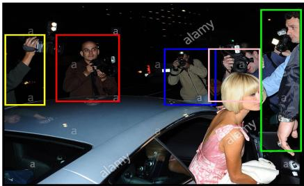

�Volcano ： The photographers are taking pictures of the woman because she is a celebrity, as indicated by her prominent position in the image and the attention she is receiving. The presence of multiple photographers [c] 0.26, 0.10, 0.42, 0.29 [/c] , [c] 0.53, 0.14, 0.66, 0.30 [/c] , [c] 0.77, 0.03, 0.87, 0.43 [/c] , [c] 0.13, 0.10,0.23,0.30 [/c], [c] 0.64, 0.14, 0.77, 0.29 [/c] around her suggests that she is the focal point of their attention. This scenario is typical in celebrity events or appearances where fans and media gather to capture moments with the person of interest. The fact that she is the center of attention, surrounded by photographers, implies that she is a public figure, likely known for her fame or achievements, which is why she is being photographed

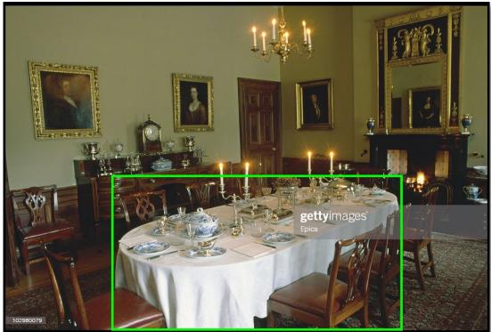

Question: What is the color of the tablecloth on the table? Option:

A. Blue

B. Brown

C. Red

D. White

Ground Truth: White

�Volcano ： Find the table [c] 0.22, 0.51, 0.82, 0.83 [/c]. Check the tablecloth on it, got the tablecloth [c] 0.22,0.51, 0.82, 0.83 [/c] . The tablecloth is white. So the answer is white.

Question: What color is the flower crown that the woman in the pink dress is wearing? Option:

A. Red

B. White

C. Yellow

D. Pink

Ground Truth: Pink

�Volcano ： Find the pink dress [c] 0.14,0.77,0.85,1.00 [/c] . Check the woman in it, got the woman [c] 0.14, 0.06, 0.85, 0.99 [/c] . Check the flower crown that it wearing, got the flower crown [c] 0.2750.06,0.72,0.30 [/c] . The flower crown is pink. So the answer is pink.

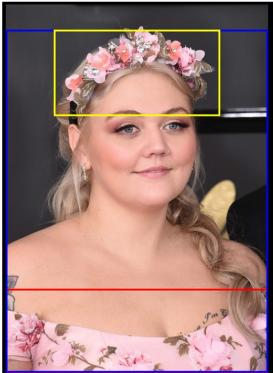  
Figure 10: Cases on Seed-Bench dataset. Seed-Bench provide a question and a list of answer options for each sample.

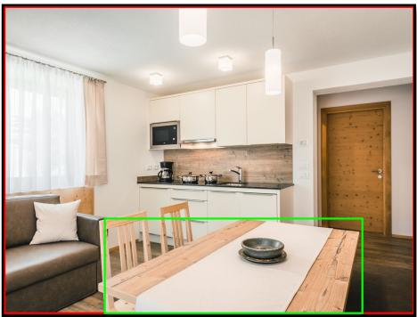

Question: What is the position of the wooden table in the room?   
Option: A. Against the wall B. Next to the couch C. In the center D. In the corner   
Ground Truth: In the center

C. A motorcycle event

Question: What is the overall theme of this image? Option:

D. A street market

�Volcano ： Find the room [c] 0.00, 0.12, 1.00, 0.87 [/c] . Check the wooden table in it, got the table [c] 0.24, 0.64, 0.87, 0.87 [/c] . The table [c] 0.24, 0.64, 0.87, 0.87 [/c] is in the middle. So the answer is center.

A. An outdoor camping trip

B. A musical performance

Ground Truth: A musical performance

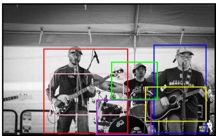

�Volcano ： The overall theme of this image is centered around a musical performance, specifically a concert. This conclusion is drawn from the presence of multiple individuals [c] 0.19, 0.39, 0.59, 0.82 [/c] , [c] 0.71, 0.37, 0.96, 0.82 [/c] , [c] 0.51, 0.46, 0.73, 0.65 [/c] who are positioned in a manner that suggests they are performing together, likely on stage. The presence of musical instruments, such as guitars [c] 0.67, 0.58, 0.96, 0.76 [/c] , [c] 0.22, 0.52, 0.57, 0.73 [/c] , and a drum set [c] 0.44, 0.65, 0.70, 0.83 [/c] further supports this theme. The arrangement and focus of these elements, along with the attire of the individuals, which is not explicitly detailed but can be inferred from the context of a concert, suggest a live performance. The setting, likely a stage, and the engagement of the individuals with their instruments, indicate a musical event where the performers are actively playing for an audience. This setup is typical of a concert, where musicians come together to showcase their talents and entertain their listeners.

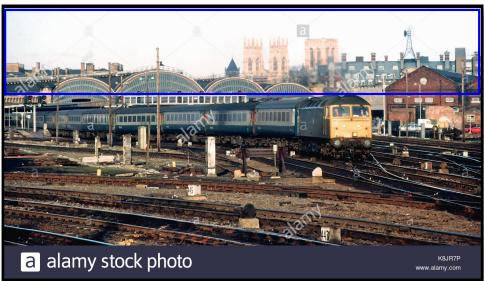

Question: What is the dominant color on the upper part of the image?

A. Blue

B. Brown

C. Red

D. White

Ground Truth: White

�Volcano ： Find the upper part of the image [c] 0.00, 0.21, 0.99, 0.39 [/c] . The dominant color on the upper part of the image [c] 0.00, 0.21, 0.99, 0.39 [/c] is blue. So the answer is blue.

Question: How many people are playing musical instruments in the image? Option:

Ground Truth: 4

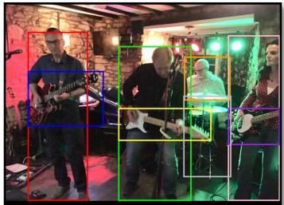

�Volcano ： In the image, there are four individuals playing musical instruments. The first person [c] 0.08, 0.26, 0.30, 0.87 [/c] is playing a guitar [c] 0.08, 0.40, 0.35, 0.60 [/c] . The second person [c] 0.41, 0.31, 0.67, 0.87 [/c] is also playing a guitar [c] 0.41, 0.53, 0.75, 0.65 [/c] . The third person [c] 0.81, 0.27, 1.00, 0.87 [/c] is playing a bass guitar [c] 0.81, 0.53, 1.00, 0.67 [/c] . The fourth person [c] 0.65, 0.35, 0.82, 0.51 [/c] is playing a drum set [c] 0.64, 0.49, 0.82, 0.78 [/c]

Figure 11: More Cases on Seed-Bench dataset.

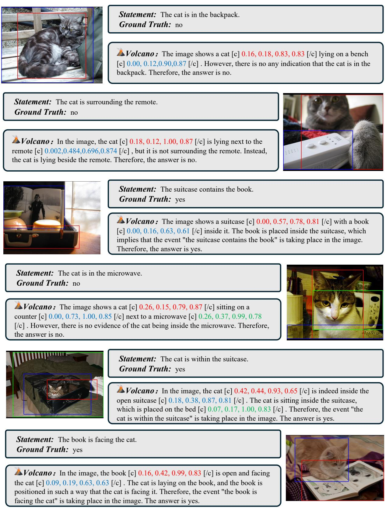  
Figure 12: Cases on VSR dataset. VSR dataset provides a statement for each image. The task is to judge whether the statement is right about this image.

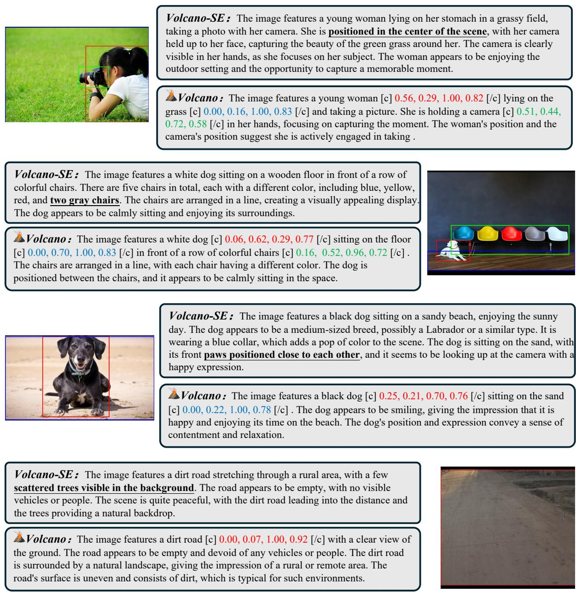  
Figure 13: Cases from the AMBER dataset. The task is to describe each image. We both present our VolCano and VolCano-SE responses for these cases. VolCano-SE is trained without VoCoT data. The underline phrase is hallucination generated by VolCano-SE.