# WHoW: A Cross-domain Approach for Analysing Conversation Moderation

Ming-Bin Chen and Lea Frermann and Jey Han Lau School of Computing and Information Systems, The University of Melbourne {mingbin, lfrermann, laujh}@unimelb.edu.au

## Abstract

We propose WHoW, an evaluation framework for analyzing the facilitation strategies of moderators across different domains/scenarios by examining their motives (Why), dialogue acts (How) and target speaker (Who). Using this framework, we annotated 5,657 moderation sentences with human judges and 15,494 sentences with GPT-4o from two domains: TV debates and radio panel discussions. Comparative analysis demonstrates the framework’s cross-domain generalisability and reveals distinct moderation strategies: debate moderators emphasise coordination and facilitate interaction through questions and instructions, while panel discussion moderators prioritize information provision and actively participate in discussions. Our analytical framework works for different moderation scenarios, enhances our understanding of moderation behaviour through automatic large-scale analysis, and facilitates the development of moderator agents.1

## 1 Introduction

Conversational moderation typically involves a moderator who upholds an impartial stance and interest, to facilitate and coordinate discussions among participants through conversation (Wright, 2009). Moderation occurs in diverse human interactive settings, however, the role of the moderator varies from hosts of debates (Thale, 1989; Zhang et al., 2016), judges in judicial processes (Danescu-Niculescu-Mizil et al., 2012), to therapists in group therapy sessions (Jacobs et al., 1998).

While there are various definitions of moderation across different domains (Grimmelmann, 2015; Vecchi et al., 2021; Friess and Eilders, 2015; Trénel, 2009) the concept is generally characterized as a form of discourse optimization mechanism with the essential objectives of: (1) mitigation: preventing and policing negative behaviors, such as personal attacks (Gorwa et al., 2020); (2) facilitation: promoting positive and constructive outcomes, such as knowledge generation and consensus building (Vasodavan et al., 2020); and (3) participation: ensuring balance and open participation opportunities for all members (Kim et al., 2020).

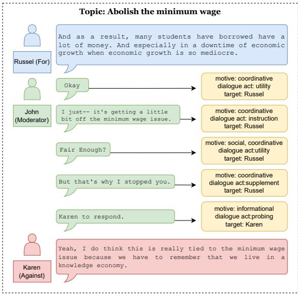  
Figure 1: Example of a moderated conversation and annotation using the WHoW framework. Blue, green, and red colors represent the supporting team, moderator, and opposing team in one of the DEBATE subset conversation, respectively. The peach-colored boxes contain the annotations for the corresponding moderator sentences.

Extensive research has focused on content moderation analysis and automation in online spaces, primarily aimed at mitigating negative behaviors and intervening through asychronous actions such as post deletion (Gorwa et al., 2020; Park et al., 2021; Wulczyn et al., 2017; Falk et al., 2024). However, there are few studies that examine how moderators facilitate positive outcomes and balance participation through conversational engagement;

our study seeks to address this.

We introduce WHoW: an analytical framework that breaks down the moderation decision-making process into three key components: motives (Why), dialogue acts (How), and target speaker (Who). Using this framework, we analyzed transcripts of conversation moderation in two distinct domains: Intelligent Squared TV Debate (DEBATE) and Roundtable Radio Panel (PANEL). We began by annotating 50 episodes of transcripts with human annotators, which are then used to create and evaluate prompts for GPT-4o (OpenAI, 2024) for automatic annotation. We then used GPT-4o to automatically annotate more data and compared the moderation strategies in facilitating and balancing participation in these two domains. Our findings reveal distinct moderation strategies and have the potential to support moderator training/assessment and facilitate the future development of moderator agents.

To summarise, our key contributions are:

1. We develop an analytical framework that characterizes conversational moderation across different scenarios using three dimensions: motives (Why), dialogue acts (How), and target speaker (Who);

2. Based on the framework, we annotated moderated multi-party conversations in two domains: TV debates and radio panel discussions. Our dataset comprises a total of 5,657 human-annotated sentences and modelannotated 15,494 sentences (GPT-4o).

3. By analyzing these two conversational domains—debates and panel discussions—we demonstrate the framework’s cross-domain generalizability and identify distinct moderation strategies. Debate moderators focus on coordination, facilitating interactions through follow-up and confrontational questions, as well as instructions. In contrast, panel discussion moderators actively engage in and contribute to the topic themselves, while being less involved in fostering interactions between speakers.

## 2 Related Work

Conversation moderation is a complex task that requires consideration of multiple dimensions when making intervention decisions. This task takes place in multi-party settings (Gu et al., 2021;

Ganesh et al., 2023), where a moderator’s decisions regarding interventions and turn assignment (Hydén and Bülow, 2003; Gibson, 2003; Ouchi and Tsuboi, 2016; Wei et al., 2023) must account for the conversation context, group dynamics, and the balance of participation. Depending on the scenario, moderators fulfill various functional roles, such as inviting for contribution, providing background information, facilitating topic transitions, and posing questions to guide discussions and maintain their quality (Wright, 2009; Park et al., 2012; Mao et al., 2024; Schroeder et al., 2024). Furthermore, moderators often operate under hybrid motives, which include facilitating quality arguments (Landwehr, 2014), maintaining social engagement (Myers, 2014), and managing external factors like time constraints (Wright, 2009). Ultimately, moderation is a strategic task, requiring the application of specific strategies to encourage constructive contributions and participant engagement while minimizing destructive conflicts (Hsieh and Tsai, 2012; Edwards, 2002; Forester, 2006).

The effect and influence of moderation have been studied across various domains using different analytical measures. In online mental health support forums, the presence of a moderator has been shown to improve user engagement, openness, linguistic coordination, and trust-building compared to non-moderated groups (Wadden et al., 2021). In the educational domain, moderators have been found to enhance collaboration patterns and increase online participation rates in group learning settings (Hsieh and Tsai, 2012). Case studies and interviews have also been conducted to analyze the role and function of moderators in community building (Cullen and Kairam, 2022; Seering et al., 2019), focus group discussions (Grønkjær et al., 2011), online public issue discussions and debates (Wright, 2009; Edwards, 2002), and mediating contentious stakeholders (Forester, 2006).

Despite the existence of some annotation protocols and datasets, resources for conversational moderation remain notably limited. Many studies have been conducted on small sample sizes (Vasodavan et al., 2020; Hsieh and Tsai, 2012) and often do not make their datasets publicly available (Grønkjær et al., 2011; Wadden et al., 2021). Additionally, the research often relies on methodologies such as interviews or case studies, which are not reusable for further analysis or automation (Forester, 2006). As of the time this study’s manual annotation was conducted, the only annotated dataset currently available consists of just 300 comments (Park et al., 2012)2. Furthermore, some studies treat moderation as a reactive intervention to participant comments and structure the data as comment-intervention pairs (Falk et al., 2024; Grønkjær et al., 2011), thereby overlooking broader session-level objectives such as balancing participation and the overall role of the moderator. Moreover, while several annotation protocols exist, they tend to be overly specific to their application domains. For instance, the role of “resolving site use issues” is only pertinent to e-rule-making scenarios (Park et al., 2012) and don’t generalise to other domains.

## 3 The WHoW Conversational Moderation Analytic Framework

We design an analytical framework that: (1) is grounded in the existing literature (Wright, 2009; Park et al., 2012; Vasodavan et al., 2020; Lim et al., 2011); (2) captures the multifaceted nature of conversational moderation; and (3) generalizes across different domains. Our framework (Table 1), inspired by existing multi-party agent work (Wei et al., 2023; Mao et al., 2024), is structured around three core dimensions: motives (Why), dialogue acts (How) and target speakers (Who). In addition to dialogue acts, which are widely employed to study dialogue patterns (Shriberg et al., 2004), we incorporate the motive dimension to provide insights into the reason the moderator intervenes given a particular scenario or context (Yeomans et al., 2022). Furthermore, we introduce the target speaker dimension to explore the moderator’s interactive style and strategies for balancing participation in a multi-party setting (Gibson, 2003; Hydén and Bülow, 2003). By decomposing the moderation process into these distinct components and analyzing their interplay, the framework enables the characterization of moderator behavior.

Table 1 shows the label definitions under the three dimensions. To derive our labels and understand their compatibility with existing protocols, we categorize all moderation-related typologies identified in Section 2 into motives and dialogue acts, as detailed in Appendix Table 9. Since moderator responses can be lengthy, and may serve multiple goals (i.e., correspond to multiple labels), we first break them into individual sentences and then label each sentence across the three dimensions using the definitions provided above. We elaborate on these three dimensions in the following sections.

## 3.1 Motives: Why does the moderator intervene?

The “Why” component examines the motivations behind a moderator’s interventions in conversations. Existing protocols distinguish socially motivated speech — such as “affective strategy” (Hsieh and Tsai, 2012) and “social functions” (Park et al., 2012) — from argument-driven speech. This pattern aligns with the conversational circumplex framework, which categorizes conversational goals along informational and relational dimensions (Yeomans et al., 2022). Furthermore, in facilitated group debates like Intelligent Squared Debate (Zhang et al., 2016) moderator interventions can be motivated by meeting rules, such as adherence to time limits. Consequently, we propose three motives driving moderation behaviors: informational, social, and coordinative (Table 1, top), which align with the facilitation types described by Lim et al. (2011) and accommodate the hybridmotive nature of the moderator role. As previous studies (Yeomans et al., 2022) and our pilot studies show that a single speech can convey multiple motives, we treat this annotation as a multi-label task (e.g., a moderator sentence may have both social and coordinative motives).

## 3.2 Dialogue Acts: How does the moderator intervene?

The “How” component analyzes the dialogue acts, or the immediate functions of a moderator’s interventions. By examining the sequential patterns of these acts, we gain insights into the strategies moderators use to realize their motives. The initial set of dialogue acts is derived from the five fundamental labels of the MRDA corpus (Shriberg et al., 2004), which was developed for annotating multi-party meetings: “Question’, “Statement”, “BackChannel”, “Disruption”, and “FloorGrabber”. The two major labels, “Question”, and “Statement”, indicate the functions of information elicitation and information provision respectively. These two major labels are instrumental in distinguishing the moderator’s functional role as either a “Interviewer” or an “Contributor” respectively (McLafferty, 2004). The remaining MRDA labels, along with other unspecified acts, such as greeting, are grouped into the ’Utility’ category, as they do not directly contribute to information exchange."

<table><tr><td>Dimension Label</td><td></td><td>Definition</td></tr><tr><td rowspan="3">Motives</td><td>Informational (IM)</td><td>Provide or acquire relevant information to constructively advance the topic or goal of the conversation.</td></tr><tr><td>Coordinative (CM)</td><td>Ensure adherence to rules, plans, and broader contextual constraints, such as time and environment.</td></tr><tr><td>Social (SM)</td><td>Enhance the social atmosphere and connections among participants by addressing feelings, emotions, and interpersonal dynamics within the group.</td></tr><tr><td rowspan="6">Dialogue acts</td><td>Probing (prob)</td><td>Prompt speaker for responses.</td></tr><tr><td></td><td>Confronting (conf) Prompt one speaker to response or engage with another speaker&#x27;s statement, ques- tion or opinion.</td></tr><tr><td>Instruction (inst)</td><td>Explicitly command, influence, halt, or shape the immediate behavior of the recipi- ents.</td></tr><tr><td>Interpretation (inte)</td><td>Clarify, reframe, summarize, paraphrase, or make connection to earlier conversation content.</td></tr><tr><td>Supplement (supp)</td><td>Enrich the conversation by supplementing details or information without immedi- ately changing the target speaker&#x27;s behavior.</td></tr><tr><td>Utility (util)</td><td>All other unspecified acts.</td></tr><tr><td>Target speaker</td><td></td><td>Target speaker (TS) The group or person addressed by the moderator.</td></tr></table>

Table 1: Definitions and acronyms for the labels across the three dimensions: motives (Why), dialogue acts (How), and target speakers (Who). Target Speaker is a categorical variable with values corresponding to each participant in the dialogue, plus “audience”, “self”, “everyone”, “support side”, “against side”, “all speakers”, and “unknkown”.

We further categorise the two major labels into sub-labels to capture the nuanced characteristics of moderators’ interventions. For “Question”, we distinguish two types of information elicitation interventions to capture whether the moderator seeks to acquire information through direct prompts (Probing) or by encouraging interaction among participants (Confronting). Turning to “Statement”, we distinguish between interjections that change a participant’s behavior (e.g. command to stop; Instruction), refer back to prior discussion (e.g. summarization; Interpretation), and provide additional information or opinions (Supplement) (Park et al., 2012; Wright, 2009).

The detailed definitions of these fine-grained labels are included in Table 1 (middle). Appendix Table 10 presents example sentences that intersect between the motives and dialogue acts dimensions. We treat dialogue acts as mutually exclusive and formalize it as a multi-class classification task.

## 3.3 Target Speaker: Who does the moderator address?

The “Who” component focuses on identifying the intended target of the moderator’s intervention, which differs from the typical task of next-speaker prediction in multi-party dialogues (Ishii et al.,

2019). Since the target participants are not always the subsequent speakers, analyzing the discrepancies between the prior speaker, target speaker, and next speaker allows for an assessment of the intended shifts in participation and the moderator’s initiatives during the discussion.

We approach the annotation of this dimension as a multi-class classification task, with labels corresponding to speakers. To accommodate different contexts, we also introduce general labels such as “everyone” (including audience), “unknown”, and “all speakers”. For the TV debates domain specifically we introduce 3 additional labels “audience”, “against team”, and “support team”. While our framework is designed to be cross-domain, we note that its labels or categories are customizable depending on the domain.

## 4 Dataset and Human Annotation

## 4.1 Datasets

We use the Intelligence Squared Debates Corpus (Zhang et al., 2016) (henceforth DEBATE), a collection of transcripts from a live-recorded U.S. television debate show featuring Oxford-style debates. The corpus comprises 108 episodes covering a wide range of topics, from foreign policy to the benefits of organic foods. Each debate includes a moderator and two teams of experts arguing, respectively, “for” and “against” the topic. Although the debates are structured into three phases—introduction, discussion, and conclusion—our analysis focused exclusively on the interactive discussion phase, where the majority of the moderated interactions occur.3 We randomly split the episodes into 11 for development, 19 for testing, and 78 for training.

<table><tr><td rowspan="2"></td><td colspan="3">DEBATE</td><td colspan="2">PANEL</td></tr><tr><td>Test</td><td>Dev</td><td>Train</td><td>Test</td><td>Train</td></tr><tr><td>Episodes</td><td>19</td><td>11</td><td>78</td><td>20</td><td>68</td></tr><tr><td>Speakers / episode Mean</td><td>4.63</td><td>4.55</td><td>4.62</td><td>3.450 4.47</td><td></td></tr><tr><td>M Share / episode (%)</td><td>38%</td><td>36%</td><td>37%</td><td>41%40%</td><td></td></tr><tr><td>M Turns / episode</td><td>69</td><td>73</td><td>70</td><td>17</td><td>21</td></tr><tr><td>M Sentences (Total)</td><td></td><td></td><td>2,795 1,702 11,153</td><td>1,160 4,341</td><td></td></tr></table>

Table 2: Descriptive statistics for the DEBATE and PANEL. M denotes Moderator; share the proportion of words uttered by the moderator; and turn the full utterance (which contains multiple sentences).

To validate the generalizability of our framework across scenarios, we also include a second dataset from a subset of The NPR Interview Corpus (Majumder et al., 2020) (henceforth PANEL). We specifically select episodes from a panel discussion program titled “Roundtable”, in which the moderator accounts for 30% - 50% of the dialogue, and which involve more than three speakers. This subset features panel discussions with speakers holding diverse views, though not necessarily opposing each other (unlike DEBATE). This selection yielded 88 episodes, from which we randomly sampled 20 episodes to create a test set. Table 2 presents some descriptive statistics of the two datasets.

## 4.2 Human annotation process

We recruited annotators to label each sentence of the moderator’s utterance based on the WHoW framework, as illustrated in Figure 1.4 We recruited five annotators in total, all proficient or native English speakers and students of either linguistics or NLP, and they were paid 36 USD/hour. The annotators manually annotated the development and test sets of DEBATE and the test set of PANEL. Annotators received the definitions of labels as outlined in Section 3 and Table 1. To facilitate the dialogue act annotation and increase agreement, we developed a decision tree flowchart (see Appendix Figure 3). We conducted one practice annotation round including group discussions to clarify any misconceptions and two further meetings during the annotation phase to discuss remaining misunderstandings. More details of annotation material and interface are provided in Appendix Section F.

<table><tr><td></td><td>DA</td><td>IM</td><td>CM</td><td>SM</td><td>TS</td></tr><tr><td>DEBATE</td><td>0.49</td><td>0.43</td><td>0.37</td><td>0.41</td><td>0.72</td></tr><tr><td>PANEL</td><td>0.59</td><td>0.67</td><td>0.54</td><td>0.63</td><td>0.75</td></tr></table>

Table 3: Inter-annotator agreement (Krippendorff’s alpha), across the dialogue acts (DA), motives (IM, CM, SM), and target speaker (TS) dimensions for the datasets DEBATE and PANEL.

Each sentence in the moderators’ utterance was annotated for the presence of the three motives, one identified dialogue act, and the target speaker(s). Each episode was annotated by at least two annotators. The final ground truth were aggregated using majority vote; in cases of evenly divided annotation votes, the first author did the tie-breaking. Inter-annotator agreement (Krippendorff’s alpha) is presented in Table 3. PANEL generally has higher agreement and the overall agreement ranges from moderate to good and these numbers are consistent with previous studies that involve complex and subjective judgements (Falk et al., 2024). A detailed analysis of disagreements is provided in Appendix section C.

## 5 Automatic Annotation

Manual labeling is time-consuming and extensive. A practical and generalizable framework for largescale exploration requires an automatic labeling framework. To this end, we leverage GPT-4o (OpenAI, 2024) for automatic annotation. We optimized the prompts using the development set from DE-BATE (see Appendix section B. for more details on the prompt design). Our single-task setting (“ST”) frames the annotation as five independent classification tasks: two multi-class classifications for dialogue acts (“DA”) and target speakers (“TS”), and three binary classifications for motive labels (“IM”, “CM”, “SM”). In addition to ST, we also developed an alternative approach to perform all tasks jointly with one single prompt (multi-task or “MT”). We present macro-F1 and agreement results of ST and MT with human test set annotations in Table 4 and Table 5 respectively. Overall, the results are encouraging and demonstrate that GPT-4o is a viable method for automatic annotation, particularly given the tasks’ high level of subjectivity and complexity (Falk et al. (2024); Appendix Section C). Error analysis (Appendix Section E) reveals that most mis-classifications arise from subjective interpretations, context dependency, or ambiguity in extremely long or short sentences. As the multitasking approach (MT) has higher average Macro-F1 (0.64 vs. 0.61) and agreement (0.51 vs. 0.46) across tasks and datasets, we used this approach for automatic annotation, and ran it on the training sets of DEBATE and PANEL.5

<table><tr><td>Model DA</td><td>IM CM SM TS</td></tr><tr><td>Random(DEBATE) 0.153 MT(DEBATE)</td><td>0.492 0.508 0.405 0.057 0.4850.761 0.711 0.767 0.497</td></tr><tr><td>ST(DEBATE)</td><td>0.515 0.7287 0.686 0.668 0.525</td></tr><tr><td>Random(PANEL) MT(PANEL)</td><td>0.1150.4900.482 0.387 0.096 0.5040.7260.732 0.754 0.467</td></tr><tr><td></td><td></td></tr><tr><td>ST(PANEL)</td><td>0.4920.7470.639 0.635 0.464</td></tr></table>

Table 4: Macro-F1 comparing GPT-4o using multi-task (MT) and single-task (ST) approaches across the two subsets. The bold numbers highlights the top performer of the dimension in the subset. The random baseline are derived from five random simulations.
<table><tr><td>Model</td><td>DA</td><td>IM</td><td>CM</td><td>SM</td><td>TS</td></tr><tr><td>MT (DEBATE)</td><td>0.38</td><td>0.52</td><td>0.42</td><td>0.53</td><td>0.66</td></tr><tr><td>ST (DEBATE)</td><td>0.53</td><td>0.46</td><td>0.37</td><td>0.34</td><td>0.68</td></tr><tr><td>MT (PANEL)</td><td>0.53</td><td>0.45</td><td>0.51</td><td>0.46</td><td>0.60</td></tr><tr><td>ST (PANEL)</td><td>0.53</td><td>0.49</td><td>0.28</td><td>0.27</td><td>0.61</td></tr></table>

Table 5: Krippendorff’s alpha agreement between the (majority) human labels and GPT-4o predictions using single task (ST) or multi-task (MT) prompts for the two datasets.

## 6 Analysis

We now analyze which dialogue acts are used to facilitate discussion and encourage participation. To demonstrate the generalizability of the automatic framework, this analysis draws on our full dataset, including development, test, and train sets, annotated using GPT-4o with the multi-task approach. In Appendix Section D, we compare GPT-4o labels against human label distributions on the development and test set, showing that they are overall consistent, with the exception of the "instruction" and "supplement" acts, with only minor variations in magnitude. Specifically, we examine how speaker rotation is facilitated and how the three motives are addressed across the two domains in the dataset.

<table><tr><td colspan="8">DEBATE</td></tr><tr><td></td><td>prob</td><td>conf</td><td>inst</td><td>inte</td><td>supp</td><td>util</td><td>p(m)</td></tr><tr><td>IM CM SM</td><td>0.41 0.15* 0.08</td><td>0.23* 0.10* 0.02</td><td>0.04* 0.54* 0.10*</td><td>0.11* 0.02 0.02</td><td>0.20 0.09 0.14</td><td>0.01 0.10 0.65</td><td>0.39 0.66* 0.12</td></tr><tr><td>p(d)</td><td>0.22</td><td>0.11*</td><td>0.36*</td><td>0.05*</td><td>0.12</td><td>0.14*</td><td></td></tr><tr><td></td><td></td><td></td><td></td><td>PANEL</td><td></td><td></td><td></td></tr><tr><td>IM 0.42</td><td colspan="7"></td></tr><tr><td>CM</td><td>0.06</td><td>0.03 0.02</td><td>0.01 0.42</td><td>0.03 0.01</td><td>0.51* 0.33*</td><td>0.01 0.17*</td><td>0.72* 0.25</td></tr><tr><td>SM</td><td>0.05</td><td>0.01</td><td>0.02</td><td>0.01</td><td>0.28</td><td>0.63</td><td>0.16*</td></tr><tr><td>p(d)</td><td>0.30*</td><td>0.03</td><td>0.10</td><td>0.02</td><td>0.41*</td><td>0.13</td><td></td></tr></table>

Table 6: Conditional probabilities of dialogue acts (d; columns) given motives (m; rows), with marginal probabilities averaged across episodes for the two scenarios—DEBATE (top) and PANEL (bottom). The most likely dialogue act per motive is highlighted in bold, and the second most likely is underlined. ∗ indicates a significantly larger p(d m) in one data set compared to the other (t-test; $\mathsf { p } { < } = 0 . 0 5 )$ . On average, a moderator speaks 151 sentences per DEBATE episode and 61 per PANEL episode.

## 6.1 Motives and Dialogue Acts

Table 6 presents the probabilities that motive m (rows) is realized by dialogue act d (columns), $p ( d | m )$ , as well as all dialogue acts and motives labels’ marginal probabilities. There is a distinct difference in relative motive frequencies between the two domains. DEBATE moderation is dominated by a coordinative motive (66%) followed by informational (39%). In contrast, informational motives are the most frequent in PANEL moderation (72%). For relative dialogue act frequencies, DEBATE moderators mostly focus on providing instructions (36%), while PANEL moderators tend to supply information (41%). Probing is the second most common dialogue act in both corpora.

Turning to the conditional probabilities, strategically, DEBATE moderators achieve informational motives (IM) by actively facilitating participant contributions through methods such as probing (0.41) and confronting (0.23), along with notable uses of interpretation (0.12) and supplementing (0.19) information. IM in PANEL, on the other hand, is characterized by moderators delivering information themselves (0.51) and engaging participants through probing (0.41). The minimal use of confrontation (0.03) and interpretation (0.01) in PANEL indicates relatively few attempts to foster interaction and engagement between non-moderator participants.

Conversely, DEBATE moderators more frequently prompt participants to respond to one another (confronting) and engage with earlier discussion content (interpretation). Overall, for IM DEBATE moderators’ interventions are more diverse and leading to interaction between participants compared to those in PANEL.

Coordination motives (CM) in both domains primarily rely on instructions (0.54 in DEBATE and 0.42 in PANEL). However, DEBATE moderators are more likely to coordinate through probing (0.15), maintaining dialogue engagement by asking participants about their preferences for rotation and participation. PANEL moderators coordinate by providing supplementary information (0.33), e.g. by explaining rules.

While PANEL has a significantly higher proportion of moderator interventions driven by Social Motives (SM) compared to DEBATE, there is no notable difference in the dialogue acts used. Both settings primarily utilize utility acts (0.65 in DE-BATE, 0.62 in PANEL), such as greetings, along with some social/personal information sharing (supplement) to fulfill their social motives. Although our observations can be partially explained by the respective rules of the discussion programs, they highlight different high-level strategies to facilitate a constructive discussion.

## 6.2 Balancing Speaker Participation

An essential role of a moderator is to facilitate balanced participation among participants and their respective stances. To analyze how moderators balance participation, we examine the transition probabilities between moderator dialogue acts and speaker rotation.

Given an episode of a conversation consisting of n turns between a moderator and participants, we denote the speaker identities (e.g. moderator or name of a participant) as $[ p _ { 0 } , p _ { 1 } , \ldots , p _ { n } ]$ . Note that a turn here denotes the full utterance (which can have multiple sentences) by a speaker.

<table><tr><td colspan="4">DEBATE</td></tr><tr><td></td><td>moderation</td><td>continuation</td><td>rotation</td></tr><tr><td>moderation</td><td></td><td>0.52</td><td>0.48</td></tr><tr><td>continuation</td><td>0.78</td><td></td><td>0.22</td></tr><tr><td>rotation</td><td>0.47</td><td>一</td><td>0.53</td></tr><tr><td colspan="4">PANEL</td></tr><tr><td>moderation</td><td>一</td><td>0.35</td><td>0.65</td></tr><tr><td>continuation</td><td>0.80</td><td></td><td>0.20</td></tr><tr><td>rotation</td><td>0.60</td><td></td><td>0.40</td></tr></table>

Table $7 { : }$ Transition probabilities between moderator interventions and speaker rotation / continuation. Note: the transition from ’rotation’ to ’rotation’ represents instances of participant-driven rotation without moderator intervention. ‘–’ indicates that transitions are not possible.

To understand the rotation pattern (i.e. how the dialogue transition from one speaker to another), we simplify the speaker status for each turn $\left( { { s _ { t } } } \right)$ as follows:

$$
s _ { t } = \left\{ \begin{array} { c c } { m o d e r a t i o n , } & { \mathrm { i f ~ } p _ { t } = \mathrm { m o d e r a t o r } } \\ { c o n t i n u a t i o n , } & { \mathrm { i f ~ } p _ { t } \ne \mathrm { m o d e r a t o r } \enspace \& } \\ & { \qquad p _ { t } = p _ { t ^ { \prime } } } \\ { r o t a t i o n , } & { \mathrm { i f ~ } p _ { t } \ne \mathrm { m o d e r a t o r } \enspace \& } \\ & { \qquad p _ { t } \ne p _ { t ^ { \prime } } } \end{array} \right.
$$

where $t ^ { \prime }$ is the last non-moderator turn before t.

By converting the conversation sequence into three states—moderation, continuation, and rotation—we derive a transition probability matrix $( \boldsymbol { P } ( s _ { t + 1 } | s _ { t } ) )$ , as shown in Table 7. The table reveals several key patterns: both DEBATE and PANEL moderators are more likely to intervene when a speaker has continued for more than one exchange (0.78 and 0.80). However, DEBATE moderators (0.52) exhibit a higher tendency than PANEL moderators (0.35) to continue the conversation with the same participant; or another interpretation is that PANEL moderator intervention has a higher tendency to lead to speaker rotation. Additionally, there are more participant-driven rotations (rotation rotation) in the DEBATE dataset (0.53) compared to the PANEL dataset (0.40), indicating a higher level of independent interaction among participants in DEBATE.

We next use the dialogue act (DAs) to further investigate how rotations are facilitated. For each moderator turn $t \left( \mathrm { i . e . } p _ { t } = \mathrm { m o d e r a t o r } \right)$ and denoting the dialogue acts as $d _ { t } ,$ we compute $P ( s _ { t + 1 } | d _ { t } )$ and present the results in Figure $2 . ^ { \bar { 6 } }$ We see that moderator intervention in PANEL tends to lead to speaker rotation across all dialogue acts. Most dialogue acts in DEBATE, however, lead to both continuation and rotation almost equally; the only exceptions are confronting and supplementary. This is perhaps not surprising, as confronting questions are designed to explicitly prompt one speaker to respond to another speaker’s statement.

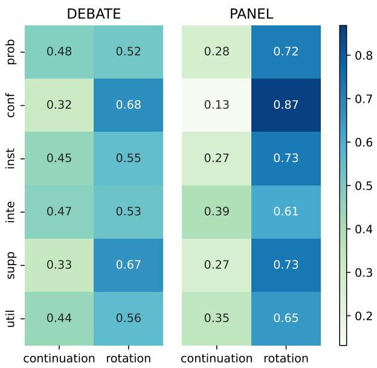

Figure 2: Probabilities of participants’ rotation statuses following different moderation dialogue acts.
<table><tr><td></td><td>Pro-activity</td><td>Interactivity</td><td>Specificity</td></tr><tr><td>DEBATE</td><td>0.59</td><td>0.73</td><td>0.63</td></tr><tr><td>PANEL</td><td>0.61</td><td>0.75</td><td>0.85</td></tr></table>

Table 8: Proportion of moderator sentences that are proactive (target\_speaker $\neq$ last\_speaker), interactive (target\_speaker = next\_speaker), and specific (targeting an individual).

## 6.3 Moderators’ selection of target speakers

Moderators may exhibit different interaction styles with participants depending on the context, in terms of pro-activity (how often the moderator actively initiates conversations), interactivity (how likely participants respond to the moderator), and specificity (how often the moderator addresses specific individuals rather than the group as a whole) (Wagner et al., 2022). For instance, in a highly scripted setting, a moderator may act primarily as an assistant, responding to participant queries and broadcasting reminders about time and rules, with no expectation of responses—showing low levels of pro-activity, interactivity, and specificity. In contrast, in a more dynamic setting, a moderator might initiate conversations by asking questions tailored to individual speakers.

By analyzing whether the moderator’s target speaker aligns with the speakers preceding and following their intervention, we can infer the moderator’s interaction style. For each moderator turn t (i.e. pt = moderator), we denote the set of target speakers as $r _ { t }$ (a moderator turn can have multiple sentences and hence multiple target speakers) and compute pro-activity, interactivity and specificity as follows:

$$
{ \begin{array} { r l } & { { \mathrm { p r o - a c t i v i t y } } = { \frac { \# ( p _ { t - 1 } \notin { r _ { t } } ) } { M } } } \\ & { { \mathrm { i n t e r a c t i v i t y } } = { \frac { \# ( p _ { t + 1 } \in { r _ { t } } ) } { M } } } \\ & { \quad { \mathrm { s p e c i f i c i t y } } = { \frac { \# ( r _ { t } \subset S ) } { M } } } \end{array} }
$$

where M is the total number of moderator turns and S the set of unique participants in the conversation.

Table 8 indicates that moderators in both domains demonstrate high levels of pro-activity and interactivity, suggesting that they frequently initiate interactions with participants. However, PANEL moderators exhibit higher levels of specificity compared to DEBATE moderators, indicating a greater tendency to address specific individuals rather than the group as a whole. This suggests that PANEL moderators are more likely to tailor their interventions to particular participants, fostering more targeted and personalized interactions.

## 7 Conclusion

We present WHoW, an analytical framework that characterizes conversational moderation across domains. WHoW breaks down the complexity of moderation decision-making into three key components: why the moderator intervenes (motives), how they intervene (dialogue acts), and to whom they direct the intervention (target speakers). Using this framework, we annotated moderation utterances in two distinct scenarios: Intelligent Squared Debate Corpus (DEBATE) and RoundTable Radio

Panel Discussion (PANEL). We showed that GPT-4o can effectively automate the labelling process. In total, our dataset has 5,657 human-annotated and 15,494 GPT-4o annotated moderation sentences, which is an order of magnitude larger than existing datasets (Park et al., 2012).

Our analysis demonstrates the framework’s effectiveness in differentiating intervention strategies and styles across the two scenarios. In DEBATE, moderators are primarily coordination-motivated, serving functional roles as interviewers and instructors, while occasionally facilitating interaction between non-moderator speakers. In contrast, PANEL moderators are more information-oriented, acting as both contributors and interviewers, as they often participate in the discussion topics. While they seek information from the speakers and balance turn-taking, they promote less direct interaction between non-moderator speakers.

Our framework can serve as an exploratory tool or foundational skeleton for domain-specific adaptation and expansion in moderation analysis or moderator agent development. Using raw transcripts, users can initially categorize the moderator’s speech into the twelve categories across the motive and dialogue act dimensions, then refine these labels based on the specific domain context. For example, in a mental health support setting, “social interpretation” could be expanded into more specific categories like “emotion interpretation”. Although the current dataset may not be large enough for fine-tuning supervised models, it serves as a valuable resource for in-context few-shot learning. This means it provides practical examples that help develop models capable of predicting or recommending intuitive moderation interventions based on our framework.

Future studies should encompass a broader range of moderation scenarios, such as group counseling (Kissil, 2016) and second language group conversations (Gao et al., 2024). Additionally, the proposed analytic framework could be expanded to support the generation of conversational moderation strategies by sequentially predicting the three key components. Another important direction is the development of evaluation metrics to assess the effects and potential biases of moderation interventions (Spada and Vreeland, 2013), enabling deeper insights into the impact and fairness of moderation practices. Finally, a broader goal for future work could involve synthesizing the results into “moderator prototype strategies” — a schema with multiple axes capturing distinct moderation styles. As new scenarios are explored, these prototypes may evolve, offering a richer understanding of diverse moderation approaches.

## 8 Limitations

Some dimensions exhibit low to moderate interannotator agreement and low macro-F1 scores, indicating that the boundaries between certain concepts can be ambiguous and subjective. This issue is not unique to our research, as previous studies on moderation-related annotations have also reported both low (Falk et al., 2024) and high (Park et al., 2012) levels of inter-annotator agreement. As shown in Table 3, the agreement levels and macro-F1 scores differ across the settings we analyzed, suggesting that ambiguity is highly contextdependent, with some contexts using more explicit language and others relying on implicit expressions. We recommend that future studies adapting this framework incorporate some degree of human validation tailored to the specific context. Additionally, while we aimed to develop and validate an analytic framework that generalizes across scenarios, the two selected scenarios share a high degree of similarity, both placing less emphasis on social motives. This limitation was due to the lack of sufficient data to compare more diverse scenarios, as multi-party conversation data with clearly tagged moderators are scarce. However, despite the similarity between the selected scenarios, the framework successfully differentiated the two settings, demonstrating its potential for comparative analysis.

## 9 Ethics Statement

This study was conducted in accordance with the ACL Code of Ethics. Given that the multi-party discussion transcripts may involve controversial topics, annotators were informed in advance and were granted the right to skip any content they found uncomfortable. All identifiable personal information of the annotators has been removed from the datasets. Since the annotations are based on publicly available datasets (Zhang et al., 2016; Majumder et al., 2020), there are no confidentiality concerns regarding the speakers’ privacy or personal information. The annotation protocol and material were approved by the University of Melbourne research ethics committee with the reference code- 2023-28400-47354-1.

In terms of potential risks and dangers, our work at this stage is primarily analytical and does not involve content generation, thereby minimizing the risk of producing harmful material. Additionally, since the research focuses on moderation rather than persuasion, the findings are unlikely to contribute to harmful uses, such as the spread of propaganda.

## Acknowledgments

I would like to express my gratitude to Rena Gao, Rui Xing, Gisela Vallejo, and Miao Li, my wonderful colleagues who contributed significantly during the pilot study stage. I also wish to thank the anonymous workers who participated in the annotation process for this project. Additionally, I am grateful to Alex Goddard for sharing inspiring literature and insights that greatly informed this research.

## References

Iz Beltagy, Matthew E Peters, and Arman Cohan. 2020. Longformer: The long-document transformer. arXiv preprint arXiv:2004.05150.

Amanda LL Cullen and Sanjay R Kairam. 2022. Practicing moderation: Community moderation as reflective practice. Proceedings of the ACM on Humancomputer Interaction, 6(CSCW1):1–32.

Cristian Danescu-Niculescu-Mizil, Lillian Lee, Bo Pang, and Jon Kleinberg. 2012. Echoes of power: Language effects and power differences in social interaction. In Proceedings ofthe 21st international conference on World Wide Web, pages 699–708.

Arthur R Edwards. 2002. The moderator as an emerging democratic intermediary: The role of the moderator in internet discussions about public issues. Information polity, 7(1):3–20.

Neele Falk, Eva Maria Vecchi, Iman Jundi, and Gabriella Lapesa. 2024. Moderation in the wild: Investigating user-driven moderation in online discussions. In Proceedings ofthe 18th Conference of the European Chapter ofthe Associationfor Computational Linguistics (Volume 1: Long Papers), pages 992–1013.

John Forester. 2006. Making participation work when interests conflict: Moving from facilitating dialogue and moderating debate to mediating negotiations. Journal ofthe American Planning Association, 72(4):447–456.

Dennis Friess and Christiane Eilders. 2015. A systematic review of online deliberation research. Policy & Internet, 7(3):319–339.

Ananya Ganesh, Martha Palmer, and Katharina Kann. 2023. A survey of challenges and methods in the

computational modeling of multi-party dialog. In Proceedings ofthe 5th Workshop on NLPfor Conversational AI (NLP4ConvAI 2023), pages 140–154.

Rena Gao, Carsten Roever, and Jey Han Lau. 2024. Interaction matters: An evaluation framework for interactive dialogue assessment on english second language conversations. arXiv preprint arXiv:2407.06479.

David R Gibson. 2003. Participation shifts: Order and differentiation in group conversation. Socialforces, 81(4):1335–1380.

Robert Gorwa, Reuben Binns, and Christian Katzenbach. 2020. Algorithmic content moderation: Technical and political challenges in the automation of platform governance. Big Data & Society, 7(1):2053951719897945.

James Grimmelmann. 2015. The virtues of moderation. Yale JL & Tech., 17:42.

Mette Grønkjær, Tine Curtis, Charlotte De Crespigny, and Charlotte Delmar. 2011. Analysing group interaction in focus group research: Impact on content and the role of the moderator. Qualitative studies, 2(1):16–30.

Jia-Chen Gu, Chongyang Tao, Zhen-Hua Ling, Can Xu, Xiubo Geng, and Daxin Jiang. 2021. Mpcbert: A pre-trained language model for multiparty conversation understanding. arXiv preprint arXiv:2106.01541.

Ya-Hui Hsieh and Chin-Chung Tsai. 2012. The effect of moderator’s facilitative strategies on online synchronous discussions. Computers in Human Behavior, 28(5):1708–1716.

Lars-Christer Hydén and Pia H Bülow. 2003. Who’s talking: drawing conclusions from focus groups—some methodological considerations. Int. J. Social Research Methodology, 6(4):305–321.

Ryo Ishii, Kazuhiro Otsuka, Shiro Kumano, Ryuichiro Higashinaka, and Junji Tomita. 2019. Prediction of who will be next speaker and when using mouthopening pattern in multi-party conversation. Multimodal Technologies and Interaction, 3(4):70.

Edward E Jacobs, Robert L Masson, and Riley L Harvill. 1998. Group counseling: Strategies and skills. Thomson Brooks/Cole Publishing Co.

Soomin Kim, Jinsu Eun, Changhoon Oh, Bongwon Suh, and Joonhwan Lee. 2020. Bot in the bunch: Facilitating group chat discussion by improving efficiency and participation with a chatbot. In Proceedings of the 2020 CHI Conference on Human Factors in Computing Systems, pages 1–13.

Karni Kissil. 2016. About the facilitators. In The Person of the Therapist Training Model, pages 77–86. Routledge.

Claudia Landwehr. 2014. Facilitating deliberation: The role of impartial intermediaries in deliberative minipublics. Deliberative mini-publics: Involving citizens in the democratic process, pages 77–92.

Sze Chung Raymond Lim, Wing Sum Cheung, and Khe Foon Hew. 2011. Critical thinking in asynchronous online discussion: An investigation of student facilitation techniques. New Horizons in Education, 59(1):52–65.

Bodhisattwa Prasad Majumder, Shuyang Li, Jianmo Ni, and Julian McAuley. 2020. Interview: Large-scale modeling of media dialog with discourse patterns and knowledge grounding. In Proceedings of the 2020 Conference on Empirical Methods in Natural Language Processing (EMNLP), pages 8129–8141.

Manqing Mao, Paishun Ting, Yijian Xiang, Mingyang Xu, Julia Chen, and Jianzhe Lin. 2024. Multiuser chat assistant (muca): a framework using llms to facilitate group conversations. arXiv preprint arXiv:2401.04883.

Isabella McLafferty. 2004. Focus group interviews as a data collecting strategy. Journal ofadvanced nursing, 48(2):187–194.

Greg Myers. 2014. Becoming a group: Face and sociability in moderated discussions. In Discourse and social life, pages 121–137. Routledge.

OpenAI. 2024. Openai api. OpenAI, https://openai. com/index/hello-gpt-4o/. Accessed: 2024-07- 20.

Hiroki Ouchi and Yuta Tsuboi. 2016. Addressee and response selection for multi-party conversation. In Proceedings ofthe 2016 Conference on Empirical Methods in Natural Language Processing, pages 2133– 2143.

Chan Young Park, Julia Mendelsohn, Karthik Radhakrishnan, Kinjal Jain, Tushar Kanakagiri, David Jurgens, and Yulia Tsvetkov. 2021. Detecting community sensitive norm violations in online conversations. arXiv preprint arXiv:2110.04419.

Joonsuk Park, Sally Klingel, Claire Cardie, Mary Newhart, Cynthia Farina, and Joan-Josep Vallbé. 2012. Facilitative moderation for online participation in erulemaking. In Proceedings ofthe 13th Annual International Conference on Digital Government Research, pages 173–182.

Hope Schroeder, Deb Roy, and Jad Kabbara. 2024. Fora: A corpus and framework for the study of facilitated dialogue. In Proceedings of the 62nd Annual Meeting of the Association for Computational Linguistics (Volume 1: Long Papers), pages 13985–14001.

Joseph Seering, Tony Wang, Jina Yoon, and Geoff Kaufman. 2019. Moderator engagement and community development in the age of algorithms. New media & society, 21(7):1417–1443.

Ashish Sharma, Adam S Miner, David C Atkins, and Tim Althoff. 2020. A computational approach to understanding empathy expressed in text-based mental health support. arXiv preprint arXiv:2009.08441.

Elizabeth Shriberg, Raj Dhillon, Sonali Bhagat, Jeremy Ang, and Hannah Carvey. 2004. The icsi meeting recorder dialog act (mrda) corpus. In Proceedings of the 5th SIGdial Workshop on Discourse and Dialogue at HLT-NAACL 2004, pages 97–100.

Paolo Spada and James Raymond Vreeland. 2013. Who moderates the moderators? the effect of non-neutral moderators in deliberative decision making. Journal ofDeliberative Democracy, 9(2).

Mary Thale. 1989. London debating societies in the 1790s. The Historical Journal, 32(1):57–86.

Matthias Trénel. 2009. Facilitation and inclusive deliberation. Online deliberation: Design, research, and practice, pages 253–257.

Vinothini Vasodavan, Dorothy DeWitt, Norlidah Alias, and Mariani Md Noh. 2020. E-moderation skills in discussion forums: Patterns of online interactions for knowledge construction. Pertanika Journal of Social Sciences and Humanities, 28(4):3025–3045.

Eva Maria Vecchi, Neele Falk, Iman Jundi, and Gabriella Lapesa. 2021. Towards argument mining for social good: A survey. In Proceedings of the 59th Annual Meeting ofthe Associationfor Computational Linguistics and the 11th International Joint Conference on Natural Language Processing (Volume 1: Long Papers), pages 1338–1352.

David Wadden, Tal August, Qisheng Li, and Tim Althoff. 2021. The effect of moderation on online mental health conversations. In Proceedings ofthe International AAAI Conference on Web and Social Media, volume 15, pages 751–763.

Nicolas Wagner, Matthias Kraus, Tibor Tonn, and Wolfgang Minker. 2022. Comparing moderation strategies in group chats with multi-user chatbots. In Proceedings of the 4th Conference on Conversational User Interfaces, pages 1–4.

Jimmy Wei, Kurt Shuster, Arthur Szlam, Jason Weston, Jack Urbanek, and Mojtaba Komeili. 2023. Multi-party chat: Conversational agents in group settings with humans and models. arXiv preprint arXiv:2304.13835.

Scott Wright. 2009. The role of the moderator: Problems and possibilities for government-run online discussion forums. Online deliberation: Design, research, and practice, pages 233–242.

Ellery Wulczyn, Nithum Thain, and Lucas Dixon. 2017. Ex machina: Personal attacks seen at scale. In Proceedings of the 26th international conference on world wide web, pages 1391–1399.

Michael Yeomans, Maurice E Schweitzer, and Alison Wood Brooks. 2022. The conversational circumplex: Identifying, prioritizing, and pursuing informational and relational motives in conversation. Current Opinion in Psychology, 44:293–302.

Justine Zhang, Ravi Kumar, Sujith Ravi, and Cristian Danescu-Niculescu-Mizil. 2016. Conversational flow in oxford-style debates. arXiv preprint arXiv:1604.03114.

Ming Zhong, Yang Liu, Yichong Xu, Chenguang Zhu, and Michael Zeng. 2022. Dialoglm: Pre-trained model for long dialogue understanding and summarization. In Proceedings of the AAAI Conference on Artificial Intelligence, volume 36, pages 11765– 11773.

## A Appendix: Framework Supplementary Information

<table><tr><td>DAs IM Prob</td><td></td><td>SM empathetic exploration(4),</td><td>CM coordinative enquiry*</td><td>Source No. 0: Park et al. (2012),</td></tr><tr><td></td><td>asking users to provide more in- fomratino (0), asking user to make or consider possible solution (0), Posing a question at large for the users to respond(0), asking ques- tions (1), asking for elaboration (1), asking for clarification and expla- nation (1), facilitating students’ar- gumentation (2), conversation stim- ulator (3), invite feedback or com- ments(5), questioning clarifications probe viewpoints(5), open invitation (6), specific intivation to participate</td><td>participation encouragement (7)</td><td></td><td>1: Vasodavan et al. (2020), 2: Hsieh and Tsai (2012), 3: Wright (2009), 4: Sharma et al. (2020), 5: Lim et al. (2011), 6: Schroeder et al. (2024), 7: Mao et al. (2024), *: observed from Zhang et al. (2016)</td></tr><tr><td>Conf</td><td>(6), follow-up question (6) encourage users to consider/engage comments of others (0), playing devil&#x27;s advocate (1), helping students to sustain threaded discussion (2), problem solver (3), make connec- tions (6)</td><td>conflict resolver (3), conflict resolution (7)</td><td>coordinative consensus building*</td><td></td></tr><tr><td>Inst</td><td>Indicating irrelevant, offpoint com- ments (0), promote self-regulation (1), helping students focus on the main topics (2)</td><td>invite for team collaboration (1),</td><td>directing user to another more relevent issue post more relevent(0), redact and quarantine for inappropriate language content(0), main- taining/encouraging civil de- liberative discourse(0), co- ordinating and planning (1), open censor (3), covert cen- sor (3), cleaner (3), establish new threads/directions (5)</td><td></td></tr><tr><td>Inte</td><td>correcting misstatements or clarify- ing (0), summarizaing discussion (1), highlight contribution (1), archiving information (1), summarizer of de- bates (3), summarize salient points (5), initiative summarization (7) providing information about the pro- posed rule (0), pointing to rele- vant information(O), pointing out characteristics of effective comment-</td><td>empathetic interpretation(4)</td><td>preference intepretation*</td><td></td></tr><tr><td>Supp</td><td>ing(0), providing opinion (1), giv- ing feedback (1), introduce other relevant information (1), providing judgment (1), constructive feedback (1), self evaluation (1), giving stu- dents positive feedback (2), sup- porter (3), ybrarian’(3), express- ing agreements(5), challenge others&#x27; viewpoints (5), make connections with supporting research (5), provid- ing opinions/explanation (5), express agreements or affirmation (6), model</td><td>informal talk (1), adding per- action(4), direct chatting (7)</td><td>explaining the goals/rules sonal experience/opinion (1), of moderation(0), explaining welcomer (3), empathetic re- the role of CeRI(0), explain- ing why comment is outside scope (0),</td><td></td></tr><tr><td>Util</td><td>examples (6), in-context chime-in (7) acknowledgement*</td><td>(1), humor (1), use emojis (1), making people feel wel- come(3), acknowledgement or showing appreciation (5), express appreciation (6)</td><td>greeting (1), appreciation keep silent (7), floor grab- bing*</td><td></td></tr></table>

Table 9: This table presents a collection of literature with taxonomies for moderation/facilitation, mapping their classifications across the dialogue acts and motives dimensions of our framework.

<table><tr><td>DAs</td><td>IM</td><td>CM</td><td>SM</td></tr><tr><td>Prob</td><td>Can you take that on? (prompting) As long as the political spectrum is covered overall, what&#x27;s wrong with that? (follow up question) Siva? (name calling prompt)</td><td>Which of you would like to go first? (preference inquiry) Did this gentleman come down yet? (coordinative question) It&#x27;s working, right? (question manag- ing environment)</td><td>Is that a relief to you or– (asking feel- ing) Could you tell us your name, please? (social question) Do you have eyeglasses? (humour question)</td></tr><tr><td>Conf</td><td>That landed pretty well I think, so can you respond to that? (counter confronting) On this side, do you want to respond, or do you agree? (consensus con- fronting) You actually asked a perfect question, and so Mark Zandi, do you want to take that on? (confronting question)</td><td>The other side care to respond, if not I&#x27;ll move on.(coordinative con- sensus) Response from the other side, or do you want to pass? (coordinative con- fronting) Marc Thiessen, do you want to join your partner on this one, because I “nuts&quot; just said you&#x27;re unfair. (hu- think– (coordinative consensus)</td><td>Bryan Caplan, I think he just described your fantasy, come true.(social confronting) I&#x27;d love to hear your answer to that question, so go for it. (confronting with affective appeal) Jared Bernstein, the guy you called mour confronting)</td></tr><tr><td>Inst</td><td>Can you frame your question as a question? (articulate instruction) Relate that point to this motion. (back to topic) I want to stay on the merits of the Obama plan. (manage topic)</td><td>Remember, about 30 seconds is what you&#x27;ll get. (time control) Can you go up three steps, please, Those who agree, just a round of ap- and turn right? (coordinating instruc- tion) I&#x27;ll be right back after this message. -because it&#x27;s turning into a personal (program management)</td><td>Do not be afraid. (emotion instruc- tion) plause to that. (pro-social instruc- tion) attack. (stop anti-social)</td></tr><tr><td>Inte</td><td>So, Matt, you&#x27;re saying that it&#x27;s not true that it&#x27;s inevitable that Amazon will control everything. (summariza- tion) Their point is that it would be a bad thing. (simplification) But that would be the question of mo- bility. (reframe)</td><td>That was an ambiguous signal. I think it was a rhetorical question, (situation interpretation) You&#x27;re pointing to Lawrence Korb.(preference interpretation) And you want the side arguing for the motion to address that (preference interpretation)</td><td>and it got a good laugh. (humour in- terpretation) And it&#x27;s a little bit insulting almost to say (toxicity interpretation) —honestly, I don&#x27;t think that was an—a personal attack— (toxicity in- terpretation)</td></tr><tr><td>Supp</td><td>I agree that it is.(agreement) The fact is that one of the US manu- motion. (vote reporting) facturers, with 1 percent of its yearly production, would run us out of the whole market.(add information) They had never paid any attention whatsoever to Africa. (share opin- ion)</td><td>Fifty-one of you voted against the And the mic&#x27;s coming down to you. (describe situation) Round two is where the debaters ad- And I think all of us probably share a dress each other directly (rule expla- sense that we want things to improve. nation)</td><td>You have a colorful sleeve. (social chit-chat) I hate to reward it but I&#x27;m going to. (encouragement) (state common feeling)</td></tr><tr><td>Util</td><td>Fair question. (acknowledgement) Right (acknowledgement) So the- (floor grabbing)</td><td>All right. (backchanneling) Actually, I– (floor grabbing) Well—(floor grabbing)</td><td>Thank you Evgeny Morozov. (thanks) I&#x27;m sorry. (apology) Hi. (greeting)</td></tr></table>

Table 10: This table presents a collection of exemplar sentences at the intersection of the motives and dialogue acts dimensions.

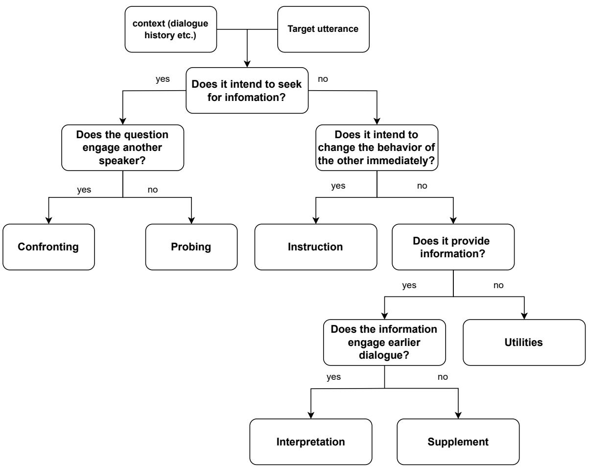  
Figure 3: The decision tree used by annotators to resolve ambiguous sentences that may involve multiple dialogue acts.

## B Prompt Engineering

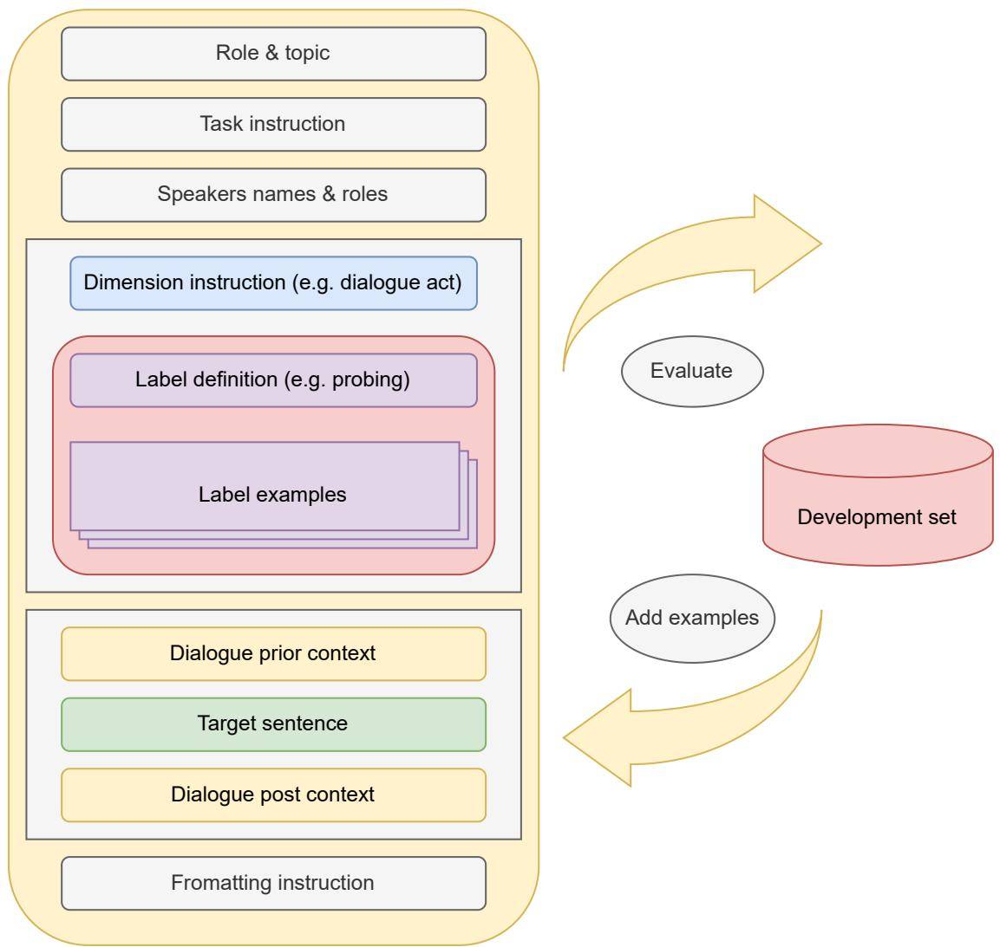  
Figure 4: Prompt structure and development cycle

Our prompt design, as illustrated in Figure 4, incorporates several key components: a concise description of the moderation scenario and the annotator’s role, an introduction to the task, an explanation of the dimensions and corresponding labels, five preceding responses for context, the target sentence, two subsequent responses for additional context, and instructions for the output format. The label instructions include both definitions from the annotation manual and single-sentence examples. We initially began with a few seed examples for each label and iteratively introduced new examples that had been misclassified during the development process to enhance performance. Table 11 provides a detailed example of a single-task prompt. Additionally, we developed a multi-task prompt that stacks all label definitions and examples across the three dimensions, with adjusted formatting instructions. Table 12 highlights the modifications and stacked elements of the prompt.

<table><tr><td>section</td><td>prompt part</td></tr><tr><td>Role &amp; topic</td><td>Your role is an annotator, annotating the moderation behavior and speech of a debate TV show. The debate topic is “When It Comes To Politics, The Internet Is Closing Our Minds"</td></tr><tr><td>Task instruction Dimension</td><td>given the definition and the examples, the context of prior and posterior dialogue, please label if the target utterance carries informational motive? Motives: During the dialogue, the moderator is acting upon a mixed-motives scenario, where different</td></tr><tr><td>instruction</td><td>motives are expressed through responses depending on the context of the dialogue. Motives are the high level motivation that the moderator aim to achieve. The definitions and examples of the informational motive are below:</td></tr><tr><td>Label definition</td><td>informational motive: Provide or acquire relevant information to constructively advance the topic or goal of the conversation.</td></tr><tr><td>Label examples</td><td>examples: “Why do you think minimum wage is unfair?" (Relevant information seeking.) “The legal system has many loopholes." (Expressing opinion.) “Yea! I agree with your point!" (Agreement relevant</td></tr><tr><td>Dialogue prior context</td><td>to the topic.) “The law was established in 1998." (Providing topic relevant information.) Dialogue context before the target sentence: Eli Pariser (for): Just a little story, when I was on the book tour for my book, I was on a radio</td></tr><tr><td></td><td>show in St. Louis. And the host decided to make this big spectacle of having people Google Barack Obama and call-in and read their search results. It was a really boring radio hour. And the first person called in, the second person called in and they interviewed everybody and had people kind of do a read-off where they're both reading it off at the same time and it was exactly the same. And I was thinking, this is the worse book promotion I've ever done. And then a third guy called in, and he said you know it's the damndest thing, when I Google Barack Obama, the first thing that comes up is this link to this site about how he's not a natural citizen. And the second link is also a link to a website about how he doesn't have a birth certificate.</td></tr><tr><td></td><td>Evgeny Morozov (against): That was your publicist. Eli Pariser (for): Oh, I was wondering about that. But so, I think the danger here is that it's not just that he was getting a view of the world that was really far off the average here. But he didn't even know that that was the view that he was getting. He had no idea how tilted that view was. And that's sort</td></tr><tr><td></td><td>of the challenge. I just want to address one other point, which is that there seems to be this question about whether this is happening. And it's really kind of funny to me, because if you talk to these companies and if you listen to what they're saying, all of these companies are very clear that personalization is a big part</td></tr><tr><td></td><td>of what they're doing and what they're— Evgeny Morozov (against): For pizza, weighted decisions. They are very clear. And they say</td></tr><tr><td></td><td>we don't want to do it for politics, we only want to do it for pizza. Eli Pariser (for): Right, and the question is, can you trust them?</td></tr><tr><td></td><td>John Donvan (mod): Let me- Jacob, I think Eli left a pretty good image hanging out there, of these folks truly not knowing how much they don't know and believing what they're getting and not</td></tr><tr><td>Target sentence</td><td>understanding how slanted it is. Target sentence:</td></tr><tr><td>Dialogue post context</td><td>John Donvan (mod): That landed pretty well I think, so can you respond to that? Dialogue context after the target sentence: Jacob Weisberg (against): But a guy who called into a radio show? I know the plural of anec-</td></tr><tr><td></td><td>dote is data. But I mean, if this were really happening in the way you say it is, wouldn't there be some kind of decent study that actually showed widely varying results? I mean as I say, I've tried to test this out as best I can. I've tried it myself on various browsers, signed in, signed out, Wikipedia always comes up first, sometimes it comes up second. Wikipedia's vaccine entry is pretty good. I do not think there is actually the kind of variety you're talking in searches done most of the time by most people.</td></tr><tr><td></td><td></td></tr><tr><td>Formatting instruction</td><td>John Donvan (mod): Siva. Please answer only for the target sentence with the JSON format: {"verdict": 0 or 1,"reason": String} For example: answer: {"verdict": 1, "reason": "The moderator asks a question to Joe Smith aimed at eliciting his viewpoint or reaction to a statement from the recent policy change for combatting climate change..."}</td></tr><tr><td>Task instruction Motives section</td><td>given the definition and the examples, the context of prior and posterior dialogue, please label which motives the target response carries? And which dialogue act the target sentence belong to? And who is the moderator talking to? Motives: During the dialogue, the moderator is acting upon a mixed-motives scenario, where different motives are expressed through responses depending on the context of the dialogue. Different from dialogue act, motives are the high level motivation that the moderator</td></tr><tr><td></td><td>aim to achieve. The definitions and examples of the 3 motives are below: informational motive: Provide or acquire relevant information to constructively advance the topic or goal of the conversation. examples: "Why do you think minimum wage is unfair?" (Relevant information seeking.) "The legal system has many loopholes."</td></tr><tr><td rowspan="5">Dialogue section</td><td>(Expressing opinion.) “Yea! I agree with your point!" (Agreement relevant to the topic.) “The law was established in 1998." (Providing topic relevant information.) social motive: Enhance the social atmosphere and connections among participants by addressing feelings, emotions, and in- terpersonal dynamics within the group. examples: "It is sad to hear the news of the tragedy." (Expressing emotion and feeling.) "Thank you! Mr. Wang." (Appreciating.) "Hello! Let's welcome Dr. Frankton." (Greeting.) "I can understand your struggle being a single mum."</td></tr><tr><td>(Empathy) "How do you feel? when your work was totally denied." (Exploring other's feeling.) "Please feel free to say your mind because I can't bite you online, hehe!" (Humour.) “The definition is short and simple! I love it!" (Encouragement.) "Maybe Amy's intention is different to what you thought, you guys actually believe the same thing." (Social Reframing.) coordinative motive: Ensure adherence to rules, plans, and broader contextual constraints, such as time and environment. ex-</td></tr><tr><td>amples: "Let's move on to the next question due to time running out." (Command) "We going to start with the blue team and then the red team" (Planning) "Do you want to go first?" (Asking for process preference.) “Please move to the left side and turn on your mic!" (Managing environment)</td></tr><tr><td>act Dialogue act: Dialogue acts is referring to the function of a piece of a speech. The definitions and examples of the 6 motives are below:</td></tr><tr><td>Probing: Prompt speaker for responses. examples: "What is your view on that Dr. Foster?" (Questioning.) "Where are you from?" (Social questioning.) “Peter!" (Name calling for response.) “If the majority of people are voting against it, would you still insist?" (Elaborated questioning.) "Do you agree with this statement?" (Binary question.)</td></tr></table>

Table 11: An example of a single task prompt to determine if the target sentence has informational motive.

Table 12: An example of a multi-task prompt. Here we only demonstrate the components that are different from the single-task prompt.

## B.1 Supervised model training and comparison

<table><tr><td>Model</td><td>DA IM CM SM TS</td></tr><tr><td>Random (DEBATE) GPT-4o-MT(DEBATE) GPT-40-ST(DEBATE) longformer-MT(DEBATE) longformer-ST(DEBATE)</td><td>0.153 0.492 0.508 0.405 0.057 0.485 0.761 0.711 0.767 0.497 0.515 0.729 0.686 0.668 0.525 0.4940.7640.719 0.7840.246 0.493 0.772 0.726 0.694 0.299 DialogLMLED-MT(DEBATE) 0.489 0.760 0.760 0.714 0.147</td></tr><tr><td>Random(PANEL) GPT-40-MT(PANEL) GPT-4o-ST(PANEL) longformer-MT(PANEL) longformer-ST(PANEL)</td><td>0.115 0.490 0.482 0.387 0.096 0.504 0.726 0.732 0.754 0.467 0.492 0.747 0.639 0.635 0.464 0.414 0.753 0.774 0.731 0.196 0.417 0.757 0.759 0.729 0.225 DialogLMLED-MT(PANEL) 0.389 0.764 0.751 0.768 0.132</td></tr></table>

Table 13: Macro-F1 comparing GPT-4o and Longformer using multi-task (MT) and single-task (ST) approaches across the two subsets. The bold numbers highlights the top performer of the dimension in the subset. The random baseline is derived from five random simulations.

To further explore training smaller language models for motive and dialogue act classification, we finetuned the Hugging Face pre-trained Longformer model (allenai/longformer-base-4096) (Beltagy et al., 2020). The input sequence included the discussion topic; a list of speaker options comprising all speaker names along with "unknown," "everyone," "audience," and "all speakers"; and, for the DEBATE subset, additional options "against team" and "support team." We also incorporated the five utterances preceding and the two utterances following the target sentence, with a maximum input length of 3,072 tokens. The model was trained for three epochs over three hours using a learning rate of 2e-5 with the AdamW optimizer (weight decay = 0.01) and a batch size of 8 on an A100 GPU via the Spartan cluster.

We compared both single-task and multi-task variants of the Longformer, employing individual and combined loss functions, respectively. For the multi-task approach, we adapted the model to include multiple classifier heads, each corresponding to a different classification task, and backpropagated using a combined loss function. Additionally, recognizing that the original Longformer models were not pretrained on dialogue data, we included DialogueLM LED (Zhong et al., 2022)— a variant of Longformer model with a 5,120-token input context length and was pre-trained on interview and radio conversation corpora—in our experiments.

The results measured against the human-labeled test set are presented in Table 13. While the fine-tuned Longformer models demonstrated performance comparable to GPT-4o across most dimensions, they showed a notable disparity in predicting the target speaker. This discrepancy may be attributed to the dynamic nature of classification labels—the number and identity of speakers change between episodes.

Generative or retrieval approaches are more effective for target speaker classification. Finally, we observed that pre-training the model with dialogue corpora did not noticeably impact performance.

## C Disagreement Cases Analysis

<table><tr><td>Dimensions</td><td>Examples</td></tr><tr><td rowspan="5">Dialogue act</td><td>1. You know, what do you think about that, Callie? (prob vs. conf)</td></tr><tr><td>2. Our time has run out. (supp vs. inst)</td></tr><tr><td>3. Well let me move on to our final topic, which is gentrification. (supp vs. inst)</td></tr><tr><td>4. Rick MacArthur cited Mexico, it has worked for Mexico.(supp vs. inte)</td></tr><tr><td>5. Yeah. (supp vs. util)</td></tr><tr><td rowspan="4">Motives</td><td>6. Can you take that on? (IM vs. CM)</td></tr><tr><td>7. Okay, go ahead. (IM vs. CM) 8. Let&#x27;s let Jacob Weisberg (IM vs. CM)</td></tr><tr><td>9. So Lenny took the initiative of sending a question into us by email. (IM vs. SM)</td></tr><tr><td>10. Do you agree that our nation needs affirmative action for intelligent conversation? (IM vs. SM)</td></tr><tr><td>Target Speaker</td><td>11. All right. (CM vs. SM) 12. And that concludes round one of this Intelligence Squared US debate (everyone vs.</td></tr><tr><td rowspan="2"></td><td>audience)</td></tr><tr><td>13. Let&#x27;s bring Evgeny in and– (everyone vs. Evgeny) 14. And we also– is Lenny Gengrinovich here? (everyone vs. Lenny)</td></tr></table>

Table 14: Examples of disagreement cases across the dimensions of dialogue acts, motives, and target speaker. Bracketed information includes the combinations of disagreed labels. All examples are from the DEBATE dataset.

In this appendix, we highlight the complexity and difficulty of the task by curating several examples in Table 14. We analyze and discuss cases of disagreement, particularly within the DEBATE subset, which received a relatively low agreement score.

To better understand the disagreements in dialogue act annotations, we calculated the co-occurrences of human annotators’ votes, as shown in Figure 5. While most dialogue act labels exhibit strong internal consistency, indicating general agreement among annotators, the figure reveals two primary sources of disagreement. The first source involves cases of ’confrontation,’ where disagreement often arises when the moderator does not explicitly mention the intended participant by name, leading to differing interpretations of whether the confrontation is implied or direct (Example 1). The second source of disagreement involves the label ’supplement,’ which frequently co-occurs with ’instruction,’ ’interpretation,’ and ’utility. Examples 2 and 3 illustrate instances where it is unclear whether the moderator is expecting a behavioral change from the recipient or merely providing a reminder or explanation. Additionally, there are numerous ambiguous cases between ’supplement’ and ’utility,’ such as brief responses like ’Yeah,’ where it is uncertain whether the expression is intended as acknowledgment or simple backchanneling.

For disagreements regarding motive labels, we found that the ’coordinative’ motive was particularly often confused with the other two categories. Examples 6 to 8 highlight cases where vague probing led some annotators to interpret the moderator’s actions as rotating turns according to program rules, while others perceived the probing as an attempt to prompt information from the speakers to contribute to the topic. Short utility phrases like ’All right,’ as seen in Example 10, also present ambiguity in motive—whether it’s meant for pacing or calming the speaker’s emotions is unclear. Additionally, disagreements were noted in the target speaker dimension. In Example 12, it is uncertain whether the moderator is addressing everyone or just the audience. Similarly, in Examples 13 and 14, the addressee shifts mid-sentence, leading to further confusion.

These analyses underscore the inherent complexity and subjectivity involved in labeling dialogue acts and motives. Despite efforts to create clear definitions and guidelines, the nuanced nature of communication often results in differing interpretations among annotators, especially when dealing with implicit intentions, vague statements, or multi-functional phrases.

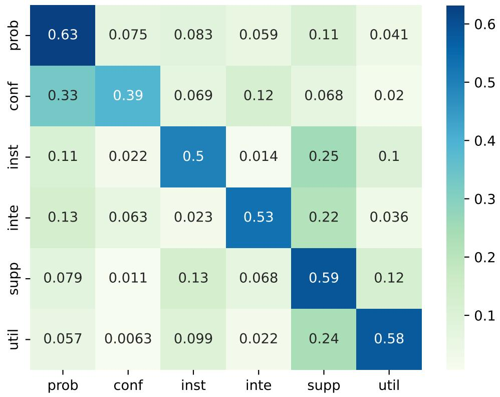  
Figure 5: The normalized co-occurrence matrix of dialogue act human votes from the DEBATE subset.

## D Human Machine Annotation Comparative Analysis

<table><tr><td colspan="8">DEBATE human</td></tr><tr><td></td><td>prob</td><td>conf</td><td>inst</td><td>inte</td><td>supp</td><td>util</td><td>p(m)</td></tr><tr><td>IM CM SM</td><td>0.48* 0.13 0.04</td><td>0.09 0.01 0.01</td><td>0.05 0.27 0.03</td><td>0.25* 0.02 0.01</td><td>0.11 0.52* 0.36*</td><td>0.02 0.04 0.54</td><td>0.37 0.53 0.12</td></tr><tr><td>Total</td><td>0.24*</td><td>0.04</td><td>0.15</td><td>0.09*</td><td>0.34*</td><td>0.14</td><td>150.77</td></tr><tr><td colspan="8">DEBATE GPT-40</td></tr><tr><td>IM CM</td><td>0.40 0.14</td><td>0.22* 0.10*</td><td>0.04 0.54*</td><td>0.11 0.02</td><td>0.22* 0.10</td><td>0.01 0.11*</td><td>0.39 0.66*</td></tr><tr><td>SM p(d)</td><td>0.06 0.22</td><td>0.01 0.11*</td><td>0.12* 0.36*</td><td>0.02 0.05</td><td>0.16 0.12</td><td>0.64 0.14</td><td>0.12 150.77</td></tr><tr><td colspan="8">PANEL human</td></tr><tr><td></td><td>prob</td><td>conf</td><td>inst</td><td>inte</td><td>supp</td><td>util 0.01</td><td>p(m)</td></tr><tr><td>IM CM SM</td><td>0.51* 0.03</td><td>0.02 0.00</td><td>0.02 0.09</td><td>0.02 0.00</td><td>0.42 0.85*</td><td>0.03 0.72</td><td>0.60 0.28</td></tr><tr><td>p(d)</td><td>0.00 0.31</td><td>0.00 0.01</td><td>0.01 0.03</td><td>0.02 0.02</td><td>0.20 0.55*</td><td>0.08</td><td>0.06 61.35</td></tr><tr><td colspan="8">PANEL GPT-40</td></tr><tr><td>IM CM</td><td>0.41 0.08*</td><td>0.04* 0.02</td><td>0.01 0.41*</td><td>0.03 0.01</td><td>0.50* 0.33</td><td>0.01 0.16*</td><td>0.72* 0.25</td></tr><tr><td>SM p(d)</td><td>0.05 0.30</td><td>0.00 0.03*</td><td>0.02 0.10*</td><td>0.01 0.02</td><td>0.27 0.41</td><td>0.64 0.13*</td><td>0.16* 61.35</td></tr></table>

Table 15: Conditional probabilities of dialogue acts (columns) given motives (rows), along with marginal probabilities of dialogue acts (right column) and motives (bottom row). All values are averaged across episodes from the test and development sets for the two scenarios—DEBATE (top) and PANEL (bottom)—and for the two annotation sources: human and GPT-4o. The most frequent dialogue act for each motive is highlighted in bold, with the second most frequent underlined. The italicized number in the corner indicates the average frequency of moderator sentences. An \* denotes values that are statistically significantly greater than their annotation source counterparts (human vs. GPT-4o; t-test at p <= 0.05).

To validate the analytical findings from the automatic system, we conducted a comparative study between human annotations and machine-generated annotations (using GPT-4o) on the test and development datasets. Table 15 presents the conditional and marginal probabilities across the two settings (DEBATE vs. PANEL) and the two annotation approaches (human vs. GPT-4o). Overall, the results indicate that machine annotations generally align well with human annotations. Although some differences are statistically significant, their magnitudes are typically small ( 0.1).

One notable exception is the distinction between coordinative-motivated "instruction" and "supplement." In our error analysis, we found that this discrepancy arises from differences in interpreting the "immediacy" of the expected influence on subsequent turns. An "instruction" act is intended for moderator interventions that expect an immediate change in the target speaker’s behavior (e.g., "Please stay on topic."). In contrast, when moderators provide information without expecting immediate action (e.g., "After the debate, we will proceed to voting."), human annotators tend to label it as a "coordinative-motivated supplement," as it provides context or rules without requiring an immediate response. Machine annotations, however, did not consistently capture this nuance and often mislabeled these explanations of rules as "instructions," overlooking the subtle difference in immediacy.

We acknowledge the need to refine these aspects of the annotation framework to improve accuracy. Nevertheless, the core patterns and characteristics identified by both human and machine annotations remain largely consistent, reinforcing the validity of our primary findings.

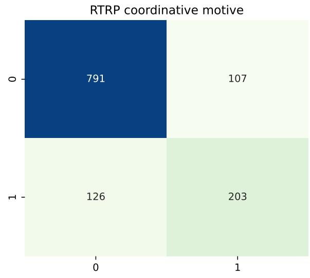

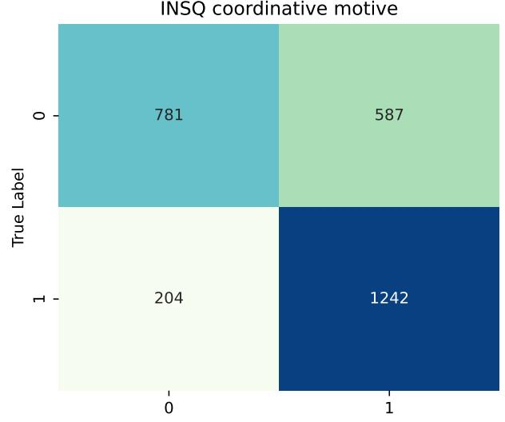

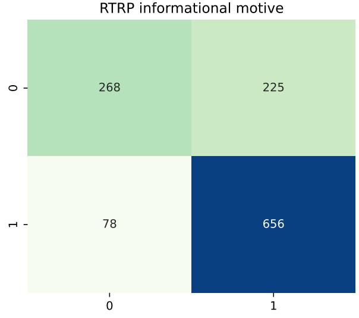

## E Classification Error Analysis

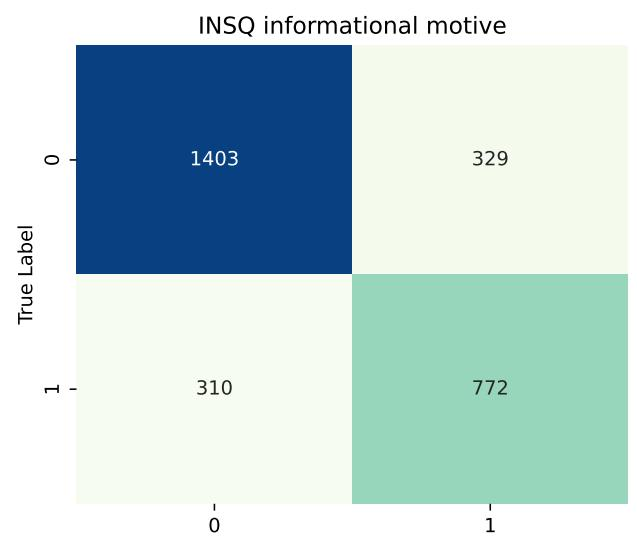

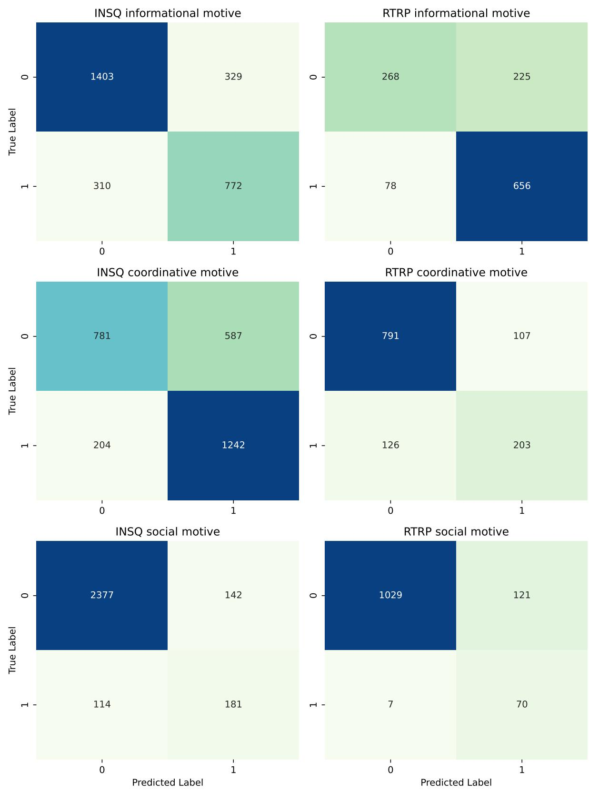  
Figure 6: The confusion matrices for the three motives across the two subsets.

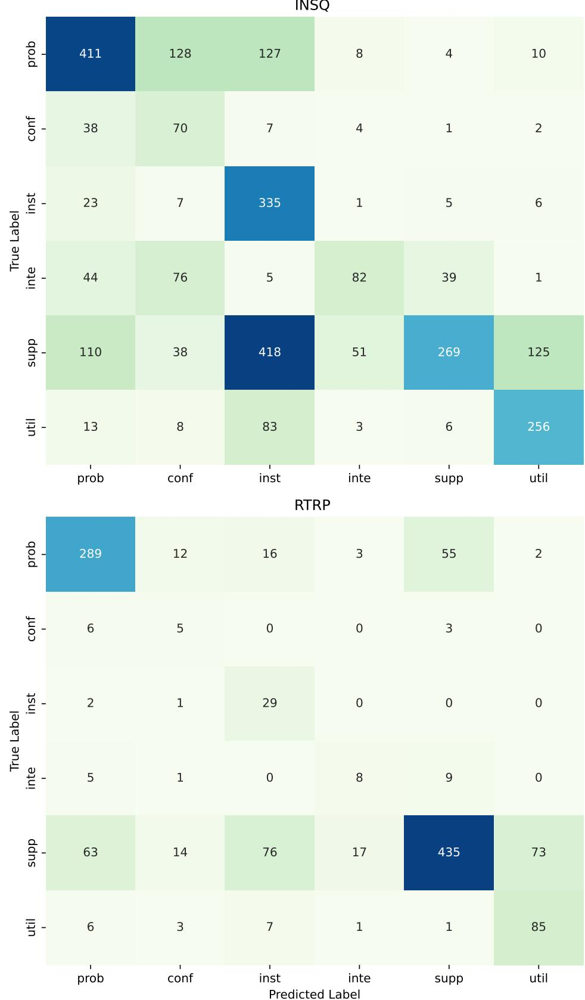  
Figure 7: The confusion matrices for the three motives across the two subsets.

<table><tr><td rowspan=1 colspan=1>Dimensions</td><td rowspan=1 colspan=1>Examples</td></tr><tr><td rowspan=1 colspan=1>Dialogue act</td><td rowspan=1 colspan=1>1. Eli Pariser. (prob vs. conf, DEBATE).2. Dr. David Satcher. (conf vs. prob, DEBATE).3. I want to bring Matt back into this conversation. (prob vs. conf, DEBATE)4. But wasn&#x27;t your partner using the &quot;that&#x27;s what happened to me when I typed in Egypt&quot;? (prob vs. inte,DEBATE)5. Let&#x27;s go to Frank Foer. (prob vs. inst, DEBATE)6. There was a lot of questions that came up during Jena Six, saying, oh, marching is so 1965.(prob vs.supp, PANEL)7. Your opponents are saying that Amazon cannot be trusted, that it&#x27;s becoming more and more powerful,and that&#x27;s probably likely to continue, although you&#x27;re saying there are mitigating forces.(inte vs. conf,DEBATE)8. Also, that in a peace process that is going nowhere, that is stuck, it lays down a marker that the Israeliscannot ignore.&#x27; (inte vs. supp, DEBATE)9. I have a– question in the second row. (supp vs. prob, DEBATE)10. You work for the Washington Post and I couldn&#x27;t even find the story online about that. (supp vs. prob,PANEL)11. We&#x27;re going to ask you to vote again at the end and the team that has moved its numbers the most willbe declared our winner. (supp vs. inst, DEBATE)12. Microphones will be brought forward if you raise your hand. (supp vs. inst, RTRO)13. Yep (supp vs. util, DEBATE)14. Alright (util vs. inst, DEBATE)</td></tr><tr><td rowspan=1 colspan=1>Motives</td><td rowspan=1 colspan=1>15. So how would you relate that directly to the motion? (IM false positive, DEBATE)16. Jacob Weisberg. (IM false negative, DEBATE)17. What do you - Jasmyne, I&#x27;ll start with you - unfold your, uncross your arms. (IM false negative,PANEL)18. The team arguing against the motion, Franklin Foer and Scott Turow, they&#x27;re saying, &quot;It&#x27;s all a trap.(CM false positive, DEBATE)19.Our motion is “America is to Blame for Mexico&#x27;s Drug War,&quot; at the start, 43 percent of you werefor. . . 22 percent against, and 35 percent undecided. (CM false negative, DEBATE)20. Today on our Bloggers&#x27;Roundtable, we&#x27;re taking a close look at urban education and the race for theWhite House. (CM false positive, PANEL)21. Well, you&#x27;re laughing because you think it&#x27;s impossible or what is... (SM false positive, PANEL)22. All right. (SM false negative, DEBATE)</td></tr><tr><td rowspan=1 colspan=1>Target Speaker</td><td rowspan=1 colspan=1>23. Round two is where the debaters address each other directly and also answer questions from you inthe audience and from me. (audience vs. everyone, DEBATE)24. Let me ask the side that&#x27;s arguing that when it comes to politics, the internet is closing our minds.(support team vs. all speakers, DEBATE)25. But Evgeny kind of addressed that point when he– I think you said, Evgeny, earlier in your openingstatements, that initially the theory was the internet gave us tools to do stuff that we were already doing.(audience vs. Evgeny, DEBATE)26. Let me approach this from a couple of different angles. (all speakers vs. audience, PANEL)</td></tr></table>

Table 16: Examples of error cases across the dimensions of dialogue acts, motives, and target speaker. Bracketed information indicates the predicted labels vs. the human-aggregated labels, along with the source of each example.

In this appendix, we examine the discrepancies between the GPT-4o-based classification results and the aggregated human annotation labels. Figure 6 presents the confusion matrix for the three motives, comparing GPT-4o with the aggregated human annotations, while Figure 7 displays the confusion matrix for the six dialogue act labels. Table 16 provides examples of common errors across the three dimensions to support further qualitative analysis.

An analysis of the dialogue act confusion matrix in Figure 7, particularly within the DEBATE subset, reveals four primary sources of error. First, several probing sentences are frequently misclassified as confrontational or instructional. In Table 16, Examples 1 and 2 illustrate instances where the sentences merely include the addressees’ names, and the intended purpose of the moderator—to engage the addressees with a previous speaker—depends heavily on the conversational context and remains inherently subjective. Ambiguous cases, such as Example 5, demonstrate scenarios where it is unclear whether the moderator is seeking information or simply inviting someone to participate. Additionally, long sentences may be reasonably associated with more than one dialogue act, as seen in Example 7, where both interpretation and confrontation are plausible classifications. A substantial number of errors also arise from confusion between ’supplement’ and ’instruction,’ which is the largest source of misclassifications. In Examples 11 and 12, it is often uncertain whether the moderator is merely explaining or reminding participants of a rule or the program’s progress, or if they expect a specific response. Lastly, numerous errors involve brief utility phrases like ’Yep’ and ’Alright,’ as in Examples 13 and 14. These phrases are highly context-dependent, making it challenging to determine whether the moderator is expressing acknowledgment, signaling the speaker to stop, or simply backchanneling.

Analyzing the confusion matrix for motive prediction in Figure 6, we identified two primary sources of error. In the DEBATE subset, the ’coordinative’ motive exhibited the lowest performance, with most errors being false positives. For example, in Table 16, Example 18 involves the moderator introducing a key argument for the opposing team. Although this instance was annotated as driven by an informational motive, GPT-4o incorrectly interpretate it as an coordinative move for setting up the introduction. A similar pattern is observed in Example 20 from the PANEL subset, where the moderator introduces the discussion’s background and topic. While GPT-4o classified this action as coordination-driven, human annotators labeled it as informational, despite one annotator also indicating a coordinative motive. Additionally, errors related to social motives proved particularly difficult to interpret, as seen in Examples 21 and 22.

In terms of target speaker classification errors, most misclassification occur when the target speaker is plural,e.g. "everyone". When multiple speakers are addressed, determining the scope or boundary of the intended recipients can be subjective and ambiguous. Examples 23, 24, and 26 illustrate the difficulty in discerning whether the moderator is addressing the entire group or only the audience. Another common source of error arises when the speaker shifts the intended recipient mid-sentence, as demonstrated in Example 25.

In our error case analysis, we identified several instances where GPT-4o classifications diverged from human annotations. However, these misalignments are not always unreasonable. Many examples are highly context-dependent, subjective, and open to interpretation, particularly in cases involving long sentences that could be associated with multiple labels or extremely short sentences, such as name-calling or backchanneling, where interpretation relies heavily on the conversational context. We also examined the reasons generated by GPT-4o to justify its classifications and found that, while they differ from the aggregated human annotations, the majority of these justifications are still defensible.

## F Annotator instruction and material

<table><tr><td rowspan=1 colspan=1>252 7</td><td rowspan=1 colspan=1>666 Br</td><td rowspan=1 colspan=1>yan Caplan</td><td rowspan=1 colspan=1>for</td><td rowspan=1 colspan=1></td><td rowspan=1 colspan=1>now one of the richest countries in the world. What happened? People in Puerto Rico, whootherwise would have been stuck in a third world country, not able to use their skills, manyof them left and found that there was a better place for them to work. And those remainingfound that their wages were higher. A lot of what happened was that Puerto Ricans wenthome and turned a third world country into a first world country. There&#x27;s no reason that  {&#1America cannot do for the world what it did for Puerto Rico.</td><td rowspan=1 colspan=1>x27;laughter&#x27;:[[0, 1]]}</td><td rowspan=1 colspan=1>0</td><td rowspan=1 colspan=1>0</td><td rowspan=1 colspan=1>0</td><td rowspan=1 colspan=1></td><td rowspan=1 colspan=1></td></tr><tr><td rowspan=1 colspan=1>253</td><td rowspan=1 colspan=1>7667Ron</td><td rowspan=1 colspan=1>Unz</td><td rowspan=1 colspan=1>against</td><td rowspan=1 colspan=1>1Th</td><td rowspan=1 colspan=1>e whole world? One difference--</td><td rowspan=1 colspan=1>o</td><td rowspan=1 colspan=1>o</td><td rowspan=1 colspan=1>0</td><td rowspan=1 colspan=1>o</td><td rowspan=1 colspan=1></td><td rowspan=1 colspan=1></td></tr><tr><td rowspan=1 colspan=1>255</td><td rowspan=1 colspan=1>7669Ron</td><td rowspan=1 colspan=1>Unz</td><td rowspan=1 colspan=1>against</td><td rowspan=1 colspan=1>1|O</td><td rowspan=1 colspan=1>ne difference is--</td><td rowspan=1 colspan=1>中</td><td rowspan=1 colspan=1>0</td><td rowspan=1 colspan=1>0</td><td rowspan=1 colspan=1>o</td><td rowspan=1 colspan=1></td><td rowspan=1 colspan=1></td></tr><tr><td rowspan=1 colspan=1>256</td><td rowspan=1 colspan=1>7670_0</td><td rowspan=1 colspan=1>John Donvan</td><td rowspan=1 colspan=1>mod</td><td rowspan=1 colspan=1>1Re</td><td rowspan=1 colspan=1>ally?</td><td rowspan=1 colspan=1>0</td><td rowspan=1 colspan=1>0</td><td rowspan=1 colspan=1>0</td><td rowspan=1 colspan=1>1|a</td><td rowspan=1 colspan=1>(All utilities)</td><td rowspan=1 colspan=1>4 (Bryan Caplan- for)</td></tr><tr><td rowspan=1 colspan=1>257</td><td rowspan=1 colspan=1>7671Ron</td><td rowspan=1 colspan=1>Unz</td><td rowspan=1 colspan=1>against</td><td rowspan=1 colspan=1>1On</td><td rowspan=1 colspan=1>e difference is that Puerto Rico-</td><td rowspan=1 colspan=1>0</td><td rowspan=1 colspan=1>o</td><td rowspan=1 colspan=1>0</td><td rowspan=1 colspan=1>0</td><td rowspan=1 colspan=1></td><td rowspan=1 colspan=1></td></tr><tr><td rowspan=1 colspan=1>259</td><td rowspan=1 colspan=1>7673_0</td><td rowspan=1 colspan=1>John Donvan</td><td rowspan=1 colspan=1>mod</td><td rowspan=1 colspan=1>1 Yo</td><td rowspan=1 colspan=1>u got it.</td><td rowspan=1 colspan=1>{&#x27;laughter&#x27;[[0, 10]]}</td><td rowspan=1 colspan=1>0</td><td rowspan=1 colspan=1>1</td><td rowspan=1 colspan=1>1a (</td><td rowspan=1 colspan=1>All utilities)</td><td rowspan=1 colspan=1>4 (Bryan Caplan- for)</td></tr><tr><td rowspan=1 colspan=1>260</td><td rowspan=1 colspan=1>7673_1</td><td rowspan=1 colspan=1>John Donvan</td><td rowspan=1 colspan=1>mod</td><td rowspan=1 colspan=1></td><td rowspan=1 colspan=1>1 We will-- we will meet you here-- Let&#x27;s go to some questions from the audience.</td><td rowspan=1 colspan=1>{&#x27;laughter&#x27;:[[0, 10]]}</td><td rowspan=1 colspan=1>o</td><td rowspan=1 colspan=1>0</td><td rowspan=1 colspan=1>1e (</td><td rowspan=1 colspan=1>Instruction)</td><td rowspan=1 colspan=1>2 (Everyone)</td></tr><tr><td rowspan=1 colspan=1>261</td><td rowspan=1 colspan=1>76732</td><td rowspan=1 colspan=1>John Donvan</td><td rowspan=1 colspan=1>mod</td><td rowspan=1 colspan=1>1 l</td><td rowspan=1 colspan=1>Right there in the center, sir, and if you can raise-- stand up when the mike comes from youreft-hand side and tell us your name.</td><td rowspan=1 colspan=1>{&#x27;laughter&#x27;:[[0, 10]]}</td><td rowspan=1 colspan=1>o</td><td rowspan=1 colspan=1>0</td><td rowspan=1 colspan=1>1e (</td><td rowspan=1 colspan=1>Instruction)   3</td><td rowspan=1 colspan=1>(Audience)</td></tr><tr><td rowspan=1 colspan=1></td><td rowspan=1 colspan=1></td><td rowspan=1 colspan=1></td><td rowspan=1 colspan=1>unkn</td><td rowspan=1 colspan=1></td><td rowspan=1 colspan=1>Thank you, this is terrific. My name is Gerry Ohrstrom , and my question is for the panelistsopposing the resolution. Mr. Unz, you asserted that opening labor markets would not only bedevastating to local labor but to the general economy itself. And yet economists often adviseus that economies are not so much about producers and workers but about consumers. Andto the extent that foreign workers are hired at all, it&#x27;s because it&#x27;s deemed that they willproduce goods and services with higher quality at cheaper prices than the local market thatthey-- the local labor market that they outcompete, which, in turn, is wonderful for the</td><td rowspan=1 colspan=1></td><td rowspan=1 colspan=1></td><td rowspan=1 colspan=1></td><td rowspan=1 colspan=1></td><td rowspan=1 colspan=1></td><td rowspan=1 colspan=1></td></tr></table>

Figure 8: The Excel sheet annotation interface used for annotating moderator transcript.

# Exploring the role and behaviour of debate and panel session moderator

## PROJECT OVERVIEW

Deliberation is a process of careful and thoughtful discussion, typically involving multiple individuals or stakeholders, to weigh various ideas, viewpoints, arguments, and evidence before making a decision or reaching a conclusion. In real life, deliberative conversation take place in forms of debate, online discussion, parliament meeting etc. While several studies have looked at how to win a debate or argument, extremely few have investigated the role and the functioning of the moderator in facilitating a better conversation between individuals with different point of views. The goal of this research project is improving human deliberative conversation by exploring, analysing, and modelling the behaviours and bias of moderator from existing debate transcripts. We specifically investigate 1) HOW does the moderator did: unveiling patterns in the moderator's interventions and speech, 2) WHY the moderator did these: identifying the motives underpinning these interventions within the context of speaker dialogues, and 3) WHO are the moderator talking to: investigate the choice of turn assignment and target speaker from the moderator.

## What are the possible benefits?

The project's primary benefit lies in advancing our understanding of moderator behaviours and bias, which serves as a foundation for the development of automatic discussion moderating agents and the detection of moderating bias, which can be used to improve the productivity, efficiency and harmony of human dialogue.

## What are the possible risks?

There are no immediate risks that we can foresee, however, due to the nature of debate there might be some controversial, sensitive, and emotional topics and content be exposed to you. but you are free to withdraw from the experiment at any time should you wish to do so. Before the annotation of each debate, we will show you a debriefing including the title, speakers, and the short relevant background information. You may choose to replace the current topic if you feel uncomfortable.

## What will happen to information about me?

Regarding data privacy for Mechanical Turk contributors, only internal worker IDs will be accessible to our research team, thereby ensuring that no personally identifiable information is collected. For local participants, essential contact details and payment information will be required; this data will be securely stored on the University of XXX's OneDrive, protected by password encryption until the project's conclusion. Taskrelated annotated data will also be initially stored on the University of XXX OneDrive.

Prior to any public release, the data will undergo a sanitization process to remove any potential personally identifiable information, ensuring participant privacy is maintained when the data is published in the public repository on GitHub.If you would like more information about the project, please contact the researchers given above.

## DATA

Currently, we are expanding the existing "Intelligence Squared Debates Corpus", a dataset consisting of full transcripts of debates from the famous American debate TV show with clear labels of speakers' roles and stances (for vs. against). Specifically, we are focusing on the crossexamination phase of the debates, where frequent interactions occur between the moderator and speakers from both sides. In addition, we are also including the transcript from “Roundtable” a panel discussion radio show.

## ANNOTATION FACETS AND LABELS INTRODUCTION

For each annotation task, you will be provided some background information, including the topic of the debate, speaker’s name and stances, and a segment of complete debate transcript including the interventions from the moderator.

Since we are only interested in moderator’s behaviour, you will only need to label the moderator’s responses. There are three facets that we would like you to label, which are motives, dialogue acts, and target speaker. At the end of the annotation of each episode, there is also a short survey for your overall impressions of the moderator and the dialogue before and after the annotation.

## WHY Motives

In our proposed framework, we assume that the moderator is acting upon a mixed-motives scenario, where different motives are expressed through responses depending on the context of the dialogue. In the framework we proposed, we assume during the debate the moderator wants to achieve informational goals (e.g. argument and knowledge), social goals (e.g. relation building, and stabilising emotion), and coordinating goals (e.g. following rules.):

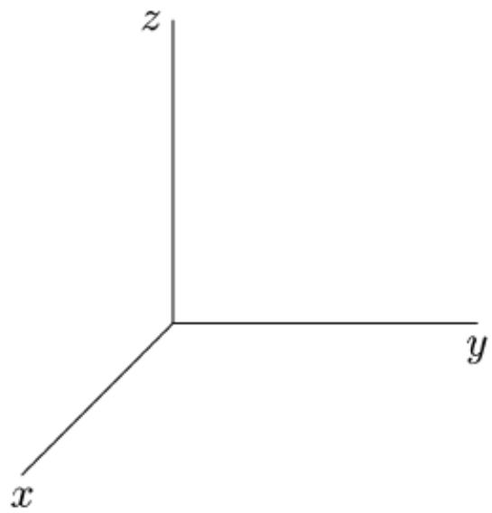

1.) Informational Motive (z): Provide or acquire relevant information to constructively advance the topic or goal of the conversation..

2.) Social Motive (x): Enhance the social atmosphere and connections among participants by addressing feelings, emotions, and interpersonal dynamics within the group.

3.) Coordinative Motive (y): Ensure adherence to rules, plans, and broader contextual constraints, such as time and environment.

Based on these assumptions, we identified and proposed three motives dimensions. The definition of each motive dimensions with examples are shown below:

## Informational motive (I):

Definition: Provide or acquire relevant information to constructively advance the topic or goal of the conversation..

Examples:

“Why do you think minimum wage is unfair?” (Relevant information seeking.)

“The legal system has many loopholes.” (Expressing opinion.)

“Yea! I agree with your point!” (Agreement relevant to the topic.)

“The law was established in 1998.” (Providing information.)

Social motive (S):

Definition: Enhance the social atmosphere and connections among participants by addressing feelings, emotions, and interpersonal dynamics within the group.

Examples:

“It is sad to hear the news of the tragedy.” (Expressing emotion and feeling.)

“Thank you! Mr. Wang.” (Appreciating.)

“Hello! Let’s welcome Dr. Frankton.” (Greeting.)

“I can understand your struggle being a single mum.” (Empathy)

“How do you feel? when your work was totally denied.” (Exploring other’s feeling.)

“Please feel free to say your mind because I can’t bite you online, hehe!” (Humour.)

“The definition is short and simple! I love it!” (Encouragement.)

“Maybe Amy’s intention is different to what you thought, you guys actually believe the same thing.” (Social Reframing.)

## Coordinative motive (C):

Definition: Ensure adherence to rules, plans, and broader contextual constraints, such as time and environment.

Examples:

“Let’s move on to the next question due to time running out.” (Command)

“We going to start with the blue team and then the red team” (Planning)

“Do you want to go first?” (Asking for process preference.)

“Please move to the left side and turn on your mic!” (Managing environment)

## Mixed motive (I/S/C):

There are also possibilities that one single sentence carries more than one motives.

Example:

“I am very sorry about the incident, but few exceptions cannot defy the statistic majority” (I & S).

“My daughter dies because of a broken traffic light.” (I & S).

“Sorry, John, I spoke over you, go ahead?” (S & C)

“Okay—thank you, we—those are good, those are all questions and they’re quite good and brief.” (I, S & C).

## WHAT: Dialogue acts

Dialogue acts is referring to the intention of a piece of dialog. Labelling dialogue act allow us to identify the behaviour pattern and even strategy of the moderator. Based on our observation of the moderator acts, we identified and proposed 3 broad categories and 5 specific acts for as shown below:

## Information seeking behaviour:

The goal of the moderator is to facilitate contribution of views, feeling, opinion and knowledge from the participants, therefore information seeking behaviours play a major role in moderation. In addition, we are interested in how moderator foster interaction between the participants, therefore, we separate the information seeking behaviour into two broad categories (probing, confronting) diverged by if another speaker is linked, engaged or mentioned in the prompt.

Probing:

Definition: Prompt speaker for responses. (this excludes rhetorical question).

Examples:

“What is your view on that Dr. Foster?” (Questioning.)

“Where are you from?” (Social questioning.)

“Peter!” (Name calling for response.)

“If the majority of people are voting against it, would you still insist?” (Elaborated questioning.)

“Do you agree with this statement?” (Binary question.)

Confronting:

Definition: Response that prompts one speaker to response or engage with another speaker.

Examples:

“So David pointed out the critical weakness of the system, what is your thought on his critiques, Dr. Foster?”

Information provision behaviour:

Occasionally moderators themselves contribute information for various purposes, including instruction, clarifying information, filling knowledge gap, expressing opinion etc. For the provided information, we are also interested in the source of the information, and therefore, we have devised three information provision categories (Instruction, Interpretation, Supplement).

Supplement:

Definition: Enrich the conversation by supplementing details or information without immediately changing the target speaker's behavior.

Examples:

“Supposed we live in a world where such behaviour is accepted.” (Hypothesis)

“I suggest the best solution is giving everyone equal chances.” (Proposal)

“The government announced tax raise from March.” (Providing external information)

“I agree with that you said.” (Agreement)

“GM means genetic modified.” (Providing external knowledge)

“I think people should be given the right to say no!” (Opinion)

Interpretation:

Definition: Clarify, reframe, summarize, paraphrase, or make connection to earlier conversation content.

Examples:

“So basically, what Amy said is that they didn’t use the budget efficiently”. (Summarisation)

“You said ‘I believe GM is harmless,’.” (Quote)

“In another word, you don’t like their plan.”. (Paraphrase)

“My understanding is you don’t support this due to moral reason.” (Interpretation)

“She does not mean to hurt you but just tell the truth.” (Clarify)

“So far, we have Dr. Johnson suggesting…., and Dr. Brown against it because……”(Summarisation)

“Amy saying that to justify the reduction of the wage, but not aiming to induce suffering.” (Reframing)

Instruction:

Definition: Explicitly command, influence, halt, or shape the immediate behavior of the recipients.

Examples:

“Please get back to the topic.” (Commanding)

“Please stop here, we are running out of time.” (Reminding of the rule)

“The red will start now.” (Instruction)

“Please mind your choice of words and manner.” (social policing)

“Do not intentionally create misconception.” (argumentative policing)

“Now is not your term, stop here.” (coordinative policing)

Utility:

There are also various other kinds of dialogue acts that are neither contributing information nor seeking information. Since these kinds of dialogue acts are not the focus of our study, we group all the uncovered dialogue acts into a broad category called “Utility”. Occasionally, this group of behaviours play an important role to show engagement (e.g. back channelling) and getting attention (e.g. floor grabbing).

All Utility:

Definition: All other unspecified acts.

Examples:

“Thanks, you.” (Greeting)

“Sorry.” (Apology)

“Okay.” (Back channelling)

“Um hm.” (Back channelling)

“But, but, but……” (Floor grabbing)

## WHO: Target speaker

We are also interested in who the moderator was talking to at the time given the dialogue context. Besides talking to a particular speaker, the moderator can also talk to him/herself, the audience, or everyone.

Examples:

“We are going to start in 10 minutes. The red team will go first.” (talking to everyone).

“Paul, what is your thought?” (talking to Paul Helmke)

“Cough! Cough!” (Self)

“The guy sitting at the front row. Yes! You!” (talking to Audience)

“This is ‘Intelligence Square’. Welcome back!” (talking to Audience)

Annotation instruction and steps

For every debate annotation task, you will firstly be provided the topic, speakers information, and the debate transcript. The annotation process starts with reading the debate topic, then complete the pre-annotation survey. After completing the annotation, there are also a few post-annotation questions about the impression of the moderator. Before starting an episode, please make sure you have time to complete the whole episode in the same time block.

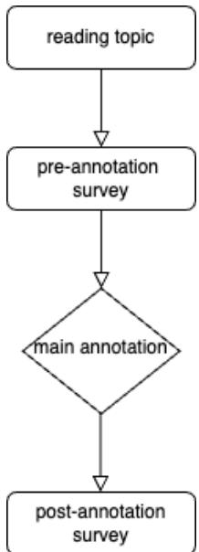

<table><tr><td rowspan=1 colspan=1>Topic</td><td rowspan=1 colspan=1>Abolish the minimum wage</td></tr><tr><td rowspan=1 colspan=1>“For&quot; speakers</td><td rowspan=1 colspan=1>Russell Roberts, James A. Dorn</td></tr><tr><td rowspan=1 colspan=1>“Against&quot; speakers</td><td rowspan=1 colspan=1>Karen Kornbluh, Jared Bernstein</td></tr><tr><td rowspan=1 colspan=1>Moderator</td><td rowspan=1 colspan=1>John Donvan</td></tr></table>

Label codes for the three facets:

<table><tr><td colspan="1" rowspan="1">dialogue acts</td><td colspan="1" rowspan="1">motivations</td><td colspan="1" rowspan="1">target speakers</td></tr><tr><td colspan="1" rowspan="1">q (Probing)</td><td colspan="1" rowspan="1">I (Informational motive)</td><td colspan="1" rowspan="1">1 (Everyone)</td></tr><tr><td colspan="1" rowspan="1">w (Confronting)</td><td colspan="1" rowspan="1">S (Social motive)</td><td colspan="1" rowspan="1">2 (Self)</td></tr><tr><td colspan="1" rowspan="1">e (Instruction)</td><td colspan="1" rowspan="1">C (Coordinative motive)</td><td colspan="1" rowspan="1">3 (Russell Roberts, For)</td></tr><tr><td colspan="1" rowspan="1">d (Interpretation)</td><td colspan="1" rowspan="1"></td><td colspan="1" rowspan="1">4 (James A. Dorn, For)</td></tr><tr><td colspan="1" rowspan="1">s (Supplement)</td><td colspan="1" rowspan="1"></td><td colspan="1" rowspan="1">5 (Karen Kornbluh,Against)</td></tr><tr><td colspan="1" rowspan="1">a (All utilities)</td><td colspan="1" rowspan="1"></td><td colspan="1" rowspan="1">6 (Jared Bernstein,Against)</td></tr><tr><td colspan="1" rowspan="1"></td><td colspan="1" rowspan="1"></td><td colspan="1" rowspan="1">7 (Audience)</td></tr></table>

Debate transcript (blue = For, red = Against, green = Moderator):

<table><tr><td colspan="1" rowspan="1">21793_0</td><td colspan="1" rowspan="1">RussellRoberts</td><td colspan="1" rowspan="1">I think part of the problem we have with education right now is that we'vesubsidized it, which is a lovely idea.</td></tr><tr><td colspan="1" rowspan="1">21793_1</td><td colspan="1" rowspan="1">RussellRoberts</td><td colspan="1" rowspan="1">And as a result, it's pushed up tuition, and it's allowed colleges to raise theirprices, their tuition a great deal.</td></tr><tr><td colspan="1" rowspan="1">21793_2</td><td colspan="1" rowspan="1">RussellRoberts</td><td colspan="1" rowspan="1">And as a result, many students have borrowed have a lot of money.</td></tr><tr><td colspan="1" rowspan="1">21793_3</td><td colspan="1" rowspan="1">RussellRoberts</td><td colspan="1" rowspan="1">And as a result, they're in big trouble.</td></tr><tr><td colspan="1" rowspan="1">21793_4</td><td colspan="1" rowspan="1">RussellRoberts</td><td colspan="1" rowspan="1">And especially in a downtime of economic growth when economic growthis so mediocre.</td></tr><tr><td colspan="1" rowspan="1">21794_0</td><td colspan="1" rowspan="1">JohnDonvan</td><td colspan="1" rowspan="1">Okay.</td></tr><tr><td colspan="1" rowspan="1">21794_1</td><td colspan="1" rowspan="1">JohnDonvan</td><td colspan="1" rowspan="1">I just-- it's getting a little bit off the minimum wage issue.</td></tr><tr><td colspan="1" rowspan="1">21794_2</td><td colspan="1" rowspan="1">JohnDonvan</td><td colspan="1" rowspan="1">Fair enough?</td></tr><tr><td colspan="1" rowspan="1">21794_3</td><td colspan="1" rowspan="1">JohnDonvan</td><td colspan="1" rowspan="1">But that's why I stopped you.</td></tr><tr><td colspan="1" rowspan="1">21794_4</td><td colspan="1" rowspan="1">JohnDonvan</td><td colspan="1" rowspan="1">Karen Kornbluh to respond.</td></tr><tr><td colspan="1" rowspan="1">21795_0</td><td colspan="1" rowspan="1">KarenKornbluh</td><td colspan="1" rowspan="1">Yeah, I do think this is really tied to the minimum wage issue because wehave to remember that we live in a knowledge economy.</td></tr><tr><td colspan="1" rowspan="1">21795_1</td><td colspan="1" rowspan="1">KarenKornbluh</td><td colspan="1" rowspan="1">And a country's human capital is what it competes on.</td></tr><tr><td colspan="1" rowspan="1">21795_2</td><td colspan="1" rowspan="1">KarenKornbluh</td><td colspan="1" rowspan="1">And so what we need to do to be competitive, to have productivity, to havethe American dream again, to have people earning high wages and beingable to support their families is investing in people's education.</td></tr><tr><td colspan="1" rowspan="1">21795_3</td><td colspan="1" rowspan="1">KarenKornbluh</td><td colspan="1" rowspan="1">And so we have a big problem in this country in terms of K-12, and wehave a big problem in terms of--</td></tr><tr><td colspan="1" rowspan="1">21796_0</td><td colspan="1" rowspan="1">JohnDonvan</td><td colspan="1" rowspan="1">Okay, for the same reason, Karen--</td></tr><tr><td colspan="1" rowspan="1">21797_0</td><td colspan="1" rowspan="1">KarenKornbluh</td><td colspan="1" rowspan="1">That's what we should adjust and not the minimum wage.</td></tr><tr><td colspan="1" rowspan="1">21798_0</td><td colspan="1" rowspan="1">JohnDonvan</td><td colspan="1" rowspan="1">All right.</td></tr><tr><td colspan="1" rowspan="1">21798_1</td><td colspan="1" rowspan="1">JohnDonvan</td><td colspan="1" rowspan="1">I'm going to step in.</td></tr><tr><td colspan="1" rowspan="1">21798_2</td><td colspan="1" rowspan="1">JohnDonvan</td><td colspan="1" rowspan="1">But your opponents made the very same argument at the beginning.</td></tr><tr><td colspan="1" rowspan="1">21798_3</td><td colspan="1" rowspan="1">JohnDonvan</td><td colspan="1" rowspan="1">And I was surprised when you said that you had the moral argument ontheir side because they were not saying "damn the poor" in any way.</td></tr><tr><td colspan="1" rowspan="1">21798_4</td><td colspan="1" rowspan="1">JohnDonvan</td><td colspan="1" rowspan="1">They were saying that they feel that the tool, the minimum wage, doesn'tfunction correctly.</td></tr><tr><td>21798_5</td><td>John Donvan</td><td>And I've been wanting to get to that moral argument, but I was hoping somebody in the audience would actually bring it up.</td></tr></table>

The red highlighted rows are from the “Against team”; while the blue highlighted rows are from the “For team”, and the green rows are from the “Moderator”. Only the green rows require labels.

\*\*\*Attention: the annotation below is only one of the samples from pilot study to show how the annotation works. The annotation itself is not the golden truth.\*\*\*

A whole block of consecutive rows from the same speaker is called a “response”. As displayed in the dialogue history, each response has been segmented into sentences, since some response might contain more than one semantic utterance. For example, in the response 21794, the moderator firstly backchanneled the speaker 3 (Russell Roberts, For), then reminded about getting back to the topic, and then finally called another speaker 5 (Karen Kornbluh, Against) to speak.

The annotation interface will have three columns for the three facets to label like shown below:

<table><tr><td rowspan=1 colspan=1>Id</td><td rowspan=1 colspan=1>Speaker</td><td rowspan=1 colspan=1>text</td><td rowspan=1 colspan=1>Dialogue act</td><td rowspan=1 colspan=1>Motivew</td><td rowspan=1 colspan=1>Targetspeaker</td></tr><tr><td rowspan=1 colspan=1>21794_0</td><td rowspan=1 colspan=1>JohnDonvan</td><td rowspan=1 colspan=1>Okay.</td><td rowspan=1 colspan=1>a</td><td rowspan=1 colspan=1>I</td><td rowspan=1 colspan=1>3</td></tr><tr><td rowspan=1 colspan=1>21794_1</td><td rowspan=1 colspan=1>JohnDonvan</td><td rowspan=1 colspan=1>I just-- it&#x27;s getting a little bit off theminimum wage issue.</td><td rowspan=1 colspan=1>e</td><td rowspan=1 colspan=1>I</td><td rowspan=1 colspan=1>3</td></tr><tr><td rowspan=1 colspan=1>21794_2</td><td rowspan=1 colspan=1>JohnDonvan</td><td rowspan=1 colspan=1>Fair enough?</td><td rowspan=1 colspan=1>q</td><td rowspan=1 colspan=1>C, S</td><td rowspan=1 colspan=1>3</td></tr><tr><td rowspan=1 colspan=1>21794_3</td><td rowspan=1 colspan=1>JohnDonvan</td><td rowspan=1 colspan=1>But that&#x27;s why I stopped you.</td><td rowspan=1 colspan=1>s</td><td rowspan=1 colspan=1>C</td><td rowspan=1 colspan=1>3</td></tr><tr><td rowspan=1 colspan=1>21794_4</td><td rowspan=1 colspan=1>JohnDonvan</td><td rowspan=1 colspan=1>Karen Kornbluh to respond.</td><td rowspan=1 colspan=1>9</td><td rowspan=1 colspan=1>I</td><td rowspan=1 colspan=1>5</td></tr></table>

However, you do not need to label each sentence. Like the example below, if the dialogue act or the perceived intention of the speaker spans through multiple sentences, you will only need to label the top row.

<table><tr><td rowspan=1 colspan=1>21798_1</td><td rowspan=1 colspan=1>JohnDonvan</td><td rowspan=1 colspan=1>I&#x27;m going to step in.</td><td rowspan=1 colspan=1>e</td><td rowspan=1 colspan=1>C</td><td rowspan=1 colspan=1>5</td></tr><tr><td rowspan=1 colspan=1>21798_2</td><td rowspan=1 colspan=1>JohnDonvan</td><td rowspan=1 colspan=1>But your opponents made the very sameargument at the beginning.</td><td rowspan=1 colspan=1>i</td><td rowspan=1 colspan=1>I</td><td rowspan=1 colspan=1>5</td></tr><tr><td rowspan=1 colspan=1>21798_3</td><td rowspan=1 colspan=1>JohnDonvan</td><td rowspan=1 colspan=1>And I was surprised when you said thatyou had the moral argument on their sidebecause they were not saying &quot;damn thepoor&quot; in any way.</td><td rowspan=1 colspan=1></td><td rowspan=1 colspan=1></td><td rowspan=1 colspan=1></td></tr><tr><td rowspan=1 colspan=1>21798_4</td><td rowspan=1 colspan=1>JohnDonvan</td><td rowspan=1 colspan=1>They were saying that they feel that thetool, the minimum wage, doesn&#x27;t functioncorrectly.</td><td rowspan=1 colspan=1></td><td rowspan=1 colspan=1></td><td rowspan=1 colspan=1></td></tr></table>