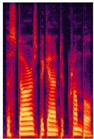
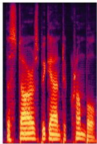
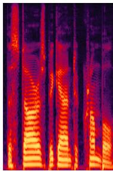
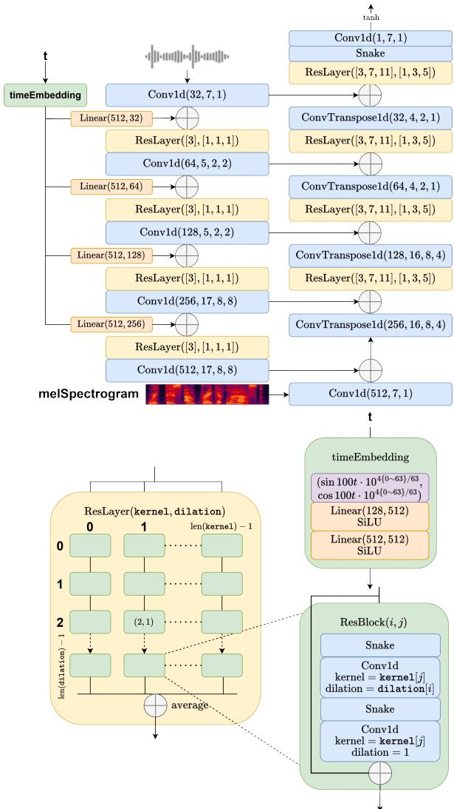
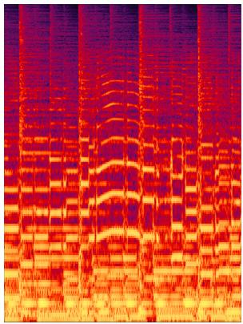
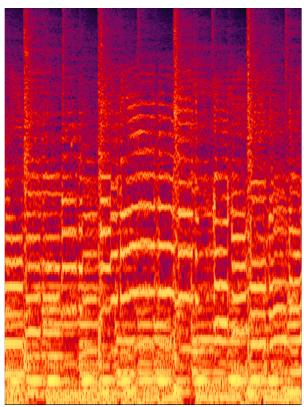
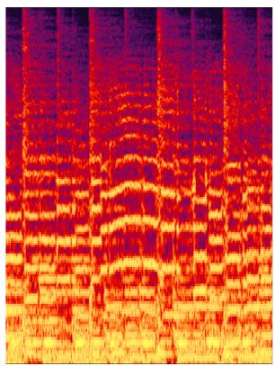
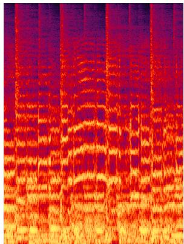

# WaveFM: A High-Fidelity and Efficient Vocoder Based on Flow Matching

Tianze Luo, Xingchen Miao, Wenbo Duan

Tsinghua Universtiy {ltz22,miuxc22,dwb22}@mails.tsinghua.edu.cn

## Abstract

Flow matching offers a robust and stable approach to training diffusion models. However, directly applying flow matching to neural vocoders can result in subpar audio quality. In this work, we present WaveFM, a reparameterized flow matching model for mel-spectrogram conditioned speech synthesis, designed to enhance both sample quality and generation speed for diffusion vocoders. Since mel-spectrograms represent the energy distribution of waveforms, WaveFM adopts a mel-conditioned prior distribution instead of a standard Gaussian prior to minimize unnecessary transportation costs during synthesis. Moreover, while most diffusion vocoders rely on a single loss function, we argue that incorporating auxiliary losses, including a refined multi-resolution STFT loss, can further improve audio quality. To speed up inference without degrading sample quality significantly, we introduce a tailored consistency distillation method for WaveFM. Experiment results demonstrate that our model achieves superior performance in both quality and efficiency compared to previous diffusion vocoders, while enabling waveform generation in a single inference step. <sup>1</sup>

## 1 Introduction

Recent advancements in network architectures and training algorithms have greatly enhanced the ability of deep generative models to produce highfidelity audio in speech synthesis (Lee et al., 2021, 2022; Siuzdak, 2023; Huang et al., 2023; Wang et al., 2023; Nguyen et al., 2024; Ju et al., 2024; Kumar et al., 2024). The initial breakthrough came with the autoregressive generation of waveforms from mel-spectrograms (Oord et al., 2016; Kalchbrenner et al., 2018), which provided high audio fidelity but suffered from slow inference speeds.

To enable real-time high-fidelity speech synthesis, a variety of non-autoregressive models have been introduced, classified broadly into three categories: flow-based models, generative adversarial networks (GANs), and diffusion models.

Flow-based models utilize invertible neural networks to generate waveforms from a selected prior distribution, such as a Gaussian distribution, estimating log-likelihoods during training (Ping et al., 2020; Prenger et al., 2019). While these intricately designed models maintain invertibility and evaluate determinants, this complexity limits their flexibility, and consequently the quality of the audio output.

Generative Adversarial Networks (GANs) provide greater flexibility than flow-based models and can generate waveforms with high fidelity more efficiently (Kumar et al., 2019; Kong et al., 2020a; Kim et al., 2021; Jang et al., 2021; Lee et al., 2022; Siuzdak, 2023). Their success stems from the generators’ large receptive fields and the discriminators’ ability to detect noise across various scales and periods. For instance, Kumar et al. (2019) introduced multi-scale discriminators, while Kong et al. (2020a) developed a multi-receptive field (MRF) generator alongside multiple multi-period discriminators, leading to substantial improvements. Moreover, Lee et al. (2022) further enhanced sample quality by utilizing the snake activation function and integrating the anti-aliased multi-periodicity (AMP) composition module.

Denoising diffusion probabilistic models (DDPMs) have recently gained significant popularity for their ability to transform a simple prior distribution into a complex ground truth distribution through a Markov chain process (Kong et al., 2020b; Lam et al., 2022; Huang et al., 2023; Nguyen et al., 2024). These models rely on a parameter-free noise-adding diffusion process to generate training data for the denoising generator, eliminating the need for auxiliary networks like discriminators or autodecoders during training.

However, the inference phase of diffusion models tends to be time-consuming. To mitigate this issue, Kong et al. (2020b), Lam et al. (2022), and Huang et al. (2023) introduced several fast-sampling algorithms that speed up waveform generation, though with a minor compromise in sample quality. Consistency models (Song et al., 2023; Song and Dhariwal, 2023) have been proposed to enhance the efficiency of diffusion models by directly predicting the endpoint of the probability flow ordinary differential equation (PF-ODE) at each step, enabling single-step inference. These models surpass previous distillation approaches in image synthesis tasks and achieve higher distillation efficiency by aligning along ODE trajectories, thereby avoiding the need to numerically solve the entire ODE.

In this study, we propose WaveFM for the melspectrogram conditioned speech synthesis task. Firstly, since the mel-spectrogram records the energy information in waveforms, an appropriately conditioned distribution can significantly improve sample quality. Additionally, we adopt a reparameterized flow matching method that directly predicts the waveform, allowing us to apply several auxiliary losses to the original flow-matching loss to further enhance the model’s performance.

To better supervise the model’s output waveforms regarding phase angles, we also incorporate a multi-resolution phase loss into our model. Furthermore, gradient and Laplacian operators are utilized on the real and generated spectrograms. Minimizing the mean square losses associated with these operations enables the model to better learn edge details and structural patterns in the spectrograms.

Finally, we propose a tailored consistency distillation method for WaveFM to further accelerate the model’s inference speed while maintaining audio quality. The subjective and objective experiment results indicate that WaveFM outperforms previous diffusion models in terms of sample quality and efficiency, and generalizes better on out-of-distribution musical mel-spectrograms.

## 2 Related Works

## 2.1 Flow Matching and Rectified Flow Models

Flow matching (Lipman et al., 2022) and rectified flow (Liu et al., 2022) models share a similar training objective, and diffusion models can also be interpreted within this framework. Here, we briefly introduce their mathematical principles using simpler, self-contained notation.

Theorem 1 Let $\mathbf { \mathcal { x } } _ { t }$ be a continuously differentiable random process on $t \in [ 0 , 1 ]$ and $p ( { \pmb x } , t )$ be its probability density function. We denote the prior distribution as $\scriptstyle { \mathbf {  { x } } } _ { 0 }$ and the ground truth distribution as $\mathbf { \delta x } _ { 1 }$ . If the conditional expectation $\mathbb { E } \left[ \frac { \mathrm { d } \pmb { x } _ { t } } { \mathrm { d } t } \Big | \pmb { x } _ { t } = \pmb { x } \right]$ is locally Lipschitz, we let

$$
{ \pmb v } ( { \pmb x } , t ) = \mathbb { E } \left[ \frac { \mathrm { d } { \pmb x } _ { t } } { \mathrm { d } t } \bigg | { \pmb x } _ { t } = { \pmb x } \right] .\tag{1}
$$

Then samples from the data distribution $\mathbf { x } _ { 1 }$ can be obtained by sampling from the prior distribution $\scriptstyle { \mathbf { { \mathit { x } } } } _ { 0 }$ and solving the following ODE with an initial value $\scriptstyle { \mathbf { \mathscr { x } } } _ { 0 }$ at time $t = 0$

$$
\frac { \mathrm { d } \pmb { x } } { \mathrm { d } t } = \pmb { v } ( \pmb { x } , t ) .\tag{2}
$$

The detailed proof is available in Appendix A. The conditional expectation can be expressed as a simple mean square training objective:

$$
\operatorname* { m i n } _ { \pmb { v } } \left\| \frac { \mathrm { d } \pmb { x } _ { t } } { \mathrm { d } t } - \pmb { v } ( \pmb { x } _ { t } , t ) \right\| ^ { 2 } .\tag{3}
$$

In practice, straight trajectories generally imply lower transportation costs. Thus, we take

$$
\begin{array} { r } { \pmb { x } _ { t } = t \pmb { x } _ { 1 } + ( 1 - t ) \pmb { x } _ { 0 } , \quad t \in [ 0 , 1 ] , } \end{array}\tag{4}
$$

which leads to the following objective for the neural network ${ \pmb v } ( { \pmb x } , t )$ . After the training process, data samples can be generated by numerically solving the ODE according to Theorem 1.

$$
\operatorname* { m i n } _ { \pmb { v } } \mathbb { E } \left\| \pmb { x } _ { 1 } - \pmb { x } _ { 0 } - \pmb { v } ( \pmb { x } _ { t } , t ) \right\| ^ { 2 } .\tag{5}
$$

## 2.2 Consistency Distillation

Consistency Distillation (CD) (Song et al., 2023) is an efficient method for distilling diffusion models to enable one-step generation. In the original paper, the authors adopt the following forward Stochastic Differential Equation (SDE) to diffuse data:

$$
\mathrm { d } \pmb { x } = \sqrt { 2 t } \mathrm { d } \pmb { w } , \quad t \in [ \epsilon , T ] ,\tag{6}
$$

where $\epsilon = 0 . 0 0 2$ and $T = 8 0$ . The corresponding backward SDE and PF-ODE are given by:

$$
\begin{array} { r } { \mathrm { d } \pmb { x } = - 2 t \nabla _ { \pmb { x } } \log p ( \pmb { x } , t ) \mathrm { d } t + \sqrt { 2 t } \mathrm { d } \pmb { w } , } \end{array}\tag{7}
$$

$$
\mathrm { d } \pmb { x } = - t \nabla _ { \pmb { x } } \log p ( \pmb { x } , t ) \mathrm { d } \pmb { t } .\tag{8}
$$

In CD, the time steps are discretized by

$$
t _ { i } = \epsilon ^ { 1 / \rho } + \frac { i - 1 } { N - 1 } ( T ^ { 1 / \rho } - \epsilon ^ { 1 / \rho } ) ,\tag{9}
$$

where N is the total number of discretization steps, $\rho = 7 ,$ , and $i \in \{ 1 , \cdots , N \}$ . According to the forward SDE, CD samples $n \sim \mathcal { U } \{ 1 , 2 , \dots , N - 1 \}$ $\mathbf { \mathscr { x } } _ { t _ { n + 1 } } \sim \mathcal { N } \left( \mathscr { x } _ { \mathrm { c l e a n } } , t _ { n + 1 } ^ { 2 } \mathbf { I } \right)$ , and then the pretrained teacher score network is used to compute $\hat { \pmb { x } } _ { t _ { n } }$ by numerically solving the PF-ODE, where any type of ODE solver can be chosen for this purpose. The student network in CD aims to predict the endpoint at time $t = \epsilon$ of the PF-ODE trajectory at any position and time, parameterized as follows:

$$
\begin{array} { r } { \pmb { f _ { \theta } } ( \pmb { x } , t ) = c _ { \mathrm { s k i p } } ( t ) \pmb { x } + c _ { \mathrm { o u t } } ( t ) \pmb { F _ { \theta } } ( \pmb { x } , t ) , } \end{array}\tag{10}
$$

where $\begin{array} { r } { c _ { \mathrm { s k i p } } ( t ) = \frac { \sigma _ { \mathrm { d a t a } } ^ { 2 } } { ( t - \epsilon ) ^ { 2 } + \sigma _ { \mathrm { d a t a } } ^ { 2 } } , c _ { \mathrm { o u t } } ( t ) = \frac { \sigma _ { \mathrm { d a t a } } ( t - \epsilon ) } { \sqrt { \sigma _ { \mathrm { d a t a } } ^ { 2 } + t ^ { 2 } } } , } \end{array}$ $\sigma _ { \mathrm { { d a t a } } } ~ = ~ 0 . 5$ and ${ \cal F } _ { \theta } ( x , t )$ is the neural network. The loss function of CD is given by

$$
\lambda ( t _ { n } ) d \left( f _ { \theta } ( x _ { t _ { n + 1 } } , t _ { n + 1 } ) , f _ { \theta ^ { - } } ( \hat { x } _ { t _ { n } } , t _ { n } ) \right) ,\tag{11}
$$

where $\lambda ( t _ { n } )$ is a scale function, and $d ( \cdot , \cdot )$ is a distance function such as L2 distance. The parameters $\pmb { \theta } ^ { - }$ are updated using Exponential Moving Average (EMA), where $\mu$ is the EMA decay rate.

$$
\pmb \theta ^ { - }  \mathrm { s t o p g r a d } ( \mu \pmb \theta ^ { - } + ( 1 - \mu ) \pmb \theta ) .\tag{12}
$$

## 3 Methodology

## 3.1 Mel-Conditioned Prior Distribution

Mel-conditioned prior distributions have been applied to diffusion models (Lee et al., 2021; Koizumi et al., 2022), but they do not closely approximate the audio distribution due to the necessity of stabilizing diffusion training objectives. For instance, Lee et al. (2021) utilize $\scriptstyle { \mathcal { N } } ( { \boldsymbol { \mu } } , { \boldsymbol { \Sigma } } )$ as the diffusion prior distribution, with their training objective defined as

$$
\begin{array} { r } { \pmb { x } _ { t } = \sqrt { \bar { \alpha } _ { t } } ( \pmb { x } _ { 0 } - \pmb { \mu } ) + \sqrt { 1 - \bar { \alpha } _ { t } ^ { 2 } } \pmb { \epsilon } , } \end{array}\tag{13}
$$

$$
\operatorname* { m i n } _ { \epsilon } ( \epsilon - \epsilon _ { \theta } ( x _ { t } , t ) ) ^ { \top } \Sigma ^ { - 1 } ( \epsilon - \epsilon _ { \theta } ( x _ { t } , t ) ) ,\tag{14}
$$

where $\pmb { x } _ { 0 } \sim p _ { d a t a }$ and $\epsilon \sim \mathcal { N } ( \mathbf { 0 } , \mathbf { \boldsymbol { \Sigma } } )$ . They set $\pmb { \mu } =$ 0 and Σ as a diagonal matrix derived from the melspectrogram. Nonetheless, to stabilize the training process, they need to clamp the standard deviations between 0.1 and 1, which increases the distance between the prior and the audio distribution.

According to Theorem 1, however, to train a flow matching model, we only need to sample from two marginal distributions without requiring their analytical forms. This means that WaveFM could utilize a prior distribution with much smaller variance without compromising training stability. We choose $\mathcal { N } ( \mathbf { 0 } , \pmb { \Sigma } )$ as the prior distribution with a diagonal Σ. We utilize the logarithmic melspectrograms as inputs to the neural network, as the raw values span a wide range of [0, 32768]. Since the mel-spectrogram captures the energy of the audio signal, the square root of the sum across the frequency dimension is a suitable choice for the standard deviation of the prior distribution. We normalize it by dividing it by mel-bands 32768 to ensure that it falls within [0, 1], apply linear interpolation to align its shape with the audio, and clamp the values with a minimum of $1 0 ^ { - 3 }$ . Given that the values in a mel-spectrogram are typically much smaller than the potential maximum value, the standard deviation can indeed approach $1 0 ^ { - 3 }$ in nearly silent regions. This suggests that our prior distribution is aligned with the audio distribution more closely. Our ablation study indicates that the adopted prior distribution enhances the sample quality of WaveFM.

## 3.2 Training Objective

We follow the notation in subsection 2.1. The original objective in Equation 5 aims to estimate a random derivative, which not only prevents the incorporation of auxiliary losses, such as the melspectrogram loss, but also complicates the design of a neural network with periodic inductive bias, as the random noise can disrupt periodic patterns. Experiment results demonstrate that this original objective can result in inferior sample quality for our network. Therefore, we hope the neural network to directly generate audio from noise, rather than predicting random derivatives. To achieve this, we choose to reparameterize the original mean square objective as follows:

$$
\pmb { x } _ { 1 } - \pmb { x } _ { 0 } = \frac { \pmb { x } _ { 0 } - \pmb { x } _ { t } } { 1 - t } , \quad t \in [ 0 , 1 ) .\tag{15}
$$

$$
{ \pmb v } ( { \pmb x } , t ) = \mathbb { E } [ { \pmb x } _ { 1 } - { \pmb x } _ { 0 } | { \pmb x } _ { t } ] = \frac { \mathbb { E } [ { \pmb x } _ { 1 } | { \pmb x } _ { t } ] - { \pmb x } } { 1 - t } .\tag{16}
$$

$$
\Leftrightarrow \operatorname* { m i n } _ { v ^ { \prime } } \mathbb { E } \left\| \pmb { x } _ { 1 } - \pmb { v } ^ { \prime } ( \pmb { x } _ { t } , t ) \right\| ^ { 2 } , t \in [ 0 , 1 ) .\tag{17}
$$

We can now directly utilize a neural network to predict clean audio from mel-spectrograms, similar

to GANs, allowing for the straightforward addition of auxiliary losses to the mean square loss:

$$
\begin{array} { r l } & { \underset { \boldsymbol { v ^ { \prime } } } { \mathrm { m i n } } \left( \frac { 1 } { 1 - t } \mathbb { E } \left\| \boldsymbol { x } _ { 1 } - \boldsymbol { v ^ { \prime } } ( \boldsymbol { x } _ { t } , t ) \right\| ^ { 2 } \right. } \\ & { \left. \qquad + \lambda _ { 0 } \mathbb { E } \left[ \mathrm { S T F T L o s s } ( \boldsymbol { x } _ { 1 } , \boldsymbol { v ^ { \prime } } ( \boldsymbol { x } _ { t } , t ) ) \right] \right. } \\ & { \left. \qquad + \lambda _ { 1 } \mathbb { E } \left\| \mathrm { m e l } ( \boldsymbol { x } _ { 1 } ) - \mathrm { m e l } ( \boldsymbol { v ^ { \prime } } ( \boldsymbol { x } _ { t } , t ) ) \right\| _ { 1 } \right) . } \end{array}\tag{18}
$$

The total loss function employed by WaveFM is defined as above, with $\lambda _ { 0 } = 0 . 0 2 , \lambda _ { 1 } = 0 . 0 2$ To prevent factor $\textstyle { \frac { 1 } { 1 - t } }$ from approaching infinity and stabilize training, we set the coefficient to 10 for $t \in [ 0 . 9 , 1 )$ . The first auxiliary loss function is a multi-resolution STFT loss, initially introduced by Parallel WaveGAN (Yamamoto et al., 2019). They apply the short-time Fourier transform (STFT) at three resolutions to both the clean audio and the generated audio, with FFT, hop, and window sizes set to (1024, 2048, 512), (120, 240, 50), and (600, 1200, 240), respectively. The spectral convergence loss $L _ { \mathrm { s c } }$ and log STFT magnitude loss $L _ { \mathrm { m a g } }$ are computed as follows:

$$
L _ { \mathrm { s c } } ( \pmb { x } , \hat { \pmb { x } } ) = \frac { | | \mathrm { S T F T } ( \pmb { x } ) | - | \mathrm { S T F T } ( \hat { \pmb { x } } ) | | _ { F } } { | | \mathrm { S T F T } ( \pmb { x } ) | | _ { F } } ,\tag{19}
$$

$$
L _ { \mathrm { m a g } } ( { \pmb x } , \hat { \pmb x } ) = \frac { 1 } { N } \left\| \mathrm { l o g } \frac { \vert \mathrm { S T F T } ( { \pmb x } ) \vert } { \vert \mathrm { S T F T } ( \hat { \pmb x } ) \vert } \right\| _ { 1 } ,\tag{20}
$$

where x, xˆ denote the clean and generated audios, respectively; N is the number of elements in the STFT spectrogram; $\left\| \cdot \right\| _ { F } , \left\| \cdot \right\| _ { 1 }$ denote the Frobenius and L1 norms; operators to the STFT-shaped matrices inside the norms are element-wise. Thus, the total loss function equals

$$
\mathrm { S T F T L o s s } ( { \pmb x } , \hat { \pmb x } ) = \frac { 1 } { 3 } \sum _ { m = 1 } ^ { 3 } ( L _ { \mathrm { s c } } ^ { ( m ) } + L _ { \mathrm { m a g } } ^ { ( m ) } ) ( { \pmb x } , \hat { \pmb x } )\tag{21}
$$

Notably, the original multi-resolution STFT loss leverages only the magnitude information in STFT spectrograms. So we replace $L _ { \mathrm { s c } }$ with a phase angle loss $L _ { \mathrm { p h a } }$ , defined as

$$
\Delta P = \mathrm { P h a s e } ( \mathrm { S T F T } ( \pmb { x } ) ) - \mathrm { P h a s e } ( \mathrm { S T F T } ( \pmb { \hat { x } } ) ) ,
$$

$$
L _ { \mathrm { p h a } } ( { \pmb x } , \hat { \pmb x } ) = \frac { \| \mathrm { a t a n 2 } ( \sin \Delta P , \cos \Delta P ) \| _ { 1 } } { N } ,\tag{22}
$$

(23)

where atan2 is used to wrap the phase difference into $( - \pi , \pi ]$ . We do not compute the phase angle loss where the squared magnitude is less than 1 $1 0 ^ { - 6 }$ , as the phase angles there are insignificant and can produce excessively large gradients that destabilize the model. In our implementation, we add a small constant of $1 \times 1 0 ^ { - 6 }$ to the squared magnitude for the computation of $L _ { \mathrm { m a g } } ^ { ( m ) }$ , and we adjust the FFT, hop, and window sizes to (1024, 2048, 512), (128, 256, 64), and (512, 1024, 256), respectively.

Finally, to further enhance the detection capability of our multi-resolution STFT loss, we apply temporal gradient, frequency gradient, and Laplacian operators to the magnitude of both the clean and generated spectrograms. These operators are defined respectively as follows:

$$
{ \frac { 1 } { 4 } } \left[ { \begin{array} { c c } { - 1 } & { 1 } \\ { - 2 } & { 2 } \\ { - 1 } & { 1 } \end{array} } \right] , { \frac { 1 } { 4 } } \left[ { \begin{array} { c c c } { - 1 } & { - 2 } & { - 1 } \\ { 1 } & { 2 } & { 1 } \end{array} } \right] , { \frac { 1 } { 8 } } \left[ { \begin{array} { c c c } { - 1 } & { - 1 } & { - 1 } \\ { - 1 } & { 8 } & { - 1 } \\ { - 1 } & { - 1 } & { - 1 } \end{array} } \right] .\tag{24}
$$

We then compute their mean square errors, scaled by 4, 4 and 2, respectively, to help the model learn the regular patterns within the spectrograms. These operators enhance the visibility of edge information in the spectrograms, enabling the model to capture finer details more effectively.

Ablation studies demonstrate that our multiresolution STFT loss significantly improves sample quality in one-step generation for WaveFM. This is further illustrated in Figure 1, where the spectrograms of audio generated using the original loss exhibit lower accuracy compared to those generated using our proposed loss.





  
Figure 1: Spectrograms of a clean audio and audios generated by WaveFM-6 Steps using the original STFT loss and our proposed STFT loss, from left to right.

The second auxiliary loss function is the L1 loss of the mel-spectrograms. Both subjective and objective experiment results indicate that these two auxiliary losses significantly improve sample quality. Besides, we provide the Pytorch implementation details of our multi-resolution STFT loss in Appendix C.

It is worth noting that our reparameterization diverges at time $t = 1$ . Therefore, during distillation, we restrict the range of t to [0, 0.99], as a t that is too large is ineffective since the waveforms are already sufficiently clean. The training process is summarized in Algorithm 1, where prior(m) denotes the diagonal covariance matrix derived from the mel-spectrogram m. For simplicity, we denote the reparameterized $\mathbf { \boldsymbol { v } } ^ { \prime }$ as ${ \pmb v } _ { \pmb \theta }$ in the algorithm.

Algorithm 1 Train WaveFM   
Input: neural network ${ \boldsymbol { v } } _ { \boldsymbol { \theta } } ,$ mel-spectrogram m,   
time step $t \sim U [ 0 , 1 ] , \lambda _ { 0 } = 0 . 0 2 , \lambda _ { 1 } = 0 . 0 2$   
repeat   
$\pmb { x } _ { 1 } \sim p _ { \mathrm { d a t a } } ( \pmb { x } | m ) , \pmb { x } _ { 0 } \sim \mathcal { N } ( \pmb { 0 } , \mathrm { p r i o r } ( m ) )$   
$\begin{array} { r } { \pmb { x } _ { t } = t \pmb { x } _ { 1 } + ( \frac { 1 } { \ r _ { * } } - t ) \pmb { x } _ { 0 } , \pmb { v } _ { 0 } = \pmb { v } _ { \theta } ( \pmb { x } _ { t } , t , m ) } \end{array}$   
Loss = <sup>1</sup>min(0.1,1 t) ∥<sup>x</sup>1 − <sup>v</sup>0∥<sup>2</sup> 1   
+λ<sub>0</sub> STFTLoss(x<sub>1</sub>, v<sub>0</sub>)   
<sup>+λ</sup>1 ∥<sup>mel(x</sup>1<sup>)</sup> − <sup>mel(v</sup>0<sup>)</sup>∥1   
Take gradient descent according to loss.   
until WaveFM converges

## 3.3 Distillation Objective

The conventional inference method using numerical ODE solvers typically requires numerous steps to generate waveforms, which contradicts our efficiency demand. Inspired by consistency distillation (Song et al., 2023) for SDEs, we propose a specialized consistency distillation algorithm for our model, summarized in Algorithm 2.

```latex
Algorithm 2 Distill WaveFM
Input: student network ${ \pmb v } _ { \pmb \theta }$ , teacher network $\boldsymbol { v } _ { \boldsymbol { \theta } ^ { \prime } } ^ { \prime }$
EMA decay rate $\mu = 0 . 9 9 9 .$ , mel-spectrogram
$m ,$ distance $d ( \cdot , \cdot )$ , time duration $\Delta t = 0 . 0 1$
Initialize EMA parameters $\pmb { \theta } ^ { - } = \pmb { \theta }$
repeat
$\begin{array} { r } { \pmb { x } _ { 1 } \sim p _ { \mathrm { d a t a } } ( \pmb { x } | m ) , \pmb { x } _ { 0 } \sim \mathcal { N } ( \pmb { 0 } , } \end{array}$ prior(m))
$t \sim \mathcal { \widetilde { N } } \left( 0 , 0 . 3 3 ^ { 2 } \right)$ , where $\widetilde { \mathcal { N } }$ refers to the trun
e ecated Gaussian distribution into [0, 0.99]
${ \pmb x } _ { t } = t { \pmb x } _ { 1 } + ( 1 - t ) { \pmb x } _ { 0 }$
if t $+ \Delta t > 0 . 9 9$ then
target = x<sub>1</sub>
else
$\begin{array} { r } { \pmb { x } _ { t + \Delta t } = \mathrm { O D E S O L V E } ( \pmb { v } _ { \pmb { \theta } ^ { \prime } } ^ { \prime } , \pmb { x } _ { t } , t , \Delta t ) } \end{array}$
target = v<sub>θ−</sub> (x<sub>t+∆t</sub>, t + ∆t, m)
end if
$\mathrm { L o s s } = d ( v _ { \pmb { \theta } } ( { \pmb x } _ { t } , t , m )$ , target)
Take gradient descent to loss to update θ
$\pmb { \theta } ^ { - } = \mathrm { s t o p g r a d } ( \mu \pmb { \theta } ^ { - } + ( 1 - \mu ) \pmb { \theta } )$
until WaveFM converges
```

In the algorithm, the student network is initialized with the pretrained model, and we calculate the exponential moving average (EMA) of the student network parameters to produce the consistency training target, which is essential for stabilizing the distillation procedure. During the distillation process, we sample t from a truncated $\mathcal { N } \left( 0 , 0 . 3 3 ^ { 2 } \right)$ within the range [0, 0.99], rather than from $\mathcal { U } ( 0 , 0 . 9 9 )$ . This choice is made because the error at time steps near $t = 0$ is more critical in one-step generation. The distance function $d ( \cdot , \cdot )$ in our algorithm serves as shorthand for the training loss between network outputs and targets, comprising four terms as previously mentioned. The ODESOLVE can utilize any numerical solver, and we employ the Euler method in our implementation. Notably, since we reparameterize the original objective, it is necessary to reconstruct the original function for the numerical ODE solver. Furthermore, instead of parameterizing the consistency function in a continuously differentiable manner as in (Song et al., 2023), we directly set the targets to be clean audios at time points close to 1 and use the neural network to predict results at smaller time points. This represents a significant deviation from traditional consistency models, as the quality of generated audio would severely degrade if we parameterized our model conventionally. Additionally, our method is compatible with our dynamic prior distribution, requiring only sampling from it, in contrast to the original consistency models that rely on a fixed prior distribution determined by the solutions to their forward SDEs.

## 3.4 Network Architecture

The function ${ \pmb v } ( { \pmb x } , t )$ is predicated on a 19.5Mparameter asymmetric U-Net model, adopting multi-receptive field modules, which are first introduced in the Hifi-GAN (Kong et al., 2020a) generator, referred to as ResBlocks and ResLayers in Figure 2. In ResBlock Conv1d takes “same” padding. Each ResLayer is defined with a kernel list and a dilation list, and their outer product defines both the ResBlock matrix, and the kernel width and dilation of convolutional layers in each ResBlock.

Given that mel-spectrograms provide detailed conditions, the neural network’s primary task is to upsample the mel-spectrogram and refine the waveform step by step. Consequently, we allocate most of our parameters and FLOPs to the upsampling process of the U-Net rather than distributing them equally between both sides. Additionally, we employ dilated convolutional layers with larger kernel sizes in the upsampling process to reconstruct audio from mel-spectrograms, while the downsampling process features simpler convolutional layers. On the left column of Figure 2 are downsampling ResLayers, each containing a 4 1 ResBlock matrix, while on the right columns are upsampling ResLayers, each containing a $3 \times 3$ ResBlock matrix, following the structure from Hifi-GAN. In each ResBlock the number of channels remains unchanged from layers to layers.

  
Figure 2: Network architecture. Conv1d and ConvTranspose1d are set with parameters (output channel, kernel width, dilation, padding).

Inside the multi-receptive field modules, we adopt the snake-beta activation function from BigV-GAN, defined with channel-wise log-scale parameters α and $\beta \colon$

$$
{ \mathrm { s n a k e } } ( x ) = x + { \frac { 1 } { e ^ { \beta } + \epsilon } } \sin ^ { 2 } ( e ^ { \alpha } x ) ,\tag{25}
$$

where $\epsilon = 1 0 ^ { - 8 }$ to ensure numerical stability. Note that this activation function, with its periodic inductive bias, is ineffective for the original flow matching model, as the noise in the random derivatives disrupts periodic patterns in the audio.

The downsampling and upsampling processes are implemented using strided and transposed convolutions, respectively. This design choice reflects our goal of generating waveforms directly from mel-spectrograms, where the additional information from downsampling features is less critical and primarily serves as a controller for the upsampling process.

For time representation, we follow (Kong et al., 2020b) by embedding $t \in [ 0 , 1 ]$ , scaled by 100 to align its magnitude with diffusion models, into a 128-dimensional positional encoding vector

$$
\begin{array} { r l r } & { } & { \left[ \sin \left( 1 0 0 t \cdot 1 0 ^ { \frac { 0 \times 4 } { 6 3 } } \right) , \dots , \sin \left( 1 0 0 t \cdot 1 0 ^ { \frac { 6 3 \times 4 } { 6 3 } } \right) , \right. } \\ & { } & { \left. \cos \left( 1 0 0 t \cdot 1 0 ^ { \frac { 0 \times 4 } { 6 3 } } \right) , \dots , \cos \left( 1 0 0 t \cdot 1 0 ^ { \frac { 6 3 \times 4 } { 6 3 } } \right) \right] } \end{array}\tag{26}
$$

These 128-dim time embeddings are first expanded to 512-dim after two linear-SiLU layers, then reshaped to the desired shape of each resolution, and finally added to the hidden layers during the downsampling process.

## 4 Experiments

## 4.1 Datasets

To ensure fair and reproducible comparisons with other competing methods, we employ the LibriTTS dataset (Zen et al., 2019), a large-scale corpus of read English speech comprising over 350,000 audio clips at 24,000 Hz, spanning approximately 1,000 hours of recordings from multiple speakers. All models are trained using the full dataset, including train-clean-100, train-clean-360, and trainother-500. For our mel-spectrograms, we generate 100-band mel-spectrograms with a frequency range of [0, 12] kHz. The FFT size, Hann window size, and hop size are set to 1024, 1024, and 256, respectively.

To evaluate the model’s ability to generalize in out-of-distribution scenarios, we use the MUSDB18-HQ music dataset (Rafii et al., 2017). This multi-track dataset includes original mixture audio, along with four separated tracks: vocals, drums, bass, and other instruments.

## 4.2 Training and Evaluation Metrics

The detailed architectures and configurations of the models can be found in subsection 3.4. For training, the model is run on a single NVIDIA RTX

<table><tr><td>Model</td><td>SMOS (↑)</td><td>M-STFT (↓)</td><td>PESQ (↑)</td><td>MCD ()</td><td>Period (↓)</td><td>V/UV F1 (1)</td></tr><tr><td>Ground Truth</td><td> $\overline { { 4 . 4 1 \pm 0 . 0 6 } }$ </td><td>0.000</td><td>4.644</td><td>0.000</td><td>0.000</td><td>1.000</td></tr><tr><td>Hifi-GAN V1</td><td> $4 . 0 9 { \pm } 0 . 0 8$ </td><td>0.995</td><td>2.943</td><td>1.942</td><td>0.163</td><td>0.928</td></tr><tr><td>Diffwave-6 Steps</td><td> $4 . 0 7 { \pm } 0 . 0 9$ </td><td>1.279</td><td>2.956</td><td>2.675</td><td>0.154</td><td>0.936</td></tr><tr><td>PriorGrad-6 Steps</td><td> $4 . 1 2 { \pm } 0 . 1 0$ </td><td>1.832</td><td>3.161</td><td>2.519</td><td>0.159</td><td>0.937</td></tr><tr><td>FreGrad-6 Steps</td><td> $4 . 0 8 { \pm } 0 . 0 9$ </td><td>1.893</td><td>3.148</td><td>2.573</td><td>0.165</td><td>0.932</td></tr><tr><td>FastDiff-6 Steps</td><td> $4 . 0 6 { \pm } 0 . 0 8$ </td><td>2.181</td><td>2.889</td><td>3.264</td><td>0.156</td><td>0.937</td></tr><tr><td>BigVGAN-base</td><td> $4 . 1 7 { \pm } 0 . 0 9$ </td><td>0.876</td><td>3.503</td><td>1.316</td><td>0.130</td><td>0.945</td></tr><tr><td>WaveFM-1 Step</td><td> $\overline { { 4 . 1 1 \pm 0 . 0 8 } }$ </td><td>0.872</td><td>3.514</td><td>1.355</td><td>0.138</td><td>0.943</td></tr><tr><td>WaveFM-6 Steps</td><td> $\mathbf { 4 . 1 9 \pm } 0 . 1 0$ </td><td>0.841</td><td>3.882</td><td>1.150</td><td>0.116</td><td>0.956</td></tr></table>

Table 1: Subjective results with 95% confidence interval and objective evaluation results on LibriTTS dev set.
<table><tr><td>Model</td><td>SMOS (↑)</td><td>M-STFT (↓)</td><td>PESQ (↑)</td><td>MCD (↓)</td><td>Period (↓)</td><td>V/UV F1 (↑)</td></tr><tr><td>Ground Truth</td><td>4.38±0.08</td><td>0.000</td><td>4.644</td><td>0.000</td><td>0.000</td><td>1.000</td></tr><tr><td>Hifi-GAN V1</td><td> $3 . 8 1 { \pm } 0 . 1 1$ </td><td>1.288</td><td>2.635</td><td>2.469</td><td>0.182</td><td>0.924</td></tr><tr><td>Diffwave-6 Steps</td><td> $3 . 8 5 { \pm } 0 . 1 0$ </td><td>1.354</td><td>2.731</td><td>3.875</td><td>0.171</td><td>0.929</td></tr><tr><td>PriorGrad-6 Steps</td><td>3.92±0.09</td><td>1.925</td><td>3.156</td><td>3.439</td><td>0.168</td><td>0.931</td></tr><tr><td>FreGrad-6 Steps</td><td>3.87±0.10</td><td>1.960</td><td>2.953</td><td>3.325</td><td>0.180</td><td>0.924</td></tr><tr><td>FastDiff-6 Steps</td><td> $3 . 7 9 { \pm } 0 . 0 8$ </td><td>2.257</td><td>2.659</td><td>4.331</td><td>0.179</td><td>0.923</td></tr><tr><td>BigVGAN-base</td><td> $3 . 9 5 { \pm } 0 . 0 9$ </td><td>1.262</td><td>3.170</td><td>1.597</td><td>0.151</td><td>0.942</td></tr><tr><td>WaveFM-1 Step</td><td> $3 . 9 6 { \pm } 0 . 0 9$ </td><td>1.034</td><td>3.287</td><td>1.589</td><td>0.148</td><td>0.947</td></tr><tr><td>WaveFM-6 Steps</td><td> $\pm . 0 5 { \pm } 0 . 0 8$ </td><td>0.968</td><td>3.639</td><td>1.342</td><td>0.135</td><td>0.952</td></tr></table>

Table 2: Subjective results with 95% confidence interval and objective evaluation results on MUSDB18-HQ.

4090 GPU, starting with an initial learning rate of $7 . 5 \times 1 0 ^ { - 5 }$ and a batch size of 16. The learning rate decays according to a cosine annealing schedule, with the final learning rate set to $5 \times 1 0 ^ { - 6 }$ , and the training process spans 1 million steps. We adopt the AdamW optimizer, setting the betas to (0.9, 0.99) and the weight decay rate to $5 \times 1 0 ^ { - 4 }$ . The distillation stage, however, only requires 25,000 steps, with the initial learning rate reduced to $2 \times 1 0 ^ { - 5 }$ During distillation, we adjust the weight decay rate to $1 \times 1 0 ^ { - 2 }$ and set the betas to (0.8, 0.95). The time duration during distillation is set to 0.01. The training process requires approximately two days, while the distillation process is completed in about two hours. Given the need to evaluate performance on out-of-distribution data, we conduct a 5-point Similarity Mean Opinion Score (SMOS) test as described in BigVGAN (Lee et al., 2022). This subjective evaluation is carried out by ten volunteers, and the reported SMOS scores include a 95% confidence interval. To ensure evaluation accuracy, 150 audio samples are generated per dataset for testing, with six different workers rating each sample.

Additionally, we incorporate objective automatic metrics to assess sample quality, including Multi-resolution STFT (M-STFT) loss (Yamamoto et al., 2019), Perceptual Evaluation of Speech Quality (PESQ) (RIX, 2001), Mel-cepstral distortion (MCD) with dynamic time warping (Kubichek, 1993), Periodicity error, and the F1 score for voiced/unvoiced (V/UV) classification (Morrison et al., 2021). Details on the implementation of these metrics are provided in Appendix B .

Moreover, we compute the real-time factor (RTF) using the same RTX 4090 GPU, defined as the ratio of total generated audio duration to inference time. It is important to note that the inference time excludes data loading and saving times.

## 4.3 Comparison With Other Models

We conduct a series of experiments on speech synthesis tasks to evaluate our model. Models we have compared with are listed below:

Hifi-GAN V1 (Kong et al., 2020a), BigVGANbase (Lee et al., 2022), two well-known GAN vocoders; DiffWave (Kong et al., 2020b), Prior-Grad (Lee et al., 2021), FastDiff (Huang et al., 2022), FreGrad (Nguyen et al., 2024), four diffusion probabilistic models: all proved to be highfidelity. We train these models for 1M steps with a batch size of 16 on LibriTTS following the setups







  
Figure 3: Spectrograms of a music clip (Ground Truth, WaveFM-6 Steps, PriorGrad-6 Steps, BigVGAN-base)  
as in the original papers.

The results in Table 1 show that our models demonstrate superior performance over various previous models in terms of sample quality. In the table, WaveFM-1 Step and WaveFM-6 Steps audios are generated by our distilled model and undistilled with 6 steps Euler solver respectively. According to the data, our 6 steps model achieves the best performance on M-STFT, PESQ, MCD, Periodicity error and V/UV F1 score and our consistency distillation algorithm doesn’t compromise too much sample quality in order to achieve one step generation.

Besides, our model has advantages in terms of synthesis speed. The RTF results in Table 3 have shown that our distilled model enjoys a inference speed close to Hifi-GAN V1, which is much higher than the previous diffusion models since they need several steps to generate waveforms.

<table><tr><td>Model</td><td>RTF (↑)</td></tr><tr><td>Hifi-GAN V1</td><td>325×</td></tr><tr><td>Diffwave-6 Steps</td><td>16.7×</td></tr><tr><td>PriorGrad-6 Steps</td><td>16.7×</td></tr><tr><td>FreGrad-6 Steps</td><td>35.3×</td></tr><tr><td>FastDiff-6 Steps</td><td>69.4×</td></tr><tr><td>BigVGAN-base</td><td>90.3×</td></tr><tr><td>WaveFM-1 Step</td><td>303×</td></tr><tr><td>WaveFM-6 Steps</td><td>50.2×</td></tr></table>

Table 3: Real Time Factor (RTF)

## 4.4 Out-of-Distribution Situation

We demonstrate the generalizability of WaveFM using the musical dataset MUSDB18-HQ. The SMOS test is conducted by uniformly sampling from the five tracks: drums, bass, vocal, others, and mixture. Since automatic evaluators are primarily designed for speech analysis, we use vocal track samples for automatic evaluation, where audio segments with high silence ratios are removed. The results in Table 2 indicate our model exhibits commendable performance in unseen scenarios, exceeding the performance of the baseline models. To be specific, WaveFM-6 Steps model performs significantly better than previous diffusion models, and even distilled WaveFM-1 Step model can generate acceptable waveforms compared to other methods, which implies that our models generalize well on out of distribution data. We can further illustrate this point by visualizing the spectrograms of the generated audio. Figure 3 shows that our model’s spectrogram is closer to ground truth spectrogram, and comparing to our model, PriorGrad tends to overestimate low frequency components and underestimate high frequency components, while BigVGAN-base fails to generate the regular components in the clean spectrogram neatly. Figuratively speaking, Prior-Grad’s spectrogram is too light at the bottom and a little dark at the top, and BigVGAN’s spectrogram fails to keep the regular lines that can be found in clean spectrogram.

## 4.5 Ablation Study

<table><tr><td>Model</td><td>SMOS (↑)</td></tr><tr><td>Ground Truth</td><td> $\overline { { 4 . 4 1 \pm 0 . 0 6 } }$ </td></tr><tr><td>WaveFM-1 Step</td><td> ${ \bf 4 . 1 1 \pm 0 . 0 8 }$ </td></tr><tr><td>w/o Snake Activation</td><td> $4 . 0 3 \pm 0 . 0 7$ </td></tr><tr><td>w/o Conditioned Prior</td><td> $3 . 7 9 \pm 0 . 0 8$ </td></tr><tr><td>with Original STFTLoss</td><td> $4 . 0 5 \pm 0 . 0 7$ </td></tr><tr><td>w/o Auxiliary Losses</td><td> $3 . 9 7 \pm 0 . 0 9$ </td></tr><tr><td>w/o Reparameterization</td><td> $3 . 8 8 \pm 0 . 0 7$ </td></tr></table>

Table 4: Ablation study results on LibriTTS Test set.

In order to show that our structural designs are effective, we have conducted several ablation studies on LibriTTS Test set. Here are the observations:

1. After removing the random derivative term, the snake activation function with periodic inductive bias, as used in BigVGAN, improves the sample quality of WaveFM;

2. The mel-conditioned prior distribution significantly improves the one-step sample quality, indicating that reducing unnecessary distribution transportation costs is effective;

3. For our model, replacing the spectral convergence loss $L _ { \mathrm { s c } }$ by the phase angle loss $L _ { \mathrm { p h a } }$ and incorporating gradient and Laplacian operators can improve sample quality, which is consistent with the visual results in Figure 1.

4. The auxiliary losses are important to improve the sample quality, which aligns with the experiment results of GANs. Moreover, the results suggest that additional losses cannot be efficiently applied to the original flow matching objective unless it is reparameterized to directly predict waveforms; thus, the reparameterization is indeed crucial.

## 5 Conclusion

We propose WaveFM, a high-fidelity vocoder for speech synthesis conditioned on mel-spectrograms. First, it utilizes the energy information from melspectrograms to generate a prior distribution with low variance. Additionally, reparameterizing the original flow matching objective not only introduces periodic inductive bias into the neural network, but also enables the inclusion of auxiliary losses. Specifically, we design a multi-resolution STFT loss function to enhance sample quality for our model. Finally, our consistency distillation algorithm allows WaveFM to produce audio in one step without significantly sacrificing sample quality. Together, these techniques greatly improve both the quality and efficiency of WaveFM, with SMOS tests and automatic evaluators confirming that it performs competitively against previous diffusion models.

## 6 Limitations and Potential Risks

The main limitation of our work lies in the noticeable gap in sample quality between multi-step and single-step models. While single-step models offer faster synthesis, their quality still lags behind, which restricts their usability for generating high-quality waveforms at scale. This trade-off remains a challenge, as improving the performance of single-step models without resorting to adversarial training requires further exploration and insights.

While our proposed model improves the accessibility of high-fidelity speech synthesis, it also introduces potential risks. By lowering the technical barriers, our approach could inadvertently facilitate misuse, such as more convincing voice spoofing or impersonation in media, customer service, or telephone scams. This raises concerns about the ethical implications of deploying such technology without proper safeguards.

## References

Rongjie Huang, Max WY Lam, Jun Wang, Dan Su, Dong Yu, Yi Ren, and Zhou Zhao. 2022. Fastdiff: A fast conditional diffusion model for high-quality speech synthesis. arXiv preprint arXiv:2204.09934.

Rongjie Huang, Yi Ren, Ziyue Jiang, Chenye Cui, Jinglin Liu, and Zhou Zhao. 2023. Fastdiff 2: Revisiting and incorporating gans and diffusion models in high-fidelity speech synthesis. In Findings ofthe Association for Computational Linguistics: ACL 2023, pages 6994–7009.

Won Jang, Dan Lim, Jaesam Yoon, Bongwan Kim, and Juntae Kim. 2021. Univnet: A neural vocoder with multi-resolution spectrogram discriminators for high-fidelity waveform generation. arXiv preprint arXiv:2106.07889.

Zeqian Ju, Yuancheng Wang, Kai Shen, Xu Tan, Detai Xin, Dongchao Yang, Yanqing Liu, Yichong Leng, Kaitao Song, Siliang Tang, et al. 2024. Naturalspeech 3: Zero-shot speech synthesis with factorized codec and diffusion models. arXiv preprint arXiv:2403.03100.

Nal Kalchbrenner, Erich Elsen, Karen Simonyan, Seb Noury, Norman Casagrande, Edward Lockhart, Florian Stimberg, Aaron Oord, Sander Dieleman, and Koray Kavukcuoglu. 2018. Efficient neural audio synthesis. In International Conference on Machine Learning, pages 2410–2419. PMLR.

Ji-Hoon Kim, Sang-Hoon Lee, Ji-Hyun Lee, and Seong-Whan Lee. 2021. Fre-gan: Adversarial frequency-consistent audio synthesis. arXiv preprint arXiv:2106.02297.

Yuma Koizumi, Heiga Zen, Kohei Yatabe, Nanxin Chen, and Michiel Bacchiani. 2022. Specgrad: Diffusion probabilistic model based neural vocoder with adaptive noise spectral shaping. arXiv preprint arXiv:2203.16749.

Jungil Kong, Jaehyeon Kim, and Jaekyoung Bae. 2020a. Hifi-gan: Generative adversarial networks for efficient and high fidelity speech synthesis. Advances in

Neural Information Processing Systems, 33:17022– 17033.

Zhifeng Kong, Wei Ping, Jiaji Huang, Kexin Zhao, and Bryan Catanzaro. 2020b. Diffwave: A versatile diffusion model for audio synthesis. arXiv preprint arXiv:2009.09761.

Robert Kubichek. 1993. Mel-cepstral distance measure for objective speech quality assessment. In Proceedings of IEEE pacific rim conference on communications computers and signal processing, volume 1, pages 125–128. IEEE.

Kundan Kumar, Rithesh Kumar, Thibault De Boissiere, Lucas Gestin, Wei Zhen Teoh, Jose Sotelo, Alexandre De Brebisson, Yoshua Bengio, and Aaron C Courville. 2019. Melgan: Generative adversarial networks for conditional waveform synthesis. Advances in neural information processing systems, 32.

Rithesh Kumar, Prem Seetharaman, Alejandro Luebs, Ishaan Kumar, and Kundan Kumar. 2024. Highfidelity audio compression with improved rvqgan. Advances in Neural Information Processing Systems, 36.

Max WY Lam, Jun Wang, Dan Su, and Dong Yu. 2022. Bddm: Bilateral denoising diffusion models for fast and high-quality speech synthesis. arXiv preprint arXiv:2203.13508.

Sang-gil Lee, Heeseung Kim, Chaehun Shin, Xu Tan, Chang Liu, Qi Meng, Tao Qin, Wei Chen, Sungroh Yoon, and Tie-Yan Liu. 2021. Priorgrad: Improving conditional denoising diffusion models with data-dependent adaptive prior. arXiv preprint arXiv:2106.06406.

Sang-gil Lee, Wei Ping, Boris Ginsburg, Bryan Catanzaro, and Sungroh Yoon. 2022. Bigvgan: A universal neural vocoder with large-scale training. arXiv preprint arXiv:2206.04658.

Yaron Lipman, Ricky TQ Chen, Heli Ben-Hamu, Maximilian Nickel, and Matt Le. 2022. Flow matching for generative modeling. arXiv preprint arXiv:2210.02747.

Xingchao Liu, Chengyue Gong, and Qiang Liu. 2022. Flow straight and fast: Learning to generate and transfer data with rectified flow. arXiv preprint arXiv:2209.03003.

Max Morrison, Rithesh Kumar, Kundan Kumar, Prem Seetharaman, Aaron Courville, and Yoshua Bengio. 2021. Chunked autoregressive gan for conditional waveform synthesis. arXiv preprint arXiv:2110.10139.

Tan Dat Nguyen, Ji-Hoon Kim, Youngjoon Jang, Jaehun Kim, and Joon Son Chung. 2024. Fregrad: Lightweight and fast frequency-aware diffusion vocoder. arXiv preprint arXiv:2401.10032.

Aaron van den Oord, Sander Dieleman, Heiga Zen, Karen Simonyan, Oriol Vinyals, Alex Graves, Nal Kalchbrenner, Andrew Senior, and Koray Kavukcuoglu. 2016. Wavenet: A generative model for raw audio. arXiv preprint arXiv:1609.03499.

Wei Ping, Kainan Peng, Kexin Zhao, and Zhao Song. 2020. Waveflow: A compact flow-based model for raw audio. In International Conference on Machine Learning, pages 7706–7716. PMLR.

Ryan Prenger, Rafael Valle, and Bryan Catanzaro. 2019. Waveglow: A flow-based generative network for speech synthesis. In ICASSP 2019-2019 IEEE International Conference on Acoustics, Speech and Signal Processing (ICASSP), pages 3617–3621. IEEE.

Zafar Rafii, Antoine Liutkus, Fabian-Robert Stöter, Stylianos Ioannis Mimilakis, and Rachel Bittner. 2017. Musdb18-a corpus for music separation.

A RIX. 2001. Perceptual evaluation of speech quality (pesq)-a new method for speech quality assessment of telephone networks and codecs. In Proc. IEEE International Conference on Acoustics, Speech, and Signal Processing, 2001, pages 73–76.

Hubert Siuzdak. 2023. Vocos: Closing the gap between time-domain and fourier-based neural vocoders for high-quality audio synthesis. arXiv preprint arXiv:2306.00814.

Yang Song and Prafulla Dhariwal. 2023. Improved techniques for training consistency models. arXiv preprint arXiv:2310.14189.

Yang Song, Prafulla Dhariwal, Mark Chen, and Ilya Sutskever. 2023. Consistency models. arXiv preprint arXiv:2303.01469.

Christian J Steinmetz and Joshua D Reiss. 2020. auraloss: Audio focused loss functions in pytorch. In Digital music research network one-day workshop (DMRN+ 15).

Chengyi Wang, Sanyuan Chen, Yu Wu, Ziqiang Zhang, Long Zhou, Shujie Liu, Zhuo Chen, Yanqing Liu, Huaming Wang, Jinyu Li, et al. 2023. Neural codec language models are zero-shot text to speech synthesizers. arXiv preprint arXiv:2301.02111.

Ryuichi Yamamoto, Eunwoo Song, and Jae-Min Kim. 2019. Parallel wavegan: A fast waveform generation model based on generative adversarial networks with multi-resolution spectrogram. arXiv preprint arXiv:1910.11480.

Heiga Zen, Viet Dang, Rob Clark, Yu Zhang, Ron J Weiss, Ye Jia, Zhifeng Chen, and Yonghui Wu. 2019. Libritts: A corpus derived from librispeech for textto-speech. arXiv preprint arXiv:1904.02882.

## A Proof of Theorem 1

Theorem 1 Let $\mathbf { \mathcal { x } } _ { t }$ be a continuously differentiable random process on $t \in [ 0 , 1 ]$ and $\boldsymbol { p } ( \boldsymbol { x } , t )$ be its probability density function. We denote the prior distribution as $\scriptstyle { \mathbf { { \mathit { x } } } } _ { 0 }$ and the ground truth distribution as $\mathbf { \boldsymbol { x } } _ { 1 }$ , if the conditional expectation E $\textstyle \left[ { \frac { \mathrm { d } { \boldsymbol { \mathbf { x } } } _ { t } } { \mathrm { d } t } } { \Big | } { \boldsymbol { \mathbf { \mathit { x } } } } _ { t } = { \boldsymbol { \mathbf { \mathit { x } } } } \right]$ is locally Lipschitz, let

$$
{ \pmb v } ( { \pmb x } _ { t } , t ) = \mathbb { E } \left[ \frac { \mathrm { d } { \pmb x } _ { t } } { \mathrm { d } t } \bigg | { \pmb x } _ { t } = { \pmb x } \right] ,\tag{27}
$$

then we can draw samples from data distribution $\mathbf { \delta x } _ { 1 }$ by drawing samples from prior distribution $\scriptstyle { \mathbf {  { x } } } _ { 0 }$ and then solving the following ODE with an initial value $\scriptstyle { \mathbf { { \mathit { x } } } } _ { 0 }$ at time $t = 0$

$$
\frac { \mathrm { d } \pmb { x } } { \mathrm { d } t } = \pmb { v } ( \pmb { x } , t )\tag{28}
$$

Proof To generate data by drawing samples from prior distribution $\scriptstyle { \mathbf { \mathscr { x } } } _ { 0 }$ and then solving the following ODE with an initial value $\scriptstyle { \mathbf { { \mathit { x } } } } _ { 0 }$ at $t = 0 \colon$

$$
\frac { \mathrm { d } \pmb { x } } { \mathrm { d } t } = \pmb { v } ( \pmb { x } , t ) ,\tag{29}
$$

we only need to check that the probability density function $p ( { \pmb x } , t )$ satisfies the probability flow equation below with given ${ \pmb v } ( { \pmb x } , t )$ since when solving an ODE with locally Lipschitz condition from time t = 0 to t = 1 with initial value $\scriptstyle { \mathbf { { \mathit { x } } } } _ { 0 }$ , the evolution of probability density is described by the probability flow equation.

$$
\frac { \partial p } { \partial t } ( { \pmb x } , t ) + \nabla _ { \pmb x } ( p ( { \pmb x } , t ) { \pmb v } ( { \pmb x } , t ) ) = 0\tag{30}
$$

We can prove this by multiplying any finite supported continuously differentiable function $h ( { \pmb x } )$ and then apply integral:

$$
\int h ( { \pmb x } ) \bigg ( \frac { \partial p } { \partial t } ( { \pmb x } , t ) + \nabla _ { \pmb x } \big ( p ( { \pmb x } , t ) { \pmb v } ( { \pmb x } , t ) \big ) \bigg ) \mathrm { d } { \pmb x } = 0\tag{31}
$$

$$
\begin{array} { c l } { \displaystyle \frac { \partial } { \partial t } \int h ( \mathbf { x } ) p ( \mathbf { x } , t ) \mathrm { d } \mathbf { x } } \\ { \displaystyle = - \int h ( \mathbf { x } ) \nabla _ { \mathbf { x } } ( p ( \mathbf { x } , t ) \pmb { v } ( \mathbf { x } , t ) ) \mathrm { d } \mathbf { x } } \end{array}\tag{32}
$$

Integrating by parts to the right hand side, since h is finite supported, we have

$$
\begin{array} { r l } {  { \frac { \mathrm { d } } { \mathrm { d } t } \int h ( \pmb { x } ) p ( \pmb { x } , t ) \mathrm { d } \pmb { x } } } \\ & { = \int ( p ( \pmb { x } , t ) \pmb { v } ( \pmb { x } , t ) ) ^ { \top } \nabla _ { \pmb { x } } h ( \pmb { x } ) \mathrm { d } \pmb { x } } \end{array}\tag{33}
$$

$$
\frac { \mathrm { d } } { \mathrm { d } t } \mathbb { E } [ h ( { \pmb x } _ { t } ) ] = \mathbb { E } \left[ { \boldsymbol v } ( { \pmb x } _ { t } , t ) ^ { \top } \nabla _ { \pmb x } h ( { \pmb x } _ { t } ) \right]\tag{34}
$$

$$
\mathbb { E } \left[ \frac { \mathrm { d } \pmb { x } _ { t } } { \mathrm { d } t } ^ { \top } \nabla _ { \pmb { x } } h ( \pmb { x } _ { t } ) \right] = \mathbb { E } \left[ v ( \pmb { x } _ { t } , t ) ^ { \top } \nabla _ { \pmb { x } } h ( \pmb { x } _ { t } ) \right]\tag{35}
$$

By the tower property of expectation, we have

$$
\begin{array} { r l } & { \mathbb { E } \left[ \mathbb { E } \left[ \left. \frac { \mathrm { d } \boldsymbol { x } _ { t } } { \mathrm { d } t } \right| \boldsymbol { x } _ { t } \right] ^ { \top } \nabla _ { \boldsymbol { x } } h ( \boldsymbol { x } _ { t } ) \right] } \\ & { = \mathbb { E } \left[ \boldsymbol { v } ( \boldsymbol { x } _ { t } , t ) ^ { \top } \nabla _ { \boldsymbol { x } } h ( \boldsymbol { x } _ { t } ) \right] } \end{array}\tag{36}
$$

since we choose

$$
{ \boldsymbol { v } } ( { \boldsymbol { \mathbf { x } } } , t ) = \mathbb { E } \left[ { \frac { \mathrm { d } { \boldsymbol { \mathbf { x } } } _ { t } } { \mathrm { d } t } } \Big | { \boldsymbol { \mathbf { \mathit { x } } } } _ { t } = { \boldsymbol { \mathbf { \mathit { x } } } } \right] .\tag{37}
$$

Thus, the equations hold for any finite supported continuous differentiable function h. We have

$$
\frac { \partial p } { \partial t } ( { \pmb x } , t ) + \nabla _ { \pmb x } ( p ( { \pmb x } , t ) { \pmb v } ( { \pmb x } , t ) ) = 0 ,\tag{38}
$$

since we can arbitrarily choose h. Then Theorem 1 is proved and we can draw samples by solving the ODE numerically.

## B Implementations of Metrics

M-STFT: We use the implementation in Auraloss (Steinmetz and Reiss, 2020) with codes from https: $/ / \mathsf { g }$ ithub.com/csteinmetz1/auraloss. PESQ: We resample the audios from 24,000 Hz to 16,000 Hz and pick the wideband version of PESQ from https://github.com/ludlows/PESQ.

MCD: We use the implementation at https: $/ / \mathsf { g }$ ithub.com/jasminsternkopf/ mel\_cepstral\_distance with DTW enabled. Periodicity and V/UV F1: Both are provided in CARGAN (Morrison et al., 2021) at https://github.com/descriptinc/cargan.

## C Pytorch Implementation of Our Multi-resolution STFT Loss

```python
import torch
import torch .nn. functional as F
def filterTime ( input ):
input = F .pad ( input ,
pad =(1,0,1,1), mode =" constant ")
weight = torch . tensor ([
[ -1 .0 , 1 .0 ] ,
[-2 .0 , 2 .0 ],
[-1 .0 , 1 .0 ]]). to(
input . device ). reshape (1,1,3,2)/4
deltaT = torch . conv2d (
input . unsqueeze (1),
weight = weight ,
)
return deltaT . squeeze (1)
def filterFreq ( input ):
input = F .pad ( input ,
pad =(1,1,1,0), mode =" constant ")
weight = torch . tensor ([
[-1 .0 , -2 .0 , -1 .0 ],
[1 .0 , 2 .0 , 1 .0 ]]). to(
input . device ). reshape (1,1,2,3)/4
deltaF = torch . conv2d (
input . unsqueeze (1), weight = weight )
return deltaF . squeeze (1)
def filterLaplacian ( input ):
input = F .pad ( input ,
pad =(1,1,1,1), mode =" constant ")
weight = torch . tensor ([
[-1 .0 , -1 .0 , -1 .0 ],
[-1 .0 , 8 .0 , -1 .0 ],
[-1 .0 , -1 .0 , -1 .0 ]]). to(
input . device ). reshape (1,1,3,3)/8
laplacian = torch . conv2d (
input . unsqueeze (1), weight = weight )
return laplacian . squeeze (1)
def getSTFTLoss (answer , predict ,
fft_sizes =(1024, 2048, 512) ,
hop_sizes =(128, 256, 64),
win_lengths =(512, 1024, 256),
window = torch . hann_window ,
):
loss = 0
for i in range (len ( fft_sizes )):
ansStft = torch . view_as_real (
torch . stft (
answer . squeeze (1),
n_fft = fft_sizes [i],
hop_length = hop_sizes [ i ] ,
win_length = win_lengths [i],
window = window (
win_lengths [ i ] ,
device = answer . device ),
return_complex = True )
)
predStft = torch . view_as_real (
torch . stft (
predict . squeeze (1) ,
n_fft = fft_sizes [i],
hop_length = hop_sizes [i],
win_length = win_lengths [ i ] ,
window = window (
```

```prolog
win_lengths [i],
device = predict . device ),
return_complex = True )
)
ansStftMag = ( ansStft [... ,0 ]**2
+ ansStft [... ,1 ]**2)
predStftMag =( predStft [... ,0 ]**2
+ predStft [... ,1]**2)
magMin = 1e-6
mask = ( ansStftMag > magMin )&(
predStftMag > magMin )
ansStftMag = torch . sqrt (
ansStftMag + magMin )
predStftMag = torch . sqrt (
predStftMag + magMin )
ansStftPha = torch . atan2 (
ansStft [... , 1][ mask ],
ansStft [... , 0][ mask ])
predStftPha = torch . atan2 (
predStft [... , 1][ mask ],
predStft [... , 0][ mask ])
deltaPhase = (
ansStftPha - predStftPha )
loss += torch . atan2 (
torch . sin( deltaPhase ),
torch . cos( deltaPhase ),
). abs (). mean ()
loss += ( ansStftMag .log ()
- predStftMag .log ()
). abs (). mean ()
ansStftMagDT = filterTime (
ansStftMag )
ansStftMagDF = filterFreq (
ansStftMag )
ansStftMagLap = filterLaplacian (
ansStftMag )
predStftMagDT = filterTime (
predStftMag )
predStftMagDF = filterFreq (
predStftMag )
predStftMagLap = filterLaplacian (
predStftMag )
loss += 4 .0 * ( ansStftMagDF
- predStftMagDF
). pow(2). mean ()
loss += 4 .0 * ( ansStftMagDT
- predStftMagDT
). pow(2). mean ()
loss += 2 .0 * ( ansStftMagLap
- predStftMagLap
). pow(2). mean ()
turn loss / len( fft_sizes )
```