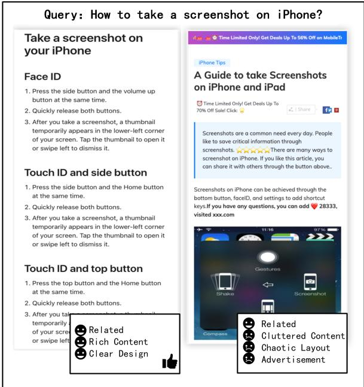
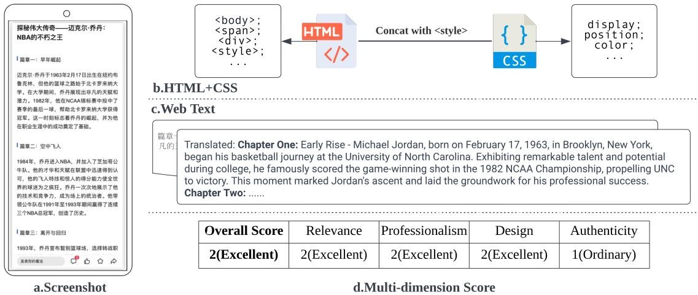
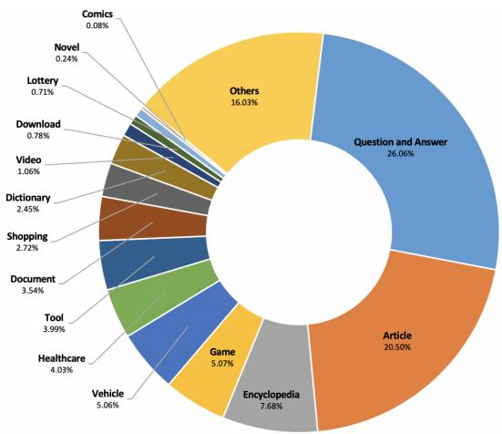
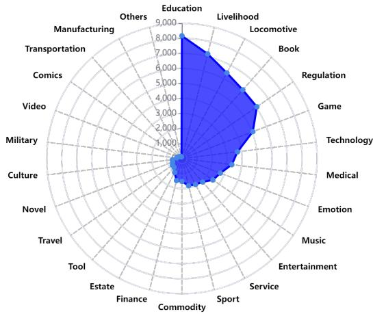

# WebQuality: A Large-scale Multi-modal Web Page Quality Assessment Dataset with Multiple Scoring Dimensions

Tao Zhang1,\*,†, Yige Wang2,\*, Hangyu Zhu1,\*, Xin Li1 Xiang Chen1, Tianhua Zhou1, Jin Ma1

1Tencent

2School of Computer Science and Technology, Xi’an Jiaotong University zhangtao.tanh@gmail.com jihejue039@stu.xjtu.edu.cn zhuhangyu@cs.hitsz.edu.cn

## Abstract

The assessment of web page quality plays a critical role in a range of downstream applications, yet there is a notable absence of datasets for the evaluation of web page quality. This research presents the pioneering task of web page quality assessment and introduces the first comprehensive, multi-modal Chinese dataset named WebQuality specifically designed for this task. The dataset includes over 65,000 detailed annotations spanning four sub-dimensions and incorporates elements such as HTML+CSS, text, and visual screenshot, facilitating in-depth modeling and assessment of web page quality. We performed evaluations using a variety of baseline models to demonstrate the complexity of the task. Additionally, we propose Hydra, an integrated multi-modal analysis model, and rigorously assess its performance and limitations through extensive ablation studies. To advance the field of web quality assessment, we offer unrestricted access to our dataset and codebase for the research community, available at https://github.com/incrediblesmurf/WebQuality.

## 1 Introduction

As web page serves as carriers of diverse and vast knowledge, selecting superior ones facilitates more effective knowledge acquisition. Current research for web page knowledge acquisition predominantly focuses on the relevance of web content (Xie et al., 2023; Singh and Joachims, 2019), often neglecting the aspect of web page quality. The presence of low-quality web page data can significantly deteriorate user experiences (Olsina et al., 2006) in industrial applications and compromise the performance of computational models (Marion et al., 2023) in scientific research. Identifying and filtering out low-quality content from the vast array of web data, to prioritize high-quality information, becomes an urgent issue. In response to our survey indicating a lack of open-source web page quality datasets, we introduce the first dataset capable of training a quality model for web page quality assessment.

  
Figure 1: Comparison between high-quality and lowquality web pages.

This paper proposes a dataset for web page quality assessment, acknowledging the complexity and multi-dimensionality of the task. The evaluation process is complicated by the diversity of web pages from various sources, requiring distinct evaluation criteria. Further complexity arises from the subjective nature of quality assessments and the need for a universally applicable standard. Furthermore, as web pages are dynamic and constantly changing, we aim to preserve static web page data to ensure consistency in annotations. Against this backdrop, the paper addresses two fundamental challenges in web page quality assessment.

Q1: How to reasonably evaluate the quality of web pages?

The domain of quality assessment in web content has been extensively explored. The Automated Essay Scoring task (Ke and Ng, 2019) represents a seminal NLU endeavor, emphasizing article-level content evaluation across dimensions such as fluency and language (Mathias et al., 2018). In the context of web quality, Anderka (2013) categorize wiki scoring into five distinct classes, albeit with a primary focus on text. Conversely, Cheng et al. (2023) prioritize the layout aspect of web pages, valuing clarity in task layout and logical structuring. However, all of above studies predominantly focus on the quality of a single modality, ignoring other modalities. As illustrated in Figure 1, even a web page meeting thematic relevance criteria can be perceived as less authentic or useful due to terrible design and advertisement. Therefore, a multi-dimensional scoring criteria is required to degrade subjectivity maximally.

  
Figure 2: Input Data for Our Three Modalities with Scores for Four Sub-dimensions and Overall Score: We insert CSS styles into HTML using <style> tags, extract key textual information, and capture screenshots of the primary content on web pages. For the scoring dimensions, relevance evaluates the degree of match between content and title, professionalism assesses the expertise of the content, design examines the website’s overall layout, and authenticity checks the credibility of the website.

## Q2: How can web page quality be modeled more comprehensively?

Significant strides have been made in web page modeling. He et al. (2022) employed full-text processing to derive a final score, while Xu et al. (2020) utilized both images and text. The Web-SRC dataset (Chen et al., 2021), though incorporating HTML and images, is tailored for QA tasks and does not wholly represent a web page through HTML alone. Cheng et al. (2023) consider layout aspects critical for user experience in their web page quality assessment, applicable in search engine results. Acknowledging the diverse and dynamic nature of web page layouts, we introduce a novel multi-modal dataset encompassing screenshot, text, and HTML+CSS. This dataset aims to capture the full spectrum of web page information, ensuring both diversity and consistency in representation.

In an effort to enhance the broad utilization of web page data, we have defined, for the first time, a comprehensive web page quality assessment task. We introduce WebQuality, a novel large-scale, multi-modal web page quality assessment dataset collected from open resources. This dataset comprises 65,442 meticulously annotated samples across 26 web page categories, with extensive details provided in Section 3. It incorporates a four-sub-dimensional evaluation system for each page, offering comprehensive scoring and annotations. The dataset amalgamates distinct data modalities: HTML+CSS, text and screenshot, each contributing synergistically, where text delivers the web page’s essential content, HTML and CSS outline its complete structure with CSS detailing style and layout, and screenshot provide a direct user experience perspective. This integrative modal approach is crucial for enhanced and thorough modeling, understanding, and evaluation of web page quality.

The contributions of our work are succinctly outlined as follows:

• We conceptualize the task of web page quality assessment, employing a multi-dimensional modeling framework that is readily extensible.

• We introduce WebQuality, a novel, largescale, open-source dataset for web page quality assessment, which facilitates a more holistic approach to web page quality modeling and evaluation.

• We propose the Hydra model, amalgamating multiple modalities, thereby substantiating the viability of multi-dimensional modeling and assessment in quality evaluation, and offering valuable perspectives for downstream task research.

## 2 Dataset Construction

## 2.1 Task Formulation

## 2.1.1 Multi-modal Web Quality Assessment

Let x be the main content of a web page, i represent the screenshot of the web page, d the HTML dom file, and s denote the score of the overall page in multiple dimensions. The purpose of the task is to train a model F to predict the score of a web page.

$$
F ( x , i , d ) = \mathbf { s }\tag{1}
$$

## 2.1.2 Scoring Dimension Selection

In light of the inherent subjectivity in annotators scoring (Rottger et al., 2022) and its inherent complexity (Ferrara et al., 2014), we advocate for dimension-specific annotation to mitigate these concerns. Enhanced dimensional clarity bolsters the interpretability of the resultant quality metrics. Numerous datasets for essay evaluation have embraced multi-criteria scoring (Ridley et al., 2021; Mathias et al., 2018) for comprehensive article appraisal. Given these considerations, we delineate our scoring across four bespoke dimensions for web pages:

Relevance This metric gauges content alignment with the topic and its extrapolated value. Optimal web content adheres to its theme, mirroring user prerequisites (Zhang et al., 2018). An expansion on the main topic can satiate user curiosity.

Professionalism This criterion examines the content’s depth, precision, fluency, and utility. High-caliber, fluent content minimizes reader cognitive load and imparts substantial insights (Liao et al., 2021).

Design This facet assesses the aesthetic and usability of the web page. The layout’s effectiveness bears significant impact on user engagement (Gardner, 2011).

Authenticity This aspect scrutinizes originality, vigilantly avoiding practices like keyword overuse or content duplication. Notably, it operates on a binary scale, given that deceptive tactics gravely mar user experience.

Refer to Table 1 for a detailed exposition of the aforementioned dimensions. Excluding authenticity, each dimension possesses a tripartite scoring gradient. Alongside these dimensional scores, we furnish an aggregate score to encapsulate the web page’s holistic quality.

## 2.2 Data Collection

The search engine accumulates millions of queries with billions of web documents returned per day. Through a probabilistic sampling of websites accessed by users via search results over the preceding annum, we’ve enhanced the diversity of sites, encompassing a spectrum from subpar to exemplary quality. Subsequently, we’ve expurgated dead links, redirects, and malicious data.

We have developed an advanced web toolkit for annotators, utilizing Chrome1, designed for the manual acquisition of three types of data modalities. To mitigate legal risks and ensure data privacy compliance, our selection process is confined to publicly accessible web pages without access restrictions. Subsequent to data collection, each screenshot undergoes rigorous examination by two experienced data scientists, a measure implemented to guarantee the quality of the web page data. This includes anonymizing data wherever feasible and considering the ethical implications of our data collection and publication methods.

## 2.3 Data Annotation

We’ve meticulously orchestrated a protocol to ensure the pinnacle of data quality:

Standard Unification In an endeavor to mitigate discrepancies arising from varied annotator interpretations, we’ve formulated and promulgated a comprehensive benchmark accompanied by guidelines for annotators. For each stipulated standard, illustrative exemplars, both exemplary and deficient, are presented to vividly elucidate the normative expectations.

Annotator Training and Selection We solicited annotation contractors from the public, selecting 21 annotators to be trained by experienced data scientists. After two-week training, we invited annotators to participate in multiple rounds of trial annotation, which were then reviewed by data experts. After examination, we chose the top 10 highest accuracy annotators for this dataset.

<table><tr><td>Scoring Dimension</td><td>Evaluation Criteria</td></tr><tr><td>Relevance</td><td>Excellent: Closely aligns with the topic and provides valuable extensions beyond Ordinary: Generally in line with the topic or slightly off-topic Bad: Deviates from the topic severely</td></tr><tr><td>Professionalism</td><td>Excellent: Includes in-depth content or a high degree of professionalism Ordinary: Contains article of normal quality with no obvious writing issues Bad: Contains obvious defects in the article or invaluable content</td></tr><tr><td>Design</td><td>Excellent: Includes exquisite and user-friendly web page layout Ordinary: Normal layout design that can obtain useful information easily Bad: Contains chaos design that hinders user&#x27;s information acquisition</td></tr><tr><td>Authenticity</td><td>Ordinary: Contains no deceptive content such as cropping and stitching Bad: Contains deceptive content attracting clicks to acquire illicit profits</td></tr><tr><td>Overall Score</td><td>Excellent: Includes no specific defects and excels in more than one dimension Ordinary: Includes no specific defects or contains slight defects Bad: Contains severe defects that damage user experience</td></tr></table>

Table 1: An Overview of the Four Key Sub-Dimensions and Overall Scoring Methodology. This framework assesses web pages based on topical relevance, content professionalism, design, and authenticity.

Multi-dimension Annotation Annotators were tasked with scoring individual dimensions of the web page initially. Having aggregated these dimension-specific ratings, an overall score was conferred, contingent upon the collated ratings. To enhance elucidation, we mandated the provision of annotation elucidatory notes corresponding to each data entry.

Batch Verification Given the extensive magnitude of the dataset, it was methodically segmented for processing. Adhering to a phased enhancement strategy, initial batch sizes encompassed 3k, 6k, 10k, and 20k web pages, subsequently augmenting to 30k for successive batches. Each segment constituted 10,000 units of data; After annotation, a random assortment of 30% of the dataset underwent contractor scrutiny, while a 1% subset was meticulously examined by data scientists.

Cross-annotation Verification To avoid missed and incorrect annotations, an inter-annotator validation mechanism was implemented. Three annotators critically appraised the labeled web content, registering a commendable congruence rate of 91.2%. Any emergent discrepancies were subject to expert adjudication, ensuring resolution and conformity.

## 2.4 Dataset Rebalancing

To counteract the detrimental impact of long-tail datasets on model performance, as noted by Zhang and Luo (2019), we executed data rebalancing on 310,000 annotated web page datasets. This intervention addressed the imbalance in data distribution, particularly between data points rated as bad and excellent. The revised data distribution is presented in Table 2.

## 3 Dataset Analysis

## 3.1 Data Format

As illustrated in Figure 2, our dataset’s input compartmentalizes into three distinct segments: a visual screenshot of the web page, the textual content, and the corresponding HTML+CSS file. The central textual corpus embodies the pivotal content of the page, exemplified by encyclopedic articles in encyclopedia websites and the question-answer pairs of QA. To maintain layout fidelity, we integrate essential CSS files into the core HTML structure using <style> tags, simultaneously preserving JavaScript files. Graphical screenshots are obtained using a browser interacting with specific URLs, processed via a rendering engine. Annotators for each web domain expanded full texts, removed ads, and captured visuals covering four screen lengths.

## 3.2 Dataset Statistics

This section describes the statistics and characteristics of WebQuality from various perspectives.

<table><tr><td>Scoring</td><td>Bad</td><td>Ord.</td><td>Exc.</td><td>Sum</td></tr><tr><td>Relevance</td><td>8098</td><td>46961</td><td>10383</td><td>65442</td></tr><tr><td>Professionalism</td><td>4112</td><td>39096</td><td>22234</td><td>65442</td></tr><tr><td>Design</td><td>10772</td><td>48782</td><td>5888</td><td>65442</td></tr><tr><td>Authenticity</td><td>3847</td><td>61595</td><td>None</td><td>65442</td></tr><tr><td>Overall Score</td><td>15553</td><td>27043</td><td>22846</td><td>65442</td></tr></table>

Table 2: The statistical distribution of the dataset regarding dimensions and scores, where ’Ord.’ represents ordinary and ’Exc.’ represents excellent.

The Statistics Distribution of Dataset Table 2 shows the overall distribution of WebQuality datasets, which contains a total of 65,442 samples, each labeled by score from 4 sub-dimensions. The distribution of scores in the Overall Score dimension is relatively balanced, while the distribution in other dimensions is relatively unbalanced, especially for the auth dimension, which has only two bins and the number of normal doc samples is 20 times greater than the number of non-authoritative docs. This is mainly because the vast majority of real-world web pages are normal, but the distribution of high-quality web pages and low-quality web pages is relatively scattered and has the characteristics of many types, which also brings challenges to quality task evaluation and modeling.

  
Figure 3: Distribution of Web Page Types

Distribution of Web Page Types Figure 3 shows the distribution of web page types in WebQuality dataset. Under the premise of ensuring a balanced label distribution, we try to select web page types according to the distribution of real web page types. For example, the question and answer page is mainly displayed in the form of Question-

  
Figure 4: Distribution of Domains in Web Pages

Answer, of which the question and answer page and article page account for 46.56%, which matches the real distribution in search engines. Cheng et al. (2023) demonstrated the effectiveness of web page evaluation by modeling web page types, and we believe that counting the distribution of web page types is equally important for web page quality assessment.

Distribution of Domains in Web Pages The web pages in the dataset can be categorized into 26 domains, including 16 main domains with more than 1000 samples. Figure 4 lists the distribution of instances belonging to different topics. Apart from the top 16 domains, how to model and understand different quality issues under different topics can be a matter of ongoing concern.

## 3.3 Dataset Comparison

As shown in Table 3, we compared our dataset with various datasets in similar fields, including web ranking, web question-and-answer and quality scoring datasets. DuReader (Wu et al., 2020) is a widely used, automatically generated web page ranking dataset. This dataset mainly focuses on the article sorting task. Although it surpasses ours in scale, it lacks the rigor of manual labeling. CoQAN (Wang et al., 2020) is the closest to our dataset in terms of our domain. It compares which of two news docs has better quality instead of directly annotating and scoring. It outputs quality scores through pairwise comparisons, but it lacks modal information, and its data volume is only half of ours. Datasets such as ASAP (Prize, 2019), ASAP++ (Mathias et al., 2018) and ACEA (He et al., 2022) predominantly concentrate on the critical evaluation of articles, including the logic, language and other dimensions of college entrance examination essays. The Web-SRC dataset (Chen et al., 2021), in its structural composition, bears the closest resemblance to ours. It also provides HTML, screenshot, and text, but its primary focus lies in QA tasks, and its size is only 1/10 of ours. In general, the WebQuality dataset is oriented to Chinese web page quality assessment, and it provides a variety of inputs and large annotations, which can provide the community with high-quality datasets.

<table><tr><td>Dataset</td><td>Task</td><td>Lang.</td><td>Html</td><td>Img.</td><td>Text</td><td>Ann.</td><td>Dims.</td><td>Doc.</td></tr><tr><td>DuReader</td><td>Ranking</td><td>CN</td><td>X</td><td>X</td><td>V</td><td>X</td><td>X</td><td>8.9M</td></tr><tr><td>WebSRC</td><td>QA</td><td>EN</td><td>V</td><td>V</td><td>V</td><td>V</td><td>X</td><td>6.4K</td></tr><tr><td>ASAP</td><td>AES</td><td>EN</td><td>X</td><td>X</td><td>V</td><td>V</td><td>V</td><td>21K</td></tr><tr><td>ASAP++</td><td>AES</td><td>EN</td><td>X</td><td>X</td><td>V</td><td>V</td><td>V</td><td>12K</td></tr><tr><td>ACEA</td><td>AES</td><td>CN</td><td>X</td><td>X</td><td>V</td><td>V</td><td>V</td><td>1.2K</td></tr><tr><td>CoQAN</td><td>Quality</td><td>CN</td><td>X</td><td>X</td><td>V</td><td>V</td><td>X</td><td>38K</td></tr><tr><td>WebQuality(Ours)</td><td>Quality</td><td>CN</td><td>V</td><td>V</td><td>V</td><td>V</td><td>V</td><td>65K</td></tr></table>

Table 3: Comparison of Datasets Across Various Tasks. ’Ann.’ denotes whether the dataset has been manually annotated, while ’Dims.’ indicates if the dataset encompasses multiple scoring dimensions.

## 4 Method

## 4.1 Text Embedding

Text is the main carrier of web page content, and text modeling is crucial for web page quality assessment. We take BERT (Devlin et al., 2019) as the text encoder, which is widely adopted in numerous NLP tasks.

$$
\vec { h } ^ { ( b e r t ) } = B E R T ( x )\tag{2}
$$

## 4.2 ScreenShot Embedding

In order to obtain the visual information in the web page screenshot, we process the web page screenshot through a series of image operations. We use ViT (Dosovitskiy et al., 2020) as image encoder.

$$
\vec { h } ^ { ( v i t ) } = V I T ( i )\tag{3}
$$

## 4.3 HTML Process and Embedding

Influenced by the methodology proposed in (Cheng et al., 2023), our study utilizes the Graph Attention Network (GAT) delineated by (Velickoviˇ c et al.´ , 2018) for HTML modeling. This approach interprets HTML elements as nodes within a graph framework. .

Graph construction To formulate layout information for various categories of web pages, we construct the graph structure required for GAT through the parent-child node relationship of the DOM tree.

Feature Pre-processing We design a series of features for each node type, to capture the layout information of the web page. More specifically, for continuous features (e.g., height, line height and margin), a non-uniform interval division strategy is employed to divide the continuous interval into several buckets, which can ensure that there are enough training samples in a single bucket.

GAT Model Function In particular, the architecture of GAT is composed by stacking multiple graph attention layers, each of which can be defined as

$$
\vec { h } ^ { ( k + 1 ) } = \sigma \Bigg ( \sum _ { m \in \mathcal { N } _ { n } } \alpha _ { n m } \mathbf { W } _ { 1 } ^ { ( k ) } \vec { h } _ { m } ^ { ( k ) } \Bigg )\tag{4}
$$

$$
\vec { h } ^ { ( g a t ) } = h _ { h t m l } ^ { l }\tag{5}
$$

where $\sigma ( . )$ is an activation function and $\alpha _ { n m }$ is the attention value between node n and node m. Here, $\vec { h } _ { m } ^ { ( k ) }$ represents the embedding of node m in the k-th layer. The attention value is learned to selectively propagate information from node n to node m. We use last layer l’s hidden state of <html> node as representation of the HTML.

## 4.4 Feature Integration

Multi Subnetwork Comprehension For the sake of simplicity, we adopt the strategy of freezing the three encoder modules, and then concatenate the outputs of the three encoders, and then pass through two fully connected layers to obtain the final web page classification s.

<table><tr><td rowspan="2">Method</td><td>Rel.</td><td>Pro.</td><td>Des.</td><td>Auth.</td><td>Avg-sub</td><td>oS</td></tr><tr><td>F1</td><td>F1</td><td>F1</td><td>F1</td><td>Avg-F1</td><td>F1/Acc</td></tr><tr><td>BERT</td><td>56.55</td><td>58.11</td><td>40.08</td><td>51.44</td><td>51.55</td><td>63.76/66.01</td></tr><tr><td>ViT</td><td>47.62</td><td>47.33</td><td>40.35</td><td>49.46</td><td>46.19</td><td>50.40/53.41</td></tr><tr><td>GAT</td><td>46.34</td><td>45.54</td><td>35.73</td><td>52.03</td><td>44.91</td><td>50.34/52.59</td></tr><tr><td>GPT4 ZeroShot</td><td>25.85</td><td>27.17</td><td>17.85</td><td>32.13</td><td>25.75</td><td>31.08/43.50</td></tr><tr><td>GPT4 OneShot</td><td>28.41</td><td>29.31</td><td>20.34</td><td>32.09</td><td>27.54</td><td>34.01/46.55</td></tr><tr><td>Hydra</td><td>58.13</td><td>60.48</td><td>41.55</td><td>51.47</td><td>52.91</td><td>66.68/68.41</td></tr><tr><td>-w/o text</td><td>49.55</td><td>52.34</td><td>41.31</td><td>49.23</td><td>48.11</td><td>54.61/57.57</td></tr><tr><td>-w/o screenshot</td><td>57.60</td><td>59.54</td><td>40.63</td><td>51.00</td><td>52.19</td><td>65.46/67.26</td></tr><tr><td>-w/o HTML+CSS</td><td>57.87</td><td>59.89</td><td>40.90</td><td>50.57</td><td>52.31</td><td>65.68/67.49</td></tr></table>

Table 4: Experimental Results and Ablation Study Outcomes. The abbreviations ’Rel.’, ’Pro.’, ’Des.’, ’Auth.’, and ’OS’ denote the sub-dimensions of Relevance, Professionalism, Design, Authenticity, and Overall Score, respectively. ’Avg-sub’ refers to the average F1 score across these four sub-dimensions. The Overall Score incorporates the F1 score and accuracy for various models.

$$
\vec { h } = c o n c a t ( \vec { h } ^ { ( b e r t ) } , \vec { h } ^ { ( v i t ) } , \vec { h } ^ { ( g a t ) } )\tag{6}
$$

$$
{ \bf s } = a r g m a x ( s o f t m a x ( l i n e a r ( \vec { h } ) ) )\tag{7}
$$

Where concat indicates the concatenation of the hidden representations of the three modalities. Equation 7 represents the concatenated hidden representations passing through a fully connected layer, with the final scoring results obtained via the softmax and argmax functions.

## 5 Experiments

## 5.1 Evaluation Metrics

For the Overall Score dimension, we use macro-F1 score (F1) and accuracy (Acc) as the evaluation indicators of the effect, which measures the overlap of the predicted score and the ground truth. For subdimensions, macro-F1 score is used for evaluation.

## 5.2 Comparative Analysis of Baseline Models

In this study, we benchmark our method against several robust baseline models, each detailed subsequently:

BERT: Recognized for its excellence in supervised text understanding, we employ a variant of BERT tailored for Chinese, considering it a potent benchmark in text analysis.

ViT: Serving as a prototypical visual encoder, ViT, pre-trained on imagery, has demonstrated proficiency across various visual tasks.

<table><tr><td rowspan=1 colspan=1>Classification</td><td rowspan=1 colspan=1>Feature Name</td></tr><tr><td rowspan=1 colspan=1>Location</td><td rowspan=1 colspan=1>height,width,position type</td></tr><tr><td rowspan=1 colspan=1>Content</td><td rowspan=1 colspan=1>font size,font style,line height,font weight</td></tr><tr><td rowspan=1 colspan=1>Layout</td><td rowspan=1 colspan=1>border,padding,margin,visibility,display style,outline style,outline width</td></tr></table>

Table 5: Selected CSS style contents for GAT’s node feature.

GAT: Chosen for its efficacy in structured data interpretation, we utilize the original GAT configuration with a two-layer structure, aiming to analyze the HTML structure of web pages.

GPT4 ZeroShot: GPT4 (OpenAI, 2023), known as a leading large language model (LLM), is employed in its zeroshot variant to assess its capability in evaluating web page quality.

GPT4 OneShot: Recognizing GPT4’s strong in-context learning abilities, we explore its upper limits in web page evaluation using a oneshot approach, with the prompt detailed in A.1.

## 5.3 Implementation Details

We have detailed the implementation specifics for three modalities.

Text Processing and Embedding: Leveraging the bert-base-chinese model from Hugging Face 2, our approach adheres to BERT’s text input limitations by selecting the initial 512 tokens of content. A dedicated BERT-only model is independently trained for this purpose. Within the Hydra model framework, we keep the BERT module’s parameters static, and the [CLS] token from the final layer serves as the quintessential representation for text encoding.

Screenshot Processing and Embedding: To establish uniformity in the dimensions of web page screenshots, we adopted a standardized agent size of 400x900 for screenshots acquired manually. In order to align with the Vision Transformer (ViT)’s pre-training specifications, operations like Resize and RandomResizedCrop were implemented. We utilized the ViT-B/16 model as the encoder3, with its parameters initially pre-trained on the ImageNet-21K dataset for an image resolution of 224x224, specifically employing the 21k\_224\_224 parameter configuration4. Subsequent to the fine-tuning process, we froze the parameters of the ViT model, selecting the encoding output from the [CLS] token of the network’s final layer as the ViT module’s output.

HTML Processing and Embedding: We utilize Beautiful Soup 5 for parsing web page source codes, thereby extracting their hierarchical structures. Employing Depth First Search, we extract adjacency relationships from the DOM tree, recording the nodes and their parent-child edge connections within the DOM structure recursively. The selected CSS Style can be seen in Table 5. For GAT training, We randomly initialize the weights of the GAT, and train it on our dataset for 10 epochs with a learning rate of 0.01. After the training process, freeze network parameters for prediction during model fusion.

## 5.4 Experiment Results

Overall Performance Table 4 presents the comprehensive experimental outcomes on the WebQuality dataset. Notably, the Hydra outperformed others in the Overall Score dimension, leading in both F1 score and accuracy. ViT and GAT registered F1 score of 50.40% and 50.34%, which indicates the importance of structure in web page quality assessment. BERT-alone closely mirrored Hydra’s effectiveness, underscoring the BERT encoder’s robustness and highlighting the pivotal role of core textual content in web page quality assessment. The LLM’s poor performance in this task indirectly reflects the challenge of the quality assessment task. Overall, Hydra, BERT, ViT, and GAT have advanced in the Overall Score dimension, but there is still room for further improvement, reflecting the complex nature of web page quality evaluation and the need for robust metrics and models.

<table><tr><td>Layer Depth</td><td>ACC</td><td>F1</td></tr><tr><td>1</td><td>50.63</td><td>49.15</td></tr><tr><td>2</td><td>52.59</td><td>50.34</td></tr><tr><td>3</td><td>52.49</td><td>50.32</td></tr><tr><td>4</td><td>52.44</td><td>49.39</td></tr><tr><td>5</td><td>51.51</td><td>49.52</td></tr><tr><td>6</td><td>51.80</td><td>49.28</td></tr></table>

Table 6: Impact of GAT Layer Depth.

Ablation Study Our examination revealed that the exclusion of any single modality from models adversely affects their performance. Specifically, the omission of text data incurred the most significant reduction in F1 score, registering a 12.07% decrease. This was succeeded by a 1.22% decrease due to the lack of screenshot data, and a 1% decrease when HTML+CSS data was absent.

## 5.5 Impact of GAT Layer Depth

In this section, we investigate the influence of the number of layers in GAT on the overall performance as measured by the Overall Score. Table 6 illustrates that a configuration with two layers exhibits the best performance. This is also consistent with the layer settings of single GAT model in our main experiment. We also maintain two layers setting in the GAT part of our Hydra model.

## 5.6 Large Language Model Comparison

Table 7 presents the comprehensive experimental outcomes on the WebQuality dataset. Regarding of the model’s strength, LLM’s poor performance in zero-shot setting indirectly reflects the inherant challenge of the quality assessment task. Even the most advanced models, such as GPT-4o, which incorporates image information, can only achieve an F1 score of 46.01 on the overall score. Notably, the ability of the Qwen-VL-Chat to tackle quality assessment problems has significantly improved after incorporating supervised data for fine-tuning, indicating that the LLM holds potential for addressing quality assessment challenges and the importance

<table><tr><td>Model Name</td><td>F1</td><td>Acc</td></tr><tr><td>GPT40</td><td>46.01</td><td>46.55</td></tr><tr><td>GPT4-0125</td><td>31.08</td><td>43.50</td></tr><tr><td>GPT4-1106</td><td>39.67</td><td>42.60</td></tr><tr><td>GLM4-0520</td><td>34.01</td><td>47.40</td></tr><tr><td>DeepSeek-V2</td><td>28.94</td><td>44.45</td></tr><tr><td>MoonShot-V1-8K</td><td>25.84</td><td>43.20</td></tr><tr><td>Qwen1.5-110B-Chat</td><td>34.01</td><td>46.55</td></tr><tr><td>Qwen2-72B-Chat</td><td>44.08</td><td>47.90</td></tr><tr><td>Qwen-VL-Chat</td><td>14.47</td><td>26.20</td></tr><tr><td>Qwen-VL-Plus</td><td>25.50</td><td>31.90</td></tr><tr><td>Qwen-VL-Max</td><td>23.00</td><td>35.30</td></tr><tr><td>Qwen-VL-Chat-SFT†</td><td>69.68</td><td>70.30</td></tr></table>

Table 7: Performance on Different LLMs, where † means use our data for supervised fine-tuning.

of SFT.

## 5.7 Discussions and Limitations

## 5.7.1 The Answer to Previous Questions

Empirical evidence obtained from our experimental investigations provides insightful answers to the two pivotal queries postulated in Section 1.

Our Dataset’s Efficacy in Assessing Web Page Quality Table 4 demonstrates that models proficient in certain sub-dimensions attain superior overall score, while those limited to a single modality frequently exhibit deficiencies in alternate subdimensions. This finding highlights the integral relationship between sub-dimensional scores and the overall score of our dataset, enhancing the model’s capacity for multi-faceted analysis. Our dataset, targeting a spectrum of quality evaluation criteria, combine supplementary multi-modal data to augment web page quality assessment. However, four scoring sub-dimensions of our dataset may not be suitable for all circumstances, depending on new focal points of specific quality discernment tasks. The potential for exploring further sub-quality dimensions remains an area for future investigative endeavors.

Our Dataset and Model’s Efficacy in Web Page Modeling from Each Modality Our research implements a multi-modal joint model to elucidate the interrelationships and correlative impacts among diverse modalities. We executed a series of ablation studies by systematically excluding threemodal data within the Hydra framework. As evidenced in Section 5.4, the omission of any modality’s data invariably results in a detrimental effect on our model’s performance, manifesting as reductions in evaluation metrics. Consequently, it is imperative to utilize a comprehensive dataset encompassing all modalities to achieve optimal results in web page modeling. The indispensable nature of data from the triad of modalities—human visual (screenshot), rendering (HTML+CSS), and semantic perspectives—is corroborated in our findings. This tri-modal approach, to our current understanding, presents a notably holistic methodology for web page analysis. The necessity for integration of additional modalities remains an open question, warranting further empirical investigation.

## 5.7.2 Is LLM the Answer to Web Quality Assessment?

In our empirical investigation, we conducted a rigorous evaluation of the most recent iteration of the Generative Pre-trained Transformer model, GPT-4, using our specialized task dataset. Despite its demonstrable proficiency across a spectrum of other tasks, the performance metrics observed with our dataset indicated suboptimal outcomes. This highlights the limitation of relying solely on GPT-4’s text-based capabilities to effectively capture the complexities inherent in our specific task. Moreover, the challenge of integrating capabilities for interpreting visual data such as screenshot and HTML+CSS structures into GPT’s framework remains an unresolved area of inquiry in this domain.

## 6 Conclusion

In this study, we introduce WebQuality, a comprehensive Chinese multi-modal dataset specifically designed for evaluating web page quality, which comprises HTML+CSS, text, and visual screenshot. Our objective centers on a holistic assessment of web pages, scrutinizing four specific subdimensions. Evaluations with various baseline models on this dataset underscore the intricacies of assessing web page quality. We propose the Hydra model, which utilizes HTML+CSS, text, and screenshot data for cohesive analysis. Despite setting a new benchmark, its limitations highlight the need for further exploration in multi-modal integration. This research contributes to methodologies in web page quality assessment, with future directions aimed at developing versatile models for practical applications such as web data filtering for LLM pre-training.

## References

Maik Anderka. 2013. Analyzing and Predicting Quality Flaws in User-generated Content: The Case of Wikipedia. doctoralthesis, Bauhaus-Universität Weimar.

Xingyu Chen, Zihan Zhao, Lu Chen, JiaBao Ji, Danyang Zhang, Ao Luo, Yuxuan Xiong, and Kai Yu. 2021. WebSRC: A dataset for web-based structural reading comprehension. In Proceedings of the 2021 Conference on Empirical Methods in Natural Language Processing, pages 4173–4185, Online and Punta Cana, Dominican Republic. Association for Computational Linguistics.

Anfeng Cheng, Yiding Liu, Weibin Li, Qian Dong, Shuaiqiang Wang, Zhengjie Huang, Shikun Feng, Zhicong Cheng, and Dawei Yin. 2023. Layoutaware webpage quality assessment. arXiv preprint arXiv:2301.12152.

Jacob Devlin, Ming-Wei Chang, Kenton Lee, and Kristina Toutanova. 2019. BERT: Pre-training of deep bidirectional transformers for language understanding. In Proceedings of the 2019 Conference of the North American Chapter ofthe Associationfor Computational Linguistics: Human Language Technologies, Volume 1 (Long and Short Papers), pages 4171–4186, Minneapolis, Minnesota. Association for Computational Linguistics.

Alexey Dosovitskiy, Lucas Beyer, Alexander Kolesnikov, Dirk Weissenborn, Xiaohua Zhai, Thomas Unterthiner, Mostafa Dehghani, Matthias Minderer, Georg Heigold, Sylvain Gelly, et al. 2020. An image is worth 16x16 words: Transformers for image recognition at scale. In International Conference on Learning Representations.

Emilio Ferrara, Pasquale De Meo, Giacomo Fiumara, and Robert Baumgartner. 2014. Web data extraction, applications and techniques. Knowledge-Based Systems, 70(C):301–323.

Brett S Gardner. 2011. Responsive web design: Enriching the user experience. Sigma Journal: Inside the Digital Ecosystem, 11(1):13–19.

Yaqiong He, Feng Jiang, Xiaomin Chu, and Peifeng Li. 2022. Automated Chinese essay scoring from multiple traits. In Proceedings of the 29th International Conference on Computational Linguistics, pages 3007–3016, Gyeongju, Republic of Korea. International Committee on Computational Linguistics.

Zixuan Ke and Vincent Ng. 2019. Automated essay scoring: A survey of the state of the art. In IJCAI, volume 19, pages 6300–6308.

Dongliang Liao, Jin Xu, Gongfu Li, and Yiru Wang. 2021. Hierarchical coherence modeling for document quality assessment. In Proceedings of the AAAI Conference on Artificial Intelligence, volume 35, pages 13353–13361.

Max Marion, Ahmet Üstün, Luiza Pozzobon, Alex Wang, Marzieh Fadaee, and Sara Hooker. 2023. When less is more: Investigating data pruning for pretraining llms at scale. arXiv preprint arXiv:2309.04564.

Sandeep Mathias, Pushpak Bhattacharyya, et al. 2018. Asap++: Enriching the asap automated essay grading dataset with essay attribute scores. In Proceedings ofthe eleventh international conference on language resources and evaluation (LREC 2018).

Luis Olsina, Guillermo Covella, and Gustavo Rossi. 2006. Web quality. Web Engineering, pages 109– 142.

OpenAI. 2023. Gpt-4 technical report.

Automated Student Assessment Prize. 2019. The hewlett foundation: Automated essay scoring.

Robert Ridley, Liang He, Xin-yu Dai, Shujian Huang, and Jiajun Chen. 2021. Automated cross-prompt scoring of essay traits. In Proceedings of the AAAI conference on artificial intelligence, volume 35, pages 13745–13753.

Paul Rottger, Bertie Vidgen, Dirk Hovy, and Janet Pierrehumbert. 2022. Two contrasting data annotation paradigms for subjective NLP tasks. In Proceedings ofthe 2022 Conference ofthe North American Chapter of the Association for Computational Linguistics: Human Language Technologies, pages 175–190, Seattle, United States. Association for Computational Linguistics.

Ashudeep Singh and Thorsten Joachims. 2019. Policy learning for fairness in ranking. Advances in neural information processing systems, 32.

Petar Velickoviˇ c, Guillem Cucurull, Arantxa Casanova,´ Adriana Romero, Pietro Liò, and Yoshua Bengio. 2018. Graph attention networks. In International Conference on Learning Representations.

Yiru Wang, Shen Huang, Gongfu Li, Qiang Deng, Dongliang Liao, Pengda Si, Yujiu Yang, and Jin Xu. 2020. Cognitive representation learning of selfmedia online article quality. In Proceedings of the 28th ACM International Conference on Multimedia, pages 843–851.

Zhijing Wu, Jiaxin Mao, Yiqun Liu, Jingtao Zhan, Yukun Zheng, Min Zhang, and Shaoping Ma. 2020. Leveraging passage-level cumulative gain for document ranking. In Proceedings ofThe Web Conference 2020, pages 2421–2431.

Xiaohui Xie, Qian Dong, Bingning Wang, Feiyang Lv, Ting Yao, Weinan Gan, Zhijing Wu, Xiangsheng Li, Haitao Li, Yiqun Liu, et al. 2023. T2ranking: A large-scale chinese benchmark for passage ranking. arXiv preprint arXiv:2304.03679.

Yiheng Xu, Minghao Li, Lei Cui, Shaohan Huang, Furu Wei, and Ming Zhou. 2020. Layoutlm: Pre-training of text and layout for document image understanding. In Proceedings of the 26th ACM SIGKDD International Conference on Knowledge Discovery & Data Mining, pages 1192–1200.

Junqi Zhang, Yiqun Liu, Shaoping Ma, and Qi Tian. 2018. Relevance estimation with multiple information sources on search engine result pages. In Proceedings ofthe 27th ACM International Conference on Information and Knowledge Management, pages 627–636.

Ziqi Zhang and Lei Luo. 2019. Hate speech detection:: A solved problem? the challenging case of long tail on twitter. Semantic Web, 10(5):925–945.

## A Appendix

## A.1 GPT Prompt

In the ensuing section delineated as Section 5, we enumerate the prompts utilized for the GPT4 oneshot and GPT4 zeroshot paradigms. Comprehensive details pertaining to these prompts are methodically presented in Table 8. We proffer the Web page quality assessment criteria, designated as <quality\_criteria>, pertinent to our dataset, thereby elucidating the task at hand. Subsequent to this exposition, the Language Model (LLM) is furnished with the title (<web\_title>) and the web content (<web\_content>) of each web page. Specifically, for the GPT4 OneShot configuration, an exemplar web page (<incontext\_example>) is additionally provided.

## A.2 Annotation Detail

In this section, we provide detailed annotation standards.

## A.2.1 Relevance

Definition: Whether the title and page content are fully matched, whether the needs are fully met, and whether the representation is very good by being one level higher than the basic satisfaction.

Excellent (2 points): The needs (title) and page content are fully matched, the needs are fully met, and the representation is very good by being one level higher than the basic satisfaction.

Ordinary (1 point): The needs are Ordinary or most of the needs are met. For example, if there are two focus points in the title, the relevance should ensure that the content of both focus points is partially addressed.

Bad (0 points): The content is irrelevant to the title or the title is severely exaggerated.

## A.2.2 Professionalism

Definition: The richness of the page content itself, such as rich content and a combination of text and images, which can be quantified by the number of words, images, and text-to-image ratio for specific page types.

Excellent (2 points): Any of the following conditions are met, indicating good professionalism that meets user needs: rich content and a combination of text and images, good quality of related videos, exquisite form, making the audience happy and making it easier to obtain information; the overall page is enhanced based on normal conditions, such as a reasonable text-to-image ratio and quantity, relevant citations in Q&A, meaningful comments; substantial content, diverse forms, providing an excellent perception and interactive experience for users; enough rich content to meet users’ extended browsing needs; beautiful article layout, deep content, able to provoke users’ thoughts under current needs; additional functions that significantly improve user experience on top of meeting user needs; normal content quality but strong user feedback and interaction.

Ordinary (1 point): Any of the following conditions are met, indicating basic professionalism: normal layout, logical, and readable; normal content quality, general user feedback, and interaction.

Bad (0 points): Incorrect content, very poor content, meaningless content, chaotic content, missing key content; very high cost to obtain content or unable to obtain content.

## A.2.3 Design

Definition: Whether the layout and structure of the page itself are reasonable and whether it is convenient for users to obtain valuable information. Due to the high requirements for intuitive feeling in this dimension, quantitative indicators are used for evaluation.

Excellent (2 points): The layout and transcoding structure are reasonable, ads do not basically affect the experience, and the main content accounts for more than 75%; Landing page: first screen/overall proportion <10%, list page: first screen to overall proportion <20%; footer ads can be ignored if they do not affect the acquisition of needs and are not nasty.

Ordinary (1 point): Poor layout, high reading cost, no segmentation, content exceeds the page, meaningless line breaks, messy text order, expand or collapse function on the main screen, no navigation guidance or confusing navigation, stacked text and images, 25% <main content on the first screen $\leq 7 5 \%$ ; Landing page: overall proportion >25% or first screen proportion >20%; list page: first screen proportion >30% or overall proportion >35%.

<table><tr><td>Template</td><td>Setting</td></tr><tr><td>Please classify the quality of the web page according to the fol- lowing title, content, and web page quality assessment criteria, and output: good, average, or poor; Web page Quality Assess- ment Criteria: &lt;quality_criteria&gt;; Title: &lt;web_title&gt;; Content: &lt;web_content&gt;.</td><td>ZeroShot</td></tr><tr><td>Please classify the quality of the web page according to the fol- lowing title, content, and web page quality assessment criteria, and output: good, average, or poor; Web Page Quality Assess- ment Criteria: &lt;quality_criteria&gt;; Title: &lt;web_title&gt;; Content: &lt;web_content&gt;; Example: &lt;incontext_example&gt;.</td><td>OneShot</td></tr></table>

Table 8: Prompt Display: The content enclosed in angle brackets represents the placeholder of a template.

Bad (0 points): Malicious ads on the page prevent access to core content; ad area too large and blocks main content without being able to close; difficult page browsing, unable to obtain information, main content proportion <25%.

## A.2.4 Authority

Definition: Whether the content of the page itself is reliable and in line with public order and good morals.

Excellent (1 point): No obvious malicious imitation or splicing behavior.

Bad (0 points): Contains any of the following: URL form and web page presentation completely imitate a mature and large site, the website content is purely fake; cheaters use some loopholes in normal websites to improperly obtain full or partial control of the website, contrary to the site owner’s intentions, posting cheating content on normal sites to profit through search engines; site trademarks and other content imitating or plagiarizing well-known websites; using crawler tools to splice multiple articles, completely lacking originality; severely exceeding the research field of the site itself; repetitive accumulation of popular keywords or the same keywords.

## A.2.5 Overall Score

Definition: Page quality refers to the quality of the web pages on a website, including page layout, content rationality, richness, and user feedback, etc. It needs to be judged based on the website’s theme and established evaluation standards and methods. High-quality pages should be able to genuinely meet user needs, although it is impossible to accurately cover all user needs, they should try to cover user intentions as much as possible.

Excellent (2 points): Rich content, combination of text and images, exquisite form, making the audience happy and making it easier to obtain information; normal content quality but strong user feedback and interaction; substantial content, diverse forms, strong sense of design, providing an excellent perception and interactive experience for users; enough rich content to meet users’ extended browsing needs; beautiful article layout, deep content, able to provoke users’ thoughts under current needs; additional functions that significantly improve user experience on top of meeting user needs.

Ordinary (1 point): Substantial content, neat layout, logical coherence, smooth reading; basically meets user needs, complete content; normal quality of video and image content.

Bad (0 points): Incorrect content, very poor content, meaningless content, chaotic content, missing key content; messy content, high cost for users to obtain information.

## A.3 Dataset Details

In this section, a lucid exemplification of our dataset is presented. Owing to the extensive length of the CSS code, only a fragment thereof is exhibited. The specific segment of the data under consideration is delineated in Table 9. In our methodology, the JavaScript code is retained within the original HTML file, accompanied by the provision of the corresponding CSS style file for each HTML document. Subsequently, the primary textual content of a singular web page is furnished. Post the process of web rendering, a screenshot corresponding to each discrete data entry is meticulously archived.

## A.4 Acknowledgement

We employed anonymous accounts for website access and made concerted efforts to remove sensitive data. Nevertheless, due to the intrinsic characteristics of web pages, potential privacy-related risks may persist. Simultaneously, the dataset presented in this study is exclusively intended for academic research and will not be utilized for any other purposes. All pertinent legal regulations and licenses have been meticulously examined to guarantee compliance.

<table><tr><td rowspan=1 colspan=1>Content</td><td rowspan=1 colspan=1>DataModality</td></tr><tr><td rowspan=1 colspan=1>&lt;html&gt;... &lt;div class=&quot;contents&quot;&gt; &lt;p class=&quot;linetits&quot;&gt; &lt;em&gt;健身跑步多长时间合适&lt;/em&gt; &lt;/p&gt; &lt;p class=&quot;linesubs&quot;&gt; 以强健身体为目的跑40分钟左右 &lt;/p&gt; &lt;p&gt; 当你跑步坚持30分钟后，**身体才会体会到跑步带来的愉悦感。与开始健身跑步的十多分钟不一样，30分钟后，你跑步的的节奏，速度，呼吸和身体内在的供能系统配合得**无缝。&lt;/p&gt; &lt;p&gt;健身跑步每天跑40分钟，就能起到燃烧脂肪的效果(一般脂肪在跑步后30分钟供能比例慢慢变大)。想通过健身跑步减肥的人，每天跑步40分钟也是可以的。&lt;/p&gt; &lt;p&gt; &lt;/p&gt; &lt;p class=&quot;linesubs&quot;&gt; 有更高目标可以跑1小时或更长时间&lt;/p&gt; &lt;p&gt;跑步健身多长时间合适?对一般跑步健身爱好者而言，如果有较好的跑步基础，每周都会进行3/4次的有氧运动的话，跑步健身可以跑60分钟。以较慢速度长时间跑步时，身体会**例使用脂肪供能。不过同时会消耗肌肉，跑步后即刻吃香蕉，促进身体恢复。&lt;/p&gt;&lt;p&gt; &lt;/p&gt;...&lt;/html&gt;</td><td rowspan=1 colspan=1>Html</td></tr><tr><td rowspan=1 colspan=1>.ad_hongren img{ width: 100%; } ::before, :after { -tw-content: &quot;; } html, :host {line-height: 1.5; -webkit-text-size-adjust: 100-moz-tab-size: 4; tab-size: 4; } ...</td><td rowspan=1 colspan=1>Css</td></tr><tr><td rowspan=1 colspan=1>健身跑步多长时间合适以强健身体为目的跑40分钟左右当你跑步坚持30分钟后，**身体才会体会到跑步带来的愉悦感。与开始健身跑步的十多分钟不一样，30分钟后，你跑步的的节奏，速度，呼吸和身体内在的供能系统配合得**无缝。健身跑步每天跑40分钟，就能起到燃烧脂肪的效果(一般脂肪在跑步后30分钟供能比例慢慢变大)。想通过健身跑步减肥的人，每天跑步40分钟也是可以的。有更高目标可以跑1小时或更长时间跑步健身多长时间合适?对一般跑步健身爱好者而言，如果有较好的跑步基础，每周都会进行3/4次的有氧运动的话，跑步健身可以跑60分钟。以较慢速度长时间跑步时，身体会**例使用脂肪供能。不过同时会消耗肌肉，跑步后即刻吃香蕉，促进身体恢复。</td><td rowspan=1 colspan=1>Text</td></tr><tr><td rowspan=1 colspan=1>健身跑步多长时间合适不同目标跑步健身时长不同04-14                            阅读(3305)跑步 健身健身跑步多长时间合适?跑步是受到许多人喜爱的有氧运动，健身跑步多长时间合适？对于不同健身基础的人来说，最合适的跑步时间长度不同。对于你来说，最合适的跑步时长是多久呢？健身跑步多长时间合适以强健身体为目的跑40分钟左右当你跑步坚持30分钟后，**身体才会体会到跑步带来的愉悦感。与开始健身跑步的十多分钟不一样，30分钟后，你跑步的的节奏，速度，呼吸和身体内在的供能系统配合得**无缝健身跑步每天跑40分钟，就能起到燃烧脂肪的效果(一般脂肪在跑步后30分钟供能比例慢慢变大)。想通过健身跑步减肥的人，每天跑步40分钟也是可以的。有更高目标可以跑1小时或更长时间跑步健身多长时间合适?对一般跑步健身爱好者而言如果有较好的跑步基础，每周都会进行3/4次的有氧运动的话，跑步健身可以跑60分钟。以较慢速度长时间跑步时，身体会**例使用脂肪供能。不过同时会消耗肌肉，跑步后即刻吃香蕉，促进身体恢复。</td><td rowspan=1 colspan=1>ScreenShot</td></tr><tr><td rowspan=1 colspan=1>般最适宜健身多久，健身跑步多长时间合适？</td><td rowspan=1 colspan=1>Title</td></tr><tr><td rowspan=1 colspan=1>内容完整，轻微采集</td><td rowspan=1 colspan=1>AnnotationRemark</td></tr><tr><td rowspan=1 colspan=1>OverallScore: 0; Relevance: 1; Professionalism: 1; Design: 1; Authenticity: 0</td><td rowspan=1 colspan=1>Score</td></tr></table>

Table 9: Detailed Examples of Multimodal Data of Our Dataset