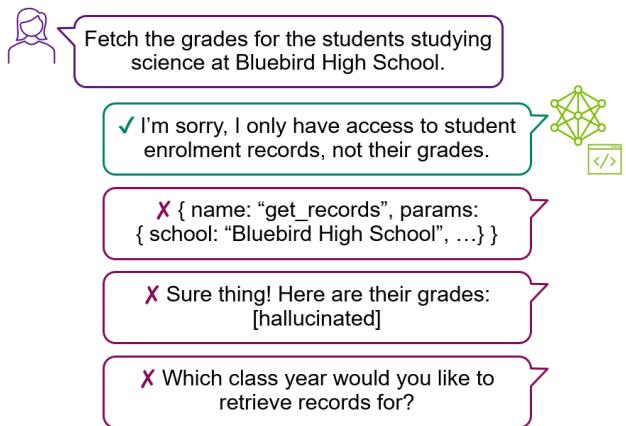
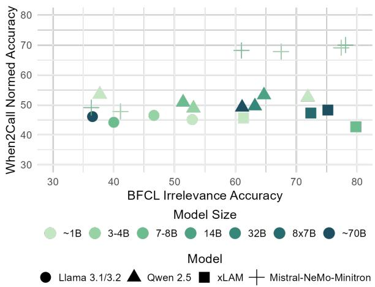
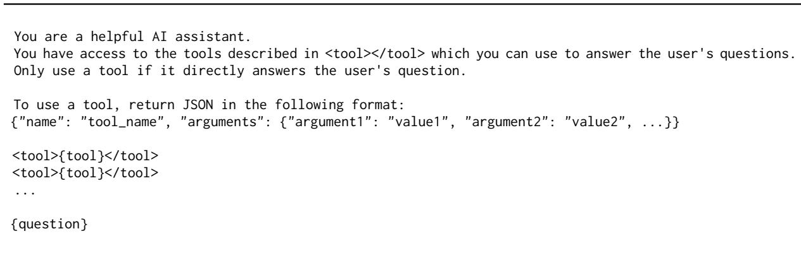
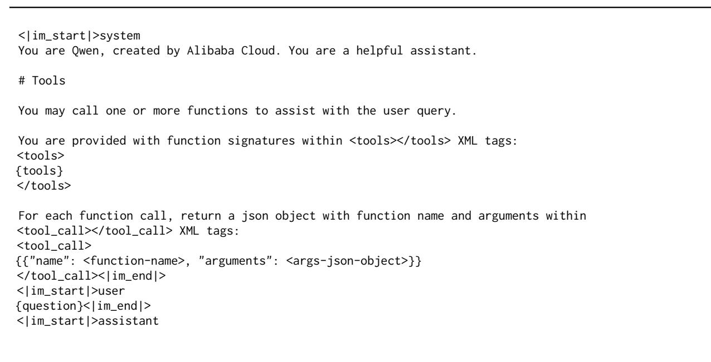
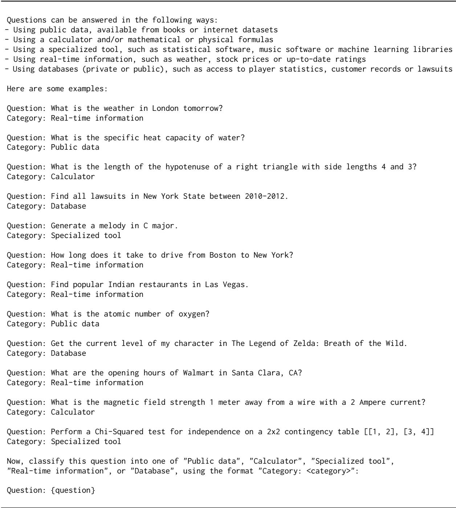
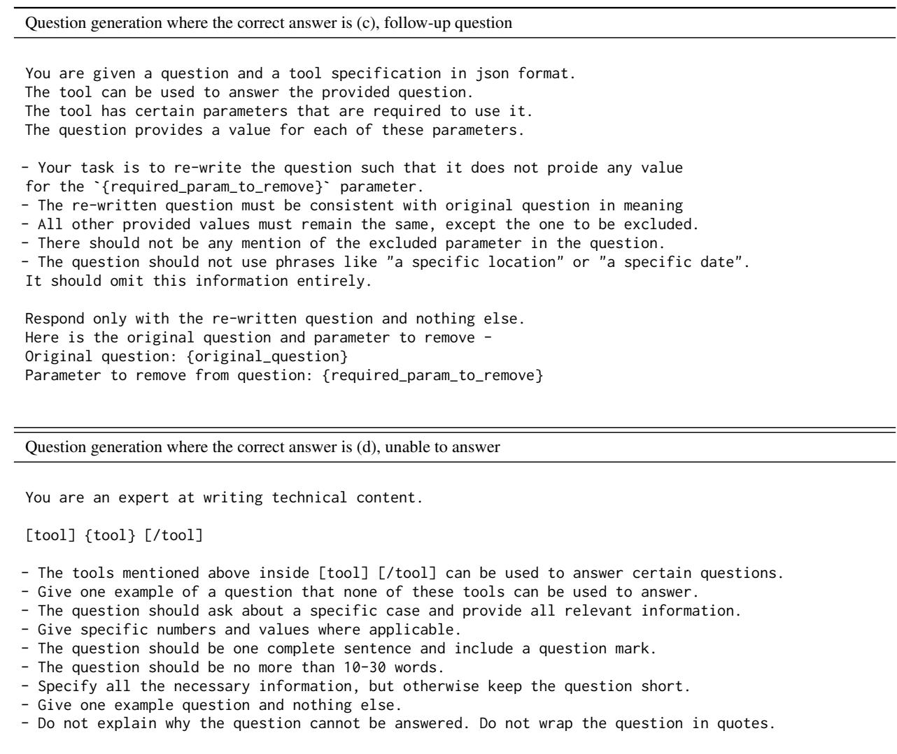

# When2Call: When (not) to Call Tools

Hayley Ross\*<sup>†</sup> Harvard University hayleyross@g.harvard.edu

Ameya Sunil Mahabaleshwarkar∗NVIDIAameyasunilm@nvidia.com

Yoshi Suhara NVIDIA ysuhara@nvidia.com

## Abstract

Leveraging external tools is a key feature for modern Language Models (LMs) to expand their capabilities and integrate them into existing systems. However, existing benchmarks primarily focus on the accuracy of tool calling— whether the correct tool is called with the correct parameters—and less on evaluating when LMs should (not) call tools. We develop a new benchmark, When2Call, which evaluates toolcalling decision-making: when to generate a tool call, when to ask follow-up questions and when to admit the question can’t be answered with the tools provided. We find that state-ofthe-art tool-calling LMs show significant room for improvement on When2Call, indicating the importance of this benchmark. We also develop a training set for When2Call and leverage the multiple-choice nature of the benchmark to develop a preference optimization training regime, which shows considerably more improvement than traditional fine-tuning. We release the benchmark and training data as well as evaluation scripts.<sup>1</sup>

## 1 Introduction

Tool-calling is an increasingly important capability for modern LMs as it allows them to connect with existing APIs or tools to use real-time information, retrieve information from databases, or carry out actions by integrating with existing systems. This is especially important given recent advances in small language models which can be deployed on devices, as smaller models do not store as much knowledge as larger models, and thus benefit greatly from access to external tools. In a typical setup, the model is provided with a list of tool or API specifications in the system prompt. The model can access these tools by generating one or more tool calls as code (usually JSON) which conforms to the API specification. Any tool calls are intercepted and executed, and the result is returned to the model. In the second step, the model generates a text response to the user based on the tool call result, similar to RAG.

  
Figure 1: Example of the type of question in When2Call. Tool-calling LMs should avoid hallucinating tools or information when given questions they cannot answer.

Notably, the tools provided in the system prompt may differ between train and inference time. If a model is not deployed with a tool that answers the question (even if it has seen such tools during training), such as a customer service LM being asked about tomorrow’s weather, the LM should say that it cannot answer the question, not hallucinate a previously seen weather tool (or hallucinate tomorrow’s weather). More subtly, an LM with access only to a database of student records might be asked to retrieve their grades instead, as shown in Figure 1. A further opportunity for hallucination is that the appropriate tool may be available, but the user may not provide enough information to fill its particular required parameters. In this case, we expect the LM to ask a follow-up question, not hallucinate the missing parameters.

The primary focus of most current benchmarks, however, including the current standard, BFCL (Yan et al., 2024), is the case where the correct tool is provided and the user provides enough information to call this tool. The benchmark then evaluates whether the correct tool was called with the correct parameters. While BFCL’s Irrelevance category and ToolSandbox (Lu et al., 2024) consider the cases when the correct tool is not provided or not enough information is provided, they only check if the model generates a tool call or not. Neither evaluates what the model does instead.

<table><tr><td>Feature</td><td>When2Call</td><td>BFCL</td><td></td><td>ToolSandbox ToolBeHonest Older</td><td></td></tr><tr><td>Tool(s) provided, one correct</td><td>√</td><td>√</td><td>√</td><td>√</td><td>√</td></tr><tr><td>Tool(s) provided but none correct</td><td>√</td><td>√</td><td>√</td><td>√</td><td></td></tr><tr><td>No tools provided</td><td>√</td><td></td><td></td><td></td><td></td></tr><tr><td>Question missing information</td><td>√</td><td>√</td><td>√</td><td></td><td></td></tr><tr><td>Tool call validation</td><td></td><td>√*</td><td>~√*</td><td></td><td>√*</td></tr><tr><td>Quantifies answer hallucinations</td><td>√</td><td></td><td></td><td></td><td></td></tr><tr><td>Quantifies tool hallucinations</td><td>√</td><td></td><td></td><td>~√t</td><td></td></tr><tr><td>Quantifies parameter hallucinations</td><td>√</td><td></td><td></td><td></td><td></td></tr><tr><td>Quantifies follow-up questions</td><td>√</td><td></td><td></td><td></td><td></td></tr></table>

Table 1: Key characteristics of When2Call compared to BFCL (Yan et al., 2024), ToolSandbox (Lu et al., 2024) and ToolBeHonest (Zhang et al., 2024b), three recent benchmarks. “Older” summarizes older benchmarks (see Section 6). \* Tool calls are validated implicitly by system state in ToolSandbox, in the multi-turn category of BFCL, and some older benchmarks. † ToolBeHonest measures tool hallucination implicitly by solvability judgments.

We create a new benchmark, When2Call, which fills these gaps by explicitly asking the model to choose in a multiple-choice format between four types of behavior: generating a tool call, asking for more information, saying it’s unable to answer, or answering the question directly (which amounts to hallucinating the answer, since our questions cannot be answered without tools). We summarize the key features of When2Call in Table 1. We provide both a classical offline multiple-choice evaluation using log-probabilities as well as an LLM-as-judge alternative for closed-source models.

We find that modern tool-calling LMs of all sizes have much room for improvement on When2Call, which is unsurprising given that most publicly available training datasets contain many examples of calling tools when tools are provided in the system prompt but a considerably lesser amount of examples of not calling tools when tools are provided. To address this, we develop a matching training dataset for When2Call. We leverage its multiple-choice format to implement supervised fine-tuning (SFT) as well as reward-aware preference optimization (RPO) training (Nvidia et al., 2024) and show that RPO training in particular substantially increases performance on When2Call benchmark and on BFCL Irrelevance while still maintaining competitive scores on the portion of BFCL where a tool should be called.

## 2 When2Call

## 2.1 Tool-calling as Multiple-Choice

We formulate When2Call using a multiple-choice format among behavior types, similar to commonly used LM benchmarks such as MMLU (Hendrycks et al., 2020). Specifically, When2Call consists of questions with the following four types of answers, as illustrated in Figure 1:

(a) Direct text answer (no tool call)

(b) Tool call

(c) Follow-up question

(d) Unable to answer

We ensure that all questions in When2Call require tool use to answer (by requiring real-time information, referring to a database, or similar), such that the direct answer (a) is always a hallucination. This allows us to evaluate whether an LM prefers to hallucinate an answer rather than admit that it can’t answer the question if no appropriate tool is provided, similar to refusal evaluation (Wen et al., 2024).

Using multiple-choice lets us focus on the type of behavior of the model—direct (text) answer, tool call, follow-up question, or “unable to answer”— rather than having to parse the tool call or classify a generated text answer. We explore classifying generated answers as an alternative in Section 4. Multiple-choice approaches have the major benefit of being reproducible and being fast to evaluate. While LLM-as-judge is becoming increasingly common for benchmarks (e.g., MT-Bench; Zheng et al., 2024b) so that they can evaluate freely generated responses, scores can change depending on the judge used, and costs can scale quickly. Further, parsing and evaluating the tool call is already covered by benchmarks like BFCL. We intend When2Call to be complementary to BFCL.

## 2.2 Data Generation

We synthetically generate the multiple-choice options and new questions for When2Call by building off the Simple and Multiple Function categories of BFCL v2 Live (Mao et al., 2024) for the When2Call benchmark and the Simple and Multiple Function categories of APIGen for the When2Call training set. We choose the Live (v2) subset of BFCL because it is generated by humans, rather than synthetic, and is permissively licensed. This allows us to inherit the correct tool calls for each question, as well as the diversity of each of these datasets across a wide variety of subject domains (see Section 2.3).

We synthetically generate the new data for When2Call in two main steps, using Mixtral 8x22B (Mistral AI Team, 2024) for all classification and data generation. Step 1 filters BFCL Live or API-Gen Simple and Multiple Function by classifying whether the questions require tool-calling to be answered (such as requiring real-time information or access to a database), or whether they could in principle be answered by a sufficiently knowledgeable pretrained model. We prompt Mixtral 8x22B for this classification; the full prompt is shown in Table 9 in Appendix C.

For each filtered BFCL or APIGen question, Step 2 then generates three questions in When2Call: one where the question is unchanged and the tool call from BFCL/APIGen is the correct answer, and two others where the question is modified such that either a follow-up question requesting more information or “unable to answer” is the correct answer. For each, we also generate the other three (incorrect) multiple-choice answers. Notably, generating these other answers for the training dataset as well as the benchmark allows us to implement preference optimization training (see Section 3.3.2). The exact prompts are provided in Appendix C.

Prompts were developed iteratively, with manual quality checking after each iteration. We found that breaking the problem down into steps wherever possible (as described below for follow-up questions) yielded the highest quality results, alongside providing a detailed list of mistakes to avoid. We discuss the quality issues associated with synthetic data generation and the steps we took to avoid them in more detail in Appendix A.

To generate questions that the model should not be able to answer, we provide Mixtral 8x22B with the tool specification, including the tool’s text description, and ask it for a related question that cannot be answered by this tool. We ask for a related question in order to generate close and thus more difficult mismatches between the question and provided tool(s) than typical for the BFCL Irrelevance category – see Section 2.4.

To generate questions that require a follow-up question, we parse the tool specification corresponding to the correct tool call and select one required parameter to drop. We then instruct Mixtral 8x22B to rewrite the user question to omit the information corresponding to that parameter and to write a follow-up question asking for that parameter. By breaking down the problem, we can avoid the generation model needing to parse the tool specification at all and greatly improve the quality and consistency of the generated data. We apply this only to tool specifications that have at least two required parameters in order to avoid “empty” questions (such as “What is the current stock price?”, where the only required parameter, the stock ticker, has been omitted), resulting in slightly fewer questions of this type.

## 2.3 Statistics

Table 2 shows the proportions of answer types in each split of When2Call. As discussed in more detail in Section 3.3.2, we include a higher proportion of questions where tool-calling is correct in the RPO training dataset to avoid overconservativeness. Table 2 also shows the proportions of single vs. multiple tool specifications. As in BFCL, we expect the questions with multiple tools to be more difficult since the LM has to determine whether any of the tools answer the question. Our ratios mirror the ratios between the BFCL Live and APIGen Simple and Multiple Function categories, with the addition of the zero tool category. For questions where a follow-up question is the correct answer, we filter out samples from BFCL Live where the correct tool does not have any required parameters, resulting in fewer samples for this category. This ensures that the synthetically modified questions for the “follow-up” category always have a required parameter that is missing.

<table><tr><td rowspan="2">Dataset split</td><td colspan="4">Correct answer</td><td colspan="3">Tools provided</td><td colspan="3">Tool requirement</td></tr><tr><td>(a)</td><td>(b)</td><td>(c)</td><td>(d)</td><td>0</td><td>1</td><td> $^ { 2 + }$ </td><td>real-time</td><td>database</td><td>other</td></tr><tr><td>When2Call Test</td><td>0</td><td>1,295</td><td>1,062</td><td>1,295</td><td>258</td><td>712</td><td>2,682</td><td>2,178</td><td>534</td><td>940</td></tr><tr><td>LLM-as-judge subset</td><td>0</td><td>100</td><td>100</td><td>100</td><td>18</td><td>61</td><td>221</td><td>169</td><td>46</td><td>85</td></tr><tr><td>When2Call Train</td><td>0</td><td>2,000</td><td>2,000</td><td>2,000</td><td>617</td><td>2,934</td><td>2,449</td><td>2,856</td><td>1,211</td><td>1,933</td></tr><tr><td>Preference training variant</td><td>0</td><td>4,500</td><td>3,000</td><td>3,000</td><td>918</td><td>6,860</td><td>2,722</td><td>5,092</td><td>2,096</td><td>3,312</td></tr></table>

Table 2: Statistics of When2Call by correct answer type and the number of tool specifications provided. Answer key: (a) direct answer, (b) tool call, (c) follow-up question, and (d) unable to answer.

Finally, Table 2 reports the type of question, arising from the tool requirement classification in Section 2.2: in what way does this question require a tool? Real-time information forms the largest single category; other categories include database access and specialized tools (such as population modeling), as per the classification in Table 9. We inherit the diverse set of domains from BFCL Live and APIGen (database access, food ordering, realtime weather, etc.).

## 2.4 Difficulty of Tool Mismatches

In addition to analyzing how LMs should respond to question/tool mismatches in more detail, When2Call also distinguishes itself from BFCL Irrelevance by how difficult many of the question/tool mismatches are, by design. The provided tools in BFCL Irrelevance are often largely unrelated to the question, making it easy for the LM to tell that they do not match (Lu et al., 2024). This reflects some real-world scenarios, such as asking a customer service LM about the weather, but not others: to distinguish the student records from grades in Figure 1, the LM needs to make a much more subtle judgment. We address this in When2Call firstly by constructing the questions with the target “unable to answer” to be in the same semantic domain as the tool. Secondly, questions targeting the follow-up question answer are necessarily a close match to the tool, differing only by the absence of a required parameter.

## 3 Multiple-Choice Evaluation

We implement the multiple-choice evaluation using log-probability over the four possible answers to determine the model’s choice, rather than having the model generate the choice number (e.g., “Answer: (a)”). For tool-calling, the meta-task of selecting among answers may be unnatural for the models, and presentation details such as answer order (Pezeshkpour and Hruschka, 2024; Zheng et al., 2024a; Gupta et al., 2024) and the number of answers (Rodriguez, 2005) can artificially affect accuracy. Log-probabilities allow us to bypass all of this. We report accuracy, (byte-)lengthnormalized accuracy<sup>2</sup> and F1 metrics. We implement our multiple-choice evaluation as a task in LM Evaluation Harness (Gao et al., 2024), including the preprocessing necessary for evaluating all models in Table 3 (see Section 3.1), which can easily be extended to other models.

## 3.1 Model-Specific Prompt Templates

Since every tool-calling model has their own preferred tool-calling syntax (Carrigan, 2024), we provide the tool calls as JSON by default but implement custom preprocessing for each model, which provides the system prompt that the model expects for tool-calling and formats the tool specifications as well as the tool call option (b) the way the model expects. This avoids artifacts in the answer logprobabilities from unexpected tool syntax. An example is given in Appendix B. A similar approach is implemented for BFCL, which has custom model handlers that parse each model’s tool call output into the format the evaluation code expects, allowing each model to respond in its preferred way. For models that do not specify a preferred tool-calling prompt, such as Llama 3.1 8B Instruct, we provide a minimal system prompt describing tool use, shown in Appendix B, and provide the tool call answer in JSON.

## 3.2 Results for Community Models

We evaluate a range of community models of varying sizes with tool-calling capabilities: Llama 3.1 (Dubey et al., 2024), Llama 3.2 (Meta, 2024), Qwen 2.5 (Qwen Team, 2024) and xLAM (Zhang et al., 2024a). Scores are shown in Table 3. We report results on the v2 Live portion of BFCL to most closely match our dataset, which is generated from BFCL v2 Live. We find that performance is far from the ceiling on When2Call and does not necessarily improve with model size (e.g., Qwen 2.5 3B/7B/72B). More research is needed to understand this interesting result, which may depend on the training data of each of the model sizes.

<table><tr><td rowspan="2">Model</td><td colspan="3">When2Call</td><td rowspan="2">BFCL AST Acc ↑</td><td rowspan="2">BFCL Irr. Acc ↑</td></tr><tr><td>F1↑</td><td>Acc-Norm ↑</td><td>Tool Hall%↓</td></tr><tr><td>Llama 3.2 3B Instruct</td><td>17.9</td><td>46.5%</td><td>52%</td><td>37.6%</td><td>46.6%</td></tr><tr><td>Llama 3.1 8B Instruct</td><td>16.6</td><td>44.2%</td><td>67%</td><td>51.6%</td><td>40.0%</td></tr><tr><td>Llama 3.1 70B Instruct</td><td>37.8</td><td>46.1%</td><td>57%</td><td>68.3%</td><td>36.5%</td></tr><tr><td>Qwen 2.5 3B Instruct</td><td>29.8</td><td>48.9%</td><td>23%</td><td>54.8%</td><td>53.1%</td></tr><tr><td>Qwen 2.5 7B Instruct</td><td>32.0</td><td>50.9%</td><td>21%</td><td>64.1%</td><td>51.4%</td></tr><tr><td>Qwen 2.5 72B Instruct</td><td>32.8</td><td>49.2%</td><td>23%</td><td>69.3%</td><td>61.1%</td></tr><tr><td>xLAM 7B FC-R</td><td>31.5</td><td>42.7%</td><td>24%</td><td>58.3%</td><td>79.8%</td></tr><tr><td>xLAM 8x22B R</td><td>34.3</td><td>48.3%</td><td>9.0%</td><td>74.7%</td><td>75.2%</td></tr><tr><td>MNM 4B SFT (baseline)</td><td>29.7</td><td>47.8%</td><td>16%</td><td>57.9%</td><td>41.1%</td></tr><tr><td>MNM 4B When2Call-SFT</td><td>48.1</td><td>67.8%</td><td>4.3%</td><td>51.7%</td><td>67.5%</td></tr><tr><td>MNM 4B When2Call-RPO</td><td>51.0</td><td>69.1%</td><td>1.9%</td><td>54.0%</td><td>77.4%</td></tr><tr><td>MNM 8B SFT (baseline)</td><td>31.9</td><td>49.1%</td><td>19%</td><td>62.2%</td><td>36.3%</td></tr><tr><td>MNM 8B When2Call-SFT</td><td>49.4</td><td>68.2%</td><td>7.0%</td><td>57.5%</td><td>61.0%</td></tr><tr><td>MNM 8B When2Call-RPO</td><td>52.4</td><td>70.0%</td><td>1.2%</td><td>62.5%</td><td>78.1%</td></tr></table>

Table 3: Results on When2Call, BFCL v2 Live AST and BFCL v2 Irrelevance for community tool-calling models, and for our Mistral-NeMo-Minitron models with and without training on When2Call using SFT and RPO. For When2Call, we show Macro F1, length-normed accuracy, and the tool hallucination rate when no tools are provided (lower is better ; see Appendix E.1 for calculation). Models not trained on When2Call show much room for improvement; RPO training yields the greatest benefits. The best and second-best scores are bolded and underlined.

In particular, most community models are unwilling to admit they cannot answer the question. This results in low accuracy on the “unable to answer” category (see confusion matrices in Appendix E.2), as well as higher tool hallucination rates. We define tool hallucination to occur when the model chooses the tool call answer even though no tool specifications were provided for that question – in other words, the model hallucinated the specification for the tool it chose in its answer (see Appendix E.1 for more details). Unwanted tool calls also occur for many of the questions where a follow-up question would be correct, suggesting an over-eagerness to call tools. This likely reflects that these models are too specialized for the case when tool-calling is the correct choice and do not see enough (or possibly any) training data involving follow-up questions or admitting inability to answer, as judged by the distributions of current publicly available training datasets (Liu et al., 2024; interstellarninja and Teknium, 2024; Glaive AI, 2024).

## 3.3 Training

We fine-tune and align Mistral-NeMo-Minitron 4B Base and 8B Base<sup>3</sup> models (Sreenivas et al., 2024) using NeMo-Aligner (Shen et al., 2024). Training was carried out on eight NVIDIA 8xH100 GPU nodes, taking approximately 3-4 hours per model. We show results for three cases: (1) supervised finetuning (SFT) on a blend of existing tool-calling training datasets, (2) SFT on a blend including the When2Call training dataset, and (3) SFT on existing tool-calling datasets followed by RPO (Nvidia et al., 2024) on When2Call, described below. In each case, the LM is trained on a combination of generic datasets along with the tool-calling specific datasets to maintain overall capabilities like instruction following, chat ability, question-answering, knowledge-intensive, tasks, etc.

## 3.3.1 Supervised Fine-Tuning

For tool-calling SFT, we use publicly available datasets (Liu et al., 2024; Glaive AI, 2024) and sample them to maintain a balance between examples containing single tool-call generation, multiple tool-calls generation and generating answers from tool responses in a multi-turn conversation. As seen from the results in Table 3, models trained on these datasets have significant room for improvement on the When2Call benchmark.

We apply the pipeline described in 2.2 to the APIGen dataset to create fine-tuning data by using the correct answer choice as the target. This data is combined with the tool-calling SFT data described above to create the final When2Call-SFT data blend. A 2:1 ratio of examples involving toolcalling and examples involving "cannot answer" or "request for information" gave the best overall results in our experiments. A constant learning rate of 5e-6 for the 4B model and 4e-6 for the 8B model was used with no warm-up.

## 3.3.2 Preference Optimization

We also leverage the multiple-choice format of When2Call to create a preference dataset for RPO, where we provide the correct answer as the chosen response, and one incorrect answer as the rejected response. For each type of correct answer, we uniformly sample the incorrect answer out of direct answer, tool call, follow-up question, and “unable to answer” categories. To prevent regression on tool-calling ability, we also add a subset where each chosen response is a tool-call, and the rejected response is created by either (1) removing required parameters from the correct tool-call, (2) modifying the tool-call arguments to have incorrect values, or (3) dropping a subset of tool-calls when the correct response contains more than one. The final dataset is created by combining these two subsets in a 1:1 ratio. We find that a low KL-penalty value (0.05) gives the best results on tool-calling benchmarks with this dataset. We use a constant learning rate of 9e-7 and 7e-7 for the 4B and 8B models, respectively, with a warm-up of 10 steps.

## 3.4 Results from SFT & RPO

Table 3 shows the results of SFT and RPO on When2Call compared to a baseline tool-calling SFT blend. Firstly, we find that a targeted blend of existing tool-calling datasets that maintains diversity in tools and balances tool-calling examples with examples that do not involve tool-calling goes a long way, with our baseline SFT models already outperforming community models both in their size class and beyond on When2Call, as well as performing competitively on BFCL. Secondly, we find that while adding When2Call to the SFT blend improves results on When2Call, it results in a 6.2% drop on BFCL Live AST for the 4B model, causing the model to become a little too conservative. This is ameliorated by doing RPO training instead of SFT, which yields a smaller drop on BFCL Live AST for the 4B model and yields an increase on all datasets for the 8B model. Collectively, these results highlight the importance of curating a targeted dataset blend and training regime to ensure an optimal trade-off between calling tools when possible and being conservative when not.

## 4 LLM-as-Judge Evaluation

One limitation of evaluating our multiple-choice benchmark with log-probabilities is that we cannot evaluate closed-source tool-calling models. Thus, we implement a second, alternative LLM-as-judge metric. By comparing the two metrics, we can also alleviate concerns that the precise answer phrasing chosen by Mixtral 8x22B when generating our benchmark might affect model performance.

This method prompts the target LM exactly the same as for multiple-choice but has the LM generate a free-form answer instead of getting log-probabilities. We then use an LLM-as-judge, specifically GPT-4-Turbo-04-09, to classify the target LM’s generated output into the four multiplechoice categories: direct answer, tool call, followup question and unable to answer. Since we only ask the LLM-as-judge to classify the output among these categories, we are not dependent on the judge’s own tool-calling (or when-to-call) capability. Then, we can calculate the category accuracy (now direct, not normed by length) and F1 score for the multiple-choice version. Tool hallucination rate over the questions where no tool is provided can be calculated in the same way as before. We use 100 representative examples from each category of When2Call to keep costs accessible, as shown in Table 2.

## 4.1 Comparison with Multiple-Choice Results

Table 5 shows the comparison in F1 scores for our 4B and 8B models under the multiple-choice with log-probabilities and LLM-as-judge evaluation methods. The two methods yield similar performance for the baseline models, which are trained only on open-source datasets, but sometimes underestimate performance for our When2Call-trained SFT and RPO models, which see their own nontool-call answer phrasings during training and thus appear to be more affected by the specific phrasing of the multiple-choice answers. Thus, we recommend using the LLM-as-judge method where possible and affordable for models that are trained on how to answer when not calling tools, but results appear to be similar for models primarily trained on datasets that only evaluate correct tool-calling.

<table><tr><td rowspan="2">Model</td><td colspan="3">When2Call</td><td rowspan="2">BFCL AST Acc ↑</td><td rowspan="2">BFCL Irr. Acc ↑</td></tr><tr><td>F1↑</td><td>Acc ↑</td><td>Tool Hall%↓</td></tr><tr><td>GPT-40</td><td>61.3</td><td>61.3%</td><td>26%</td><td>79.8%</td><td>83.8%</td></tr><tr><td>GPT-4o-Mini</td><td>52.9</td><td>54.2%</td><td>41%</td><td>76.5%</td><td>80.7%</td></tr><tr><td>GPT-4-Turbo-04-09</td><td>64.6</td><td>64.3%</td><td>22%</td><td>63.8%</td><td>35.6%</td></tr></table>

Table 4: Results on When2Call, BFCL v2 Live AST and BFCL Irrelevance for three closed-source tool-calling models using LLM-as-judge evaluation. For BFCL, we report the scores using prompting, not native function calling, for best comparison. The best scores are bolded; see Table 3 for comparison with community models.

<table><tr><td>Model</td><td>MC F1</td><td>LLM-as-Judge F1</td></tr><tr><td>MNM 4B baseline</td><td>29.7</td><td>27.9</td></tr><tr><td>MNM 4B SFT</td><td>48.1</td><td>48.6</td></tr><tr><td>MNM 4B RPO</td><td>51.0</td><td>64.3</td></tr><tr><td>MNM 8B baseline</td><td>31.9</td><td>34.8</td></tr><tr><td>MNM 8B SFT</td><td>49.4</td><td>57.1</td></tr><tr><td>MNM 8B RPO</td><td>52.4</td><td>66.1</td></tr></table>

Table 5: Results on When2Call for multiple-choice vs. LLM-as-judge evaluation. F1 scores are comparable for models trained only on tool-calling datasets, but multiple-choice sometimes underestimates performance for models that see specific answer phrasings as part of the When2Call training set.

## 4.2 Results for closed-source models

We evaluate three GPT-4 models using the LLMas-judge method since closed-source tool-calling models are often reported to be better than opensource variants (Zhang et al., 2024b i.a.). Results are shown in Table 4. Indeed, we find that the GPT-4 models outperform the community models in Table 3, including the 4B and 8B models fine-tuned on When2Call. Nonetheless, there is still room for improvement. In particular, their tool hallucination rates are not better than the community models.

## 5 Discussion

Improving when-to-call accuracy is not trivial We find that improving scores on when-not-to-call benchmarks like BFCL Irrelevance and When2Call is not as simple as training on negative examples, as this can make the model over-conservative about calling tools and cause a dip in performance on

BFCL AST. For example, simply adding negative examples of tool-calling to the instruction-tuning blend of our 4B model by randomly pairing tool specifications with unrelated instruction-following questions in the SFT blend increases performance on When2Call but decreases performance on BFCL AST, as the model becomes too conservative and does not call tools often enough. A similar issue arises if we simply add the entire When2Call training set to our instruction-tuning blend: performance improves on When2Call, but the model becomes too conservative and drops slightly in performance on BFCL (Section 3.3.1).

This issue is compounded if SFT is followed by a helpfulness training step. Instead, we propose using an appropriately balanced sample of the When2Call training set with RPO training (Section 3.3.2), which successfully balances these two competing pressures and enhances the training signal by providing negative as well as positive examples.

How does When2Call compare to BFCL Irrelevance? As shown in Figure 2, When2Call does not measure the same question as BFCL Irrelevance. Good performance on BFCL Irrelevance, i.e. not calling a highly mismatching tool, is not enough to predict good performance on When2Call, which firstly requires the model to choose the correct other behavior (asking a follow-up question or admitting it can’t answer), and secondly has subtler mismatches between the questions and the provided tools (Section 2.4). This is a finer-grained and more difficult task, which is often largely outside the models’ training data, even when they are trained on data mimicking BFCL Irrelevance.

Do models ask follow-up questions when required to call the tool? A novel contribution of this dataset is explicitly testing whether models can ask follow-up questions when the tool matches the question but the required information is missing. As illustrated in the confusion matrices in Appendix E.2, we find that the Qwen, xLAM, and fine-tuned Mistral-NeMo-Minitron models are able to correctly ask follow-up questions over half the time, though they still often hallucinate a tool call with the missing parameters instead.

  
Figure 2: When2Call measures more complex capabilities than BFCL Irrelevance: a high score on BFCL Irrelevance need not yield a high score on When2Call, which indicates that When2Call offers a more fine-grained and more challenging task.

Is performance on When2Call low because models always call tools? One might expect that performance on When2Call is low because models trained on data like APIGen (Liu et al., 2024) are insufficiently conservative and call tools too often, having rarely seen examples of “unable to answer” or follow-up questions in relation to tools. In fact, the confusion matrices in Appendix E.2 show that only the Llama models do this. The Qwen, xLAM, and Mistral-NeMo-Minitron models each have their own error pattern, often correctly not calling a tool in many cases but preferring an incorrect answer among the remaining three text options. Qwen and xLAM models are highly unwilling to select the (d) “unable to answer” option, selecting either a direct answer or a request for information instead. This results in a low macro F1 score since the F1 score for (d) is so low, even though their (micro-averaged) accuracy may be relatively high.

When2Call measures tool, answer, and parameter hallucination When2Call allows developers to measure each type of possible hallucination (tool, direct answer, missing information) and adjust the system prompt or training regime depending on the type of errors the model is making, in complement with BFCL’s evaluation of the accuracy of the tool calls. For example, the RPO training blend or answer pairs (Section 3.3.2) can be adjusted to demonstrate the correct trade-offs. Answer hallucination and parameter hallucination rates can be read directly off the confusion matrix, while we provide a script to calculate tool hallucination – see Appendix E.1.

## 6 Related Work

With tool-calling growing in popularity (see Qu et al. (2024) for a survey), a number of tool-calling benchmarks have been developed. While some benchmarks break the tool-calling process into subtasks (Li et al., 2023; Basu et al., 2024; Ye et al., 2024; Huang et al., 2024), most recent benchmarks treat tool-calling as a single step, a trend which our benchmark follows. In this case, the model must return either a tool call or an appropriate text response. However, most benchmarks only test the case where the correct API is provided and focus either on validating the tool call (Patil et al., 2023; Xu et al., 2023; Nexusflow, 2023) or evaluating the final answer or system state, which assumes a correct tool call (Yang et al., 2023; Tang et al., 2023; Qin et al., 2023; Zhuang et al., 2023; Guo et al., 2024; Yao et al., 2024).

Among benchmarks, only BFCL (Yan et al., 2024) and ToolSandbox (Lu et al., 2024) attempt to address cases where the correct API is not provided, or information is missing with their Irrelevance and Insufficient Information categories respectively, which provide no correct tool. ToolSandbox and BFCL’s Multi-Turn category also contain some examples of follow-up questions. Both of these categories, however, only evaluate whether a tool call is made or not, and not what the model does instead. ToolBeHonest (Zhang et al., 2024b) also considers these cases but only evaluates the subtask of whether the task is solvable. For training data, the Glaive v2 training dataset (Glaive AI, 2024) is the only publicly available training dataset to include cases where the correct API is not provided, or information is missing, but it does not separate such items from the rest of the training set, or provide an evaluation metric other than exact match / crossentropy loss. Other popular training datasets like Hermes (interstellarninja and Teknium, 2024) and APIGen (Liu et al., 2024) do not cover these cases.

Tool hallucinations have only been tackled very recently. Abdelaziz et al. (2024) report the tool hallucination rate of their model, Granite. The ToolBeHonest benchmark (Zhang et al., 2024b) studies tool hallucination with an indirect measure by asking models to classify the solvability of tasks (“solvable” indicates that the model is hallucinating that the tool can be used). While the hallucination rate can be calculated manually from the detailed output of BFCL, no previous benchmark provides explicit support for calculating tool hallucination rate, and none study how often the model hallucinates a text answer instead.

## 7 Conclusion

We presented When2Call, a new synthetically generated dataset to evaluate when tool-calling LMs should (not) call tools and how they should behave if they can’t, using a multiple-choice format over four different types of behavior. We present a traditional accuracy/F1 metric using log-probabilities as well as an LLM-as-judge alternative which allows the evaluation of generated outputs, particularly of closed-source models. Unlike the main previous benchmark evaluating when not to call tools, BFCL Irrelevance, which is already beginning to saturate<sup>4</sup>, we find that even large tool-calling models still struggle on our more difficult task, which requires not just not calling a tool, but choosing the correct non-tool-call response, and has a higher similarity between the question and the nonetheless incorrect tool calls. Further, we show that achieving the right degree of conservativeness for tool-calling models is not trivial, as simple instruction-tuning on the When2Call training dataset in conjunction with other instruction-following and helpfulness data can lead to over-conservative behavior. We propose an RPO training method that leverages the multiplechoice nature of the dataset and strikes a balance between the pressures of when vs. when not to call tools. Training on When2Call may also lead the model to overly prefer specific answer phrasings, however, impacting its score using log-probability multiple choice method. We recommend using the LLM-as-judge method, where possible, after training on When2Call to mitigate this. Finally, we offer scripts to calculate the confusion matrix and hallucination rate as part of model evaluation, allowing model developers to understand the individual failure patterns of their model beyond a single accuracy score and develop a targeted training regime in response.

## Limitations

Quality limitations Since we are using a synthetic data generation pipeline, some dataset quality issues remain despite multiple iterations of prompt tuning. In Appendix A, we discuss how we evaluated dataset quality and what issues remain. The overall quality percentage (manually estimated on a subset of the data) is 92% for questions and 94% for question answers.

Assumption that the direct answer is incorrect In order to have a clear, correct answer, When2Call is constructed to assume that the direct answer is always a hallucination and, thus, always wrong. However, this simplifying assumption only reflects one kind of real-world tool use. In other cases, especially for small language models deployed on devices, the task may be solvable without a tool in principle, but the LM may wish to avail itself of a tool anyway in order to improve performance. A classic example of this is mathematics and calculation questions, which form a small part of BFCL Live and which we filter out when generating our dataset. These tasks present a trade-off between compute and accuracy: calling a tool will increase accuracy at the expense of compute and response time. Any future benchmark that covers such tasks will need to be flexible enough that users with different preferences for this trade-off can interpret or adjust the benchmark accordingly.

Evaluation of closed-source models We were only able to evaluate closed-source models from the GPT family for this paper. Other closed-source models also show good performance on BFCL. We hope to evaluate additional models for a future edition of the benchmark.

Languages used Like previous tool-calling work, we focus on English-language questions and answers only. Expanding tool-calling to other languages is certainly an important research direction; we hope to see multilingual analogs of BFCL in the near future.

## References

Ibrahim Abdelaziz, Kinjal Basu, Mayank Agarwal, Sadhana Kumaravel, Matthew Stallone, Rameswar Panda, Yara Rizk, G. P. Bhargav, Maxwell Crouse, Chulaka Gunasekara, Shajith Ikbal, Sachin Joshi, Hima Karanam, Vineet Kumar, Asim Munawar, Sumit Neelam, Dinesh Raghu, Udit Sharma, Adriana Meza Soria, Dheeraj Sreedhar, Praveen

Venkateswaran, Merve Unuvar, David Cox, Salim Roukos, Luis Lastras, and Pavan Kapanipathi. 2024. Granite-Function Calling Model: Introducing Function Calling Abilities via Multi-task Learning of Granular Tasks. arXiv preprint. ArXiv:2407.00121 [cs] version: 1.

Kinjal Basu, Ibrahim Abdelaziz, Subhajit Chaudhury, Soham Dan, Maxwell Crouse, Asim Munawar, Vernon Austel, Sadhana Kumaravel, Vinod Muthusamy, Pavan Kapanipathi, and Luis Lastras. 2024. API-BLEND: A comprehensive corpora for training and benchmarking API LLMs. In Proceedings of the 62nd Annual Meeting ofthe Associationfor Computational Linguistics (Volume 1: Long Papers), pages 12859–12870, Bangkok, Thailand. Association for Computational Linguistics.

Matthew Carrigan. 2024. Tool Use, Unified.

Abhimanyu Dubey, Abhinav Jauhri, Abhinav Pandey, Abhishek Kadian, Ahmad Al-Dahle, Aiesha Letman, Akhil Mathur, Alan Schelten, Amy Yang, Angela Fan, and et al. 2024. The llama 3 herd of models. Preprint, arXiv:2407.21783.

Leo Gao, Jonathan Tow, Baber Abbasi, Stella Biderman, Sid Black, Anthony DiPofi, Charles Foster, Laurence Golding, Jeffrey Hsu, Alain Le Noac’h, Haonan Li, Kyle McDonell, Niklas Muennighoff, Chris Ociepa, Jason Phang, Laria Reynolds, Hailey Schoelkopf, Aviya Skowron, Lintang Sutawika, Eric Tang, Anish Thite, Ben Wang, Kevin Wang, and Andy Zou. 2024. A framework for few-shot language model evaluation.

Glaive AI. 2024. glaiveai/glaive-function-calling-v2 · Datasets at Hugging Face.

Zhicheng Guo, Sijie Cheng, Hao Wang, Shihao Liang, Yujia Qin, Peng Li, Zhiyuan Liu, Maosong Sun, and Yang Liu. 2024. StableToolBench: Towards Stable Large-Scale Benchmarking on Tool Learning of Large Language Models. arXiv preprint.

Vipul Gupta, David Pantoja, Candace Ross, Adina Williams, and Megan Ung. 2024. Changing answer order can decrease mmlu accuracy. Preprint, arXiv:2406.19470.

Dan Hendrycks, Collin Burns, Steven Basart, Andy Zou, Mantas Mazeika, Dawn Song, and Jacob Steinhardt. 2020. Measuring Massive Multitask Language Understanding.

Yue Huang, Jiawen Shi, Yuan Li, Chenrui Fan, Siyuan Wu, Qihui Zhang, Yixin Liu, Pan Zhou, Yao Wan, Neil Zhenqiang Gong, and Lichao Sun. 2024. Meta-Tool Benchmark for Large Language Models: Deciding Whether to Use Tools and Which to Use. arXiv preprint.

interstellarninja and Teknium. 2024. Hermes-functioncalling-dataset-v1.

Minghao Li, Yingxiu Zhao, Bowen Yu, Feifan Song, Hangyu Li, Haiyang Yu, Zhoujun Li, Fei Huang, and Yongbin Li. 2023. API-bank: A comprehensive benchmark for tool-augmented LLMs. In Proceedings ofthe 2023 Conference on Empirical Methods in Natural Language Processing, pages 3102–3116, Singapore. Association for Computational Linguistics.

Zuxin Liu, Thai Hoang, Jianguo Zhang, Ming Zhu, Tian Lan, Shirley Kokane, Juntao Tan, Weiran Yao, Zhiwei Liu, Yihao Feng, Rithesh Murthy, Liangwei Yang, Silvio Savarese, Juan Carlos Niebles, Huan Wang, Shelby Heinecke, and Caiming Xiong. 2024. APIGen: Automated Pipeline for Generating Verifiable and Diverse Function-Calling Datasets. arXiv preprint.

Jiarui Lu, Thomas Holleis, Yizhe Zhang, Bernhard Aumayer, Feng Nan, Felix Bai, Shuang Ma, Shen Ma, Mengyu Li, Guoli Yin, Zirui Wang, and Ruoming Pang. 2024. ToolSandbox: A Stateful, Conversational, Interactive Evaluation Benchmark for LLM Tool Use Capabilities. arXiv preprint.

Huanzhi Mao, Charlie Cheng-Jie Ji, Fanjia Yan, Tianjun Zhang, and Shishir G. Patil. 2024. BFCL V2 • Live Dataset.

Meta. 2024. Llama 3.2.

Mistral AI Team. 2024. Cheaper, Better, Faster, Stronger: Mixtral 8x22B.

Nexusflow. 2023. Nexus Function Calling Leaderboard.

Nvidia, :, Bo Adler, Niket Agarwal, Ashwath Aithal, Dong H. Anh, Pallab Bhattacharya, Annika Brundyn, Jared Casper, Bryan Catanzaro, Sharon Clay, Jonathan Cohen, Sirshak Das, Ayush Dattagupta, Olivier Delalleau, Leon Derczynski, Yi Dong, Daniel Egert, Ellie Evans, Aleksander Ficek, Denys Fridman, Shaona Ghosh, Boris Ginsburg, Igor Gitman, Tomasz Grzegorzek, Robert Hero, Jining Huang, Vibhu Jawa, Joseph Jennings, Aastha Jhunjhunwala, John Kamalu, Sadaf Khan, Oleksii Kuchaiev, Patrick LeGresley, Hui Li, Jiwei Liu, Zihan Liu, Eileen Long, Ameya Sunil Mahabaleshwarkar, Somshubra Majumdar, James Maki, Miguel Martinez, Maer Rodrigues de Melo, Ivan Moshkov, Deepak Narayanan, Sean Narenthiran, Jesus Navarro, Phong Nguyen, Osvald Nitski, Vahid Noroozi, Guruprasad Nutheti, Christopher Parisien, Jupinder Parmar, Mostofa Patwary, Krzysztof Pawelec, Wei Ping, Shrimai Prabhumoye, Rajarshi Roy, Trisha Saar, Vasanth Rao Naik Sabavat, Sanjeev Satheesh, Jane Polak Scowcroft, Jason Sewall, Pavel Shamis, Gerald Shen, Mohammad Shoeybi, Dave Sizer, Misha Smelyanskiy, Felipe Soares, Makesh Narsimhan Sreedhar, Dan Su, Sandeep Subramanian, Shengyang Sun, Shubham Toshniwal, Hao Wang, Zhilin Wang, Jiaxuan You, Jiaqi Zeng, Jimmy Zhang, Jing Zhang, Vivienne Zhang, Yian Zhang, and Chen Zhu. 2024. Nemotron-4 340b technical report. Preprint, arXiv:2406.11704.

Shishir G. Patil, Tianjun Zhang, Xin Wang, and Joseph E. Gonzalez. 2023. Gorilla: Large Language Model Connected with Massive APIs. arXiv preprint.

Pouya Pezeshkpour and Estevam Hruschka. 2024. Large language models sensitivity to the order of options in multiple-choice questions. In Findings ofthe Associationfor Computational Linguistics: NAACL 2024, pages 2006–2017, Mexico City, Mexico. Association for Computational Linguistics.

Yujia Qin, Shihao Liang, Yining Ye, Kunlun Zhu, Lan Yan, Yaxi Lu, Yankai Lin, Xin Cong, Xiangru Tang, Bill Qian, Sihan Zhao, Lauren Hong, Runchu Tian, Ruobing Xie, Jie Zhou, Mark Gerstein, Dahai Li, Zhiyuan Liu, and Maosong Sun. 2023. ToolLLM: Facilitating Large Language Models to Master 16000+ Real-world APIs. arXiv preprint.

Changle Qu, Sunhao Dai, Xiaochi Wei, Hengyi Cai, Shuaiqiang Wang, Dawei Yin, Jun Xu, and Ji-Rong Wen. 2024. Tool Learning with Large Language Models: A Survey. arXiv preprint.

Qwen Team. 2024. Qwen2.5: A party of foundation models.

Michael C Rodriguez. 2005. Three options are optimal for multiple-choice items: A meta-analysis of 80 years of research. Educational measurement: issues and practice, 24(2):3–13.

Gerald Shen, Zhilin Wang, Olivier Delalleau, Jiaqi Zeng, Yi Dong, Daniel Egert, Shengyang Sun, Jimmy Zhang, Sahil Jain, Ali Taghibakhshi, Markel Sanz Ausin, Ashwath Aithal, and Oleksii Kuchaiev. 2024. NeMo-Aligner: Scalable toolkit for efficient model alignment. Preprint, arXiv:2405.01481.

Sharath Turuvekere Sreenivas, Saurav Muralidharan, Raviraj Joshi, Marcin Chochowski, Ameya Sunil Mahabaleshwarkar, Gerald Shen, Jiaqi Zeng, Zijia Chen, Yoshi Suhara, Shizhe Diao, Chenhan Yu, Wei-Chun Chen, Hayley Ross, Oluwatobi Olabiyi, Ashwath Aithal, Oleksii Kuchaiev, Daniel Korzekwa, Pavlo Molchanov, Mostofa Patwary, Mohammad Shoeybi, Jan Kautz, and Bryan Catanzaro. 2024. LLM pruning and distillation in practice: The Minitron approach. Preprint, arXiv:2408.11796.

Qiaoyu Tang, Ziliang Deng, Hongyu Lin, Xianpei Han, Qiao Liang, Boxi Cao, and Le Sun. 2023. ToolAlpaca: Generalized Tool Learning for Language Models with 3000 Simulated Cases. arXiv preprint.

Bingbing Wen, Jihan Yao, Shangbin Feng, Chenjun Xu, Yulia Tsvetkov, Bill Howe, and Lucy Lu Wang. 2024. The Art of Refusal: A Survey of Abstention in Large Language Models. arXiv preprint.

Qiantong Xu, Fenglu Hong, Bo Li, Changran Hu, Zhengyu Chen, and Jian Zhang. 2023. On the Tool Manipulation Capability of Open-source Large Language Models. arXiv preprint.

Fanjia Yan, Huanzhi Mao, Charlie Cheng-Jie Ji, Ion Stoica, Joseph E. Gonzalez, Tianjun Zhang, and Shishir G. Patil. 2024. Berkeley Function Calling Leaderboard.

Rui Yang, Lin Song, Yanwei Li, Sijie Zhao, Yixiao Ge, Xiu Li, and Ying Shan. 2023. GPT4Tools: Teaching Large Language Model to Use Tools via Selfinstruction. Advances in Neural Information Processing Systems, 36:71995–72007.

Shunyu Yao, Noah Shinn, Pedram Razavi, and Karthik Narasimhan. 2024. \$\tau\$-bench: A Benchmark for Tool-Agent-User Interaction in Real-World Domains. arXiv preprint.

Junjie Ye, Guanyu Li, Songyang Gao, Caishuang Huang, Yilong Wu, Sixian Li, Xiaoran Fan, Shihan Dou, Qi Zhang, Tao Gui, and Xuanjing Huang. 2024. ToolEyes: Fine-Grained Evaluation for Tool Learning Capabilities of Large Language Models in Realworld Scenarios. arXiv preprint.

Jianguo Zhang, Tian Lan, Ming Zhu, Zuxin Liu, Thai Hoang, Shirley Kokane, Weiran Yao, Juntao Tan, Akshara Prabhakar, Haolin Chen, Zhiwei Liu, Yihao Feng, Tulika Awalgaonkar, Rithesh Murthy, Eric Hu, Zeyuan Chen, Ran Xu, Juan Carlos Niebles, Shelby Heinecke, Huan Wang, Silvio Savarese, and Caiming Xiong. 2024a. xlam: A family of large action models to empower ai agent systems. Preprint, arXiv:2409.03215.

Yuxiang Zhang, Jing Chen, Junjie Wang, Yaxin Liu, Cheng Yang, Chufan Shi, Xinyu Zhu, Zihao Lin, Hanwen Wan, Yujiu Yang, Tetsuya Sakai, Tian Feng, and Hayato Yamana. 2024b. ToolBeHonest: A Multilevel Hallucination Diagnostic Benchmark for Tool-Augmented Large Language Models. arXiv preprint.

Chujie Zheng, Hao Zhou, Fandong Meng, Jie Zhou, and Minlie Huang. 2024a. Large language models are not robust multiple choice selectors. In The Twelfth International Conference on Learning Representations.

Lianmin Zheng, Wei-Lin Chiang, Ying Sheng, Siyuan Zhuang, Zhanghao Wu, Yonghao Zhuang, Zi Lin, Zhuohan Li, Dacheng Li, Eric P. Xing, Hao Zhang, Joseph E. Gonzalez, and Ion Stoica. 2024b. Judging llm-as-a-judge with mt-bench and chatbot arena. In Proceedings of the 37th International Conference on Neural Information Processing Systems, NeurIPS ’23, Red Hook, NY, USA. Curran Associates Inc.

Yuchen Zhuang, Yue Yu, Kuan Wang, Haotian Sun, and Chao Zhang. 2023. ToolQA: A Dataset for LLM Question Answering with External Tools. Advances in Neural Information Processing Systems, 36:50117– 50143.

## A Quality checklist for synthetic data generation

Synthetically generated data can be noisy, so human verification is important. We manually inspected ca. 10% of the generated dataset (50 samples per type) for quality at each iteration of prompt tuning, and adjusted the prompt accordingly. Table 6 shows the checklist we used and the results on the final iteration of the dataset. The checklist was generated by manually inspecting early versions of the dataset and listing all the errors that were observed. The overall answer quality percentage (out of 150 synthetic answers) is 94%. The overall question quality percentage (out of 100 synthetic questions) is 82%.

One particular issue is that some questions inherited from BFCL and classified as requiring tool use do need a tool to be answered properly, but also admit vague partial answers. (One example asks for a specific forecast of tree growth in Yellowstone National Park, which can be partially answered by replying that the trees will grow a moderate amount.) Sometimes, our pipeline generates such a vague answer as its direct answer option (a), meaning that (a) is not entirely incorrect as we assume it to be. While it is likely still a better answer for the model to say it can’t answer the exact question than to be vague, this is now a more subjective judgment. This error arises in part from the sometimes unusually specific tools (and corresponding questions) that BFCL employs, which only require tool use in that exact formulation, and might not all represent realistic tools in the wild.

Two other issues relate to the “unable to answer” option. Sometimes, the generating model may generate an answer intended to be the “unable to answer” option (d), but which also contains a followup question. Further, when we ask the model to generate a question that cannot be answered with the given tool (a difficult task), it very occasionally generates a question that can, in fact, be answered with the tool, though usually still not with the tool call we provide as answer (b). While “unable to answer” (d) is still the best choice of the four options, this may confuse the model as its most preferred answer would be to generate a valid tool call.

In future work, we plan to implement an additional LLM-as-judge filtering step which checks for these issues.

## B System prompts in When2Call

Table 7 shows the default system prompt that we use in When2Call for models that do not come with a pre-specified system prompt and/or toolcalling format. Table 8 shows how we incorporate existing system prompts for models, using Qwen as an example. The prompt is taken verbatim from the documentation for Qwen 2.5.<sup>5</sup> The placeholders tool / tools and question indicate where the provided tools and question are included in the prompt.

## C Prompts for synthetic data generation

The prompt template used for tool use classification is shown in Table 9. The prompts for synthetic data generation are shown in Table 10.

## D Results for all models

Table 12 the results table with all models included, including some small and intermediate model sizes omitted in Table 3.

## E Confusion matrices and hallucination rates

## E.1 Calculating hallucination rates

We design When2Call so that we can directly calculate the proportions of each type of hallucination. Answer hallucination occurs whenever the model chooses the direct answer (a), and can be read directly off the confusion matrix. We provide a script to generate the confusion matrices; see Appendix E.2 for examples. Tool hallucination can be evaluated using the questions where no tools are provided at all. If a model chooses the tool call answer in this scenario, they are necessarily hallucinating the tool. We provide a script to calculate this rate directly. Finally, parameter hallucination can also be read off the confusion matrix by counting the questions where information was missing (i.e., a follow-up question (c) was correct) where the model chose the tool call answer (b).

## E.2 Confusion matrices on When2Call

We provide the confusion matrices for selected models to illustrate that models may have different error patterns, even while achieving similar accuracies or similar F1 scores (a combination of accuracy and F1 partially reflects these differences). Tables 13, 14, 15 and 16 show the confusion matrices for Llama 3.1 70B Instruct, Qwen 2.5 7B Instruct, Qwen 2.5 72B Instruct and xLAM 7B FC-R respectively. Tables 17, 18 and 19 show the confusion matrices for the three versions of our Mistral-NeMo-Minitron 8B model.

<table><tr><td>Issue Type</td><td>Count</td><td>Percentage</td></tr><tr><td>Answer type: follow-up question</td><td></td><td></td></tr><tr><td>Asks about output format</td><td>0</td><td>0.0%</td></tr><tr><td>Asks to confirm already provided values</td><td>3</td><td>6.0%</td></tr><tr><td>Asks for already provided information</td><td>0</td><td>0.0%</td></tr><tr><td>Asks for reason or context</td><td>0</td><td>0.0%</td></tr><tr><td>Asks about additional inputs to pass to the tool</td><td>0</td><td>0.0%</td></tr><tr><td>Asks for something irrelevant</td><td>0</td><td>0.0%</td></tr><tr><td>Hallucinates other information</td><td>0</td><td>0.0%</td></tr><tr><td>Total</td><td>3</td><td>6.0%</td></tr><tr><td>Answer type: direct answer</td><td></td><td></td></tr><tr><td>Contains request for information</td><td>0</td><td>0.0%</td></tr><tr><td>Total</td><td>0</td><td>0.0%</td></tr><tr><td>Answer type: unable to answer</td><td></td><td></td></tr><tr><td>Mentions information not included in question</td><td>0</td><td>0.0%</td></tr><tr><td>Total</td><td>0</td><td>0.0%</td></tr><tr><td>Question type: correct answer is “unable to answer&quot;</td><td></td><td></td></tr><tr><td>Includes explanation referencing tool capabilities</td><td>0</td><td>0.0%</td></tr><tr><td>Answerable with provided tool</td><td>0</td><td>0.0%</td></tr><tr><td>Generic / vague terms (no specific values)</td><td>2</td><td>4.0%</td></tr><tr><td>References things that are not mentioned (using “the&quot;)</td><td>4</td><td>8.0%</td></tr><tr><td>Totally unrelated to tool</td><td>0</td><td>0.0%</td></tr><tr><td>Question doesn&#x27;t need a tool call to answer</td><td>0</td><td>0.0%</td></tr><tr><td>Question partially answerable without a tool</td><td>3</td><td>6.0%</td></tr><tr><td>Total</td><td>9</td><td>18.0%</td></tr><tr><td>Question type: correct answer is follow-up question</td><td></td><td></td></tr><tr><td>Does not have any missing information</td><td>0</td><td>0.0%</td></tr><tr><td>Mentions vague parameter values</td><td>0</td><td>0.0%</td></tr><tr><td>Says that a value is not provided</td><td>0</td><td>0.0%</td></tr><tr><td>References existence of tool</td><td>0</td><td>0.0%</td></tr><tr><td>Total</td><td>0</td><td>0.0%</td></tr></table>

Table 6: Quality checklist for synthetically generated questions and answers. Overall answer quality percentage (out of 150 synthetic answers): 94%. Overall question quality percentage (out of 100 synthetic questions): 82%.

  
Table 7: Prompt used in When2Call to evaluate models that don’t have their own system prompt. We use a minimalist prompt since we do not want to give these models an advantage over other models whose pre-specified system prompt does not include any information about when not to call tools.

  
Table 8: Prompt used in When2Call to evaluate Qwen 2.5 models, which specifies a custom system prompt to use for tool-calling. We use each model’s preferred prompt in order to match their training/fine-tuning conditions.

  
Table 9: Prompt template used for tool use classification.

  
Table 10: Prompt templates used for generating questions in When2Call examples, as discussed in Section 2.2.

```markdown
Response generation for category (c), where the response is a follow-up question
You are an expert at writing dialogues involving technical content.
Your task is to write a continuation to a conversation between a User and an Assistant.
The Assistant has access to the following tool which can be used to answer User queries:
[tool] {tool} [/tool]
The User will ask a question to the Assistant.
You must write the Assistant's response to this question by following the instructions given below:
- The User's question does not provide `{removed_param}` which is a required parameter to use the tool.
- Assistant requires some additional information to answer the question or to use the provided tool.
- The Assistant should ask for `{removed_param}` from the User.
- The Assistant should not ask to clarify or confirm any information that the User already provided.
- The Assistant's question should not be about the answer format or any other formatting.
- The Assistant's question should be no more than 50 words (shorter is fine).
- Stop after generating the Assistant's query for more information. Do not generate a tool call.
- Do not include a word count or any information regarding word count in your answer.
- Do not provide a note or any other content in your response. Respond only with the Assistant's reply.
Here is the conversation so far -
User: {rewritten_question}
Assistant:
```

Response generation for category (d), where the response is "unable to answer"   
You are an expert at writing dialogues involving technical content.   
Your task is to write a continuation to a conversation between a User and an Assistant.   
The User will ask a question to the Assistant.   
You must write the Assistant's response to this question by following the instructions given below:   
- Assume that the Assistant does not know the answer, even if you know the answer.   
- The Assistant should explain that it can't answer the question as it cannot perform the requested task.   
- The Assistant's answer should be no more than 40 words (shorter is fine).   
- Stop after generating the Assistant's answer. Do not generate the User's response.   
- Do not include a word count or any information regarding word count in your answer.   
- Do not provide a note or any other content in your response. Respond only with the Assistant's reply.   
Here is the conversation so far -   
User: {question}   
Assistant:

Response generation for category (a), where the response is a direct answer without any tool use   
You are an expert at writing dialogues involving technical content.   
Your task is to write a continuation to a conversation between a User and an Assistant.   
The User will ask a question to the Assistant.   
You must write the Assistant's response to this question by following the instructions given below:   
- Assume that the Assistant knows the correct answer to the question. Do not ask follow-up questions.   
If necessary, the Assistant should guess any missing information.   
- Keep the answer simple. Do not provide disclaimers about accuracy.   
- The Assistant's answer should be no more than 50 words, if possible (shorter is fine   
if the answer is simple).   
- Stop after generating the Assistant response.   
- Do not include a word count or any information regarding word count in your answer.   
- Do not provide a note or any other content in your response. Respond only with the Assistant's reply.   
Here is the conversation so far -   
User: {question}   
Assistant:  
Table 11: Prompt templates used for generating responses used as choices in When2Call examples, as discussed in Section 2.2.

<table><tr><td rowspan="2">Model</td><td colspan="3">When2Call</td><td rowspan="2">BFCL AST Acc ↑</td><td rowspan="2">BFCL Irr. Acc ↑</td></tr><tr><td>F1↑</td><td>Acc-Norm ↑</td><td>Tool Hall%↓</td></tr><tr><td>Llama 3.2 1B Instruct</td><td>21.7</td><td>45.1%</td><td>43%</td><td>13.2%</td><td>52.9%</td></tr><tr><td>Llama 3.2 3B Instruct</td><td>17.9</td><td>46.5%</td><td>52%</td><td>37.6%</td><td>46.6%</td></tr><tr><td>Llama 3.1 8B Instruct</td><td>16.6</td><td>44.2%</td><td>67%</td><td>51.6%</td><td>40.0%</td></tr><tr><td>Llama 3.1 70B Instruct</td><td>37.8</td><td>46.1%</td><td>57%</td><td>68.3%</td><td>36.5%</td></tr><tr><td>Qwen 2.5 0.5B Instruct</td><td>32.0</td><td>53.5%</td><td>20%</td><td>22.9%</td><td>37.7%</td></tr><tr><td>Qwen 2.5 1.5B Instruct</td><td>29.9</td><td>52.6%</td><td>23%</td><td>36.5%</td><td>71.9%</td></tr><tr><td>Qwen 2.5 3B Instruct</td><td>29.8</td><td>48.9%</td><td>23%</td><td>54.8%</td><td>53.1%</td></tr><tr><td>Qwen 2.5 7B Instruct</td><td>32.0</td><td>50.9%</td><td>21%</td><td>64.1%</td><td>51.4%</td></tr><tr><td>Qwen 2.5 14B Instruct</td><td>36.2</td><td>53.3%</td><td>21%</td><td>61.6%</td><td>64.7%</td></tr><tr><td>Qwen 2.5 32B Instruct</td><td>32.9</td><td>49.6%</td><td>17%</td><td>65.6%</td><td>63.2%</td></tr><tr><td>Qwen 2.5 72B Instruct</td><td>32.8</td><td>49.2%</td><td>23%</td><td>69.3%</td><td>61.1%</td></tr><tr><td>xLAM 1B FC-R</td><td>25.6</td><td>45.7%</td><td>40%</td><td>55.3%</td><td>61.3%</td></tr><tr><td>xLAM 7B FC-R</td><td>31.5</td><td>42.7%</td><td>24%</td><td>58.3%</td><td>79.8%</td></tr><tr><td>xLAM 8x7B R</td><td>32.9</td><td>47.3%</td><td>13%</td><td>67.5%</td><td>72.4%</td></tr><tr><td>xLAM 8x22B R</td><td>34.3</td><td>48.3%</td><td>9.0%</td><td>74.7%</td><td>75.2%</td></tr><tr><td>MNM 4B SFT (baseline)</td><td>29.7</td><td>47.8%</td><td>16%</td><td>57.9%</td><td>41.1%</td></tr><tr><td>MNM 4B When2Call-SFT</td><td>48.1</td><td>67.8%</td><td>4.3%</td><td>51.7%</td><td>67.5%</td></tr><tr><td>MNM 4B When2Call-RPO</td><td>51.0</td><td>69.1%</td><td>1.9%</td><td>54.0%</td><td>77.4%</td></tr><tr><td>MNM 8B SFT (baseline)</td><td>31.9</td><td>49.1%</td><td>19%</td><td>62.2%</td><td>36.3%</td></tr><tr><td>MNM 8B When2Call-SFT</td><td>49.4</td><td>68.2%</td><td>7.0%</td><td>57.5%</td><td>61.0%</td></tr><tr><td>MNM 8B When2Call-RPO</td><td>52.4</td><td>70.0%</td><td>1.2%</td><td>62.5%</td><td>78.1%</td></tr></table>

Table 12: Results on When2Call, BFCL Live AST and BFCL Irrelevance for community tool-calling models, and for our Mistral-NeMo-Minitron models with and without training on When2Call using SFT and RPO. For When2Call, we show Macro F1, length-normed accuracy and the tool hallucination rate when no tools are provided (lower is better ; see Appendix E.1 for calculation). Models not trained on When2Call struggle to make the right choices; RPO training yields the greatest benefits. The best and second-best scores are bolded and underlined. Additional model sizes in Table 12.

<table><tr><td colspan="5">Predicted</td></tr><tr><td>True</td><td>Direct answer</td><td>Tool call</td><td>Follow-up question</td><td>Unable to answer</td></tr><tr><td>Direct answer</td><td>0</td><td>0</td><td>0</td><td>0</td></tr><tr><td>Tool call</td><td>0</td><td>1287</td><td>5</td><td>0</td></tr><tr><td>Follow-up question</td><td>4</td><td>1009</td><td>44</td><td>5</td></tr><tr><td>Unable to answer</td><td>100</td><td>1030</td><td>115</td><td>50</td></tr></table>

Table 13: Confusion matrix on When2Call for Llama 3.1 70B Instruct.

<table><tr><td colspan="5">Predicted</td></tr><tr><td>True</td><td>Direct answer</td><td>Tool call</td><td>Follow-up question</td><td>Unable to answer</td></tr><tr><td>Direct answer</td><td>0</td><td>0</td><td>0</td><td>0</td></tr><tr><td>Tool call</td><td>14</td><td>1078</td><td>201</td><td>2</td></tr><tr><td>Follow-up question</td><td>16</td><td>410</td><td>634</td><td>2</td></tr><tr><td>Unable to answer</td><td>119</td><td>453</td><td>645</td><td>78</td></tr><tr><td>Tool call</td><td>11</td><td>1116</td><td>167</td><td>1</td></tr><tr><td>Follow-up question</td><td>12</td><td>365</td><td>684</td><td>1</td></tr><tr><td>Unable to answer</td><td>162</td><td>478</td><td>599</td><td>56</td></tr></table>

Table 14: Confusion matrix on When2Call for Qwen 2.5 7B Instruct

Table 15: Confusion matrix on When2Call for Qwen 2.5 72B Instruct

<table><tr><td colspan="5">Predicted</td></tr><tr><td>True</td><td>Direct answer</td><td>Tool call</td><td>Follow-up question</td><td>Unable to answer</td></tr><tr><td>Direct answer</td><td>0</td><td>0</td><td>0</td><td>0</td></tr><tr><td>Tool call</td><td>133</td><td>756</td><td>393</td><td>13</td></tr><tr><td>Follow-up question</td><td>63</td><td>332</td><td>640</td><td>27</td></tr><tr><td>Unable to answer</td><td>249</td><td>314</td><td>568</td><td>164</td></tr></table>

Table 16: Confusion matrix on When2Call for xLAM 7B FC-R

<table><tr><td colspan="4">Predicted</td></tr><tr><td>True</td><td>Direct answer</td><td>Tool call</td><td>Follow-up question</td><td>Unable to answer</td></tr><tr><td>Direct answer</td><td>0</td><td>0</td><td>0</td><td>0</td></tr><tr><td>Tool call</td><td>7</td><td>1261</td><td>20</td><td>7</td></tr><tr><td>Follow-up question</td><td>18</td><td>738</td><td>288</td><td>18</td></tr><tr><td>Unable to answer</td><td>181</td><td>537</td><td>359</td><td>218</td></tr></table>

Table 17: Confusion matrix on When2Call for Mistral-NeMo-Minitron 8B SFT (baseline)

<table><tr><td colspan="5">Predicted</td></tr><tr><td>True</td><td>Direct answer</td><td>Tool call</td><td>Follow-up question</td><td>Unable to answer</td></tr><tr><td>Direct answer</td><td>0</td><td>0</td><td>0</td><td>0</td></tr><tr><td>Tool call</td><td>11</td><td>1143</td><td>132</td><td>9</td></tr><tr><td>Follow-up question</td><td>12</td><td>284</td><td>752</td><td>14</td></tr><tr><td>Unable to answer</td><td>121</td><td>282</td><td>372</td><td>520</td></tr></table>

Table 18: Confusion matrix on When2Call for Mistral-NeMo-Minitron 8B SFT with When2Call

<table><tr><td colspan="5">Predicted</td></tr><tr><td>True</td><td>Direct answer</td><td>Tool call</td><td>Follow-up question</td><td>Unable to answer</td></tr><tr><td>Direct answer</td><td>0</td><td>0</td><td>0</td><td>0</td></tr><tr><td>Tool call</td><td>17</td><td>992</td><td>148</td><td>138</td></tr><tr><td>Follow-up question</td><td>15</td><td>259</td><td>681</td><td>107</td></tr><tr><td>Unable to answer</td><td>90</td><td>106</td><td>249</td><td>850</td></tr></table>

Table 19: Confusion matrix on When2Call for Mistral-NeMo-Minitron 8B RPO with When2Call