# World Models with Hints of Large Language Models for Goal Achieving

Zeyuan Liu<sup>1,</sup>\*, Ziyu Huan<sup>2,</sup>\*, Xiyao Wang<sup>3</sup>, Jiafei Lyu<sup>1</sup>, Jian Tao<sup>1</sup>, Xiu Li<sup>1,†</sup>, Furong Huang<sup>3,†</sup>, Huazhe Xu<sup>4,5,6,†</sup>,

<sup>1</sup>Tsinghua Shenzhen International Graduate School, Tsinghua University, <sup>2</sup>University of Pennsylvania, <sup>3</sup>University of Maryland, College Park, <sup>4</sup>IIIS, Tsinghua University, <sup>5</sup>Shanghai Qi Zhi Institute, <sup>6</sup>Shanghai AI Lab Correspondence: li.xiu@sz.tsinghua.edu.cn, huazhe\_xu@mail.tsinghua.edu.cn

## Abstract

Reinforcement learning struggles in the face of long-horizon tasks and sparse goals due to the difficulty in manual reward specification. While existing methods address this by adding intrinsic rewards, they may fail to provide meaningful guidance in long-horizon decision-making tasks with large state and action spaces, lacking purposeful exploration. Inspired by human cognition, we propose a new multi-modal model-based RL approach named Dreaming with Large Language Models (DLLM). DLLM integrates the proposed hinting subgoals from the LLMs into the model rollouts to encourage goal discovery and reaching in challenging tasks. By assigning higher intrinsic rewards to samples that align with the hints outlined by the language model during model rollouts, DLLM guides the agent toward meaningful and efficient exploration. Extensive experiments demonstrate that the DLLM outperforms recent methods in various challenging, sparse-reward environments such as Home-Grid, Crafter, and Minecraft by 41.8%, 21.1%, and 9.9%, respectively. Our code is available at https://github.com/sand-nine/ Dreaming-with-Large-Language-Model.

## 1 Introduction

Reinforcement learning (RL) is effective when the agents receive rewards that propel them towards desired behaviors (Silver et al., 2021; Ladosz et al., 2022). However, the manual engineering of suitable reward functions presents substantial challenges, especially in complex environments (Xie et al., 2023; Dubey et al., 2018). Therefore, solving tasks with long horizons and sparse rewards has long been desired in RL (Bai et al., 2023; Wu and Chen, 2023).

Existing RL methods address this issue by supplementing the extrinsic rewards provided by the environment with an intrinsic reward as an auxiliary objective such as novelty (Burda et al., 2019b; Zhang et al., 2019, 2021), surprise (Achiam and Sastry, 2017), uncertainty (Bellemare et al., 2017; Moerland et al., 2017; Janz et al., 2019), and prediction errors (Stadie et al., 2015; Pathak et al., 2017; Burda et al., 2019a). Nonetheless, there exist scenarios wherein only a limited set of elements possess inherent factors that are truly valuable to the agent’s target objective, rendering the exploration of additional aspects inconsequential or potentially detrimental to the overall system performance (Dubey et al., 2018; Colas et al., 2018; Du et al., 2023). Some recent researches employ large language models (LLMs) to explore new solutions for this issue (Du et al., 2023; Zhou et al., 2023; Zhang and Lu, 2023). Leveraging prior knowledge from extensive corpus data, these methods aim to encourage the exploration of meaningful states. While these approaches have demonstrated impressive results, they depend on querying the LLM for any unknown environmental conditions, which limits their ability to generalize the acquired language information to other steps. Additionally, due to their model-free nature, these approaches cannot capture the underlying relationships between dynamics and language-based hints. They also fail to leverage planning mechanisms or synthetic data generation to enhance sample efficiency.

To address this issue, we draw inspiration from how humans solve long-horizon tasks efficiently. Humans excel at breaking down overall goals into several sub-goals and strive to plan a reasonable route to accomplish these goals sequentially (Fernando et al., 2018). These goals are often associated with specific actions or environmental dynamics and can ideally be expressed in concise natural language. For example, experienced Minecraft players can naturally connect the action “obtaining iron” with its prerequisite actions “find an iron ore” and “breaking iron ore”.

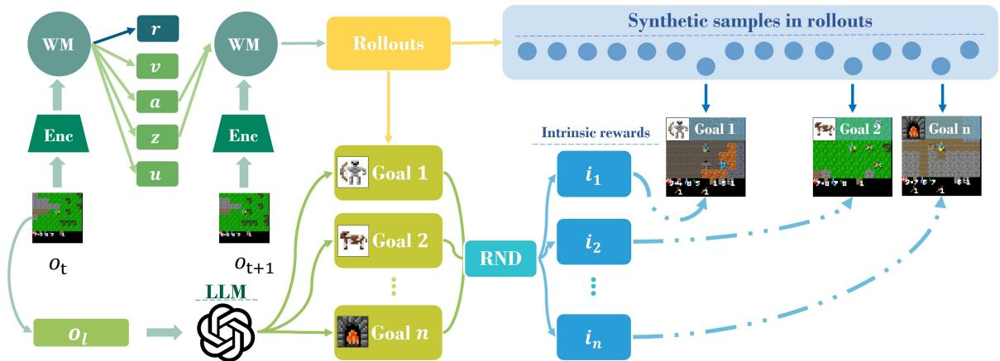  
Figure 1: The algorithmic overall structure diagram of DLLM, where WM denotes the world model, $o _ { l }$ represents the natural language caption of the observation, u denotes the transition, and $i _ { k }$ corresponds to the intrinsic reward for the k-th goal.

Consequently, we propose Dreaming with Large Language Model (DLLM), a multi-modal modelbased RL approach that integrates language hints (i.e., goals) from LLMs into the rollouts to encourage goal discovery and reaching in challenging and sparse-reward tasks, as illustrated in Figure 1. DLLM’s world model processes visual inputs and sentence embeddings of natural language descriptions for transitions and learns to predict both. It then rewards the agent when the predicted embeddings are close enough to the goal, facilitating the agents’ use of inductive bias to achieve task goals. Thanks to the power of prompt-based LLMs, DLLM can influence agents’ behaviors in distinct manners based on the prompts provided for identical tasks, resulting in multiple styles of guidance for the agents. For example, when an agent needs to obtain iron in Minecraft, it can be guided directly to break iron ore, explore more for a better policy, or try interpolating both strategies.

Empirically, we evaluate DLLM on various sparse-reward environments, including Homegrid (Lin et al., 2023), Crafter (Hafner, 2022), and Minecraft (Guss et al., 2019). Experimental results demonstrate that DLLM outperforms recent strong methods in task-oriented and exploration-oriented environments, showcasing robust performance in guiding exploration and training of the agent within highly complex scenarios. In Homegrid, Crafter and Minecraft environments, we successfully improve the performance by 41.8%, 21.1% and 9.9%, respectively, compared to the strongest baseline Dynalang (Lin et al., 2023), Achievement Distillation (Moon et al., 2024), and DreamerV3 (Hafner et al., 2023). We also observe that leveraging more powerful language models and providing the agent with comprehensive language information results in even better performance.

Our contributions are as follows: (a) we propose DLLM, a multi-modal model-based reinforcement learning approach that utilizes human natural language to describe environmental dynamics, and incorporates LLM’s guidance in model rollouts to improve the agent’s exploration and goal-completion capabilities; (b) based on goals extracted by LLMs, DLLM can generate meaningful intrinsic rewards through an automatic descending mechanism to guide policy learning; (c) experimental results demonstrate that DLLM outperforms recent strong baselines across diverse environments.

## 2 Background and Related Work

Model-based RL. Model-based RL (MBRL) trains a world model through online interactions with the environment to predict rewards and next-step states (Silver et al., 2016, 2017, 2018). With the world model, the agent can plan and optimize its policy from imagined sequences (Hansen et al., 2022; Lowrey et al., 2018). Amidst recent advancements, specific contemporary MBRL methods have acquired a world model that is capable of handling high-dimensional observations and intricate dynamics, achieving notable milestones in various domains (Ha and Schmidhuber, 2018; Schrittwieser et al., 2020; Hafner et al., 2019a, 2020, 2023; Hansen et al., 2022). Akin to our approach, the work of Lin et al. (Lin et al., 2023) constructs a multimodal world model capable of predicting future visual and textual representations, thereby enabling agents to ground their language generation capabilities within an imagined, simulated environment. We employ the same implementation approach, but further integrate the generated natural language from the LLMs during the planning process into constructing the intrinsic rewards.

Intrinsically motivated RL. Intrinsically motivated RL is proposed to encourage exploration in sparse-reward, large state-action space environments by providing additional dense rewards (Reynolds, 2002; Yang et al., 2021). Pathak et al. (2017) use curiosity as an intrinsic reward, measuring prediction proficiency within a selfsupervised model, while Burda et al. (2018) propose random network distillation (RND), which uses prediction error from a fixed random neural network and performs well in Montezuma’s Revenge. Subsequent studies improve RND with methods like distributional modeling (Yang et al., 2024). There are also other approaches focused on maximizing state diversity (Linke et al., 2020; Wang et al., 2023b) and skill diversity (Baranes and Oudeyer, 2013; Colas et al., 2022).

Despite their success, intrinsically motivated RL methods may struggle with large state-action spaces and complex tasks since they focus on exploring novel states, not necessarily useful ones. This purposeless exploration can hinder performance. Therefore, integrating meaningful guidance, such as commonsense knowledge and explicit subgoals, is crucial (Dubey et al., 2018; Du et al., 2023). DLLM considers these factors with a specific focus on long-term decision-making. During rollouts, DLLM applies intrinsic rewards when the agent achieves goals set by LLM in previous steps, strengthening the understanding of the agent’s contextual connections.

Leveraging large language models (LLMs) for language goals. Pre-trained LLMs showcase remarkable capabilities, particularly in understanding common human knowledge. Naturally, LLMs can generate meaningful and human-recognizable intrinsic rewards for intelligent agents. Choi et al. (2022) leverage pre-trained LLMs as task-specific priors for managing text-based metadata within the context of supervised learning. Kant et al. (2022) utilize LLMs as commonsense priors for zero-shot planning. Similar efforts are made by Yao et al. (2022); Shinn et al. (2023); Wu et al. (2023); Wang et al. (2023a), who propose diverse prompt methods and algorithmic structures to mitigate the problems of hallucination and inaccuracy when employing LLMs directly for decision-making. Carta et al. (2023) examine an approach where an agent utilizes an LLM as a policy that undergoes progressive updates as the agent engages with the environment, employing online reinforcement learning to enhance its performance in achieving objectives. Zhang et al. (2023) propose to leverage the LLMs to guide skill chaining. Du et al. propose ELLM (Du et al., 2023), which leverages LLMs to generate intrinsic rewards for guiding agents, integrating LLM with RL. However, the guidance obtained using this approach is only effective in the short term. DLLM draws inspiration from ELLM and endeavors to extend the guidance from LLMs into long-term decision-making.

## 3 Preliminaries

We consider a partially observable Markov decision process (POMDP) defined by a tuple $( S , A , O , \Omega , P , \gamma , R )$ , where $s \in S$ represents the states of the environment, $a \in A$ represents the actions, and observation $o \in \Omega$ is obtained from $O ( o | s , a )$ $P ( s ^ { \prime } | s , a )$ represents the dynamics of the environment, R and $\gamma$ are the reward function and discount factor, respectively. During training, the agent’s goal is to learn a policy π that maximizes discounted cumulative rewards, i.e., max $\begin{array} { r } { \mathbb { E } _ { \pi } \left[ \sum _ { t = 0 } ^ { \infty } \gamma ^ { t } R ( s _ { t } , a _ { t } ) \right] } \end{array}$

Additionally, we define two sets of natural language sentence embeddings: the set of sentence embeddings for transitions, denoted as $U$ , and the set of sentence embeddings for goals, denoted as $G .$ In this context, each $u \in U$ represents a sentence embedding describing the environmental changes from the previous step to the current step, while $g \in G$ represents a sentence embedding of a goal the LLM intends for the agent to achieve. We permit the LLM to output any content within specified formats, thereby enlarging the support of the goal distribution to encompass the space of natural language strings. Thus, $G$ should encompass all possible $u \in U ,$ , i.e., $U \subset G$

We also define the goal-conditioned intrinsic reward function $R _ { \mathrm { i n t } } ( u | g )$ , and the DLLM agent optimizes for an intrinsic reward $R _ { \mathrm { i n t } }$ alongside the reward R from the environment. Assuming that goals provided by natural language are diverse, commonsense sensitive, and context-sensitive, we expect that maximizing $R _ { \mathrm { i n t } }$ alongside R ensures that the agent maximizes the general reward function R without getting stuck in local optima.

## 4 Dreaming with LLMs

This section systematically introduces how DLLM obtains guiding information (goals) from LLMs and utilizes them to incentivize the agent to manage long-term decision-making.

## 4.1 Goal Generation by Prompting LLMs

To generate the natural language representations of goals and their corresponding vector embeddings, DLLM utilizes a pretrained Sentence-Bert model (Reimers and Gurevych, 2019) and GPT (Ouyang et al., 2022). For GPT, we use two versions including GPT-3.5-turbo-0315 and GPT-4-32k-0315, which we will refer to as GPT-3.5 and GPT-4 respectively in the following text.

We initially obtain the natural language representation, denoted as $o _ { l }$ (l denotes language, and $o _ { l }$ means natural language description of o), corresponding to the information in the agent’s current observation $o .$ This $o _ { l }$ may include details such as the agent’s position, inventory, health status, and field of view. We use an observation captioner to obtain the $o _ { l }$ following ELLM (Du et al., 2023) (see Appendix D for more details of captioners). Subsequently, we provide $o _ { l }$ and other possible language output from the environment (e.g., the task description in HomeGrid) and the description of environmental mechanisms to LLMs to get a fixed number of goals $g _ { 1 : K } ^ { l }$ in the form of natural language, where $K$ is a hyperparameter representing the expected number of goals returned by the LLM. We utilize SentenceBert to convert these goals from natural language into vector embeddings $g _ { 1 : K }$ . For different environments, we utilize two specific approaches to obtain goals: 1) having the LLM generate responses for $K$ arbitrary types of goals and 2) instructing the LLM to provide a goal for K specified types (e.g., determining which room to enter and specifying the corresponding action). The second approach is designed to standardize responses from the LLM and ensure that the goals outputted by the LLM cover all necessary aspects for task completion in complex scenarios.

## 4.2 Incorporating Decreased Intrinsic Rewards into Dreaming Processes

At each online interaction step, we have a transition captioner that gives a language description u<sub>l</sub> of the dynamics between the observation and the next observation; the language description $u _ { l }$ is then embedded into a vector embedding u. Given the sensory representation $x _ { 0 }$ , language description embedding of transition $u _ { 0 } ,$ embeddings of goals $g _ { 1 : K }$ , and intrinsic rewards for each goal $i _ { 1 : K }$ of replay inputs, the world model and actor produce a sequence of imagined latent states $\hat { s } _ { 1 : T }$ , actions $\hat { a } _ { 1 : T }$ , rewards $\hat { r } _ { 1 : T }$ , transitions $\hat { u } _ { 1 : T }$ and continuation flags $\hat { c } _ { 1 : T }$ , where $T$ represents the total length of model rollouts. We use cosine similarity to measure the matching score w between transitions and goals:

$$
w \left( \hat { u } \mid g \right) = \left\{ \begin{array} { l l } { \frac { \hat { u } \cdot g } { \lVert \hat { u } \rVert \lVert g \rVert } } & { \mathrm { i f } \frac { \hat { u } \cdot g } { \lVert \hat { u } \rVert \lVert g \rVert } > M } \\ { 0 } & { \mathrm { o t h e r w i s e } } \end{array} , \right.\tag{1}
$$

where M is a similarity threshold hyperparameter. In this step, we aim to disregard low cosine similarities to some extent, thereby preventing misleading guidance. Moreover, within a sequence, a goal may be triggered multiple times. We aim to avoid assigning intrinsic rewards to the same goal multiple times during a single rollout process, as it could lead the agent to perform simple actions repeatedly and eventually diminish the exploration of more complex behaviors. Hence, we only retain a specific goal’s matching score when it first exceeds $M$ in the sequence. The method to calculate the intrinsic reward for step t in one model rollout is written as:

$$
r _ { t } ^ { \mathrm { i n t } } = \alpha \cdot \sum _ { k = 1 } ^ { K } w _ { t } ^ { k } \cdot i _ { k } \cdot \left\{ \begin{array} { l l } { { 1 } } & { { \mathrm { i f ~ } t _ { k } ^ { \prime } \mathrm { ~ } \mathrm { e x i s t s ~ a n d ~ } t = t _ { k } ^ { \prime } } } \\ { { 0 } } & { { \mathrm { o t h e r w i s e } } } \end{array} \right. ,\tag{2}
$$

where $\alpha$ is the hyperparameter that controls the scale of the intrinsic rewards, $t _ { k } ^ { \prime }$ represents the time step t when the $w _ { t } ^ { k }$ first exceeds M within the range of 1 to $T .$ .

Then, we give the method to calculate and decrease $i _ { 1 : K }$ . If each goal’s reward is constant, the agent will tend to repeat learned skills instead of exploring new ones. We use the novelty measure RND (Burda et al., 2018) to generate and reduce the intrinsic rewards from LLMs, which effectively mitigates the issue of repetitive completion of simple tasks. To be more specific, after sampling a batch from the replay buffer, we extract the sentence embeddings of the goals from them: $g _ { 1 : B , 1 : L , 1 : K }$ , where $B$ is the batch size, and L is the batch length. Given the target network $f : G $ R and the predictor neural network ${ \hat { f } } _ { \theta } : G \to \mathbb { R }$ , we calculate the prediction error:

$$
\begin{array} { r } { e _ { 1 : B , 1 : L , 1 : K } = \Vert \hat { f } _ { \theta } ( g ) - f ( g ) \Vert ^ { 2 } . } \end{array}\tag{3}
$$

Subsequently, we update the predictor neural network and the running estimates of reward standard deviation, then standardize the intrinsic reward:

$$
i _ { 1 : B , 1 : L , 1 : K } = ( e _ { 1 : B , 1 : L , 1 : K } - m ) / \sigma ,\tag{4}
$$

where m and $\sigma$ stand for the running estimates of the mean and standard deviation of the intrinsic returns.

## 4.3 World Model and Actor Critic Learning

We implement a multi-model world model with Recurrent State-Space Model (RSSM) (Hafner et al., 2019b), with an encoder that maps sensory inputs $x _ { t }$ (e.g., image frame or language) and $u _ { t }$ to stochastic representations $z _ { t }$ . Afterward, $z _ { t }$ is combined with past action $a _ { t }$ and recurrent state $h _ { t }$ and fed into a sequence model, denoted as “seq”, to predict $\hat { z } _ { t + 1 }$

$$
{ \hat { z } } _ { t } , h _ { t } = \mathrm { s e q } \left( z _ { t - 1 } , h _ { t - 1 } , a _ { t - 1 } \right) ,\tag{5}
$$

$$
z _ { t } \sim \mathrm { e n c o d e r } \left( x _ { t } , u _ { t } , h _ { t } \right) ,\tag{6}
$$

$$
\hat { x } _ { t } , \hat { u } _ { t } , \hat { r } _ { t } , \hat { c } _ { t } = \operatorname * { d e c o d e r } \left( z _ { t } , h _ { t } \right) ,\tag{7}
$$

where $\hat { z } _ { t } , \hat { x } _ { t } , \hat { u } _ { t } , \hat { r } _ { t } , \hat { c } _ { t }$ denotes the world model prediction for the stochastic representation, sensory representation, transition, reward, and the episode continuation flag. The encoder and decoder employ convolutional neural networks (CNN) for image inputs and multi-layer perceptrons (MLP) for other low-dimensional inputs. After obtaining multimodal representations from the decoder and sequence model, we employ the following objective to train the entire world model in an end-to-end manner:

$$
\mathcal { L } _ { \mathrm { t o t a l } } = \mathcal { L } _ { x } + \mathcal { L } _ { u } + \mathcal { L } _ { r } + \mathcal { L } _ { c } + \beta _ { 1 } \mathcal { L } _ { \mathrm { p r e d } } + \beta _ { 2 } \mathcal { L } _ { \mathrm { r e g } } ,\tag{8}
$$

in which $\beta _ { 1 } = 0 . 5 , \beta _ { 2 } = 0 . 1$ . Refer to Appendix A.1 for more details of all the sub-loss terms.

We adopt the widely used actor-critic architecture for learning policies, where the actor executes actions and collects samples in the environment while the critic evaluates whether the executed action is good. We denote the model state as $s _ { t } = c o n c a t ( z _ { t } , h _ { t } )$ . The actor and the critic give:

$$
{ \mathrm { A c t o r : ~ } } \pi _ { \theta } ( a _ { t } \mid s _ { t } ) , \qquad { \mathrm { C r i t i c : ~ } } V _ { \psi } ( s _ { t } ) .\tag{9}
$$

Note that both the actor network and the critic network are simple MLPs. The actor aims to maximize the cumulative returns with the involvement of intrinsic reward, i.e.,

$$
R _ { t } \doteq \sum _ { \tau = 0 } ^ { \infty } \gamma ^ { \tau } ( r _ { t + \tau } + r _ { t + \tau } ^ { \mathrm { i n t } } ) .\tag{10}
$$

Intrinsic rewards beyond the prediction horizon T are not accessible, so we set them to zero. Details on the utilization of bootstrapped λ-returns (Sutton and Barto, 2018) for updating the actor and networks are provided in Appendix A.2. Additionally, the pseudocode for DLLM is outlined in Appendix C.

## 5 Experiments

The primary goal of our experiments is to substantiate the following claim: DLLM helps the agent by leveraging the guidance from the LLM during the dreaming process, thereby achieving improved performance in tasks. Specifically, our experiments test the following hypotheses:

• (H1) Through proper prompting, DLLM can comprehend complex environments and generate accurate instructions to assist intelligent agents in multi-task environments.

• (H2) DLLM can leverage the generative capabilities of LLMs to obtain reasonable and novel hints, aiding agents in exploration within challenging environments.

• (H3) DLLM can significantly accelerate the exploration and training of agents in highly complex, large-scale, near-real environments that necessitate rational high-dimensional planning.

• (H4) DLLM can be more powerful when leveraging stronger LLMs or receiving additional language information.

Baselines. Since we include natural language information in our experiments, we consider employing ELLM (Du et al., 2023) and Dynalang (Lin et al., 2023) as baselines.<sup>1</sup> We also compare against other recent strong baseline algorithms that do not utilize natural language in each environment.

Environments. We conduct experiments on three environments: HomeGrid (Lin et al., 2023), Crafter (Hafner, 2022), and Minecraft Diamond (Hafner et al., 2024) based on MineRL (Guss et al., 2019). These environments span first-person to third-person perspectives, 2D or 3D views, and various types and levels of task complexity. For details on the computational resources used in each environment, please refer to appendix I.

Captioner and Language Encodings. Within each environment, we deploy an observation captioner and a transition captioner to caption observations and transitions, respectively. Transition captions are stored in the replay buffer for the agent’s predictive learning, while observation captions provide pertinent information for LLM. For language encoding, we employ SentenceBert all-MiniLM-L6-v2 (Wang et al., 2020) to convert all natural language inputs into embeddings.

The Quality of Generated Goals. To measure the quality of goals generated by LLMs during online interaction in the environment, we selected the following metrics: novelty, correctness, context sensitivity, and common-sense sensitivity. See the detailed explanations and experiments in Appendix E.

Cache. As each query to the LLM consists of an object-receptacle combination, we implement a cache for each experiment to efficiently reuse queries, thereby reducing both time and monetary cost.

## 5.1 HomeGrid

Environment description. HomeGrid is a multitask reinforcement learning environment structured as a grid world, where agents get partial pixel observations and language hints (e.g., the descriptions of tasks). We adopt the “task only” setting from the original HomeGrid paper (Lin et al., 2023) but add icon signals to guide actions for opening bins. For each step, we have the captioners to caption the observation and transition. More details can be seen in Appendix B.1.1.

To support our claims, we design various settings where the environment provides different levels of information along with distinct language hints for each, as outlined in Table 1, to help address hypothesis H4.

Query prompts, LLM choices, and Goals Generated. Each query prompt consists of the caption of the agent’s current observation and a request for the LLM to generate a goal for each of the two types: “where to $\mathrm { g o } ^ { \mathsf { , , } \mathsf { , } }$ and “what to do”, respectively. For full prompts and examples, please see Appendix B.1.2. We select GPT-4 as the base LLM for all experiments in HomeGrid. Queries to the GPT are made every ten steps. We test the quality of the goals generated in the Appendix E.1.

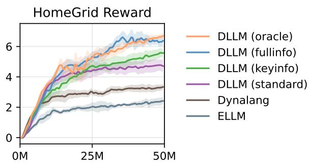  
Figure 2: HomeGrid experiments results. Curves averaged over 5 seeds with shading representing the standard deviation.

Performance. The overall results are depicted in Figure 2. The baseline algorithm ELLM underperforms in the HomeGrid environment, likely due to difficulties in understanding the sentence embeddings necessary for task description. Our method outperforms baseline algorithms utilizing the same information in the standard setting, showing strong evidence for H1 and H3. Moreover, in the Key info, Full info, and Oracle settings, DLLM demonstrates enhanced performance with increasing information. In the Full info setting, where error prompts are minimized, DLLM consistently shows a clear advantage throughout the training period. The performance in the Full info setting is comparable to the Oracle setting, with no significant difference observed. These results support hypothesis H4.

## 5.2 Crafter

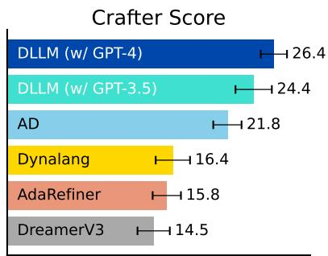  
Figure 3: The bar chart comparison of the means and standard deviations between DLLM and baselines at 1M steps. DLLM generally exhibits higher average performance, surpassing baselines by a large margin.

Environment description. The Crafter environment is a grid world that features top-down graphics and discrete action space. Crafter is designed similarly to a 2D Minecraft, featuring a procedurally generated, partially observable world where players can collect or craft a variety of artifacts. In Crafter, the player’s goal is to unlock the entire achievement tree, which consists of 22 achievements. As the map is designed with entities capable of harming the player (e.g., zombies, skeletons), the player must also create weapons or place barriers to ensure survival.

Table 1: Description of different environment settings
<table><tr><td>Setting</td><td>Description</td></tr><tr><td></td><td>Standard The environment provides task descriptions in natural language form.</td></tr><tr><td></td><td>Key info The environment additionally provides task-relevant objects&#x27; location and status informa- tion.</td></tr><tr><td>Full info</td><td>The environment additionally provides the location and status information of all objects on the map. For bins, the correct opening actions will also be instructed.</td></tr><tr><td>Oracle</td><td>The agent will always receive accurate instructions.</td></tr></table>

Extra baselines. We compared three additional types of baselines: (1) LLM-based solutions: SPRING (Wu et al., 2023), Reflexion (Shinn et al., 2023), ReAct (Yao et al., 2022), standalone GPT-4 (step-by-step instructions)<sup>2</sup>, (2) model-based RL baseline: DreamerV3 (Hafner et al., 2023), (3) model-free methods: Achievement Distillation (Moon et al., 2024), PPO (Schulman et al., 2017), Rainbow (Hessel et al., 2017). We also add human experts (Hafner, 2022) and random policy as additional references.

Query prompts, LLM choices, and Goals Generated. Each query prompt contains the caption of the agent’s current observation description and a request to have the LLM generate five goals. In this portion, we conduct evaluations using two popular LLMs, GPT-3.5 and GPT-4. Through these assessments, we explore whether a more robust LLM contributes to enhanced agent performance, addressing hypothesis H4. Queries to the GPT are made every ten steps. We test the quality of the goals generated in the Appendix E.2.

Performance. DLLM outperforms all RL-based baseline algorithms at 1M and 5M steps. As shown in Figure 3 and Table 2, DLLM exhibits a significant advantage compared to baselines. The logarithmic scale success rates for unlocking achievements at 1M and 5M refer to appendix G, shows that DLLM is good at medium to high difficulty tasks like “make stone pickaxe/sword” and “collect iron” while maintaining stable performance in less challenging tasks at 1M; when the steps reach 5M, the performance of DLLM significantly surpasses the LLM-based algorithm SPRING. These findings show strong evidence for hypotheses H2 and H3. In all experiments of Crafter, DLLM (w/ GPT-4) demonstrates a more robust performance than DLLM (w/ GPT-3.5), indicating that DLLM can indeed achieve better performance with the assistance of a more powerful LLM. This finding aligns with the results presented in Appendix E.2, where GPT-4 consistently identifies explorationbeneficial goals, thus confirming hypothesis H4. In Crafter, we also present ablation studies on various aspects, including the scale of different LLM types and sizes (Appendix F.1), the impact of intrinsic rewards (Appendix F.2), the effect of maintaining non-decreasing intrinsic rewards (Appendix F.3), the utilization of random goals (Appendix F.4), and the allowance of repeated intrinsic rewards (Appendix F.5).

<table><tr><td>Method</td><td>Score</td><td>Reward</td><td>Steps</td></tr><tr><td>DLLM (w/ GPT-4)</td><td>38.1±1.2</td><td>15.4±1.1</td><td>5M</td></tr><tr><td>DLLM (w/ GPT-3.5)</td><td>37.6±1.6</td><td>14.5±1.5</td><td>5M</td></tr><tr><td>AdaRefiner (w/ GPT-4)</td><td>28.2±1.8</td><td>12.9±1.2</td><td>5M</td></tr><tr><td>AdaRefiner (w/ GPT-3.5)</td><td>23.4±2.2</td><td>11.8±1.7</td><td>5M</td></tr><tr><td>ELLM</td><td></td><td>6.0±0.4</td><td>5M</td></tr><tr><td>DLLM (w/ GPT-4)</td><td>26.4±1.3</td><td>12.4±1.3</td><td>1M</td></tr><tr><td>DLLM (w/ GPT-3.5)</td><td>24.4±1.8</td><td>12.2±1.6</td><td>1M</td></tr><tr><td>Achievement Distillation</td><td>21.8±1.4</td><td>12.6±0.3</td><td>1M</td></tr><tr><td>Dynalang</td><td>16.4±1.7</td><td>11.5±1.4</td><td>1M</td></tr><tr><td>AdaRefiner (w/ GPT-4)</td><td>15.8±1.4</td><td>12.3±1.3</td><td>1M</td></tr><tr><td>PPO (ResNet)</td><td>15.6±1.6</td><td>10.3±0.5</td><td>1M</td></tr><tr><td>DreamerV3</td><td>14.5±1.6</td><td>11.7±1.9</td><td>1M</td></tr><tr><td>PPO</td><td>4.6±0.3</td><td>4.2±1.2</td><td>1M</td></tr><tr><td>Rainbow</td><td>4.3±0.2</td><td>5.0±1.3</td><td>1M</td></tr><tr><td>SPRING (w/ GPT-4)</td><td>27.3±1.2</td><td>12.3±0.7</td><td>-</td></tr><tr><td>Reflexion (w/ GPT-4)</td><td>12.8±1.0</td><td>10.3±1.3</td><td></td></tr><tr><td>ReAct (w/ GPT-4)</td><td>8.3±1.2</td><td>7.4±0.9</td><td></td></tr><tr><td>Vanilla GPT-4</td><td>3.4±1.5</td><td>2.5±1.6</td><td>-</td></tr><tr><td>Human Experts</td><td>50.5±6.8</td><td>14.3±2.3</td><td>-</td></tr><tr><td>Random</td><td>1.6±0.0</td><td>2.1±1.3</td><td></td></tr></table>

Table 2: The results indicate that DLLM with GPT-4 and GPT-3.5 outperforms baseline algorithms, achieving superiority at 1M and 5M training steps.

## 5.3 Minecraft

Environment description. Several RL environments, e.g., MineRL (Guss et al., 2019), have been constructed based on Minecraft, a popular video game that features a randomly initialized open world with diverse biomes. Minecraft Diamond is a challenging task based on MineRL, with the primary objective of acquiring a diamond. Progressing through the game involves the player collecting resources to craft new items, ensuring his survival, unlocking the technological progress tree, and ultimately achieving the goal of obtaining a diamond within 36000 steps. In Minecraft Diamond, we also have captioners to provide the captions of the observation and transition in natural language form at each step. The environment settings completely mirror those outlined in DreamerV3 (Hafner et al., 2023), which includes awarding a +1 reward for each milestone achieved, which encompasses collecting or crafting a log, plank, stick, crafting table, wooden pickaxe, cobblestone, stone pickaxe, iron ore, furnace, iron ingot, iron pickaxe, and diamond. Several pure LLM-based approaches (BAAI, 2023; Wang et al., 2023c; Cai et al., 2023; Qin et al., 2024) have been developed to solve this environment, while we give an RL-based solution augmented with language hints from LLMs.

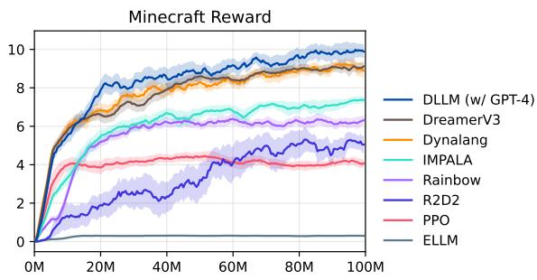  
Figure 4: Episode Returns in Minecraft Diamond. The curves indicate that DLLM enjoys a consistent advantage throughout the entire learning process, thanks to its utilization of an LLM for exploration and training. All algorithms undergo experiments using 5 different seeds.

Extra baselines. To fully compare DLLM with current popular methods from model-based algorithms to model-free algorithms on Minecraft, we include DreamerV3 (Hafner et al., 2023), IMPALA (Espeholt et al., 2018), R2D2 (Liu et al., 2003), Rainbow (Hessel et al., 2017) and PPO (Schulman et al., 2017) as our extra baselines, along with ELLM (Du et al., 2023) and Dynalang (Lin et al., 2023).

<table><tr><td>Method</td><td>Reward</td><td>Method</td><td>Reward</td></tr><tr><td>DLLM (w/ GPT-4)</td><td> $\overline { { 1 0 . 0 \pm 0 . 3 } }$ </td><td>Rainbow</td><td> $\overline { { 6 . 3 \pm 0 . 3 } }$ </td></tr><tr><td>DreamerV3</td><td> $9 . 1 { \pm } 0 . 3 $ </td><td>R2D2</td><td> $5 . 0 { \pm } 0 . 5 $ </td></tr><tr><td>Dynalang</td><td> $8 . 9 { \pm } 0 . 4 $ </td><td>PPO</td><td> $4 . 1 { \pm } 0 . 2 $ </td></tr><tr><td>IMPALA</td><td> $7 . 4 { \pm } 0 . 2 $ </td><td>ELLM</td><td> $0 . 3 { \pm } 0 . 0 \ $ </td></tr></table>

Table 3: Comparison between DLLM (w/ GPT-4) and baselines in Minecraft at 100M. DLLM (w/ GPT-4) surpasses all baselines, including those that also involve LLMs or natural languages in policy learning.

Query prompts, LLM choices, and Goals Generated. During each query to the GPT, we provide it with information about the player’s status, inventory, and equipment and request the GPT to generate five goals. We choose GPT-4 as our language model for the DLLM experiment. Please see Appendix B.3.1 for specific details. We make a query to the GPT every twenty steps. We also test the quality of the generated goals in Appendix E.3.

Performance. In Figure 4 and Table 3, we present empirical results in Minecraft Diamond. Baseline algorithm ELLM struggles in this complex environment, possibly due to high task complexity. DLLM demonstrates higher data efficiency in the early training stages, facilitating quicker acquisition of basic skills within fewer training steps compared to baseline methods. DLLM also maintains a significant advantage in later stages, indicating its ability to still derive reasonable and practical guidance from the LLM during the postexploration training process. These findings underscore the effectiveness of DLLM in guiding exploration and training in highly complex environments with the support of the LLM, providing compelling evidence for hypothesis H3.

## 6 Conclusion and Discussion

We propose DLLM, a multi-modal model-based RL method that leverages the guidance from LLMs to provide hints (goals) and generate intrinsic rewards in model rollouts. DLLM outperforms recent strong baselines in multiple challenging tasks with sparse rewards. Our experiments demonstrate that DLLM effectively utilizes language information from the environment and LLMs, and enhances its performance by improving language information quality.

## 7 Limitations

DLLM relies on the guidance provided by a large language model (LLM), making it susceptible to the inherent instability of LLM outputs. This introduces a potential risk to the stability of DLLM’s performance, even though the prompts used in our experiments contributed to relatively stable model outputs. Unreasonable goals may encourage the agent to make erroneous attempts, and correcting such misguided behavior may take time. We expect to address these challenges in future work.

## 8 Broader Impacts

LLMs have the potential to produce harmful or biased information. We have not observed LLMs generating such content in our current experimental environments, including HomeGrid, Crafter, and Minecraft. However, applying DLLM in other contexts, especially real-world settings, requires increased attention to social safety concerns. Implementing necessary safety measures involves screening LLM outputs, incorporating restrictive statements in LLM prompts, or fine-tuning with curated data.

## Acknowledgements

This work was supported by the STI 2030-Major Projects under Grant 2021ZD0201404. The authors also thank the anonymous reviewers for valuable comments.

## References

Joshua Achiam and Shankar Sastry. 2017. Surprisebased intrinsic motivation for deep reinforcement learning. arXiv preprint arXiv:1703.01732.

PKU BAAI. 2023. Plan4mc: Skill reinforcement learning and planning for open-world minecraft tasks. arXiv preprint arXiv:2303.16563.

Hui Bai, Ran Cheng, and Yaochu Jin. 2023. Evolutionary reinforcement learning: A survey. Intelligent Computing, 2.

Adrien Baranes and Pierre-Yves Oudeyer. 2013. Active learning of inverse models with intrinsically motivated goal exploration in robots. Robotics and Autonomous Systems, 61(1):49–73.

Marc G Bellemare, Will Dabney, and Rémi Munos. 2017. A distributional perspective on reinforcement learning. In International conference on machine learning, pages 449–458. PMLR.

Yuri Burda, Harrison Edwards, Deepak Pathak, Amos Storkey, Trevor Darrell, and Alexei A Efros. 2019a. Large-scale study of curiosity-driven learning. In Seventh International Conference on Learning Representations, pages 1–17.

Yuri Burda, Harrison Edwards, Amos Storkey, and Oleg Klimov. 2018. Exploration by random network distillation. In International Conference on Learning Representations.

Yuri Burda, Harrison Edwards, Amos Storkey, and Oleg Klimov. 2019b. Exploration by random network distillation. In Seventh International Conference on Learning Representations, pages 1–17.

Shaofei Cai, Bowei Zhang, Zihao Wang, Xiaojian Ma, Anji Liu, and Yitao Liang. 2023. Groot: Learning to follow instructions by watching gameplay videos. arXiv preprint arXiv:2310.08235.

Thomas Carta, Clément Romac, Thomas Wolf, Sylvain Lamprier, Olivier Sigaud, and Pierre-Yves Oudeyer. 2023. Grounding large language models in interactive environments with online reinforcement learning. arXiv preprint arXiv:2302.02662.

Kristy Choi, Chris Cundy, Sanjari Srivastava, and Stefano Ermon. 2022. Lmpriors: Pre-trained language models as task-specific priors. In NeurIPS 2022 Foundation Models for Decision Making Workshop.

Cédric Colas, Tristan Karch, Olivier Sigaud, and Pierre-Yves Oudeyer. 2022. Autotelic agents with intrinsically motivated goal-conditioned reinforcement learning: a short survey. Journal of Artificial Intelligence Research, 74:1159–1199.

Cédric Colas, Olivier Sigaud, and Pierre-Yves Oudeyer. 2018. Gep-pg: Decoupling exploration and exploitation in deep reinforcement learning algorithms. In International conference on machine learning, pages 1039–1048. PMLR.

Rati Devidze, Parameswaran Kamalaruban, and Adish Singla. 2022. Exploration-guided reward shaping for reinforcement learning under sparse rewards. Advances in Neural Information Processing Systems, 35:5829–5842.

Yuqing Du, Olivia Watkins, Zihan Wang, Cédric Colas, Trevor Darrell, Pieter Abbeel, Abhishek Gupta, and Jacob Andreas. 2023. Guiding pretraining in reinforcement learning with large language models. arXiv preprint arXiv:2302.06692.

Rachit Dubey, Pulkit Agrawal, Deepak Pathak, Tom Griffiths, and Alexei Efros. 2018. Investigating human priors for playing video games. In International Conference on Machine Learning, pages 1349–1357. PMLR.

Lasse Espeholt, Hubert Soyer, Remi Munos, Karen Simonyan, Vlad Mnih, Tom Ward, Yotam Doron, Vlad Firoiu, Tim Harley, Iain Dunning, et al. 2018. Impala: Scalable distributed deep-rl with importance weighted actor-learner architectures. In International conference on machine learning, pages 1407–1416. PMLR.

Tharindu Fernando, Simon Denman, Sridha Sridharan, and Clinton Fookes. 2018. Learning temporal strategic relationships using generative adversarial imitation learning. Preprint, arXiv:1805.04969.

William H Guss, Brandon Houghton, Nicholay Topin, Phillip Wang, Cayden Codel, Manuela Veloso, and Ruslan Salakhutdinov. 2019. Minerl: A large-scale dataset of minecraft demonstrations. arXiv preprint arXiv:1907.13440.

David Ha and Jürgen Schmidhuber. 2018. World models. arXiv preprint arXiv:1803.10122.

Danijar Hafner. 2022. Benchmarking the spectrum of agent capabilities. Preprint, arXiv:2109.06780.

Danijar Hafner, Timothy Lillicrap, Jimmy Ba, and Mohammad Norouzi. 2019a. Dream to control: Learning behaviors by latent imagination. arXiv preprint arXiv:1912.01603.

Danijar Hafner, Timothy Lillicrap, Ian Fischer, Ruben Villegas, David Ha, Honglak Lee, and James Davidson. 2019b. Learning latent dynamics for planning from pixels. In International conference on machine learning, pages 2555–2565. PMLR.

Danijar Hafner, Timothy Lillicrap, Mohammad Norouzi, and Jimmy Ba. 2020. Mastering atari with discrete world models. arXiv preprint arXiv:2010.02193.

Danijar Hafner, Jurgis Pasukonis, Jimmy Ba, and Timothy Lillicrap. 2023. Mastering diverse domains through world models. Preprint, arXiv:2301.04104.

Danijar Hafner, Jurgis Pasukonis, Jimmy Ba, and Timothy Lillicrap. 2024. Mastering diverse domains through world models. Preprint, arXiv:2301.04104.

Nicklas Hansen, Xiaolong Wang, and Hao Su. 2022. Temporal difference learning for model predictive control. arXiv preprint arXiv:2203.04955.

Matteo Hessel, Joseph Modayil, Hado van Hasselt, Tom Schaul, Georg Ostrovski, Will Dabney, Dan Horgan, Bilal Piot, Mohammad Azar, and David Silver. 2017. Rainbow: Combining improvements in deep reinforcement learning. Preprint, arXiv:1710.02298.

David Janz, Jiri Hron, Przemysław Mazur, Katja Hofmann, José Miguel Hernández-Lobato, and Sebastian Tschiatschek. 2019. Successor uncertainties: exploration and uncertainty in temporal difference learning. Advances in Neural Information Processing Systems, 32.

Yash Kant, Arun Ramachandran, Sriram Yenamandra, Igor Gilitschenski, Dhruv Batra, Andrew Szot, and Harsh Agrawal. 2022. Housekeep: Tidying virtual households using commonsense reasoning. In European Conference on Computer Vision, pages 355–373. Springer.

Durk P Kingma, Tim Salimans, Rafal Jozefowicz, Xi Chen, Ilya Sutskever, and Max Welling. 2016. Improved variational inference with inverse autoregressive flow. Advances in neural information processing systems, 29.

Pawel Ladosz, Lilian Weng, Minwoo Kim, and Hyondong Oh. 2022. Exploration in deep reinforcement learning: A survey. Information Fusion, 85:1–22.

Jessy Lin, Yuqing Du, Olivia Watkins, Danijar Hafner, Pieter Abbeel, Dan Klein, and Anca Dragan. 2023. Learning to model the world with language. arXiv preprint arXiv:2308.01399.

Cam Linke, Nadia M Ady, Martha White, Thomas Degris, and Adam White. 2020. Adapting behavior via intrinsic reward: A survey and empirical study. Journal of artificial intelligence research, 69:1287– 1332.

Qinghua Liu, Tim A Rand, Savitha Kalidas, Fenghe Du, Hyun-Eui Kim, Dean P Smith, and Xiaodong Wang. 2003. R2d2, a bridge between the initiation and effector steps of the drosophila rnai pathway. Science, 301(5641):1921–1925.

Kendall Lowrey, Aravind Rajeswaran, Sham Kakade, Emanuel Todorov, and Igor Mordatch. 2018. Plan online, learn offline: Efficient learning and exploration via model-based control. arXiv preprint arXiv:1811.01848.

Ziyan Luo, Yijie Zhang, and Zhaoyue Wang. 2023. Does hierarchical reinforcement learning outperform standard reinforcement learning in goal-oriented environments? In NeurIPS 2023 Workshop on Goal-Conditioned Reinforcement Learning.

TM Moerland, DJ Broekens, and CM Jonker. 2017. Efficient exploration with double uncertain value networks. In Deep Reinforcement Learning Symposium, NIPS 2017.

Ron Mokady, Amir Hertz, and Amit H Bermano. 2021. Clipcap: Clip prefix for image captioning. arXiv preprint arXiv:2111.09734.

Seungyong Moon, Junyoung Yeom, Bumsoo Park, and Hyun Oh Song. 2024. Discovering hierarchical achievements in reinforcement learning via contrastive learning. Advances in Neural Information Processing Systems, 36.

Long Ouyang, Jeff Wu, Xu Jiang, Diogo Almeida, Carroll L. Wainwright, Pamela Mishkin, Chong Zhang, Sandhini Agarwal, Katarina Slama, Alex Ray, John Schulman, Jacob Hilton, Fraser Kelton, Luke Miller, Maddie Simens, Amanda Askell, Peter Welinder,

Paul Christiano, Jan Leike, and Ryan Lowe. 2022. Training language models to follow instructions with human feedback. Preprint, arXiv:2203.02155.

Deepak Pathak, Pulkit Agrawal, Alexei A Efros, and Trevor Darrell. 2017. Curiosity-driven exploration by self-supervised prediction. In International conference on machine learning, pages 2778–2787. PMLR.

Yiran Qin, Enshen Zhou, Qichang Liu, Zhenfei Yin, Lu Sheng, Ruimao Zhang, Yu Qiao, and Jing Shao. 2024. Mp5: A multi-modal open-ended embodied system in minecraft via active perception. Preprint, arXiv:2312.07472.

Alec Radford, Jong Wook Kim, Chris Hallacy, Aditya Ramesh, Gabriel Goh, Sandhini Agarwal, Girish Sastry, Amanda Askell, Pamela Mishkin, Jack Clark, et al. 2021. Learning transferable visual models from natural language supervision. In International conference on machine learning, pages 8748–8763. PMLR.

Alec Radford, Jeffrey Wu, Rewon Child, David Luan, Dario Amodei, Ilya Sutskever, et al. 2019. Language models are unsupervised multitask learners. OpenAI blog, 1(8):9.

Nils Reimers and Iryna Gurevych. 2019. Sentence-bert: Sentence embeddings using siamese bert-networks. arXiv preprint arXiv:1908.10084.

Stuart Ian Reynolds. 2002. Reinforcement learning with exploration. Ph.D. thesis, University of Birmingham.

Martin Riedmiller, Roland Hafner, Thomas Lampe, Michael Neunert, Jonas Degrave, Tom Wiele, Vlad Mnih, Nicolas Heess, and Jost Tobias Springenberg. 2018. Learning by playing solving sparse reward tasks from scratch. In International conference on machine learning, pages 4344–4353. PMLR.

Julian Schrittwieser, Ioannis Antonoglou, Thomas Hubert, Karen Simonyan, Laurent Sifre, Simon Schmitt, Arthur Guez, Edward Lockhart, Demis Hassabis, Thore Graepel, et al. 2020. Mastering atari, go, chess and shogi by planning with a learned model. Nature, 588(7839):604–609.

John Schulman, Filip Wolski, Prafulla Dhariwal, Alec Radford, and Oleg Klimov. 2017. Proximal policy optimization algorithms. arXiv preprint arXiv:1707.06347.

Noah Shinn, Beck Labash, and Ashwin Gopinath. 2023. Reflexion: an autonomous agent with dynamic memory and self-reflection. arXiv preprint arXiv:2303.11366.

David Silver, Aja Huang, Chris J Maddison, Arthur Guez, Laurent Sifre, George Van Den Driessche, Julian Schrittwieser, Ioannis Antonoglou, Veda Panneershelvam, Marc Lanctot, et al. 2016. Mastering the game of go with deep neural networks and tree search. nature, 529(7587):484–489.

David Silver, Thomas Hubert, Julian Schrittwieser, Ioannis Antonoglou, Matthew Lai, Arthur Guez, Marc Lanctot, Laurent Sifre, Dharshan Kumaran, Thore Graepel, et al. 2018. A general reinforcement learning algorithm that masters chess, shogi, and go through self-play. Science, 362(6419):1140–1144.

David Silver, Julian Schrittwieser, Karen Simonyan, Ioannis Antonoglou, Aja Huang, Arthur Guez, Thomas Hubert, Lucas Baker, Matthew Lai, Adrian Bolton, et al. 2017. Mastering the game of go without human knowledge. nature, 550(7676):354–359.

David Silver, Satinder Singh, Doina Precup, and Richard S Sutton. 2021. Reward is enough. Artificial Intelligence, 299:103535.

Bradly C Stadie, Sergey Levine, and Pieter Abbeel. 2015. Incentivizing exploration in reinforcement learning with deep predictive models. arXiv preprint arXiv:1507.00814.

Richard S Sutton and Andrew G Barto. 2018. Reinforcement learning: An introduction. MIT press.

Alexander Trott, Stephan Zheng, Caiming Xiong, and Richard Socher. 2019. Keeping your distance: Solving sparse reward tasks using self-balancing shaped rewards. Advances in Neural Information Processing Systems, 32.

Guanzhi Wang, Yuqi Xie, Yunfan Jiang, Ajay Mandlekar, Chaowei Xiao, Yuke Zhu, Linxi Fan, and Anima Anandkumar. 2023a. Voyager: An open-ended embodied agent with large language models. arXiv preprint arXiv:2305.16291.

Wenhui Wang, Furu Wei, Li Dong, Hangbo Bao, Nan Yang, and Ming Zhou. 2020. Minilm: Deep selfattention distillation for task-agnostic compression of pre-trained transformers. Advances in Neural Information Processing Systems, 33:5776–5788.

Xiyao Wang, Ruijie Zheng, Yanchao Sun, Ruonan Jia, Wichayaporn Wongkamjan, Huazhe Xu, and Furong Huang. 2023b. Coplanner: Plan to roll out conservatively but to explore optimistically for model-based rl. Preprint, arXiv:2310.07220.

Zihao Wang, Shaofei Cai, Anji Liu, Yonggang Jin, Jinbing Hou, Bowei Zhang, Haowei Lin, Zhaofeng He, Zilong Zheng, Yaodong Yang, et al. 2023c. Jarvis-1: Open-world multi-task agents with memoryaugmented multimodal language models. arXiv preprint arXiv:2311.05997.

Lisheng Wu and Ke Chen. 2023. Goal exploration augmentation via pre-trained skills for sparse-reward long-horizon goal-conditioned reinforcement learning. Preprint, arXiv:2210.16058.

Yue Wu, So Yeon Min, Shrimai Prabhumoye, Yonatan Bisk, Ruslan Salakhutdinov, Amos Azaria, Tom Mitchell, and Yuanzhi Li. 2023. Spring: Gpt-4 outperforms rl algorithms by studying papers and reasoning. arXiv preprint arXiv:2305.15486.

Tianbao Xie, Siheng Zhao, Chen Henry Wu, Yitao Liu, Qian Luo, Victor Zhong, Yanchao Yang, and Tao Yu. 2023. Text2reward: Automated dense reward function generation for reinforcement learning. arXiv preprint arXiv:2309.11489.

Kai Yang, Jian Tao, Jiafei Lyu, and Xiu Li. 2024. Exploration and anti-exploration with distributional random network distillation. arXiv preprint arXiv:2401.09750.

Tianpei Yang, Hongyao Tang, Chenjia Bai, Jinyi Liu, Jianye Hao, Zhaopeng Meng, Peng Liu, and Zhen Wang. 2021. Exploration in deep reinforcement learning: a comprehensive survey. arXiv preprint arXiv:2109.06668.

Shunyu Yao, Jeffrey Zhao, Dian Yu, Izhak Shafran, Karthik R Narasimhan, and Yuan Cao. 2022. React: Synergizing reasoning and acting in language models. In NeurIPS 2022 Foundation Models for Decision Making Workshop.

Jesse Zhang, Jiahui Zhang, Karl Pertsch, Ziyi Liu, Xiang Ren, Minsuk Chang, Shao-Hua Sun, and Joseph J Lim. 2023. Bootstrap your own skills: Learning to solve new tasks with large language model guidance. arXiv preprint arXiv:2310.10021.

Jingwei Zhang, Niklas Wetzel, Nicolai Dorka, Joschka Boedecker, and Wolfram Burgard. 2019. Scheduled intrinsic drive: A hierarchical take on intrinsically motivated exploration. arXiv preprint arXiv:1903.07400.

Tianjun Zhang, Paria Rashidinejad, Jiantao Jiao, Yuandong Tian, Joseph E Gonzalez, and Stuart Russell. 2021. Made: Exploration via maximizing deviation from explored regions. Advances in Neural Information Processing Systems, 34:9663–9680.

Wanpeng Zhang and Zongqing Lu. 2023. Adarefiner: Refining decisions of language models with adaptive feedback. Preprint, arXiv:2309.17176.

Zihao Zhou, Bin Hu, Pu Zhang, Chenyang Zhao, and Bin Liu. 2023. Large language model is a good policy teacher for training reinforcement learning agents. arXiv preprint arXiv:2311.13373.

## A More Details on Methodology

## A.1 Formulas for Sub Losses of World Model

All the formulas for sub terms, including sensation loss $\mathcal { L } _ { x }$ , transition loss $\mathcal { L } _ { u }$ , reward loss ${ \mathcal { L } } _ { r } ,$ continue loss $\mathcal { L } _ { c } ,$ prediction loss $\mathcal { L } _ { \mathrm { p r e d } } .$ , regularizer $\mathcal { L } _ { \mathrm { r e g } }$ , can be written as:

$$
\mathcal { L } _ { x } = \| \hat { x } _ { t } - x _ { t } \| _ { 2 } ^ { 2 } ,\tag{11}
$$

$$
\begin{array} { r } { \mathcal { L } _ { u } = \mathrm { c a t x e n t } \left( \hat { u } _ { t } , u _ { t } \right) , } \end{array}\tag{12}
$$

$$
\mathcal { L } _ { \boldsymbol { r } } = \mathrm { c a t x e n t } \left( \hat { \boldsymbol { r } } _ { t } , \mathrm { t w o h o t } \left( \boldsymbol { r } _ { t } \right) \right) ,\tag{13}
$$

$$
\mathcal { L } _ { c } = { \mathrm { b i n x e n t } } \left( \hat { c } _ { t } , c _ { t } \right) ,
$$

$$
\mathcal { L } _ { \mathrm { p r e d } } = \operatorname* { m a x } \left( 1 , \mathrm { K L } \left[ \mathrm { s g } \left( \boldsymbol { z } _ { t } \right) \right| \left| \hat { \boldsymbol { z } } _ { t } \right] \right) ,\tag{14}
$$

(15)

$$
\mathcal { L } _ { \mathrm { r e g } } = \operatorname* { m a x } ( 1 , \mathrm { K L } [ z _ { t } | | \mathrm { s g } ( \hat { z } _ { t } ) ] ) ,\tag{16}
$$

where catxent is the categorical cross-entropy loss, binxent is the binary cross-entropy loss, sg is the stop gradient operator, KL refers to the Kullback-Leibler (KL) divergence. We adopt twohot( ) from the DreamerV3 approach for reward prediction, utilizing a softmax classifier with exponentially spaced bins. This classifier is employed to regress the two-hot encoding of realvalued rewards, ensuring that the gradient scale remains independent of the arbitrary scale of the rewards. Additionally, we apply a regularizer with a cap at one free nat (Kingma et al., 2016) to avoid over-regularization, a phenomenon known as posterior collapse.

## A.2 The Update of the Actor and Critic Networks.

The bootstrapped λ-returns (Sutton and Barto, 2018) used to update the actor and critic networks could be written as:

$$
\begin{array} { r l } & { R _ { t } ^ { \lambda } \doteq r _ { t } + \gamma c _ { t } \Big [ ( 1 - \lambda ) V _ { \psi } \left( s _ { t + 1 } \right) } \\ & { \quad \quad + \lambda R _ { t + 1 } ^ { \lambda } \Big ] . } \end{array}\tag{17}
$$

$$
R _ { T } ^ { \lambda } \doteq V _ { \psi } \left( s _ { T } \right) .\tag{18}
$$

The actor and the critic are updated via the following losses:

$$
\begin{array} { r } { \mathcal { L } _ { V } = \mathrm { c a t x e n t } \left( V _ { \psi } ( s _ { t } ) , \right. } \\ { \left. \mathrm { s g } \left( \mathrm { t w o h o t } \left( R _ { t } ^ { \lambda } \right) \right) \right) . } \end{array}\tag{19}
$$

$$
\begin{array} { c } { { \mathcal { L } _ { \pi } = - \displaystyle \frac { \mathrm { s g } \left( R _ { t } ^ { \lambda } - V ( s _ { t } ) \right) } { \mathrm { m a x } ( 1 , S ) } \log \pi _ { \theta } \left( a _ { t } \mid s _ { t } \right) } } \\ { { - \eta \mathrm { H } \left[ \pi _ { \theta } \left( a _ { t } \mid s _ { t } \right) \right] . } } \end{array}\tag{20}
$$

where S is the exponential moving average between the 5th and 95th percentile of $R _ { t }$

## B Environment Details

## B.1 HomeGrid

## B.1.1 Details of Environmental Adjustments

“HomeGrid” is introduced by Dynalang (Lin et al., 2023), and our modified version is based on the “homegrid-task” setting. Aside from the pixel observation, this setting additionally provides language information describing the task assigned to the robotic agent. However, HomeGrid does not provide any visual signal when the robot takes the actions, including “pedal”, “lift”, and “grasp”, representing the different actions to open the bins, so the trained transition captioner needs additional information in the pixel observation. We add icons (pedal), (lift), and (grasp)<sup>3</sup> for each of the three actions and make them appear on the head of the robot when the related action is taken and the robot succeeds in opening any bin. Furthermore, there have been no alterations to HomeGrid’s task assignments, reward mechanisms, or total step count.

## B.1.2 Full Prompt Details

During each query to the LLM, we provide the agent with a concise overview of the fundamental aspects of the HomeGrid environment. The observation captioner interprets the current observational state of the environment into natural language, and we provide this to the LLM. We then direct the LLM to choose one goal for “what to do” and another for “where to go.” In order to ensure consistency in agent responses, we have incorporated mandatory statements and provided illustrative examples. GPT’s performance can fluctuate, manifesting as inconsistent quality in generated outputs at different times of the day. We recommend capitalizing all the warning text. This can help alleviate the issue.

The actual input provided to the LLM is divided into two parts: system information and game information. The part of system information is:

You are engaged in a game   
resembling AI2-THOR. You will   
receive details about your   
task, interactive items in view,   
carried items, and your current   
room. State the goals you wish   
to achieve from now on. Please   
select one thing to do and one   
room to go, and return them to me,   
with the format including:   
go to the [room],   
[action] the [object],   
[action] to [change the status   
of] (e.g., open) the [bin],   
[action] the [object] in/to the   
[bin/room].   
Commas should separate goals   
and should not contain any   
additional characters.   
An example is:   
get the bottle, go to the kitchen.

The format for game information is as follows:

Your task is [text],   
You see [objects],   
Your carrying is [object],   
[Extra information based on the   
setting of standard, key info, and   
full info].

## B.2 Crafter

Crafter (Hafner, 2022) serves as a platform for reinforcement learning research drawing inspiration from Minecraft, featuring a 2D world where players engage in various survival activities. This game simplifies and optimizes familiar mechanics to enhance research productivity. Players explore a broad world comprising diverse terrains like forests, lakes, mountains, and caves. The game challenges players to maintain health, food, and water, with consequences for neglecting these essentials. The interaction with various creatures, which vary in behavior based on the time of day, adds to the game’s complexity.

## B.2.1 Full Prompt Details

During each query to the LLM, we start by presenting the framework of the Crafter environment, employing Minecraft as an analogy. Subsequently, we furnish the current observation information to the LLM, encompassing objects/creatures within the player’s field of view, the details of the player’s inventory, and the player’s status.

In Crafter, we also divide the prompt for the LLM into two sections: system information and game information. The system information is as follows:

As a professional game analyst,   
you oversee an RL agent or a player   
in a game resembling Minecraft.   
You will receive a starting point   
that includes information about   
what the player sees, what the   
player has in his inventory, and   
the player’s status. For this   
starting point, please provide the   
top 5 key goals the player should   
achieve in the next several steps   
to maximize its game exploration.   
Consider the feasibility of each   
action in the current state   
and its importance to achieving   
the achievement. The response   
should only include valid actions   
separated by ’,’. Do not include   
any other letters, symbols, or   
words.   
An example is:   
collect wood, place table, collect   
stone, attack cow, attack zombie.

The format for game information is as follows:

You see [objects/creatures],   
Your have[objects],   
Your status is [text].

## B.3 Minecraft

Minecraft Diamond (Hafner et al., 2023) is an innovative environment developed on top of MineRL (Guss et al., 2019), gaining significant attention in the research community within the expansive universe of Minecraft. Minecraft offers a procedurally generated 3D world with diverse biomes, such as forests, deserts, and mountains, all composed of one-meter blocks for player interaction. The primary challenge in this environment is the pursuit of diamonds, a rare and valuable resource found deep underground (Luo et al., 2023). This quest tests players’ abilities to navigate and survive in the diverse Minecraft world, requiring progression through a complex technology tree. Players interact with various creatures, gather resources, and craft items from over 379 recipes, ensuring their survival by managing food and safety.

Developers have meticulously addressed gameplay nuances identified through extensive human playtesting in the Minecraft Diamond environment. Key improvements include modifying the episode termination criteria based on player death or a fixed number of steps and refining the jump mechanism to enhance player interaction and strategy development. The environment, built on MineRL v0.4.415 and Minecraft version 1.11.2, offers a more consistent and engaging experience. The reward system is thoughtfully structured, encouraging players to reach 12 significant milestones culminating in acquiring a diamond. This system, while straightforward, requires strategic planning and resource management, as each item provides a reward only once per episode. The environment’s sensory inputs and action space are comprehensive and immersive, offering players a first-person view and a wide range of actions, from movement to crafting.

## B.3.1 Full Prompt Details

In Minecraft, we also split the LLM prompt into system and game info sections. The system information is as follows:

As a professional game analyst,   
you oversee an RL agent or a player   
in Minecraft, and your final goal   
is to collect a diamond. You   
will receive a starting point   
that includes information about   
what the player sees, what the   
player has in his inventory, and   
the player’s status. For this   
starting point, please provide   
the top 5 key goals the player   
should achieve in the next several   
steps to achieve his final goal.   
Take note of the game mechanics   
in Minecraft; you need to   
progressively accomplish goals.   
Each goal should be in the form   
of an action with an item after   
it. Please do not add any extra   
numbers or words.   
An example is:   
pick up log, attack creepers, drop   
cobblestone, craft wooden pickaxe,   
craft arrows.   
An example of game information is as follows:   
You have [objects]   
You have equipped [objects]   
The status of you is [text].

## C Pseudo Code

The pseudocode is presented in Algorithm 1.

## D Details of Captioners

For the implementation of the captioners, DLLM generally follows ELLM (Du et al., 2023), except that we use trained transition captioners throughout all our experiments to get the language description of the dynamics between two observations. We split the captions into two different parts: semantic parts and dynamic parts.

## D.1 Hard-coded Captioner for Semantic Parts

The captioner of semantic parts follows the hardcoded captioner implementation outlined in $\mathsf { A p - }$ pendix I of ELLM (Du et al., 2023). The overall semantic captions include the following categories:

• Field of view. In the grid world environments (HomeGrid and Crafter), we collect the text description of all the interactable objects in the agent’s view, regardless of the object’s quantity, to form the caption for this section. Similarly, in the Minecraft Diamond environment, we obtain the list of all visible objects from the simulator’s semantic sensor.

```latex
Algorithm 1 Dreaming with Large Language Mod
els (DLLM)
while acting do
Observe in the environment
$r _ { t } , c _ { t } , x _ { t } , u _ { t } , o _ { t } ^ { l } \gets$ env $\left( a _ { t - 1 } \right)$
Acquire goals $g _ { 1 : K } ^ { t } \gets$ embed $\left( \mathrm { L L M } \left( o _ { t } ^ { l } \right) \right)$
Encode observations $z _ { t } \sim$ enc $\left( { { x } _ { t } } , { { u } _ { t } } , { { h } _ { t } } \right)$
Execute action $a _ { t } \sim \pi \left( a _ { t } \mid h _ { t } , z _ { t } \right)$
Add $\left( r _ { t } , c _ { t } , x _ { t } , u _ { t } , a _ { t } , g _ { 1 : K } ^ { t } \right)$ to replay buffer.
end while
while training do
Draw batch $\left\{ \left( r _ { t } , c _ { t } , x _ { t } , u _ { t } , a _ { t } , g _ { 1 : K } ^ { t } \right) \right\}$ from
replay buffer.
Calculate intrinsic rewards $i _ { 1 : K }$ for each goal
using the RND method and update the RND
network.
Use world model to compute representa
tions $z _ { t } ,$ future predictions $\hat { z } _ { t + 1 }$ , and decode
$\hat { x } _ { t } , \hat { u } _ { t } , \hat { r } _ { t } , \hat { c } _ { t } .$
Update world model to minimize ${ \mathcal { L } } _ { \mathrm { t o t a l } } .$
Imagine rollouts from all $z _ { t }$ using π.
Calculate match scores w and the intrinsic
reward $r ^ { \mathrm { i n t } }$ for each step.
Update actor to minimize ${ \mathcal { L } } _ { \pi }$
Update critic to minimize ${ \mathcal { L } } _ { V } .$
end while
```

• Inventory. For HomeGrid, this will only include the item the robot carries. For Crafter and Minecraft, we convert each inventory item to the corresponding text descriptor. For Minecraft, we get this information directly from interpreting the observation.

• Health Status. In Crafter and Minecraft, if any health statuses are below the maximum, we convert each to a corresponding language description (e.g., we say the agent is “hungry” if the hunger status is less than 9). There is no such information in HomeGrid, so we do not provide related captions. Note that the observation directly gives related information in Minecraft, so we simply translate them into natural language.

## D.2 Trained Transition Captioner for Dynamics Parts

The captioner for transitions (dynamics parts) is designed to translate the dynamics between two adjacent observations into natural language form. For convenience, we modify the original simulator to generate language labels for the training of the transition captioner. All language labels use a predetermined and fixed format established by humans. These language labels succinctly describe the dynamics of the environment in the most straightforward manner possible. Notably, these humandesigned labels aid the agent in utilizing a similar approach to describe the environment dynamics with concise key words. The designs of all possible formats of language descriptions for transitions in each environment are as follows:

## • HomeGrid.

– go to the [room].

– [action] the [object]. (e.g., pick up the plates)

– [action] to [change the status of] (e.g., open) the [bin].

– [action] the [object] in/to the [bin/room].

## • Crafter.

– [action] (e.g., sleep, wake up)

– [action] the [item/object]. (e.g., attack the zombie)

• Minecraft.

– [action] (e.g., forward, jump, sneak)

$$
\begin{array} { r l } { - \ [ \mathsf { a c t i o n } ] \quad \mathsf { t h e } \quad [ \mathsf { o b j e c t } ] . \quad } & { ( \mathsf { e . g . } , } \\ { \mathsf { c r a f t } \quad \mathsf { t h e } \quad \mathsf { t o r c h } ) } \end{array}
$$

The training process of the captioner mainly follows the methodology outlined in Appendix J of ELLM (Du et al., 2023); we similarly apply a modified ClipCap algorithm (Mokady et al., 2021) to datasets of trajectories generated by trained agents, with details provided in Table 4. Specifically, we embed the visual observations at timestep t and t + 1 with a pre-trained and frozen CLIP ViT-B-32 model (Radford et al., 2021); the embedding is then concatenated together with the difference in semantic embeddings between the corresponding states. Semantic embeddings encompass the inventory and a multi-hot embedding of the set of objects/creatures present in the agent’s local view. The concatenated representation of the transition is then mapped through a learned mapping function to a sequence of 32 tokens. We use these tokens as a prefix and decode them with a trained and frozen GPT-2 to generate the caption (Radford et al., 2019).

Table 4: The algorithm used to generate samples, total steps, and scale of the generated dataset for each environment are as follows. We capture one sample every 1K steps during training.
<table><tr><td>Environment</td><td>Algorithm</td><td>Steps</td><td>Scale</td></tr><tr><td>HomeGrid</td><td>Dynalang</td><td>10M</td><td>10K</td></tr><tr><td>Crafter</td><td>Achievement Distillation</td><td>1M</td><td>1K</td></tr><tr><td>Minecraft</td><td>DreamerV3</td><td>100M</td><td>100K</td></tr></table>

We employ a reward confusion matrix in Figure 5 to illustrate the accuracy of our trained transition captioner on HomeGrid, depicting the probability of each achieved goal being correctly rewarded or incorrectly rewarded for another goal during real interactions with the environment. Despite being based on a limited dataset, the captioner demonstrates strong accuracy even when extrapolated beyond the dataset distribution.

## E Metrics to Test the Quality of Goals Generated by LLMs and Goal Analysis.

Despite the superiority of GPT-3.5 and GPT-4, they may still output impractical or unachievable goals within the game mechanics. This section of ablation experiments primarily investigates the quality of guidance provided by different versions of LLMs in all the environments in which DLLM was conducted. A detailed explanation of the metrics for measuring the generated goals’ quality is shown in Table 5.

## E.1 HomeGrid

In HomeGrid, given the current observation (including the information about the task and the world state), there is a unique correct answer for “where to go” and “what to do”. To assess the quality of the generated goals, we conducted tests as shown in Table 6. In this task-oriented environment, we do not test the novelty of goals. The statistical results for each setting were obtained using 1M training samples generated from real interactions. The correctness of goals provided in the standard setting is low since the agent’s observation may lack relevant information. There is a noticeable improvement in the Key info setting and extra improvement in the

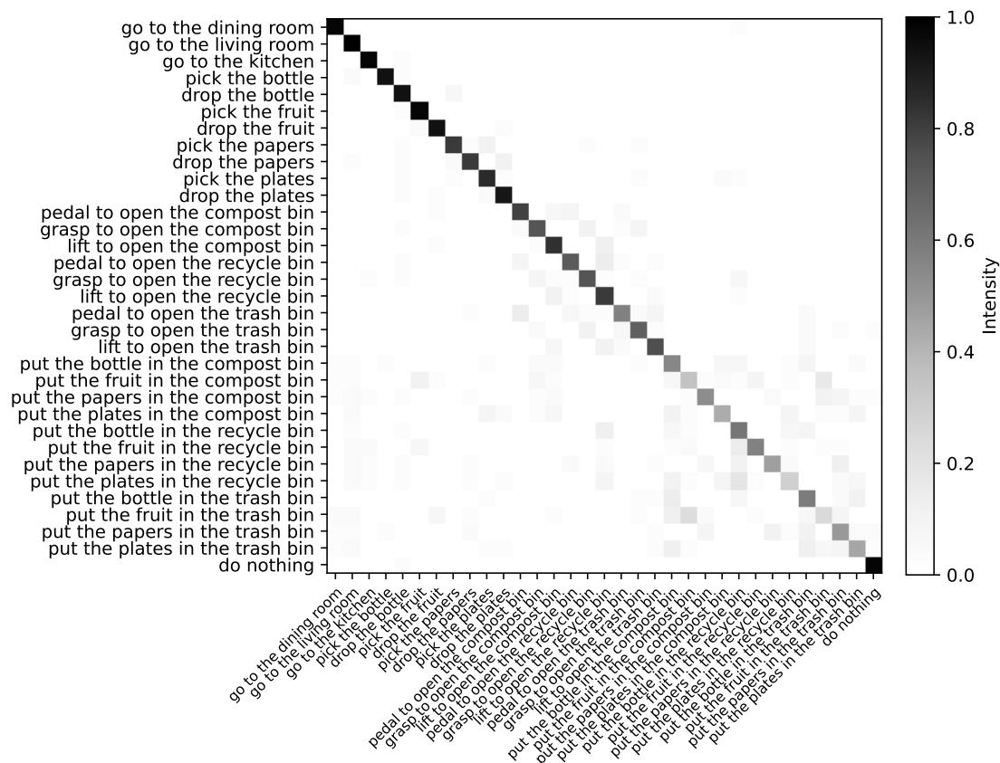  
Figure 5: The reward confusion matrix of the trained transition captioner on HomeGrid. Each square’s color indicates the probability that the action in the row will be rewarded with the achievement labels on the column. For example, if all action “go to the dining room” is recognized as the achievement “go to the dining room”, we will receive a 100% on the square corresponding to this row and column. The total in each row does not equal 100% because multiple rewards may be activated by a single achievement, depending on its description.

Table 5: Explanation of the metrics.
<table><tr><td>Metrics</td><td>Explanation</td></tr><tr><td>Novelty</td><td>In exploratory environments like Crafter and Minecraft, a goal is “novel&quot; when its prerequi- sites are fulfilled, but the goal remains unaccomplished in the current episode. For example, in Crafter, the goal “place table&quot; is “novel&quot; when it is unfulfilled when there are sufficient</td></tr><tr><td>Correctness</td><td>resources available to achieve it. In task-oriented environments like HomeGrid, each situation has finite correct answers for goals, and other goals may be useless or even lead to task failure. A goal is considered “correct&quot; if it is one of the correct answers. For example, “go to the kitchen&quot; in HomeGrid is</td></tr><tr><td>Context sensitivity</td><td>correct if the task is to “find the papers&quot; and the papers are located in the kitchen. A goal is “context sensitivity&quot; when the player&#x27;s current field of view and inventory satisfy all the conditions necessary for this goal, regardless of whether these goals are right or novel. e.g., “make wood pickaxe&quot; when you have enough resources but already have a wood</td></tr><tr><td>Common-sense sensitivity</td><td>pickaxe in your inventory, and you see a table. A goal is “common-sense sensitive&quot; when it is feasible in the environment in at least one situation. A counterexample is “make path&quot; in Crafter, which is impossible. Sometimes, the LLM may not fully understand a previously unknown environment (such as HomeGrid) through concise descriptions, leading to such situations.</td></tr></table>

Full info setting. Note that in the Oracle setting, the goals provided to the agent are always correct, so we do not include this setting.

Table 6: Testing the quality of goals provided by LLM in each setting of HomeGrid. Ideally, the goals should exhibit high correctness, low context insensitivity, and low commonsense insensitivity.
<table><tr><td>Setting</td><td>Standard</td><td>Key info</td><td>Full info</td></tr><tr><td>Correctness</td><td>52.55%</td><td>61.64%</td><td>66.92%</td></tr><tr><td>Context insensitivity</td><td>24.30%</td><td>18.34%</td><td>18.95%</td></tr><tr><td>Common-sense insensitivity</td><td>3.45%</td><td>4.17%</td><td>5.63%</td></tr></table>

## E.2 Crafter

Given the exploratory nature of the environment, it is hard to say if a goal is “correct” or not. Therefore, in evaluating Crafter’s goal quality, assessing its correctness holds minimal significance. Instead, our evaluation approach prioritizes novelty over correctness. Through testing various scenarios, the results presented in Table 7 indicate that GPT-3.5 tends to offer practical suggestions, demonstrating a context-sensitive ratio of up to 79.41%. Conversely, GPT-4 leans towards proposing more radical and innovative recommendations, prioritizing novelty. Notably, a goal can exhibit both novelty and context sensitivity concurrently. Therefore, the proportions of “context insensitivity” and “common-sense insensitivity” in the table are acceptable. Despite GPT-4 showing higher ratios in both context insensitivity and common-sense insensitivity, experimental results underscore its exceptional assistance in enhancing performance. Statistical results for each choice of LLMs were derived from 1M training samples generated from real interactions, with scripts devised to assess these samples without humans in the loop.

Table 7: Testing the quality of goals provided by GPT-3.5 and GPT-4 in Crafter.
<table><tr><td>LLM</td><td>Novelty</td><td>Context insensitivity</td></tr><tr><td>GPT-3.5</td><td>17.44%</td><td>20.59%</td></tr><tr><td>GPT-4</td><td>38.15%</td><td>38.80%</td></tr><tr><td>LLM</td><td></td><td>Common-sense Insensitivity</td></tr><tr><td>GPT-3.5</td><td></td><td>8.26%</td></tr><tr><td>GPT-4</td><td></td><td>10.78%</td></tr></table>

## E.3 Minecraft

Despite Minecraft’s relative complexity, GPT possesses a wealth of pretrained knowledge about it due to the abundance of relevant information in its training data. Similar to Crafter, correctness is not the primary focus in Minecraft. During the training process of the DLLM, we randomly sampled 1024 steps to collect an equal number of observations, resulting in 5120 goals (1024 multiplied by 5) aligned with the observations. Due to the complexity of elements encompassed within Minecraft, writing scripts to label the quality of goals proves exceedingly challenging. In light of this, we opted for a manual annotation process. This involved a detailed examination of each goal using human labeling. The results are presented in Table 8.

Table 8: Testing the quality of goals provided by GPT-4 in Minecraft.
<table><tr><td>Novelty</td><td>Context insensitivity</td><td>Common-sense insensitivity</td></tr><tr><td>73.63%</td><td>7.66%</td><td>0.53%</td></tr></table>

## F Additional Ablation Studies

In this section, we present the results and analysis of further ablation studies.

## F.1 Impact of LLM Types and Sizes

We further examine how different types and sizes of LLMs influence performance of DLLM in Crafter, with the results shown in Figure 6. The performance of DLLM improves as the capability and size of the LLM increase, with GPT-4-32k achieving the best results. This result is intuitive, as the planning ability of LLMs is inherently tied to their overall performance. The observed variation in performance further supports the effectiveness of integrating LLMs into DLLM.

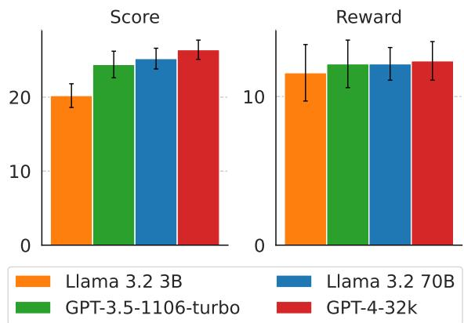  
Figure 6: The performance of DLLM with different LLM sizes and types in Crafter (1M) across 5 seeds.

## F.2 Ablations of the Intrinsic Reward Scale in Crafter

In our work, a Random Network Distillation (RND) network is employed to progressively reduce the intrinsic reward corresponding to each goal. We conduct an ablation experiment to illustrate the necessity of this measure. We set the hyperparameter $\alpha \ \in \{ 0 . 5 , \ 2 \}$ and perform experiments for each value. $\alpha = 2$ resulted in catastrophic outcomes, whereas $\alpha = 0 . 5$ only led to a slight performance decrease. We conclude that excessively large intrinsic rewards tend to mislead the agent, e.g., try to obtain intrinsic rewards instead of environmental rewards. Conversely, excessively small intrinsic rewards result in inadequate guidance the DLLM provides, undermining its effectiveness in directing the agent’s behavior. Please refer to Figures 7(a) and 7(b) for the results.

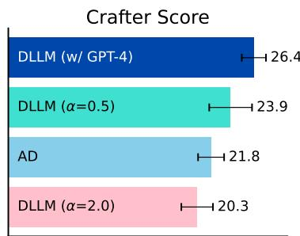

(a) Crafter scores.  
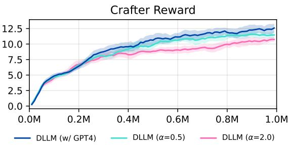  
(b) Reward curves.  
Figure 7: Experimental results of (a) the mean score values and standard deviations; (b) the reward curves for DLLM with different α comparing against baselines in Crafter, averaged across 5 seeds. “AD” refers to Achievement Distillation (Moon et al., 2024).

## F.3 Decrease or not to decrease intrinsic rewards in Crafter

This ablation study aims to demonstrate our claim in the paper that repeatedly providing the agent with a constant intrinsic reward for each goal will result in the agent consistently performing simple tasks (Riedmiller et al., 2018; Trott et al., 2019; Devidze et al., 2022), thereby reducing its exploration efficiency and the likelihood of acquiring new skills. We still use an RND network to provide intrinsic rewards in this experiment. However, by preventing the RND network from updating throughout the training process, we ensure that the intrinsic rewards corresponding to all goals remain constant and do not decrease over time. We observe a slight increase in performance during the earlier stages and a significant decline in the later stages, which is consistent with our claim. Please refer to Figures 8(a) and 8(b) for the results.

## F.4 Random Goals in Crafter

In this ablation study, we investigate the effectiveness of guidance from the LLM using its pretrained knowledge compared to randomly sampled goals. In this experiment, we instruct the LLM to sample goals without providing any information about the agent, resulting in entirely random goal sampling. However, we still require the LLM to adhere to the format specified in Appendix B.2.1. The results are presented in Figure 9(a) and 9(b). We find that using random goals significantly reduces the performance of DLLM. Nonetheless, DLLM still maintains a certain advantage over recent popular algorithms like Dynalang. This is because providing basic information about the environment to the LLM still generates some reasonable goals in uncertain player conditions. These goals continue to provide effective guidance for the agent through the intrinsic rewards generated in model rollouts.

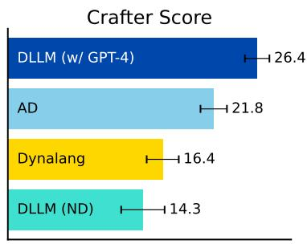

(a) Crafter scores.  
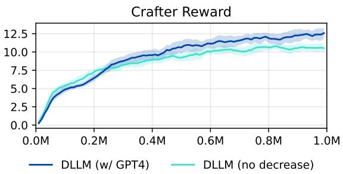  
(b) Reward curves.  
Figure 8: Experimental results consist of (a) the mean score values and standard deviations; (b) the reward curves for DLLM with decreasing or not decreasing intrinsic rewards, denoted as “ND” for “no decrease”, compared to baselines, averaged across 5 seeds. “AD” refers to Achievement Distillation (Moon et al., 2024).

## F.5 Allow Repetition in Crafter

In Method, we assert that when rewarding the same goal repeatedly within a single model rollout, there is a risk that the agent may tend to repetitively trigger simpler goals instead of attempting to unlock unexplored parts of the technology tree. Consequently, this may lead to decreased performance within Crafter environments primarily focused on exploration. This viewpoint aligns with ELLM (Du et al., 2023). Here, we conducted experiments to substantiate this claim, with results presented in Figure 10(a) and 10(b). We observed a significant performance decline in DLLM when repetitive rewards for the same goal were allowed.

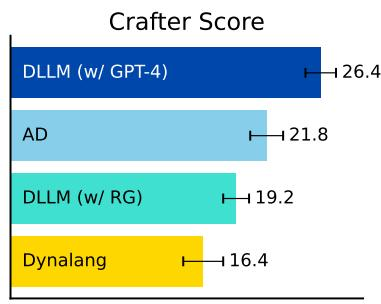

(a) Crafter scores.  
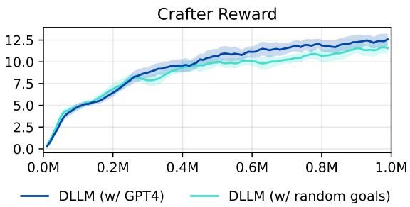  
(b) Reward curves.  
Figure 9: Experimental results consist of (a) the mean score values and standard deviations; (b) the reward curves for DLLM with random goals, denoted as “RG” for “random goals”, compared to baselines, averaged across 5 seeds. “AD” refers to Achievement Distillation (Moon et al., 2024).

## G Additional results in Crafter

Figure 11 presents the comparison of success rates on the total 22 achievements between DLLM and other baselines in Crafter at 1M and 5M steps. DLLM exhibits a higher success rate in unlocking fundamental achievements and outperforms other baselines.

## H Status of Exemption from Institutional Review Board

Before starting any segments of the study involving human evaluation, the research team completed and submitted a “Human Subjects Research Determination" form to the appropriate Institutional Review Board (IRB). We obtained a determination letter from the IRB before any human study activities commenced, indicating that our project proposal had been granted ‘Exempt’ status. This classification implies that the proposed research was deemed ‘Not Human Subjects Research’.

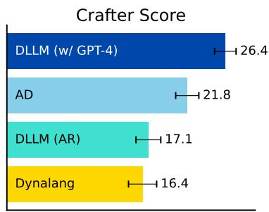

(a) Crafter scores.  
  
(b) Reward curves.  
Figure 10: Experimental results comprise: (a) the mean score values and standard deviations; (b) the reward curves for DLLM allowing repeated intrinsic rewards for goals, denoted as “AR” for “allow repetition”, compared to baselines, averaged across 5 seeds. “AD” refers to Achievement Distillation (Moon et al., 2024).

## I Computational Resources

Table 9 provides a summary of the computational cost of using DLLM, including both training time and the total query time for GPT interactions. The query time for LLMs is influenced by factors such as the training steps, query frequency, and the duration of each query. While decreasing the query interval can theoretically enhance performance, it also increases computational overhead. Therefore, achieving an optimal balance requires careful hyper-parameter searching of the query interval.

Table 9: Computational resources of DLLM.
<table><tr><td></td><td>HomeGrid</td><td>Crafter</td><td>Minecraft</td></tr><tr><td>Env Steps</td><td>50M</td><td>5M</td><td>100M</td></tr><tr><td>Training Time (GPU days)</td><td>11.25</td><td>10.75</td><td>16.50</td></tr><tr><td>Total GPT Querying Time (days)</td><td>7.50</td><td>0.75</td><td>7.50</td></tr></table>

## J Implementation Details

For all the experiments, We employ the default hyperparameters for the XL DreamerV3 model (Hafner et al., 2024). Other hyperparameters are specified below. A uniform learning rate of 3e-4 is applied across all environments for the RND networks. Regarding the scale for intrinsic reward α, we consistently set α to be 1. We use 1 Nvidia A100 GPU for each single experiment. The training time includes the total GPT querying time, which should be near zero when reusing a cache to obtain the goals. More details are shown on table 10.

## K Licenses

In our code, we have used the following libraries covered by the corresponding licenses:

• HomeGrid, with MIT license

• Crafter, with MIT license

• Minecraft, with Attribution-NonCommercial-ShareAlike 4.0 International

• OpenAI GPT, with CC BY-NC-SA 4.0 license

• SentenceTransformer, with Apache-2.0 license

• DreamerV3, with MIT license

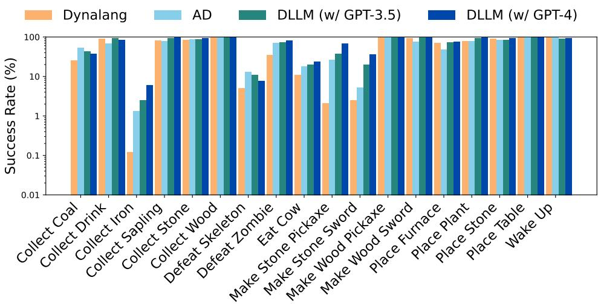

(a)  
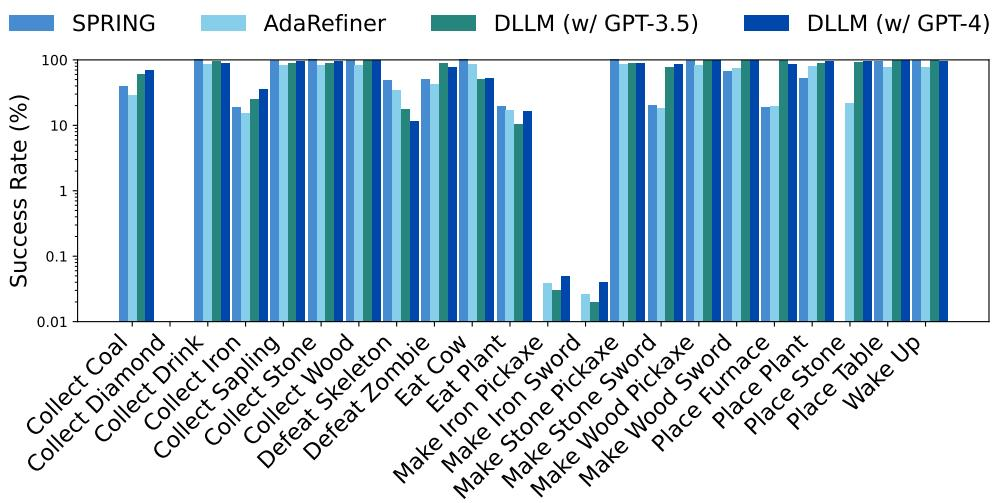  
(b)  
Figure 11: (a) The logarithmic scale success rates for unlocking 18 in 22 achievements at 1M (with the remaining four never achieved otherwise). DLLM surpasses baselines in most achievements, particularly excelling in challenging tasks such as “make stone pickaxe/sword” and “collect iron”. “AD” refers to Achievement Distillation (Moon et al., 2024). (b) Logarithmic scale success rates for unlocking 22 distinct achievements at 5M steps.

Table 10: Hyperparameters and training information for DLLM.
<table><tr><td></td><td>HomeGrid</td><td>Crafter</td><td>Minecraft</td></tr><tr><td>Imagination horizon T</td><td>15</td><td>15</td><td>15</td></tr><tr><td>Language MLP layers</td><td>5</td><td>5</td><td>5</td></tr><tr><td>Language MLP units</td><td>1024</td><td>1024</td><td>1024</td></tr><tr><td>Image Size</td><td>(64, 64, 3)</td><td>(64, 64, 3)</td><td>(64, 64, 3)</td></tr><tr><td>Train ratio</td><td>32</td><td>512</td><td>32</td></tr><tr><td>Batch size</td><td>16</td><td>16</td><td>16</td></tr><tr><td>Batch length</td><td>256</td><td>64</td><td>64</td></tr><tr><td>GRU recurrent units</td><td>4096</td><td>4096</td><td>8192</td></tr><tr><td>Learning rate for RND</td><td>3e-4</td><td>3e-4</td><td>3e-4</td></tr><tr><td>The scale for intrinsic rewards α</td><td>1.0</td><td>1.0</td><td>1.0</td></tr><tr><td>Similarity threshold M</td><td>0.5</td><td>0.5</td><td>0.5</td></tr><tr><td>Max goal numbers K</td><td>2</td><td>5</td><td>5</td></tr><tr><td>Env steps</td><td>50M</td><td>5M</td><td>100M</td></tr><tr><td>Number of envs</td><td>80</td><td>1</td><td>64</td></tr><tr><td>Training Time (GPU days)</td><td>11.25</td><td>10.75</td><td>16.50</td></tr><tr><td>Total GPT querying Time (days)</td><td>7.50</td><td>0.75</td><td>7.50</td></tr><tr><td>temperature of GPT</td><td></td><td>0.5</td><td></td></tr><tr><td>top_p of GPT</td><td></td><td>1.0</td><td></td></tr><tr><td>max_tokens of GPT</td><td></td><td>500</td><td></td></tr><tr><td>CPU device</td><td>AMD EPYC 7452 32-Core Processor</td><td></td><td></td></tr><tr><td>CUDA device</td><td></td><td>Nvidia A100 GPU</td><td></td></tr><tr><td>RAM</td><td></td><td>256G</td><td></td></tr></table>