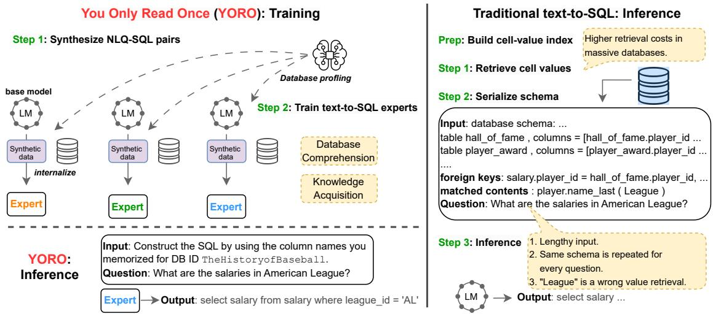
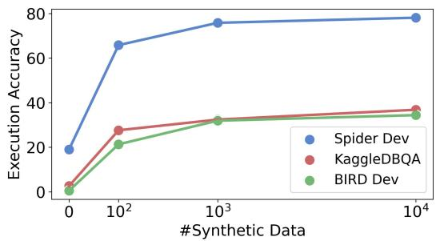
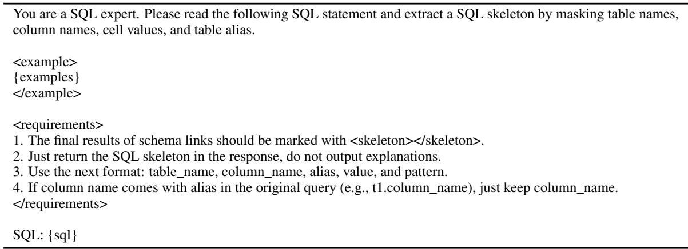
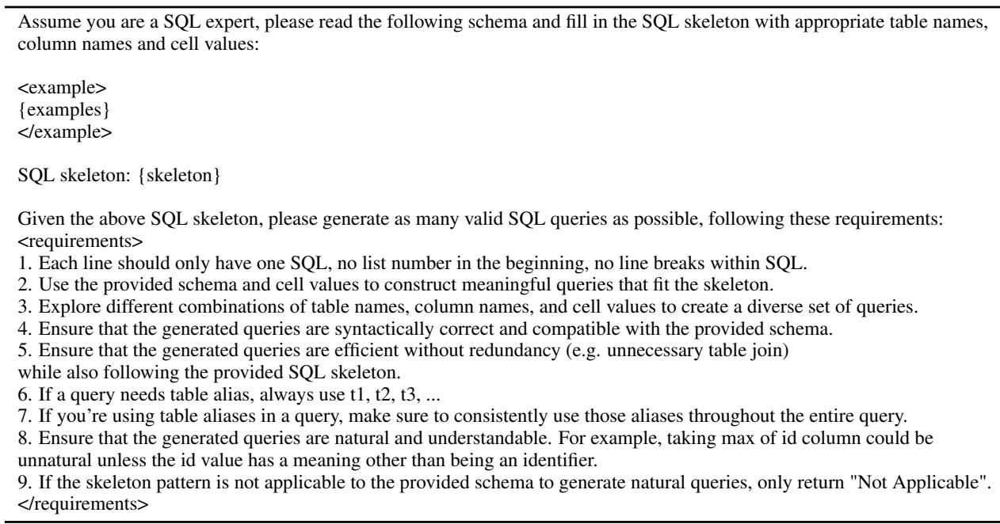
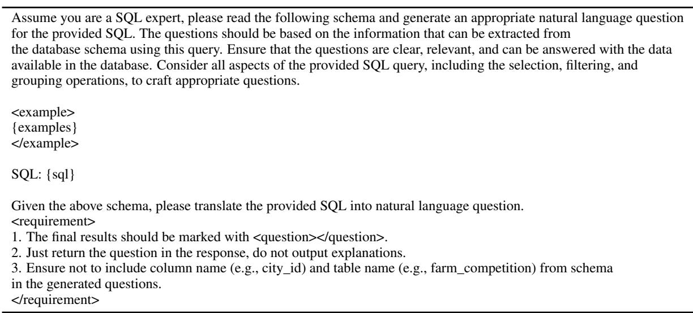

# You Only Read Once (YORO): Learning to Internalize Database Knowledge for Text-to-SQL

Hideo Kobayashi, Wuwei Lan, Peng Shi, Shuaichen Chang, Jiang Guo, Henghui Zhu, Zhiguo Wang, Patrick Ng

AWS AI

{hideodeo, lanwuwei, zhiguow, patricng}@amazon.com

## Abstract

While significant progress has been made on the text-to-SQL task, recent solutions repeatedly encode the same database schema for every question, resulting in unnecessary high inference cost and often overlooking crucial database knowledge. To address these issues, we propose You Only Read Once (YORO), a novel paradigm that directly internalizes database knowledge into the parametric knowledge of a text-to-SQL model during training and eliminates the need for schema encoding during inference. YORO significantly reduces the input token length by 66%-98%. Despite its shorter inputs, our empirical results demonstrate YORO’s competitive performances with traditional systems on three benchmarks as well as its significant outperformance on large databases. Furthermore, YORO excels in handling questions with challenging value retrievals such as abbreviation.

## 1 Introduction

The text-to-SQL task aims to convert natural language questions (NLQs) into executable SQL statements, enabling users without SQL expertise to query databases effortlessly. Existing text-to-SQL systems typically encode both a linearized database schema, which sometimes appended with partial database content (Lin et al., 2020), and an NLQ as input to generate a SQL query grounded in the database (Scholak et al., 2021; Li et al., 2024a). However, this conventional approach presents several limitations, as illustrated in Figure 1.

First, the repeated encoding of the same schema for every question significantly increases the computational inefficiency, especially when dealing with large database schemas. Second, while the linearized schema input represents the high-level structure of the database, it may still omit crucial information, such as all possible cell value choices, relationships among columns and cell values, and domain-specific knowledge. Third, when appending schema with partial database content, existing text-to-SQL systems usually require a cell value retrieval phase for each question. This process incurs additional retrieval costs and can lead to errors if retrieval misses occur due to challenging value scenarios like abbreviations in the question (Chang et al., 2023), resulting in incorrect SQL generation (e.g., it might fail to retrieve the value AL given American League in the NLQ).

<table><tr><td>Aspect</td><td>Comparison</td></tr><tr><td>Lengthly input</td><td>Trad.: ~1979 avg tokenslong DB sequence YORO: ~50 avg tokens</td></tr><tr><td>Repeated encoding</td><td>Trad.: YES encoding the same DB schema YORO: NO</td></tr><tr><td>Information Omission</td><td>Trad.: YES limited DB content YORO: NO</td></tr><tr><td>Wrong retrieval / High retrieval cost</td><td>What are the salaries in American League? Trad.: League (X) / costly during inference YORO: AL (√)</td></tr></table>

Figure 1: Comparison of traditional method and YORO.

To address these limitations, this work introduces a novel training paradigm for the text-to-SQL task, dubbed You Only Read Once (YORO). As illustrated on the left side of Figure 2, YORO takes a fundamentally different approach by first conducting a database knowledge acquisition phase. This phase comprehensively understands the database content and directly internalizes database information into the parametric knowledge of a text-to-SQL model. We achieve this by fine-tuning a language model on synthetic text-to-SQL data generated for target databases.

The key advantage of YORO is evident at inference time, where it can convert NLQs into SQL queries grounded in the database without requiring schema encoding. This streamlined process contrasts sharply with the multiple steps and potential pitfalls of the conventional approach. Furthermore, we propose training text-to-SQL expert models, with each expert specializing in a specific target database. This approach is motivated by the observation that while recent studies focus on training a single text-to-SQL model to generalize across cross-domain databases, database schemas can be highly dynamic and ambiguous with many nuances. For instance, the same column name can have different meanings in different databases. We hypothesize that having expert models can mitigate the potential cross-database knowledge conflicts and improve overall performance.

<table><tr><td>Prompt</td><td>Spider Dev</td><td>KaggleDBQA</td><td>BIRD Dev</td></tr><tr><td>CodeS</td><td>713</td><td>609</td><td>1979</td></tr><tr><td>PICARD</td><td>137</td><td>116</td><td>340</td></tr><tr><td>YORO</td><td>41</td><td>40</td><td>47</td></tr></table>

Table 1: Average input length comparison between YORO and two representative input formats from stateof-the-art models, PICARD and CodeS, across three datasets. Inputs are tokenized using Mistral tokenizer.

Our extensive evaluation on popular text-to-SQL benchmarks, including Spider (Yu et al., 2018), KaggleDBQA (Lee et al., 2021), and BIRD (Li et al., 2024b), demonstrates that YORO performs competitively compared to traditional approaches across different model choices, LLaMA-7B (Touvron et al., 2023) and Mistral-7B (Jiang et al., 2023a). Crucially, YORO achieves this performance while maintaining significantly reduced input lengths. Table 1 shows the input length comparison between YORO and two representative input formats from state-of-the-art models, PICARD (Scholak et al., 2021) and CodeS (Li et al., 2024a), across all three datasets. YORO’s input length is 66-98% shorter than that of previous models. This significant reduction in input length translates to improved computational efficiency, particularly for large databases like those in the BIRD dataset, where YORO’s input length remains consistent regardless of database size. Moreover, YORO’s design allows it to learn database values from synthetic data during the knowledge acquisition phase, eliminating the separate value retrieval step during inference and learning challenging cell values.

Our contributions are three-fold. First, we propose a novel text-to-SQL paradigm, YORO, where expert models acquire database knowledge during the training phase and utilize this knowledge to answer questions without having database access in inputs during inference phase. This results in significantly shorter inputs and eliminates dependence on value retrievers. Second, experimental results demonstrate that YORO achieves comparable performance with traditional methods. Third, our case studies reveal that YORO significantly outperforms traditional methods in large databases and excels at handling questions with challenging value retrievals.

## 2 Related Work

Text-to-SQL. Fine-tuning has recently been the primary method for achieving satisfying performance for text-to-SQL (Zhong et al., 2017; Yu et al., 2018; Scholak et al., 2021). However, with the emergence of closed-source LLMs like GPT-4 and Claude, their powerful zero-shot and in-context learning capabilities have made prompting-based solutions a strong baseline. (Chen et al., 2023; Pourreza and Rafiei, 2024; Chang and Fosler-Lussier, 2023; Zhang et al., 2024; Gao et al., 2023; Wang et al., 2023a). For example, Pourreza and Rafiei (2024) decomposes the parsing problem into several tasks such as schema linking, leveraging GPT-4 to solve each task by providing exemplars. However, the effectiveness is limited by the quality of the LLMs, and it is not possible to improve the performance of these closed-source models directly. More recently, the continued training of LLMs has been revisited for its potential to further boost text-to-SQL parsing performance, as seen with models like CodeLlama (Roziere et al., 2023) and CodeS (Li et al., 2024a). All of these methods still require schema information during inference, as well as running cell value candidate retrieval and column rankers when dealing with large databases.

Context Compression. Context compression aims to make the LLM inference more efficient by either compressing and shortening the instruction (Fei et al., 2023; Jiang et al., 2023b) or encoding the context into compact representation (Chevalier et al., 2023; Mu et al., 2024; Xiao et al., 2023). In this work, we aim to shorten database contents via knowledge ingestion where the contexts are "stored" in model’s parameters.

Single database semantic parsing can be naturally viewed as a compressed schema setting for Text-to-SQL (e.g., ATIS (Hemphill et al., 1990), GEO (Zelle and Mooney, 1996)). However, this approach requires a large amount of annotated examples, whereas we synthesize data. Additionally, these studies did not focus on storing database contents into model weights.

  
Figure 2: Overview of YORO. YORO comprehends and internalizes database knowledge through fine-tuning text-to-SQL expert models on synthetic NLQ and SQL data. Comparing with traditional methods, it leads to significantly shorter inputs and does not rely on the value retrieval step.

Trad.: \~1979 avg tokens ▹Synthesizing data for Text-to-SQL. Data aug-YORO: \~50 avg tokensmentation improves text-to-SQL systems, espe-Trad.: YES ▹ encoding samcially in the domain generalization. One effective approach is the skeleton-based method, which ex-Information Omission Trad.: YES ▹ limited ctracts SQL skeletons and populates placeholders to generate diverse SQL queries for training set’s Wrong retrieval /databases (Zhong et al., 2020; Hu et al., 2023). YORO: AL (✔)Subsequently, a SQL-to-Text generator such as T5 or ChatGPT is employed to produce the NLQ and SQL pairs. Another line of work synthesizes data for databases from new domains (Wang et al., 2023b; Li et al., 2024a). These studies still require providing database contents as part of the input.

## 3 YORO

YORO encompasses a training stage for database comprehension and knowledge acquisition, followed by an inference stage focused on question comprehension and SQL generation. As illustrated in Figure 2, we propose a straightforward approach to acquire database knowledge: synthesize a vast collection of high-quality NLQ-SQL pairs for the target database, then continue training large language models to become Text-to-SQL experts. Once the YORO expert model is ready, we can use it for online inference without accessing schema information. In contrast, traditional Text-to-SQL systems require constructing a database index and retrieving cell values, a time-consuming process that also incurs index maintenance costs. After cell value retrieval, we must serialize the schema and construct a significantly longer input for model inference. In the next sections, we will delve into

DB contentthe intricacies of our prompt design, training phase, and inference phases.

## 3.1 Prompt Structure

t lengthOur prompt closely resembles the standard textto-SQL prompts, yet it excludes all schema information (e.g., table names, column names, column aliases, column types, foreign key relationships) and cell value candidates. We only retain the database ID (e.g., department\_management). This approach prevents the model from merely copying database contents from the input when constructing a SQL query and instead compels it to internalize the database contents within the model weights for each database ID. In contrast to standard text-to-SQL prompts (Table 2), our prompt is remarkably simple and results in significantly shorter inputs.

In contrast, the CodeS prompt (Li et al., 2024a) incorporates database information as extensively as possible, including table/column names, column types, sampled cell values, retrieved cell values, as well as primary and foreign key relationships. The underlying design principle is to ensure that all relevant information is accessible within the prompt. However, the PICARD prompt (Scholak et al., 2021) adopts a more simplified approach, omitting column types, sampled cell values, and foreign key relationships. Despite this, its input remains lengthy, and it adds complexity to constraint decoding during beam search.

## 3.2 Database Knowledge Acquisition

Databases often comprise numerous tables, columns, and a vast number of rows, with each row containing relevant domain knowledge. It is a non-trivial task for a large language model (LLM) to efficiently digest and compress all this information into the model weights. More importantly, the LLM must also learn how to leverage this acquired information for the text-to-SQL task. To bridge the gap between database knowledge acquisition and text-to-SQL generation, we propose the method of continued pre-training with synthetic NLQ-SQL pairs. In this approach, we encode the database structure and cell value information within synthetic SQL queries, and then utilize these NLQ-SQL pairs for model training. This method enables the LLM to not only absorb the database information but also learn how to apply it in generating accurate SQL queries from NLQs.

In line with Zhao et al.’s (2023) method, we employ skeleton-based SQL synthesis and condition NLQ generation based on synthetic SQLs. We leverage in-context learning with an LLM for all three stages: 1) SQL skeleton extraction, 2) SQL generation and 3) NLQ generation. We start with zero-shot prompt and gradually add generations as few-shot exemplars. We describe each step with examples below. See Appendix A for the prompts used at these steps.

SQL Skeleton Extraction. From SQL queries in a training set, we extract SQL skeletons by abstracting table names, column names, aliases, and cell values, resulting in a variety of skeletons. This diversity ensures a broad range of SQL patterns in subsequent steps, while also ensuring that the resulting synthetic SQL queries will have SQL patterns similar to those in the training set.

SQL: select avg(unitprice) from track Skel.: select avg(col\_name) from table\_name

SQL Generation. Using the skeletons from the previous step, we generate SQL queries for the target database by prompting an LLM to fill in placeholders within each skeleton. Multiple SQL queries are derived from each skeleton. We instruct the LLM to skip generating SQL queries for skeletons that are not applicable to the database (e.g., insufficient tables to meet the required number of tables). Each generated SQL query is executed, and those that result in execution errors are filtered out. We present the database contents in the CodeS format within the prompt, providing metadata and sample cell values for columns. We use a high temperature setting for in-context learning to ensure SQL queries with extensive coverage of different tables, columns, and cell values.

Skel.: select avg(col\_name) from table\_name SQL1: select avg(tonnage) from ship SQL2: select avg(lost\_in\_battle) from ship

NLQ Generation. Finally, given a synthetic SQL from the previous step, we generate an NLQ. Interestingly, we observed in our preliminary study that in-context learning produces high-quality NLQs, whereas Zhao et al.’s (2023) T5-based NLQ generator often yields unnatural NLQs, especially with complex SQL queries. In contrast, in-context learning adapts more effectively to complex queries, resulting in more natural and accurate NLQs. We believe that high-quality NLQs are crucial not only for accurate text-to-SQL learning but also for a correct understanding of the database.

SQL: select avg(tonnage) from ship NLQ: What is the average tonnage of the ships?

## 3.3 Domain Experts

YORO employs expert models to acquire knowledge for each target database. Unlike previous approaches that aim to train a single model capable of generalizing to unseen database schemas, our solution can be adapted to a company’s proprietary databases without requiring new human-labeled data. Although training multiple expert models is more computationally expensive than training a single model, our solution can significantly reduce the cost of online inference. For example, it saves 64% of FLOPS compared to PICARD and 93% compared to CodeS in the 90th percentile on Spider. Since model training is a one-time cost while inference will be continuous, YOLO will achieve better overall efficiency.

While target databases are typically unseen, the synthetic data described in Section 3.2 profiles the target databases, allowing us to transfer domain knowledge to expert models. To train an expert model, we combine the synthetic data of the target database and the original training data (i.e., out-ofdomain data), excluding its database contents, to enhance data quality and diversity. We hypothesize that balancing training data allows expert models to mitigate cross-database knowledge conflicts. Finally, each fine-tuned expert processes the test data routed to it by the database ID during inference.

<table><tr><td>Prompt</td><td>Example</td></tr><tr><td>CodeS</td><td>Schema: table department , columns = [ department.creation ( text I values : 1789 , 1947 ) , department.ranking ( int I values : 1 , 2 ) , department.budget_in_billions (real I values : 9.96 , 11.1) , department.num_employees (real I values : 30266.0 , 115897.0 ),</td></tr><tr><td></td><td>department.department_id ( int I primary key I values : 1 , 2 ) , department.name ( text I values : State , Treasury ) ] foreign keys: management.head_id = head.head_id, ... matched contents : department.name (State )</td></tr><tr><td>PICARD</td><td>Schema: department_management I department : department_id , name , creation , ranking , budget_in_billions ,</td></tr><tr><td>YORO</td><td>num_employees I head : head_id , name , born_state , age I management : department_id , head_id , temporary_acting Construct the SQL by using the column names you memorized forDB ID department_management.</td></tr></table>

Table 2: Examples of different prompts for the same data in Spider Dev, each followed by the same NLQ.

## 4 Evaluation

## 4.1 Experimental Setup

Evaluation datasets. For evaluation, we employ three widely used datasets for Text-to-SQL, Spider (Yu et al., 2018), KaggleDBQA (Lee et al., 2021), and BIRD (Li et al., 2024b)1. Spider is known to have table and column names that are simple and explicit while the other two datasets use more realistic databases containing abbreviated and ambiguous column names. BIRD’s databases also contain cell values in various formats that poses new challenges for models. We use the official dev sets as our test set because our method needs to access the target database for the knowledge acquisition. In addition, prior studies on BIRD often use oracle knowledge during training and testing, but this is not a realistic setting. Therefore, we do not use oracle knowledge in our BIRD experiments.

Evaluation metrics. Text-to-SQL results are reported in execution accuracies. We provide both micro and macro averages across all databases. Unless otherwise specified, we always present micro average results.

Implementation details. We use Anthropic’s Claude-3-Sonnet model to generate synthetic data. For SQL skeleton extraction and NLQ generation, the temperature is set as 0.9 and 0.0 respectively2. We set higher temperature for SQL generation since we want to obtain diverse SQLs.

As noted in Section 3.3, we mix the synthetic data with original training data to train each expert model. Since KaggleDBQA lacks a training set, we use the Spider’s training set for KaggleD-BQA experiments. We use Mistral-7B (Jiang et al., 2023a) and LLaMA-7B (Touvron et al., 2023) as the base models. We optimize these models using AdamW (Loshchilov and Hutter, 2018) for 300 steps for Mistral and 500 steps for LLaMA with a batch size of 128 through gradient accumulation, a maximum learning rate of 2e-6 for Mistral and 2e-5 for LLaMA, and a linear warmup of 0.04 ratio followed by a cosine decay of the learning rate. The texts over 4096 tokens are trimmed during training.

## 4.2 Results and Discussion

Baselines. We employ as our baselines models trained on the input formats of CodeS and PICARD, which contain database information as described in Section 3.1. We retrieved cell value candidates for the CodeS format but not for PICARD, to investigate performance differences given varying amounts of database information. This establishes two baselines: the former with full information access and the latter with minimal access.

Results of text-to-SQL for Spider, KaggleD-BQA, and BIRD are shown in Table 3. As we can see, using Mistral as the base model consistently outperforms LLaMA. Additionally, all macro and micro average results obtained via CodeS baselines are higher than PICARD baseline results across the three datasets, except for the LLaMA versions in Spider and BIRD. This implies that various metadata and retrieved values presented in the CodeS prompt are often helpful. We speculate that a model might need to be powerful enough to fully utilize the rich information in the CodeS prompt and that even the LLaMA versions will perform well more consistently with CodeS prompt on all datasets if inputs are shortened via schema filtering.

Baselines vs YORO. Results of YORO are presented in Table 3. Our goal is to determine if a model without database access during inference can compete with or even surpass the performance of traditional methods.

First, Our method significantly outperforms all PICARD baselines by 1.9% to 12.0% with Mistral and 6.5% to 18.0% with LLaMA in terms of micro average accuracy. Although YORO’s inputs lack table and column names during inference, training expert models on NLQ-SQL pairs improves performances, even surpassing PICARD baselines.

<table><tr><td rowspan="2">Method</td><td colspan="2">Spider Dev</td><td colspan="2">KaggleDBQA</td><td colspan="2">BIRD Dev</td></tr><tr><td>Mic.</td><td>Mac.</td><td>Mic.</td><td>Mac.</td><td>Mic.</td><td>Mac.</td></tr><tr><td></td><td colspan="6">Mistral-7B</td></tr><tr><td>CodeS</td><td>80.2</td><td>83.5</td><td>44.5</td><td>43.4</td><td>35.7</td><td>34.1</td></tr><tr><td>PICARD</td><td>76.1</td><td>81.3</td><td>37.1</td><td>35.3</td><td>22.0</td><td>22.1</td></tr><tr><td>YORO</td><td>78.5</td><td>81.8</td><td>39.0</td><td>39.0</td><td>34.0</td><td>34.1</td></tr><tr><td colspan="7">LLaMA-7B</td></tr><tr><td>CodeS</td><td>66.9</td><td>71.9</td><td>27.9</td><td>24.5</td><td>11.7</td><td>12.0</td></tr><tr><td>PICARD</td><td>67.7</td><td>71.9</td><td>22.8</td><td>22.3</td><td>12.6</td><td>11.8</td></tr><tr><td>YORO</td><td>74.2</td><td>76.9</td><td>34.2</td><td>34.3</td><td>30.6</td><td>30.4</td></tr></table>

Table 3: Performance of CodeS, PICARD, and YORO in Spider Dev, KaggleDBQA, and BIRD Dev, using LLaMA-7B and Mistral-7B. Bold indicates the highest accuracy, and underlined denotes the second highest.

Second, when comparing YORO with CodeS baselines, we observe mixed results between using LLaMA and Mistral. With LLaMA, YORO consistently outperforms the corresponding CodeS baselines by 6.3-18.9% in terms of micro average accuracy. This indicates that LLaMA makes it easier for YORO to answer questions using its acquired database knowledge instead of relying on the database contents in the input. On the other hand, YORO using Mistral underperforms CodeS baselines by up to 1.7-5.5% micro average. However, a closer examination of individual database performance in Appendix D reveals that there exists several YORO experts performing as well as or better than their CodeS counterparts.

Finally, in the comparison of YORO with PI-CARD and CodeS in BIRD, YORO often shows either a smaller performance gap or significant improvement compared to the other datasets. This trend in BIRD can be explained by two factors. 1) the databases in BIRD are larger than those in the other two datasets, as discussed in Section 4.4. 2) baselines struggle with the metadata in CodeS due to abbreviated columns and random cell values in BIRD. Our method uses synthetic NLQs to help models comprehend these abbreviated columns and cell values. This can also be seen as enhancing YORO’s ability to handle complex databases by distilling the Claude’s knowledge.

While our discussion of these results has focused on micro average accuracy, the same trends can be observed for macro average accuracy for the most part. Overall, these results are very encouraging, especially considering that the new paradigm is a highly challenging setting.

<table><tr><td>Spider Dev (%)</td><td>KaggleDBQA (%)</td><td>BIRD Dev (%)</td></tr><tr><td>0.48</td><td>0.37</td><td>0.07</td></tr></table>

Table 4: Percentage of gold SQLs in each test set that exactly match any synthetic SQLs used to train our models. For BIRD, a string match is used, while for Spider and KaggleDBQA, a parsing-based match (i.e., exact match in Spider evaluation) is employed. The proportion is very small, under 0.5% in each dataset.

To further validate our findings, we examine whether synthetic data significantly overlaps with test sets, causing YORO to memorize the gold labels rather than genuinely acquiring database knowledge. Table 4 presents the percentage of gold SQLs in each test set having an exact match with any synthetic SQLs used to train our models. It shows the ratio is less than 0.5%, indicating that YORO is indeed learning database contents.

Different synthetic data sizes. Recent studies (Li et al., 2023; Zhou et al., 2024) show the importance of quality and quantity of training data. Here, we investigate the effectiveness of scaling up the synthetic data by training models with varying amounts of synthetic data.

Results of YORO with Mistral on three datasets are shown in Figure 3, where YORO is trained on the mixed data of the original training data and different amount of synthetic data. Mistral is a strong base model as can been seen from prior experiments. Without any synthetic data (i.e., using only original training data), the model achieves 0.5- 19.0% points. Surprisingly, performances improve by 20.7-46.8% points only by being provided with one hundred synthetic data for each target database. We see the smaller slope after one hundred synthetic data. This suggests the importance of augmenting the synthetic data, although a substantial quantity may not always be necessary.

Standard fine-tuning vs LoRA. We further enhance memory efficiency by employing the lowrank updating mechanism, known as LoRA (Hu et al., 2021). Employing a shared foundation model with a set of LoRA adaptors for different companies could increase cost efficiency. Moreover, recent work (Chen et al., 2024) enables efficient multi-LoRA serving. Dettmers et al. (2024) demonstrates LoRA’s ability to compete with standard fine-tuning performances in some tasks. However, unlike typical NLP tasks, YORO requires learning domain-specific knowledge (i.e., database knowledge) that has not been seen during pre-training. The question is: would LoRA still compete with standard fine-tuning in such a new paradigm?

  
Figure 3: Performance of YORO trained with varying amounts of synthetic data using Mistral-7B.

<table><tr><td>Method</td><td>Spider Dev KaggleDBQA</td><td></td><td>BIRD Dev</td></tr><tr><td></td><td colspan="3">Mistral-7B</td></tr><tr><td>Standard</td><td>78.5</td><td>39.0</td><td>34.0</td></tr><tr><td>LoRA</td><td>78.1</td><td>37.5</td><td>33.8</td></tr><tr><td></td><td colspan="3">LLaMA-7B</td></tr><tr><td>Standard</td><td>74.2</td><td>34.2</td><td>30.6</td></tr><tr><td>LoRA</td><td>73.2</td><td>33.1</td><td>28.4</td></tr></table>

Table 5: YORO with standard vs LoRA fine-tuning.

Results of standard fine-tuning and LoRA3 versions of YORO with Mistral and LLaMA on three datasets are shown in Table 5. Although significantly less parameters are updated in LoRA, it lags behind the standard fine-tuning version by only 0.2- 2.2% points. This suggests that YORO is effective even with parameter-efficient fine-tuning.

Different model sizes. The LLaMA series encompasses a range of models differing in size. In this experiment, we aim to investigate how varying the size of these models affects YORO’s performance while utilizing LoRA fine-tuning due to computational limitations.

Results of YORO using LLaMA with varying sizes are shown in Table 6. We observe that model scaling generally leads to higher accuracies in the new paradigm. However, in contrast to prior work, which often shows significant improvements with increasing LLaMA model size, our results might be a more moderate enhancement.

<table><tr><td>Model</td><td>Spider Dev</td><td>KaggleDBQA</td><td>BIRD Dev</td></tr><tr><td>LLaMA-7B</td><td>73.2</td><td>33.1</td><td>28.4</td></tr><tr><td>LLaMA-13B</td><td>74.4</td><td>35.3</td><td>31.1</td></tr><tr><td>LLaMA-33B</td><td>74.9</td><td>36.0</td><td>32.9</td></tr></table>

Table 6: Performance of YORO across different LLaMA model sizes, all fine-tuned using LoRA.
<table><tr><td colspan="2">Spider</td><td>BIRD</td></tr><tr><td>YORO</td><td>74.1</td><td>44.4</td></tr><tr><td>– Original data</td><td>67.9</td><td>37.3</td></tr><tr><td>– Synthetic data</td><td>15.2</td><td>0.37</td></tr><tr><td>– Database ID</td><td>71.3</td><td>41.3</td></tr><tr><td>– Domain experts</td><td>67.5</td><td>40.5</td></tr></table>

Table 7: Ablation results for YORO using Mistral-7B.

## 4.3 Ablations.

To evaluate the contribution of the different components in our full model, we show in Table 7 ablation results of YORO using Mistral-7B, which we obtain by removing one component at a time and retraining the model. We evaluate on holdout sets from the training data of Spider and BIRD, using 20 and 11 training databases, respectively.

Original training data. First, we remove the original training data, meaning that each expert is trained solely on synthetic data. As we can see in Table 7, Text-to-SQL accuracy drops by 5.3- 7.9% points. This indicates that it is useful to mix original training data with synthetic data.

Synthetic data. Ablating the synthetic data means that all experts are trained using only the original training data (i.e., out-of-domain data). This ablation resembles the part of the prior experiment where we trained models with different amounts of synthetic data. Comparing with the full model results, Text-to-SQL accuracy drops by 33.5-59.5% points. This suggests the effectiveness of using our synthetic data as well as the difficulty of the new paradigm.

Database ID. Next, we remove database ID from YORO’s prompts during training and testing. Recall that an expert is trained on a mix of original and synthetic data, requiring the model to link questions with database knowledge from multiple sources. Text-to-SQL accuracy drops by 2.1-6.5% points, showing the important role played by database ID.

Domain experts. Finally, we ablate domain experts by training a single model on the mixture of synthetic data for all target databases. Text-to-SQL accuracy drops by 5.9-6.8% points, showing domain experts’ positive contribution. The expert approach helps efficiently transfer the domain knowledge for the target database through synthetic data.

(1) CodeS Input: database schema : ... templates.template\_type\_code ( char(15) | values : PP , BK ) , ...   
Question: Show the number of documents that use the PowerPoint template.   
(✗) CodeS Output: select count(\*) from documents as t1 join templates as t2   
on t1.template\_id = t2.template\_id where t2.template\_type\_code = ${ \bf \Pi } : \bf P P \cal P ^ { \bf \Pi } $   
(✓) YORO Output: select count(\*) from documents as t1 join templates as t2   
on t1.template\_id = t2.template\_id where t2.template\_type\_code = ’ PPT   
(2) CodeS Input: database schema : ... bond.bond\_type ( text | values : $\mathbf { \partial } - \mathbf { \partial } _ { \mathbf { \gamma } } , = \mathbf { \gamma } )$   
Question: Find the triple-bonded molecules which are carcinogenic.   
(✗) CodeS Output: select molecule.molecule\_id from molecule inner join bond on   
molecule.molecule\_id = bond.molecule\_id where bond.bond $\mathrm { { . y p e } = \ ' \cdot \ ' }$ and molecule.label = ’+’   
(✓) YORO Output: select t1.molecule\_id from molecule as t1 inner join bond as t2 on   
t1.molecule\_id = t2.molecule\_id where t1.label = ’+’ and t2.bond ${ \mathrm { t y p e } } = { \mathrm { } } ^ { , } { \# } ^ { , }$  
Table 8: Examples of challenging value retrieval scenarios. The value retriever finds no value in these examples.

## 4.4 Case Studies.

We explore further strengths of YORO alongside its significantly shorter inputs.

Large databases. YORO can handle large databases consisting of many columns and tables without making input longer during inference, while traditional methods might suffer from long input sequence both in terms of accuracy and inference cost. To examine performances with large databases, we construct our evaluation set using a subset of the BIRD dev set, ensuring that each database contains at least 90 columns. This accounts for 583 of 1534 examples4.

Results of CodeS, PICARD, and YORO using Mistral-7B are 26.1%, 18.4%, and 31.6%, respectively. Despite YORO underperforming CodeS on the entire BIRD dataset as shown in Table 3, it surpasses both CodeS and PICARD when handling large databases. This advantage over CodeS may arise in part from its input truncation when exceeding a maximum length, which is common due to CodeS’s longer inputs with large databases. While schema filtering and model quantization are potential memory-saving techniques, our method does not require schema filtering during inference for handling massive databases, and it can also seamlessly integrates with model quantization.

Challenging value retrievals. In certain instances, YORO successfully generates accurate queries for questions involving challenging value retrieval. Many state-of-the-art models rely on string matching to align indicators in the question with database values, potentially leading to failures when encountering specific instances like abbreviations such as "PPT" in Example (1) in Table 8. While CodeS input may occasionally include the required value among its example column values, this is not always the case. In contrast, YORO may have encountered the required value in synthetic data during training, allowing it to effectively leverage this knowledge to address such challenging cases. In addition to abbreviation, Examples (2) presents another challenging case where the retriever needs to find the database value "#" from the indicator "triple-bonded" in the question5. While the baseline model might attempt to guess the value based on the world knowledge it acquired during pre-training, this approach is not always successful. These examples highlight a potential advantage of YORO in handling challenging value retrieval. However, further research with a more extensive dataset is needed to validate this quantitatively.

Baselines might be enhanced by employing a more sophisticated retriever (e.g., embeddingbased) with the drawback of higher retrieval costs. However, YORO’s strength lies in its independence from such a retrieval step. This is particularly advantageous when dealing with massive databases containing numerous cell values.

## 4.5 Error Analysis

Although YORO outperforms all PICARD baselines for text-to-SQL, it still underperforms CodeS baselines when using Mistral-7B. To better understand what areas of improvement are needed, we present some sample errors made by our topperforming YORO setup, which uses Mistral-7B as the base model.

<table><tr><td>(1)</td><td>Database: concert_singer I stadium: stadium_id , location , name , capacity , highest , lowest , average I singer : singer_id , name , country , song_name , song_release_year , age , is_male I concert : concert_id , concert_name , theme , stadium_id , year | singer_in_concert : concert_id , singer_id</td></tr><tr><td>(2)</td><td>Question: What are the locations and names of all stations with capacity between 5000 and 10000? YORO Output: select t1.location, t1.name from station as t1 where t1.capacity between 5000 and 10000 Database: car_1 I continents : contid , continent I countries : countryid , countryname , continent I car_makers : id , maker , fullname , country |model_list: modelid , maker , model I car_names : makeid , model , make | car_data: id , mpg , cylinders , edispl , horsepower , weight , accelerate , year</td></tr><tr><td>(3)</td><td>Question: How many models does each car maker produce? List maker full name, id and the number. YORO Output: t1.fullname, t2.id, count(*) from car_makers as t1 join model_list as t2 on t1.id = t2.maker group by t2.maker Database: GeoNuclearData I nuclear_power_plants : id, name, latitude, longitude, country, status, reactortype, reactormodel, constructionstartat, operationalfrom, operationalto, capacity, lastupdatedat, source</td></tr></table>

Table 9: Examples of the errors made by YORO with Mistral-7B. PICARD inputs are also presented as reference.

While this may not be surprising, our model occasionally fails in correctly acquiring database knowledge. First, the model uses a table name that does not exist in the database when constructing a SQL query, such as "station" in Example (1) in Table 9, where the correct table name is "stadium". In this example, the model misuses "stations" from the question as the table name. Second, the model get confused about which table a column belongs to. In Example (2), the "t2.id" column in the generated query is a column that does not appear in the "model\_list" table even though this column name exists in other tables such as the "car\_makers" and "car\_data" tables. Third, the model recalls an incorrect cell value. In Example (3), the cell value "Under Construction" for the "status" column is necessary to construct a correct query. Instead, the model incorrectly uses "preparation" from the question as the cell value "Preparation". Currently our system still makes mistakes with these cases.

## 5 Conclusion

Motivated in part by recent studies on compressing instructions and contexts, this work introduced YORO, a new training paradigm for Text-to-SQL. It enables database knowledge acquisition by finetuning domain experts on text-to-SQL synthetic data and answer questions without having database access. YORO outperformed PICARD baselines with Mistral and LLaMA while also surpassing CodeS baselines with LLaMA.

## Limitations

There are three limitations. First, database contents could dynamically change, which requires our proposed method to retrain a model occasionally. To update the database information already stored in LLM’s parametric knowledge after database operations such as inserts, updates or deletions, it might be more desirable to use a knowledge editing technique on the trained model rather than fully fine-tune a base LLM from scratch. Second, some enterprise-level databases may involve thousands of tables, which could challenge YORO’s scalability and limit its applicability to medium-sized databases. Third, some databases could share a similar domain, potentially leading to beneficial synergy by training an expert on synthetic data generated from those databases, but we have trained an expert on synthetic data from a single target database and original training data without considering domain combinations. We leave these three components to a future work.

## References

Shuaichen Chang and Eric Fosler-Lussier. 2023. Selective demonstrations for cross-domain text-to-sql. arXiv preprint arXiv:2310.06302.

Shuaichen Chang, Jun Wang, Mingwen Dong, Lin Pan, Henghui Zhu, Alexander Hanbo Li, Wuwei Lan, Sheng Zhang, Jiarong Jiang, Joseph Lilien, et al. 2023. Dr. spider: A diagnostic evaluation benchmark towards text-to-sql robustness. arXiv preprint arXiv:2301.08881.

Lequn Chen, Zihao Ye, Yongji Wu, Danyang Zhuo, Luis Ceze, and Arvind Krishnamurthy. 2024. Punica: Multi-tenant lora serving. Proceedings of Machine Learning and Systems, 6:1–13.

Xinyun Chen, Maxwell Lin, Nathanael Schärli, and Denny Zhou. 2023. Teaching large language models to self-debug. arXiv preprint arXiv:2304.05128.

Alexis Chevalier, Alexander Wettig, Anirudh Ajith, and Danqi Chen. 2023. Adapting language models to compress contexts. In Proceedings ofthe 2023 Conference on Empirical Methods in Natural Language Processing, pages 3829–3846.

Tim Dettmers, Artidoro Pagnoni, Ari Holtzman, and Luke Zettlemoyer. 2024. Qlora: Efficient finetuning of quantized llms. Advances in Neural Information Processing Systems, 36.

Weizhi Fei, Xueyan Niu, Pingyi Zhou, Lu Hou, Bo Bai, Lei Deng, and Wei Han. 2023. Extending context window of large language models via semantic compression. arXiv preprint arXiv:2312.09571.

Dawei Gao, Haibin Wang, Yaliang Li, Xiuyu Sun, Yichen Qian, Bolin Ding, and Jingren Zhou. 2023. Text-to-sql empowered by large language models: A benchmark evaluation. arXiv preprint arXiv:2308.15363.

Charles T Hemphill, John J Godfrey, and George R Doddington. 1990. The atis spoken language systems pilot corpus. In Speech and Natural Language: Proceedings of a Workshop Held at Hidden Valley, Pennsylvania, June 24-27, 1990.

Edward J Hu, Phillip Wallis, Zeyuan Allen-Zhu, Yuanzhi Li, Shean Wang, Lu Wang, Weizhu Chen, et al. 2021. Lora: Low-rank adaptation of large language models. In International Conference on Learning Representations.

Yiqun Hu, Yiyun Zhao, Jiarong Jiang, Wuwei Lan, Henghui Zhu, Anuj Chauhan, Alexander Hanbo Li, Lin Pan, Jun Wang, Chung-Wei Hang, et al. 2023. Importance of synthesizing high-quality data for textto-sql parsing. In Findings of the Association for Computational Linguistics: ACL 2023, pages 1327– 1343.

Albert Q Jiang, Alexandre Sablayrolles, Arthur Mensch, Chris Bamford, Devendra Singh Chaplot, Diego de las Casas, Florian Bressand, Gianna Lengyel, Guillaume Lample, Lucile Saulnier, et al. 2023a. Mistral 7b. arXiv preprint arXiv:2310.06825.

Huiqiang Jiang, Qianhui Wu, Chin-Yew Lin, Yuqing Yang, and Lili Qiu. 2023b. Llmlingua: Compressing prompts for accelerated inference of large language models. arXiv preprint arXiv:2310.05736.

Chia-Hsuan Lee, Oleksandr Polozov, and Matthew Richardson. 2021. KaggleDBQA: Realistic evaluation of text-to-SQL parsers. In Proceedings ofthe 59th Annual Meeting ofthe Associationfor Computational Linguistics and the 11th International Joint Conference on Natural Language Processing (Volume 1: Long Papers), pages 2261–2273, Online. Association for Computational Linguistics.

Haoyang Li, Jing Zhang, Hanbing Liu, Ju Fan, Xiaokang Zhang, Jun Zhu, Renjie Wei, Hongyan Pan, Cuiping Li, and Hong Chen. 2024a. Codes: Towards building open-source language models for text-to-sql.

Proceedings of the ACM on Management of Data, 2(3):1–28.

Jinyang Li, Binyuan Hui, Ge Qu, Jiaxi Yang, Binhua Li, Bowen Li, Bailin Wang, Bowen Qin, Ruiying Geng, Nan Huo, et al. 2024b. Can llm already serve as a database interface? a big bench for large-scale database grounded text-to-sqls. Advances in Neural Information Processing Systems, 36.

Xian Li, Ping Yu, Chunting Zhou, Timo Schick, Omer Levy, Luke Zettlemoyer, Jason E Weston, and Mike Lewis. 2023. Self-alignment with instruction backtranslation. In The Twelfth International Conference on Learning Representations.

Xi Victoria Lin, Richard Socher, and Caiming Xiong. 2020. Bridging textual and tabular data for crossdomain text-to-sql semantic parsing. arXiv preprint arXiv:2012.12627.

Ilya Loshchilov and Frank Hutter. 2018. Decoupled weight decay regularization. In International Conference on Learning Representations.

Jesse Mu, Xiang Li, and Noah Goodman. 2024. Learning to compress prompts with gist tokens. Advances in Neural Information Processing Systems, 36.

Mohammadreza Pourreza and Davood Rafiei. 2024. Din-sql: Decomposed in-context learning of textto-sql with self-correction. Advances in Neural Information Processing Systems, 36.

Baptiste Roziere, Jonas Gehring, Fabian Gloeckle, Sten Sootla, Itai Gat, Xiaoqing Ellen Tan, Yossi Adi, Jingyu Liu, Tal Remez, Jérémy Rapin, et al. 2023. Code llama: Open foundation models for code. arXiv preprint arXiv:2308.12950.

Torsten Scholak, Nathan Schucher, and Dzmitry Bahdanau. 2021. PICARD: Parsing incrementally for constrained auto-regressive decoding from language models. In Proceedings ofthe 2021 Conference on Empirical Methods in Natural Language Processing, pages 9895–9901. Association for Computational Linguistics.

Hugo Touvron, Thibaut Lavril, Gautier Izacard, Xavier Martinet, Marie-Anne Lachaux, Timothée Lacroix, Baptiste Rozière, Naman Goyal, Eric Hambro, Faisal Azhar, et al. 2023. Llama: Open and efficient foundation language models. arXiv preprint arXiv:2302.13971.

Bing Wang, Changyu Ren, Jian Yang, Xinnian Liang, Jiaqi Bai, Qian-Wen Zhang, Zhao Yan, and Zhoujun Li. 2023a. Mac-sql: Multi-agent collaboration for text-to-sql. arXiv preprint arXiv:2312.11242.

Tianshu Wang, Hongyu Lin, Xianpei Han, Le Sun, Xiaoyang Chen, Hao Wang, and Zhenyu Zeng. 2023b. Dbcopilot: Scaling natural language querying to massive databases. arXiv preprint arXiv:2312.03463.

Chaojun Xiao, Zhengyan Zhang, Xu Han, Chi-Min Chan, Yankai Lin, Zhiyuan Liu, Xiangyang Li, Zhonghua Li, Zhao Cao, and Maosong Sun. 2023. Plug-and-play document modules for pre-trained models. In Proceedings of the 61st Annual Meeting ofthe Associationfor Computational Linguistics (Volume 1: Long Papers), pages 15713–15729.

Tao Yu, Rui Zhang, Kai Yang, Michihiro Yasunaga, Dongxu Wang, Zifan Li, James Ma, Irene Li, Qingning Yao, Shanelle Roman, Zilin Zhang, and Dragomir Radev. 2018. Spider: A large-scale human-labeled dataset for complex and cross-domain semantic parsing and text-to-SQL task. In Proceedings ofthe 2018 Conference on Empirical Methods in Natural Language Processing, pages 3911–3921, Brussels, Belgium. Association for Computational Linguistics.

John M Zelle and Raymond J Mooney. 1996. Learning to parse database queries using inductive logic programming. In Proceedings ofthe national conference on artificial intelligence, pages 1050–1055.

Bin Zhang, Yuxiao Ye, Guoqing Du, Xiaoru Hu, Zhishuai Li, Sun Yang, Chi Harold Liu, Rui Zhao, Ziyue Li, and Hangyu Mao. 2024. Benchmarking the text-to-sql capability of large language models: A comprehensive evaluation. arXiv preprint arXiv:2403.02951.

Victor Zhong, Mike Lewis, Sida I. Wang, and Luke Zettlemoyer. 2020. Grounded adaptation for zeroshot executable semantic parsing. In Proceedings of the 2020 Conference on Empirical Methods in Natural Language Processing (EMNLP), pages 6869– 6882, Online. Association for Computational Linguistics.

Victor Zhong, Caiming Xiong, and Richard Socher. 2017. Seq2sql: Generating structured queries from natural language using reinforcement learning. arXiv preprint arXiv:1709.00103.

Chunting Zhou, Pengfei Liu, Puxin Xu, Srinivasan Iyer, Jiao Sun, Yuning Mao, Xuezhe Ma, Avia Efrat, Ping Yu, Lili Yu, et al. 2024. Lima: Less is more for alignment. Advances in Neural Information Processing Systems, 36.

## A Prompts for Synthetic Data Generation

The prompt used for extracting SQL skeleton, SQL generation, and NLQ generations are shown in Table 10-12, respectively.

## B Dataset Summary

Table 13 shows statistics on Spider, KaggleDBQA, and BIRD.

## C Statistics on Synthetic Data

Table 14 shows statistics on SQL skeletons and synthetic data used for our experiments. As noted,

KaggleDBQA lacks the training set and uses the skeletons from Spider.

## D Performances on Individual Databases

Results of CodeS baseline, PICARD baseline and YORO on individual databases in three datasets are shown in Table 15. C, P, and Y columns correspond to CodeS, PICARD, and YORO, respectively. When using Mistral-7B, although CodeS generally shows higher average accuracies compared to YORO, several YORO experts still perform as well as or better than their CodeS counterparts: ten out of twenty databases in Spider, three out of eight databases in KaggleDBQA, and three out of eleven databases in BIRD.

  
Table 10: Prompt for extracting SQL skeletons.

  
Table 11: Prompt for generating SQLs.

  
Table 12: Prompt for generating NLQs.

<table><tr><td rowspan="2">Dataset</td><td colspan="2">Size</td><td colspan="2">#DB</td></tr><tr><td>Train</td><td>Dev</td><td>Train</td><td>Dev</td></tr><tr><td>Spider</td><td>7000</td><td>1034</td><td>140</td><td>20</td></tr><tr><td>KaggleDBQA</td><td></td><td>272</td><td>-</td><td>8</td></tr><tr><td>BIRD</td><td>9428</td><td>1534</td><td>69</td><td>11</td></tr></table>

Table 13: Dataset Summary.

<table><tr><td rowspan=1 colspan=2>Spider Dev</td><td rowspan=1 colspan=2>KaggleDBQA BIRD Dev</td></tr><tr><td rowspan=1 colspan=1>#SQL skeletons</td><td rowspan=1 colspan=1>967</td><td rowspan=1 colspan=1>一</td><td rowspan=1 colspan=1>3737</td></tr><tr><td rowspan=1 colspan=1>#Synthetic data</td><td rowspan=1 colspan=1>2863</td><td rowspan=1 colspan=1>4530</td><td rowspan=1 colspan=1>3594</td></tr></table>

Table 14: Number of SQL skeletons extracted from each training dataset and average synthetic data volume used to train each expert model.

<table><tr><td rowspan="2">Database</td><td colspan="3">Mistral-7B</td><td colspan="3">LLaMA-7B</td></tr><tr><td>C</td><td>P</td><td>Y</td><td>C</td><td>P</td><td>Y</td></tr><tr><td></td><td></td><td>Spider Dev</td><td></td><td></td><td></td><td></td></tr><tr><td>world_1</td><td>72.5</td><td>57.5</td><td>52.5</td><td>39.2</td><td>44.2</td><td>54.2</td></tr><tr><td>pets_1</td><td>81.0</td><td>66.7</td><td>92.9</td><td>81.0</td><td>76.2</td><td>88.1</td></tr><tr><td>car_1</td><td>52.2</td><td>52.2</td><td>65.2</td><td>38.0</td><td>34.8</td><td>65.2</td></tr><tr><td>wta_1</td><td>69.4</td><td>75.8</td><td>93.6</td><td>67.7</td><td>53.2</td><td>90.3</td></tr><tr><td>dog</td><td>73.2</td><td>70.7</td><td>74.4</td><td>54.9</td><td>65.9</td><td>72.0</td></tr><tr><td>orchestra</td><td>100.0</td><td>100.0</td><td>85.0</td><td>92.5</td><td>97.5</td><td>82.5</td></tr><tr><td>course</td><td>93.3</td><td>86.7</td><td>83.3</td><td>86.7</td><td>76.7</td><td>83.3</td></tr><tr><td>concert</td><td>97.8</td><td>93.3</td><td>91.1</td><td>80.0</td><td>84.4</td><td>86.7</td></tr><tr><td>employee</td><td>100.0</td><td>100.0</td><td>86.8</td><td>92.1</td><td>100.0</td><td>79.0</td></tr><tr><td>museum</td><td>83.3</td><td>94.4</td><td>88.9</td><td>72.2</td><td>66.7</td><td>66.7</td></tr><tr><td>cre_Doc</td><td>90.5</td><td>92.9</td><td>94.1</td><td>83.3</td><td>81.0</td><td>83.3</td></tr><tr><td>tyshow</td><td>80.6</td><td>74.2</td><td>71.0</td><td>72.6</td><td>64.5</td><td>67.7</td></tr><tr><td>flight_2</td><td>88.8</td><td>86.3</td><td>92.5</td><td>66.2</td><td>85.0</td><td>82.5</td></tr><tr><td>real_estate</td><td>75.0</td><td>50.0</td><td>75.0</td><td>75.0</td><td>75.0</td><td>75.0</td></tr><tr><td>singer</td><td>100.0</td><td>100.0</td><td>96.7</td><td>96.7</td><td>93.3</td><td>100.0</td></tr><tr><td>battle_death</td><td>68.8</td><td>75.0</td><td>75.0</td><td>56.2</td><td>43.8</td><td>68.8</td></tr><tr><td>student</td><td>73.1</td><td>75.6</td><td>66.7</td><td>57.7</td><td>52.6</td><td>59.0</td></tr><tr><td>voter_1</td><td>100.0</td><td>86.7</td><td>86.7</td><td>86.7</td><td>73.3</td><td>80.0</td></tr><tr><td>poker_player</td><td>100.0</td><td>100.0</td><td>100.0</td><td>85.0</td><td>97.5</td><td>97.5</td></tr><tr><td>network_1</td><td>69.6</td><td>87.5</td><td>64.3</td><td>53.6</td><td>73.2</td><td>57.1</td></tr><tr><td>Micro AVG</td><td>80.2</td><td>76.1</td><td>78.5</td><td>66.9</td><td>67.7</td><td>74.2</td></tr><tr><td>Macro AVG</td><td>83.5</td><td>81.3</td><td>81.8</td><td>71.9</td><td>71.9</td><td>76.9</td></tr><tr><td></td><td></td><td>KaggleDBQA</td><td></td><td></td><td></td><td></td></tr><tr><td>GeoNuclear</td><td>78.1</td><td>53.1</td><td>68.8</td><td>68.8</td><td>53.1</td><td>68.8</td></tr><tr><td>Manchester</td><td>51.9</td><td>44.4</td><td>40.7</td><td>37.0</td><td>22.2</td><td>40.7</td></tr><tr><td>Pesticide</td><td>32.0</td><td>38.0</td><td>32.0</td><td>28.0</td><td>14.0</td><td>26.0</td></tr><tr><td>StudentMath</td><td>32.1</td><td>10.7</td><td>17.9</td><td>0.0</td><td>0.0</td><td>14.3</td></tr><tr><td>TheHistory</td><td>46.2</td><td>20.5</td><td>38.5</td><td>10.3</td><td>23.1</td><td>28.2</td></tr><tr><td>USWildFires</td><td>59.5</td><td>54.1</td><td>54.1</td><td>18.9</td><td>32.4</td><td>56.8</td></tr><tr><td>HipHop</td><td>19.5</td><td>34.1</td><td>26.8</td><td>22.0</td><td>17.1</td><td>17.1</td></tr><tr><td>WorldSoccer</td><td>27.8</td><td>27.8</td><td>33.3</td><td>11.1</td><td>16.7</td><td>22.2</td></tr><tr><td>Micro AVG</td><td>44.5</td><td>37.1</td><td>39.0</td><td>27.9</td><td>22.8</td><td>34.2</td></tr><tr><td>Macro AVG</td><td>43.4</td><td>35.3</td><td>39.0</td><td>24.5</td><td>22.3</td><td>34.3</td></tr><tr><td></td><td></td><td>BIRD Dev</td><td></td><td></td><td></td><td></td></tr><tr><td>formula_1</td><td>28.2</td><td>21.8</td><td>37.9</td><td>9.2</td><td>10.9</td><td>23.6</td></tr><tr><td>california</td><td>18.0</td><td>13.5</td><td>21.4</td><td>0.0</td><td>5.6</td><td>20.2</td></tr><tr><td>thrombosis</td><td>15.3</td><td>9.8</td><td>9.2</td><td>4.3</td><td>1.2</td><td>11.0</td></tr><tr><td>debit_card</td><td>35.9</td><td>15.6</td><td>31.3</td><td>18.8</td><td>12.5</td><td>35.9</td></tr><tr><td>financial</td><td>31.1</td><td>9.4</td><td>26.4</td><td>14.2</td><td>4.7</td><td>25.5</td></tr><tr><td>codebase</td><td>37.6</td><td>36.6</td><td>31.2</td><td>14.5</td><td>30.1</td><td>30.1</td></tr><tr><td>toxicology</td><td>37.9</td><td>9.0</td><td>35.9</td><td>6.2</td><td>4.1</td><td>29.7</td></tr><tr><td>european</td><td>17.8</td><td>24.8</td><td>45.7</td><td>0.0</td><td>11.6</td><td>35.7</td></tr><tr><td>student_club</td><td>57.6</td><td>40.5</td><td>54.4</td><td>27.2</td><td>19.0</td><td>51.3</td></tr><tr><td>superhero</td><td>68.2</td><td>50.4</td><td>61.2</td><td>34.1</td><td>25.6</td><td>55.0</td></tr><tr><td>card_games</td><td>27.8</td><td>12.0</td><td>20.9</td><td>3.7</td><td>4.7</td><td>16.2</td></tr><tr><td>Micro AVG</td><td>35.7</td><td>22.0</td><td>34.0</td><td>11.7</td><td>12.6</td><td>30.6</td></tr><tr><td></td><td></td><td></td><td></td><td></td><td></td><td></td></tr><tr><td>Macro AVG</td><td>34.1</td><td>22.1</td><td>34.1</td><td>12.0</td><td>11.8</td><td>30.4</td></tr></table>

Table 15: Overall and individual database performance of CodeS (C), PICARD (P), and YORO (Y) in Spider Dev, KaggleDBQA, and BIRD Dev, using LLaMA-7B and Mistral-7B. Some database names are shortened due to the limited space.